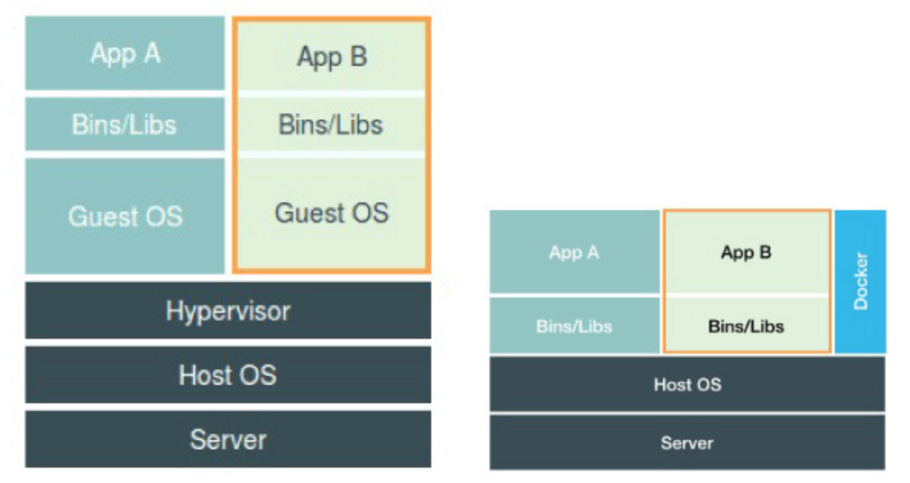

目录

<!-- TOC -->

- [Namespace](#namespace)
- [Cgroups](#cgroups)
- [rootfs文件系统](#rootfs%E6%96%87%E4%BB%B6%E7%B3%BB%E7%BB%9F)

<!-- /TOC -->

容器技术的核心功能，就是通过**约束和修改进程**的动态表现，从而为其创造一个『边界』。

+ Namespace技术用来修改进程视图
+ Cgroups技术用来制造约束

## Namespace

参考[05 \| 白话容器基础（一）：从进程说开去](https://time.geekbang.org/column/article/14642)

**进程**：一个程序运行后的计算机执行环境（磁盘上的可执行文件、内存中的数据、寄存器中的值、堆栈中的指令、被打开的文件、各种设备的状态信息等）的总和。

```shell
docker run -it busybox /bin/sh
```

-it参数指的是，在启动容器后，**分配一个文本输入/输出环境，即tty**，与容器的标准输入相关联。

linux的Namespace机制，其实就是Linux新建进行的一个可选参数，在Linux系统中创建线程的系统调用是clone()，如：

```c++
int pid = clone(main_function, stack_size, SIGCHLD, NULL); 
```

这个系统调用会创建一个新进程，并返回其进程号pid（其中，SIGCHLD表示在**一个进程终止或者停止时**，将**SIGCHLD信号发送给其父进程**，按系统默认将忽略此信号，如果父进程希望被告知其子系统的这种状态，则应捕捉此信号）。可以指定CLONE_NEWPID参数，这样就会创建一个**新的PID Namespace**，clone出来的**新进程将成为Namespace里**的**第一个进程**。如：

```c++
int pid = clone(main_function, stack_size, CLONE_NEWPID | SIGCHLD, NULL); 
```

如果多次执行如上的clone()调用，就会创建多个PID Namespace，每个Namespace里的应用进程，都会认为自己是当前容器里的第1号进行，看不到宿主机里真正的进程空间，也看不到其他PID Namespace里的具体情况。

除了PID Namespace，Linux中还有Mount、UTS、IPC、Network和User这些Namespace。

下图左边是虚拟机的工作原理，Hypervisor是虚拟机最主要部分，通过硬件虚拟化功能，模拟出运行一个操作系统需要的各种硬件（CPU、内存、I/O设备等），然后在这些虚拟的硬件上安装了一个新的操作系统Guest OS。所以，这个Hypervisor负责创建虚拟机，会有额外资源消耗和占用，本身虚拟机还会占用内存，对宿主机操作系统的调用也要经过虚拟化软件的拦截和处理，对计算资源、网络和磁盘的I/O损耗也非常大。

右边的Docker在运行时，并没有一个真正的『docker容器』运行在宿主机中，只是一个正常的应用进程，只是在创建时，加上了各种Namespace参数。

『敏捷』和『高性能』是容口相对于虚拟机的最大优势，也是它能够在PaaS这种更细粒度的资源管理平台上大行其道的重要原因。

<html>
<br/>

<br/>
</html>

但基于linux namespace的隔离机制有一个主要问题：**隔离得不彻底**，体现为以下两方面：

+ 容器只是运行在宿主机上的一种特殊进程，多个容器之间用的还是**同一个宿主机的操作系统内核**

可以在容器中通过Mount Namespace单独挂载其他不同版本的操作系统文件，如CentOS或Ubuntu，但不能改变共享宿主机内核的事实。所以，**要在Windows宿主机主运行Linux容器，或者在低版本的Linux宿主机上运行高版本的Linux容器，都是不行的**（Docker on Mac或者windows，实际上都是基于虚拟化技术实现的，和这里要讲的linux容器不同）

+ Linux内核中，**很多资源和对象是不能被Namespace化的**，典型例子就是『时间』

所以，在容器里部署应用时，『什么能做，什么不能做』，是用户必须考虑的。所以容器给应用暴露出的攻击面是很大的，尽管在实践中可以用Seccomp等技术，对容器内部发起的所有系统调用进行过滤和甄别以进行安全加固，但这加多了一层对系统调用的过滤，会拖累容器的性能。所以在生产环境中，不能把运行在物理机上的Linux容器直接暴露到公网上。

注：

> seccomp 是 secure computing 的缩写，其是 Linux kernel 从2.6.23版本引入的一种简洁的 sandboxing 机制。在 Linux 系统里，大量的系统调用（system call）直接暴露给用户态程序。但是，并不是所有的系统调用都被需要，而且不安全的代码滥用系统调用会对系统造成安全威胁。seccomp安全机制能使一个进程进入到一种“安全”运行模式，该模式下的进程只能调用4种系统调用（system call），即 read(), write(), exit() 和 sigreturn()，否则进程便会被终止。

当然，后续讲的**基于虚拟化或者独立内核技术的容器实现**，可以较好地在隔离和性能间做平衡。

## Cgroups

参考[06 \| 白话容器基础（二）：隔离与限制](https://time.geekbang.org/column/article/14653)

Linux Cgroups是Linux内核中用来**为进程设置资源限制**的一个重要功能，可以限制一个进程能够使用的资源上限，包括CPU、内存、磁盘、网络带宽等。

如果是centos，先```yum install libcgroup```，然后```service cgconfig start```，可以发现

```shell
root@xx:ll /cgroup/
total 0
drwxr-xr-x 4 root root 0 Jul 19  2017 blkio
drwxr-xr-x 7 root root 0 Jul 19  2017 cpu
drwxr-xr-x 4 root root 0 Jul 19  2017 cpuacct
drwxr-xr-x 4 root root 0 Jul 19  2017 cpuset
drwxr-xr-x 4 root root 0 Jun 21 20:25 devices
drwxr-xr-x 5 root root 0 Jul 19  2017 freezer
drwxr-xr-x 5 root root 0 Jul 19  2017 memory
drwxr-xr-x 2 root root 0 Oct  8 20:34 net_cls
```

类似的目录，ubuntu是在```/sys/fs/cgroup/```目录下。例如，cpu目录下：

```shell
root@xx:ll /cgroup/cpu
total 0
drwxr-xr-x 2 root root 0 May 25 07:02 agent-webdir
-rw-r--r-- 1 root root 0 Jul 19  2017 cgroup.clone_children
--w--w--w- 1 root root 0 Jul 19  2017 cgroup.event_control
-r--r--r-- 1 root root 0 Jul 19  2017 cgroup.procs
-rw-r--r-- 1 root root 0 Jul 19  2017 cpu.cfs_period_us
-rw-r--r-- 1 root root 0 Jul 19  2017 cpu.cfs_quota_us
-rw-r--r-- 1 root root 0 Jul 19  2017 cpu.shares
-r--r--r-- 1 root root 0 Jul 19  2017 cpu.stat
drwxr-xr-x 7 root root 0 Jul 19  2017 idle
-rw-r--r-- 1 root root 0 Jul 19  2017 notify_on_release
drwxr-xr-x 7 root root 0 Jul 19  2017 offline
-rw-r--r-- 1 root root 0 Jul 19  2017 release_agent
drwxr-xr-x 2 root root 0 Oct  8 20:30 small
drwxr-xr-x 2 root root 0 Jul 19  2017 system
-rw-r--r-- 1 root root 0 Oct  8 20:06 tasks
```

cfs_quota和cfs_period是组合使用的参数，限制进程在长度为cfs_period的一段时间内，只能被分配到总量为cfs_quota的cpu时间。试着建一个文件夹，就会生成一堆文件，这个目录称为一个『控制组』：

```shell
root@xx:mkdir /cgroup/cpu/container
root@xx:ll /cgroup/cpu/container/  
total 0
-rw-r--r-- 1 root root 0 Oct  8 20:43 cgroup.clone_children
--w--w--w- 1 root root 0 Oct  8 20:43 cgroup.event_control
-r--r--r-- 1 root root 0 Oct  8 20:43 cgroup.procs
-rw-r--r-- 1 root root 0 Oct  8 20:43 cpu.cfs_period_us
-rw-r--r-- 1 root root 0 Oct  8 20:43 cpu.cfs_quota_us
-rw-r--r-- 1 root root 0 Oct  8 20:43 cpu.shares
-r--r--r-- 1 root root 0 Oct  8 20:43 cpu.stat
-rw-r--r-- 1 root root 0 Oct  8 20:43 notify_on_release
-rw-r--r-- 1 root root 0 Oct  8 20:43 tasks
```

可以看下默认值：

```shell
==> /cgroup/cpu/container/cpu.cfs_period_us <==
100000

==> /cgroup/cpu/container/cpu.cfs_quota_us <==
-1
```

文件```/cgroup/cpu/container/cpu.cfs_quota_us```的默认值是-1，如果改成20000（即20000us，也就是20ms），那么，在每100ms的时间内(cpu.cfs_period_us文件指定)，被这个控制组限制的进程只能用20%的CPU带宽。如何指定进程呢？把pid写到```tasks```文件里就行啦。。

几个cgroups常用的子系统：

+ blkio：为块设备设定I/O限制，一般用于磁盘等设备
+ cpuset：为进程分配单独的CPU核和对应的内存节点
+ memory：为进程设定内存使用的限制

对于docker等linux容器项目来说，只需要在每个子系统下，为每个容器创建一个控制组（即创建一个新目录），然后在启动容器进程后，把这个进程的pid写入对应控制组的tasks文件中就行啦~

例如：

```shell
$ docker run -it --cpu-period=100000 --cpu-quota=20000 ubuntu /bin/bash
```

然后可以看到：

```shell
root@xx:docker ps
CONTAINER ID        IMAGE                                  COMMAND             CREATED             STATUS              PORTS                              NAMES
edc3dad98449        ubuntu                                 "/bin/bash"         14 minutes ago      Up 14 minutes                                          evil_shaw
```

然后我们拿containerid去找：

```shell
root@xx:ll /cgroup/cpu/docker/*edc3dad98449*
total 0
-rw-r--r-- 1 root root 0 Oct  8 20:59 cgroup.clone_children
--w--w--w- 1 root root 0 Oct  8 20:59 cgroup.event_control
-rw-r--r-- 1 root root 0 Oct  8 20:59 cgroup.procs
-rw-r--r-- 1 root root 0 Oct  8 20:59 cpu.cfs_period_us
-rw-r--r-- 1 root root 0 Oct  8 20:59 cpu.cfs_quota_us
-rw-r--r-- 1 root root 0 Oct  8 20:59 cpu.rt_period_us
-rw-r--r-- 1 root root 0 Oct  8 20:59 cpu.rt_runtime_us
-rw-r--r-- 1 root root 0 Oct  8 20:59 cpu.shares
-r--r--r-- 1 root root 0 Oct  8 20:59 cpu.stat
-rw-r--r-- 1 root root 0 Oct  8 20:59 notify_on_release
-rw-r--r-- 1 root root 0 Oct  8 20:59 tasks
```

进一步地，可以发现cfs_period_us和cfs_quota_us确实都设成了我们想要的值啦：

```shell
root@xx:head /cgroup/cpu/docker/*edc3dad98449*/*cpu*
==> /cgroup/cpu/docker/edc3dad98449c401fc53e684bb14242dcba2ccd5ac56024ed330aa54d5b3642d/cpu.cfs_period_us <==
100000

==> /cgroup/cpu/docker/edc3dad98449c401fc53e684bb14242dcba2ccd5ac56024ed330aa54d5b3642d/cpu.cfs_quota_us <==
20000

==> /cgroup/cpu/docker/edc3dad98449c401fc53e684bb14242dcba2ccd5ac56024ed330aa54d5b3642d/cpu.rt_period_us <==
1000000

==> /cgroup/cpu/docker/edc3dad98449c401fc53e684bb14242dcba2ccd5ac56024ed330aa54d5b3642d/cpu.rt_runtime_us <==
0

==> /cgroup/cpu/docker/edc3dad98449c401fc53e684bb14242dcba2ccd5ac56024ed330aa54d5b3642d/cpu.shares <==
1024

==> /cgroup/cpu/docker/edc3dad98449c401fc53e684bb14242dcba2ccd5ac56024ed330aa54d5b3642d/cpu.stat <==
nr_periods 5
nr_throttled 1
throttled_time 27232386
```

总之，容器是一个『单进程』模型。所以，在一个容器中，不能同时运行两个不同的应用，除非可以事先找到一个公共的pid=1来充当两个不同应用的父进程。所以很多人会用systemd或者supervisord等软件来代替应用本身作为容器的启动进程。当然，还有其他的解决方法，使容器和应用能**同生命周期**，因为如果『容器正常运行，但里面的应用已经挂了』这种情况出现，容器编排就很麻烦了。。


## rootfs文件系统

Mount Namespace和其他Namespace的不同之处在于：它对容器进程视图的改变，一定要伴随着挂载操作(mount)才能生效。
