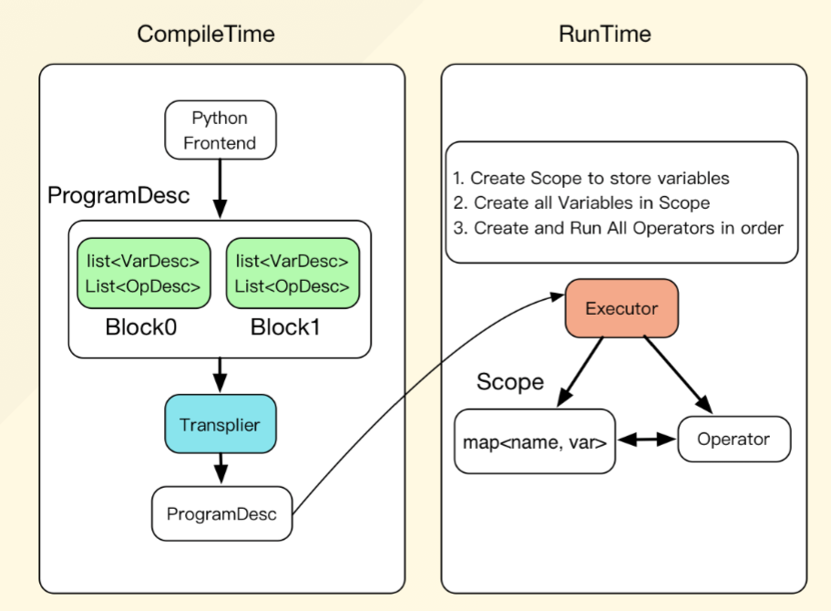

目录

<!-- TOC -->

- [简介](#%E7%AE%80%E4%BB%8B)
- [核心概念](#%E6%A0%B8%E5%BF%83%E6%A6%82%E5%BF%B5)

<!-- /TOC -->


## 简介

参考[https://daiwk.github.io/posts/platform-tensorflow-folding.html](https://daiwk.github.io/posts/platform-tensorflow-folding.html)

先了解下eager execution的优点：

+ 快速调试即刻的运行错误并通过 Python 工具进行整合
+ 借助易于使用的 Python 控制流支持动态模型
+ 为自定义和高阶梯度提供强大支持
+ 适用于几乎所有可用的 TensorFlow 运算

fluid也有点类似，分为编译时和运行时。

编译时：

+ 创建变量描述Variable
+ 创建operators的描述OpDesc
+ 创建operator的属性
+ 推断变量的类型和形状，进行静态检查：InferShape
+ 规划变量的内存复用
+ 创建反向计算
+ 添加优化相关的Operators
+ (可选)添加多卡/多机相关的Operator，生成在多卡/多机上运行的程序


运行时：
+ 创建Executor
+ 为将要执行的一段计算，在层级式的Scope空间中创建Scope
+ 创建Block，依次执行Block

<html>
<br/>


<br/>

</html>

另外，fluid自己封装了各种switch/ifelse/while_op等。

## 核心概念

program就是一个nn的训练/预测任务，由多个可嵌套的Block组成，而每个Block中包含了Variable和Operator：

VarDesc + TensorDesc + OpDesc ==> BlockDesc ==> ProgramDesc

transpiler将一个ProgramDesc转成另一个ProgramDesc，有以下两种：

+ Memory optimization transpiler: 在原始ProgramDesc中插入FreeMemoryOps，在一次迭代结束前提前释放内存，使得能够维持较小的memory footprint
+ distributed training transpiler: 将原始ProgramDesc转化为对应的分布式版本，包括：
    + trainer进程执行的ProgramDesc
    + parameter server执行的ProgramDesc

WIP: 输入ProgramDesc，生成可以直接被gcc/nvcc/icc等编译的代码，编译得到可执行文件。


logistic regression的demo: 

```python
#!/bin/env python
# -*- encoding:utf-8 -*-
"""
fit a line demo
Authors: xiayanming
refer to: 
https://github.com/PaddlePaddle/Paddle/blob/develop/python/paddle/fluid/tests/book/test_fit_a_line.py
"""

import paddle
import paddle.fluid as fluid
import contextlib
import numpy
import unittest
import math
import sys
import os

import paddlecloud.visual_util as visualdl

cluster_train_dir = "./train"
cluster_test_dir = "./test"


def cluster_data_reader(file_dir):
    """
    cluster data reader
    """
    def data_reader():
        """
        data reader
        """
        files = os.listdir(file_dir)
        for fi in files:
            with open(file_dir + '/' + fi, "r") as f:
                for line in f:
                    line = line.strip()
                    if line:
                        ins = numpy.fromstring(line, dtype=float, sep=" ")
                        ins_data = ins[:-1]
                        label = ins[-1:]
                        yield ins_data, label
    return data_reader


def train(use_cuda, save_dirname, is_local):
    """
    train
    """
    x = fluid.layers.data(name='x', shape=[13], dtype='float32')

    y_predict = fluid.layers.fc(input=x, size=1, act=None)

    y = fluid.layers.data(name='y', shape=[1], dtype='float32')

    cost = fluid.layers.square_error_cost(input=y_predict, label=y)
    avg_cost = fluid.layers.mean(cost)

    sgd_optimizer = fluid.optimizer.SGD(learning_rate=0.001)
    optimize_ops, params_grads = sgd_optimizer.minimize(avg_cost)

    BATCH_SIZE = 20

    place = fluid.CUDAPlace(0) if use_cuda else fluid.CPUPlace()
    training_role = os.getenv("TRAINING_ROLE", "TRAINER")
    if training_role == "PSERVER":
        place = fluid.CPUPlace()
    exe = fluid.Executor(place)

    def train_loop(main_program):
        """
        train_loop
        """
        train_reader = paddle.batch(
            paddle.reader.shuffle(
                cluster_data_reader(cluster_train_dir), buf_size = 500),
                batch_size = BATCH_SIZE)
        
        feeder = fluid.DataFeeder(place=place, feed_list=[x, y])
        exe.run(fluid.default_startup_program())

        batch_id = 0
        PASS_NUM = 100
        for pass_id in range(PASS_NUM):
            for data in train_reader():
                avg_loss_value, = exe.run(main_program,
                                          feed=feeder.feed(data),
                                          fetch_list=[avg_cost])
                print(avg_loss_value)
                visualdl.show_fluid_trend('epoch', \
                        pass_id, batch_id, '{\"avg_loss\":%d}' % (avg_loss_value[0]))
                batch_id += 1
                if avg_loss_value[0] < 10.0:
                    if save_dirname is not None:
                        fluid.io.save_inference_model(save_dirname, ['x'],
                                                      [y_predict], exe)
                    return
                if math.isnan(float(avg_loss_value)):
                    sys.exit("got NaN loss, training failed.")
            visualdl.show_fluid_trend('batch', \
                    pass_id, '{\"avg_loss\":%d}' % (avg_loss_value[0]))
            
        if save_dirname is not None:
            fluid.io.save_inference_model(save_dirname, ['x'], [y_predict], exe)

    if is_local:
        train_loop(fluid.default_main_program())
    else:
        port = os.getenv("PADDLE_PORT", "6174")
        pserver_ips = os.getenv("PADDLE_PSERVERS")  # ip,ip...
        eplist = []
        for ip in pserver_ips.split(","):
            eplist.append(':'.join([ip, port]))
        pserver_endpoints = ",".join(eplist)  # ip:port,ip:port...
        trainers = int(os.getenv("PADDLE_TRAINERS_NUM", "0"))
        current_endpoint = os.getenv("POD_IP") + ":" + port
        trainer_id = int(os.getenv("PADDLE_TRAINER_ID", "0"))
        t = fluid.DistributeTranspiler()
        t.transpile(
            optimize_ops,
            params_grads,
            trainer_id,
            pservers=pserver_endpoints,
            trainers=trainers)
        if training_role == "PSERVER":
            pserver_prog = t.get_pserver_program(current_endpoint)
            pserver_startup = t.get_startup_program(current_endpoint,
                                                    pserver_prog)
            exe.run(pserver_startup)
            exe.run(pserver_prog)
        elif training_role == "TRAINER":
            train_loop(t.get_trainer_program())


def infer(use_cuda, save_dirname=None):
    """
    infer
    """
    if save_dirname is None:
        return

    place = fluid.CUDAPlace(0) if use_cuda else fluid.CPUPlace()
    exe = fluid.Executor(place)

    inference_scope = fluid.core.Scope()
    with fluid.scope_guard(inference_scope):
        # Use fluid.io.load_inference_model to obtain the inference program desc,
        # the feed_target_names (the names of variables that will be feeded
        # data using feed operators), and the fetch_targets (variables that
        # we want to obtain data from using fetch operators).
        [inference_program, feed_target_names,
         fetch_targets] = fluid.io.load_inference_model(save_dirname, exe)

        # The input's dimension should be 2-D and the second dim is 13
        # The input data should be >= 0
        batch_size = 10
        tensor_x = numpy.random.uniform(0, 10,
                                        [batch_size, 13]).astype("float32")
        assert feed_target_names[0] == 'x'
        results = exe.run(inference_program,
                          feed={feed_target_names[0]: tensor_x},
                          fetch_list=fetch_targets)
        print("infer shape: ", results[0].shape)
        print("infer results: ", results[0])


def main(use_cuda, is_local=True):
    """
    main
    """
    if use_cuda and not fluid.core.is_compiled_with_cuda():
        return

    # Directory for saving the trained model
    save_dirname = "./output/model/"
    if not os.path.isdir(save_dirname):
        os.makedirs(save_dirname)

    train(use_cuda, save_dirname, is_local)
    infer(use_cuda, save_dirname)


if __name__ == '__main__':
    use_cuda = os.getenv("PADDLE_USE_GPU", "0") == "1"
    is_local = os.getenv("PADDLE_IS_LOCAL", "0") == "1"
    main(use_cuda, is_local)

```
