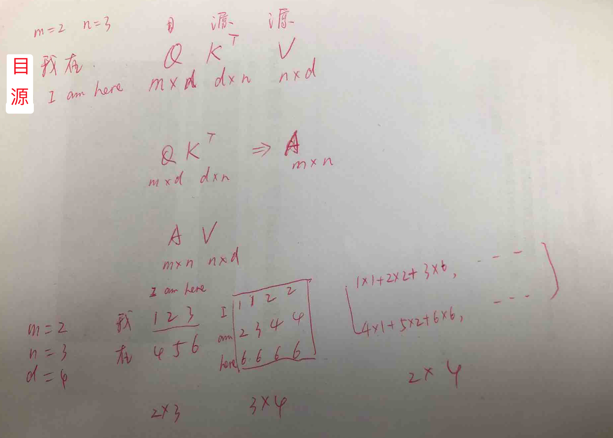
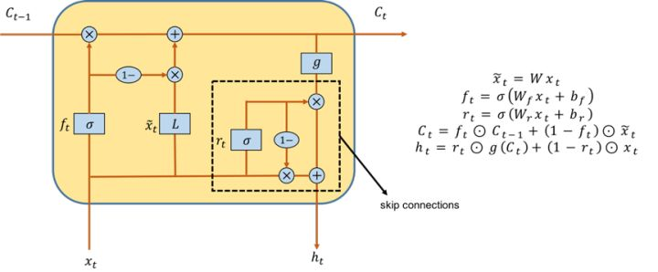

目录

<!-- TOC -->

- [attention的本质](#attention%E7%9A%84%E6%9C%AC%E8%B4%A8)
- [multi-head attention](#multi-head-attention)
- [self-attention](#self-attention)
- [对比rnn/cnn/transformer](#%E5%AF%B9%E6%AF%94rnncnntransformer)
  - [rnn](#rnn)
    - [SRU](#sru)
    - [SRNN](#srnn)
  - [cnn](#cnn)
  - [transformer](#transformer)

<!-- /TOC -->

attention is all you need的解读可以参考

[https://daiwk.github.io/posts/platform-tensor-to-tensor.html](https://daiwk.github.io/posts/platform-tensor-to-tensor.html)

各种attention model可以参考：

[https://daiwk.github.io/posts/dl-attention-models.html](https://daiwk.github.io/posts/dl-attention-models.html)

本文参考[自然语言处理中的自注意力机制（Self-Attention Mechanism）](https://mp.weixin.qq.com/s?__biz=MzIwMTc4ODE0Mw==&mid=2247488035&idx=1&sn=9d0568f58cd85d628fa60ddc33d266e9&chksm=96e9cda3a19e44b5e7ce784d08508ad6d03dcd93c96491dd660af4312b9c67b67457486475ea&mpshare=1&scene=1&srcid=0328RMAtTkf2hZSuXZD5vJBR&pass_ticket=tNNNXIGOajFyoVTQkCkEGcrVM4xaK5lnuItOaXnqkjfkBuTkVoKCva7UoF68PTww#rd)

论文作者之一Lukasz Kaiser的ppt：[https://daiwk.github.io/assets/attention-is-all-you-need-lkaiser.pdf](https://daiwk.github.io/assets/attention-is-all-you-need-lkaiser.pdf)

## attention的本质

Attention函数的本质可以被描述为**一个查询（query）与一系列（键key-值value）对一起映射成一个输出**。分为以下3步：

+ 将**query**和**每个key**进行**相似度**计算得到权重，常用的相似度函数有点积，拼接，感知机等
+ 使用一个**softmax**(因为是一系列的k/v，所以类似多分类，要用softmax)函数对这些**权重进行归一化**
+ 将**权重**和**相应的键值value**进行**加权求和**得到最后的Attention

`\[
attention(Q,K,V)=softmax(\frac{QK^T}{\sqrt {d_k}})V
\]`

目前在**NLP研究**中，key和value常常都是同一个，即 **key=value**(如下例中的源语言的编码器输出)。

对比[https://daiwk.github.io/posts/nlp-nmt.html#4-%E6%B3%A8%E6%84%8F%E5%8A%9B%E6%9C%BA%E5%88%B6](https://daiwk.github.io/posts/nlp-nmt.html#4-%E6%B3%A8%E6%84%8F%E5%8A%9B%E6%9C%BA%E5%88%B6)以及[https://daiwk.github.io/posts/platform-tensor-to-tensor.html#422-attention](https://daiwk.github.io/posts/platform-tensor-to-tensor.html#422-attention)可以发现：

+ 机器翻译里的源语言的编码器输出`\(h_j\)`就是`\(V\)`
+ 机器翻译里的源语言的编码器输出`\(h_j\)`同样是`\(K\)`
+ 机器翻译里的目标语言的隐层状态`\(z_i\)`就是`\(Q\)`
+ 机器翻译里的目标语言和源语言的匹配程度`\(e_{ij}\)`就是`\(\frac{QK^T}{\sqrt {d_k}}\)`
+ 机器翻译里的归一化后的目标语言和源语言的匹配程度`\(a_{ij}\)`就是`\(softmax(\frac{QK^T}{\sqrt {d_k}})\)`
+ 机器翻译里的`\(c_i\)`就是最终的`\(attention(Q,K,V)\)`

所以说，机器翻译的attention，本质就是想给源语言的encoder输出的每一个元素`\(h_j\)` **(即V)** 搞一个权重，然后加权求和。而这个权重是通`\(h_j\)` 它自己 **(即K=V)** 与目标语言的隐层状态`\(z_i\)` **(即Q)** 进行变换得到的。所以：

**k=v=源语言的encoder输出，q=目标语言的隐层状态。**

再理解回nmt里（不理那个`\(\sqrt{d_k}\)`）。假设emb是d维，那么 Q是mxd，K是nxd，i=1->m，j=1->n，`\(e_{ij}=QK^T\)`是一个m行目标语言，n列源语言的矩阵，那么`\(a_{ij}\)`是对`\(e_{ij}\)`求softmax，分母就是第i行每个元素(即这第i个目标语言的词，对应的所有源语言词)的exp之和，分子就是第i行第j列(第i个目标语言词对应的第j个源语言词)的exp，即`\(a_{ij}=\frac {exp(e_{ij})}{\sum _{k=1}^Texp(e_{ik})}\)`看分母，是固定i，遍历j，也就是固定第i行，求这行每一列的和。

再强调一次，一定要记得i、Q、m是目标语言的，j、K、n是源语言的，所以是`\(QK^T\)`，我们要拿attention来对源语言也就是V=K来做加权。做加权这步，就是一个mxn的矩阵，乘一个nxd的矩阵，得到最后mxd矩阵。就是第i行和nxd的一列对应相乘相加，得到一个元素，最后总共得到m个元素。相当于对于目标语言的第i个词来讲，他和源语言的每个词（共n个词）分别有个相关性（mxn矩阵的一行），然后作为这次输入的n个词的权重，求个和，当做这第i个目标语言的词的表示，即最终mxd的第i行的一个元素。而可以看到这个权重，对d维的emb的每一维的作用都是一样的（emb的第1维，即nxd的第1列和mxn的第i行相乘相加得到一个元素；emb的第2维，即nxd的第2列，和mxn的第i行相乘相加得到一个元素，这次运算和上一次运算，对于这一列的每一行来讲，它乘的mxn里的那一行是一样的，也就是说对一个给定的目标语言的词语，即mxn的第i行来讲，他对每一个源语言的词的影响权重在每一维源语言的emb（例如nxd的第1列和第2列）上都是一样的）。

另外，得到的context只是作为产出下一个目标语言词的输入之一，还有前一个目标语言的词，及前一个目标语言的隐层状态。

再来理解一下其中的softmax那步：

类比一个分类任务，m行n列，m个样本，n个类别，每一行就是对这个样本而言，他在这个分类的概率，所以分子是这个类别，分母是所有类别（这一行求和）

类似地，对于这个attention矩阵，m行n列，m个目标语言，n个源语言，一行就是一个目标语言的词，表示这个词和源语言每个词的相关程度，所以分母是所有源语言的词（这一行求和）。

<html>
 

 
</html>

## multi-head attention

+ Query，Key，Value最开始都是`\(d_{model}\)`维，各自通过h个线性变换拆成h部分，每一部分的大小是`\(d_k\)`，`\(d_k\)`和`\(d_v\)`（`\(d_k=d_v=d_{model}/h\)`）。
+ 然后这h部分，每部分各自的q/k/v做一个attention的操作得到对应的attention
+ 最后把这h个attention给concat到一起

不同之处在于进行了h次计算而不仅仅算一次，论文中说到这样的好处是可以**允许模型在不同的表示子空间里学习到相关的信息**。

## self-attention

Self-Attention即**K=V=Q**，例如输入一个句子，那么里面的**每个词都要和该句子中的所有词**进行Attention计算。目的是学习句子内部的词依赖关系，捕获句子的内部结构。

使用self-attention的原因：

+ 每一层的复杂度：
    + 如果输入序列n小于表示维度d的话，每一层的时间复杂度Self-Attention是比较有优势的。
    + 当n比较大时，作者也给出了一种解决方案Self-Attention(restricted)即每个词不是和所有词计算Attention，而是只与限制的r个词去计算Attention。
+ 是否可以并行: multi-head Attention和CNN一样不依赖于前一时刻的计算，可以很好的并行，优于 RNN。
+ 长距离依赖: 由于Self-Attention是每个词和所有词都要计算Attention，所以不管他们中间有多长距离，最大的路径长度也都只是 1。可以捕获长距离依赖关系。

## 对比rnn/cnn/transformer

当然，在讲t2t的时候，就讲到了[https://daiwk.github.io/posts/platform-tensor-to-tensor.html#426-why-self-attention](https://daiwk.github.io/posts/platform-tensor-to-tensor.html#426-why-self-attention)

不过，我们可以参考[放弃幻想，全面拥抱Transformer：自然语言处理三大特征抽取器（CNN/RNN/TF）比较](https://mp.weixin.qq.com/s?__biz=MzA3MzI4MjgzMw==&mid=2650755575&idx=2&sn=86fe97ff3d3b345eaeba92fbcf74ca99&chksm=871a9589b06d1c9fa48f2a471f50777980472464d576440d76d858cae6a9f1a305a9489de091&mpshare=1&scene=1&srcid=0114HOKLy2c4NGYKZEsHUxA8&pass_ticket=aXFgueLD%2BxWMZCVaAWnXvtEoEpLmG3oXS8xAbcmCXkgLYGoJ9eVER7nGjjDlztRz#rd)再来对比一下~

nlp问题的特点：

+ 输入是**一维线性序列**
+ 输入是**不定长**的
+ 单词或子句的**相对位置**关系很重要

主要的nlp任务：

+ **序列标注**：句子中**每一个单词**要求模型根据上下文给出一个**分类类别**。如中文分词、词性标注、命名实体识别、语义角色标注。
+ **分类任务**：整个句子输出一个分类值。如文本分类。
+ **句子关系推断**：给定**两个句子**，判断这两个句子是否具备某种名义关系。例如entilment、QA、语义改写、自然语言推断
+ **生成式任务**：输出一段文本，生成另一段文本。如机器翻译、文本摘要、写诗造句、看图说话。

### rnn

基本原理不再赘述，看看rnn并行化的两个主要套路

#### SRU

[Simple Recurrent Units for Highly Parallelizable Recurrence](https://arxiv.org/pdf/1709.02755.pdf)

在nmt上，transformer+sru比单纯transformer的bleu提升约0.7个点。

SRU的核心思想就是仍然保留任意连续时间步（T-1和T）之间的隐层连接，然后在网络结构上做了一些改变，可以参考知乎的讨论：[如何评价新提出的RNN变种SRU?](https://www.zhihu.com/question/65244705)

先看下原始的gru：[https://daiwk.github.io/posts/nlp-nmt.html#12-gru](https://daiwk.github.io/posts/nlp-nmt.html#12-gru)

`\[
\\ z_t=\sigma(W_zx_t+U_zh_{t-1}+b_z)
\\ r_t=\sigma(W_rx_t+U_rh_{t-1}+b_r)
\\ h_t=z_t \circ h_{t-1}+(1-z_t) \circ tanh(W_hx_t+ U_h(r_t \circ h_{t-1}) + b_h)
\]`

然后从知乎偷个图：

<html>
 

 
</html>

在gru的基础上进行修改，将各个时间步的**gate**和**transformed input**的计算**只依赖**于**当前时间步**的输入，然后在recurrent layers之间添加了**skip
connections（严格来说是highway connections）**

所以，

+ 各个时间步的transformed input、forget gate 以及reset gate的值可以并行处理，因为不依赖上一个时间步了。
+ 还**存在时间步依赖**的计算也只是比较简单和快速的**element-wise**操作，它们还可以在dimension上进行并行。

因此这个RNN单元现在的计算瓶颈就在三个矩阵乘法了，最后将这三个矩阵乘法可以归并成一个矩阵乘法。

作者为了进一步的加速，将上面的各个时间步之间的element-wise的操作优化实现成了CUDA kernel functions。

#### SRNN

### cnn

### transformer

