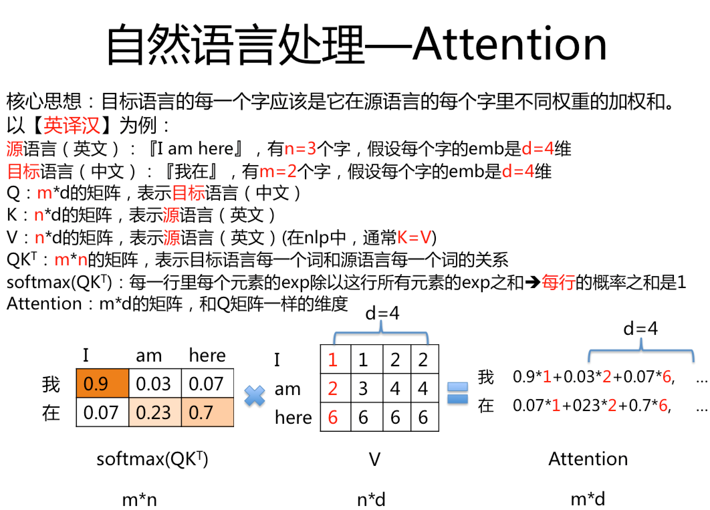
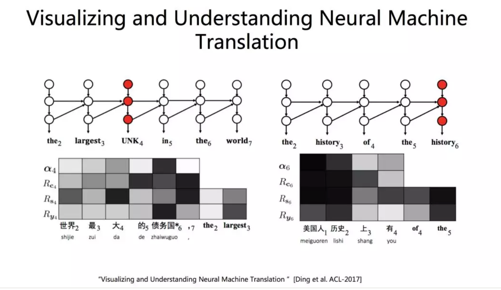
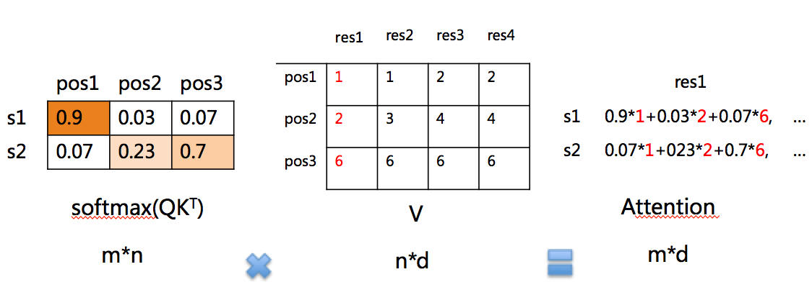

目录

<!-- TOC -->

- [attention的本质](#attention%e7%9a%84%e6%9c%ac%e8%b4%a8)
- [自己的小结](#%e8%87%aa%e5%b7%b1%e7%9a%84%e5%b0%8f%e7%bb%93)
- [multi-head attention](#multi-head-attention)
- [self-attention](#self-attention)
- [对比rnn/cnn/transformer](#%e5%af%b9%e6%af%94rnncnntransformer)
  - [rnn](#rnn)
    - [SRU](#sru)
    - [SRNN](#srnn)
  - [cnn](#cnn)
  - [transformer](#transformer)
- [机器翻译小综述](#%e6%9c%ba%e5%99%a8%e7%bf%bb%e8%af%91%e5%b0%8f%e7%bb%bc%e8%bf%b0)
  - [机器翻译的挑战](#%e6%9c%ba%e5%99%a8%e7%bf%bb%e8%af%91%e7%9a%84%e6%8c%91%e6%88%98)
    - [漏译](#%e6%bc%8f%e8%af%91)
    - [数据稀疏](#%e6%95%b0%e6%8d%ae%e7%a8%80%e7%96%8f)
    - [引入知识](#%e5%bc%95%e5%85%a5%e7%9f%a5%e8%af%86)
    - [可解释性](#%e5%8f%af%e8%a7%a3%e9%87%8a%e6%80%a7)
    - [语篇翻译](#%e8%af%ad%e7%af%87%e7%bf%bb%e8%af%91)
- [清华刘洋的talk——机器翻译的三大挑战](#%e6%b8%85%e5%8d%8e%e5%88%98%e6%b4%8b%e7%9a%84talk%e6%9c%ba%e5%99%a8%e7%bf%bb%e8%af%91%e7%9a%84%e4%b8%89%e5%a4%a7%e6%8c%91%e6%88%98)
  - [知识整合](#%e7%9f%a5%e8%af%86%e6%95%b4%e5%90%88)
  - [可解释/可视化](#%e5%8f%af%e8%a7%a3%e9%87%8a%e5%8f%af%e8%a7%86%e5%8c%96)
  - [鲁棒性](#%e9%b2%81%e6%a3%92%e6%80%a7)
- [attention的其他奇怪应用](#attention%e7%9a%84%e5%85%b6%e4%bb%96%e5%a5%87%e6%80%aa%e5%ba%94%e7%94%a8)

<!-- /TOC -->

attention is all you need的解读可以参考

[https://daiwk.github.io/posts/platform-tensor-to-tensor.html](https://daiwk.github.io/posts/platform-tensor-to-tensor.html)

各种attention model可以参考：

[https://daiwk.github.io/posts/dl-attention-models.html](https://daiwk.github.io/posts/dl-attention-models.html)

本文参考[自然语言处理中的自注意力机制（Self-Attention Mechanism）](https://mp.weixin.qq.com/s?__biz=MzIwMTc4ODE0Mw==&mid=2247488035&idx=1&sn=9d0568f58cd85d628fa60ddc33d266e9&chksm=96e9cda3a19e44b5e7ce784d08508ad6d03dcd93c96491dd660af4312b9c67b67457486475ea&mpshare=1&scene=1&srcid=0328RMAtTkf2hZSuXZD5vJBR&pass_ticket=tNNNXIGOajFyoVTQkCkEGcrVM4xaK5lnuItOaXnqkjfkBuTkVoKCva7UoF68PTww#rd)

论文作者之一Lukasz Kaiser的ppt：[https://daiwk.github.io/assets/attention-is-all-you-need-lkaiser.pdf](https://daiwk.github.io/assets/attention-is-all-you-need-lkaiser.pdf)

## attention的本质

Attention函数的本质可以被描述为**一个查询（query）与一系列（键key-值value）对一起映射成一个输出**。分为以下3步：

+ 将**query**和**每个key**进行**相似度**计算得到权重，常用的相似度函数有点积，拼接，感知机等
+ 使用一个**softmax**(因为是一系列的k/v，所以类似多分类，要用softmax)函数对这些**权重进行归一化**
+ 将**权重**和**相应的键值value**进行**加权求和**得到最后的Attention

`\[
attention(Q,K,V)=softmax(\frac{QK^T}{\sqrt {d_k}})V
\]`

目前在**NLP研究**中，key和value常常都是同一个，即 **key=value**(如下例中的**源**语言的编码器输出)。

对比[https://daiwk.github.io/posts/nlp-nmt.html#4-%E6%B3%A8%E6%84%8F%E5%8A%9B%E6%9C%BA%E5%88%B6](https://daiwk.github.io/posts/nlp-nmt.html#4-%E6%B3%A8%E6%84%8F%E5%8A%9B%E6%9C%BA%E5%88%B6)以及[https://daiwk.github.io/posts/platform-tensor-to-tensor.html#422-attention](https://daiwk.github.io/posts/platform-tensor-to-tensor.html#422-attention)可以发现：

+ 机器翻译里的**源**语言的编码器输出`\(h_j\)`就是**`\(V\)`**
+ 机器翻译里的**源**语言的编码器输出`\(h_j\)`同样是**`\(K\)`**
+ 机器翻译里的**目标**语言的隐层状态`\(z_i\)`就是**`\(Q\)`**
+ 机器翻译里的目标语言和源语言的匹配程度`\(e_{ij}\)`就是`\(\frac{QK^T}{\sqrt {d_k}}\)`
+ 机器翻译里的归一化后的目标语言和源语言的匹配程度`\(a_{ij}\)`就是`\(softmax(\frac{QK^T}{\sqrt {d_k}})\)`
+ 机器翻译里的`\(c_i\)`就是最终的`\(attention(Q,K,V)\)`

所以说，机器翻译的attention，本质就是想给源语言的encoder输出的每一个元素`\(h_j\)` **(即V)** 搞一个权重，然后加权求和。而这个权重是通`\(h_j\)` 它自己 **(即K=V)** 与目标语言的隐层状态`\(z_i\)` **(即Q)** 进行变换得到的。所以：

**k=v=源语言的encoder输出，q=目标语言的隐层状态。**


再理解回nmt里（不理那个`\(\sqrt{d_k}\)`）。假设emb是d维，那么 Q是mxd，K是nxd，i=1->m，j=1->n，`\(e_{ij}=QK^T\)`是一个m行目标语言，n列源语言的矩阵，那么`\(a_{ij}\)`是对`\(e_{ij}\)`求softmax，分母就是第i行每个元素(即这第i个目标语言的词，对应的所有源语言词)的exp之和，分子就是第i行第j列(第i个目标语言词对应的第j个源语言词)的exp，即`\(a_{ij}=\frac {exp(e_{ij})}{\sum _{k=1}^Texp(e_{ik})}\)`看分母，是固定i，遍历j，也就是固定第i行，求这行每一列的和。

再强调一次，一定要记得i、Q、m是目标语言的，j、K、n是源语言的，所以是`\(QK^T\)`，我们要拿attention来对源语言也就是V=K来做加权。做加权这步，就是一个mxn的矩阵，乘一个nxd的矩阵，得到最后mxd矩阵。就是第i行和nxd的一列对应相乘相加，得到一个元素，最后总共得到m个元素。相当于对于目标语言的第i个词来讲，他和源语言的每个词（共n个词）分别有个相关性（mxn矩阵的一行），然后作为这次输入的n个词的权重，求个和，当做这第i个目标语言的词的表示，即最终mxd的第i行的一个元素。而可以看到这个权重，对d维的emb的每一维的作用都是一样的（emb的第1维，即nxd的第1列和mxn的第i行相乘相加得到一个元素；emb的第2维，即nxd的第2列，和mxn的第i行相乘相加得到一个元素，这次运算和上一次运算，对于这一列的每一行来讲，它乘的mxn里的那一行是一样的，也就是说对一个给定的目标语言的词语，即mxn的第i行来讲，他对每一个源语言的词的影响权重在每一维源语言的emb（例如nxd的第1列和第2列）上都是一样的）。

另外，得到的context只是作为产出下一个目标语言词的输入之一，还有前一个目标语言的词，及前一个目标语言的隐层状态。

再来理解一下其中的softmax那步：

类比一个分类任务，m行n列，m个样本，n个类别，每一行就是对这个样本而言，他在这个分类的概率，所以分子是这个类别，分母是所有类别（这一行求和）

类似地，对于这个attention矩阵，m行n列，m个目标语言，n个源语言，一行就是一个目标语言的词，表示这个词和源语言每个词的相关程度，所以分母是所有源语言的词（这一行求和）。

<html>
<br/>

<br/>
</html>

## 自己的小结

某个时候整理了个ppt：

<html>
<br/>

<br/>
</html>

## multi-head attention

+ Query，Key，Value最开始都是`\(d_{model}\)`维，各自通过h个线性变换拆成h部分，每一部分的大小是`\(d_k\)`，`\(d_k\)`和`\(d_v\)`（`\(d_k=d_v=d_{model}/h\)`）。
+ 然后这h部分，每部分各自的q/k/v做一个attention的操作得到对应的attention
+ 最后把这h个attention给concat到一起

不同之处在于进行了h次计算而不仅仅算一次，论文中说到这样的好处是可以**允许模型在不同的表示子空间里学习到相关的信息**。


## self-attention

Self-Attention即**K=V=Q**，例如输入一个句子，那么里面的**每个词都要和该句子中的所有词**进行Attention计算。目的是学习句子内部的词依赖关系，捕获句子的内部结构。

使用self-attention的原因：

+ 每一层的复杂度：
    + 如果输入序列n小于表示维度d的话，每一层的时间复杂度Self-Attention是比较有优势的。
    + 当n比较大时，作者也给出了一种解决方案Self-Attention(restricted)即每个词不是和所有词计算Attention，而是只与限制的r个词去计算Attention。
+ 是否可以并行: multi-head Attention和CNN一样不依赖于前一时刻的计算，可以很好的并行，优于 RNN。
+ 长距离依赖: 由于Self-Attention是每个词和所有词都要计算Attention，所以不管他们中间有多长距离，最大的路径长度也都只是 1。可以捕获长距离依赖关系。

## 对比rnn/cnn/transformer

当然，在讲t2t的时候，就讲到了[https://daiwk.github.io/posts/platform-tensor-to-tensor.html#426-why-self-attention](https://daiwk.github.io/posts/platform-tensor-to-tensor.html#426-why-self-attention)

不过，我们可以参考[放弃幻想，全面拥抱Transformer：自然语言处理三大特征抽取器（CNN/RNN/TF）比较](https://mp.weixin.qq.com/s?__biz=MzA3MzI4MjgzMw==&mid=2650755575&idx=2&sn=86fe97ff3d3b345eaeba92fbcf74ca99&chksm=871a9589b06d1c9fa48f2a471f50777980472464d576440d76d858cae6a9f1a305a9489de091&mpshare=1&scene=1&srcid=0114HOKLy2c4NGYKZEsHUxA8&pass_ticket=aXFgueLD%2BxWMZCVaAWnXvtEoEpLmG3oXS8xAbcmCXkgLYGoJ9eVER7nGjjDlztRz#rd)再来对比一下~

nlp问题的特点：

+ 输入是**一维线性序列**
+ 输入是**不定长**的
+ 单词或子句的**相对位置**关系很重要

主要的nlp任务：

+ **序列标注**：句子中**每一个单词**要求模型根据上下文给出一个**分类类别**。如中文分词、词性标注、命名实体识别、语义角色标注。
+ **分类任务**：整个句子输出一个分类值。如文本分类。
+ **句子关系推断**：给定**两个句子**，判断这两个句子是否具备某种名义关系。例如entilment、QA、语义改写、自然语言推断
+ **生成式任务**：输出一段文本，生成另一段文本。如机器翻译、文本摘要、写诗造句、看图说话。

### rnn

基本原理不再赘述，看看rnn并行化的两个主要套路

#### SRU

[Simple Recurrent Units for Highly Parallelizable Recurrence](https://arxiv.org/pdf/1709.02755.pdf)

在nmt上，transformer+sru比单纯transformer的bleu提升约0.7个点。

SRU的核心思想就是仍然保留任意连续时间步（T-1和T）之间的隐层连接，然后在网络结构上做了一些改变，可以参考知乎的讨论：[如何评价新提出的RNN变种SRU?](https://www.zhihu.com/question/65244705)

先看下原始的gru：[https://daiwk.github.io/posts/nlp-nmt.html#12-gru](https://daiwk.github.io/posts/nlp-nmt.html#12-gru)

`\[
\\ z_t=\sigma(W_zx_t+U_zh_{t-1}+b_z)
\\ r_t=\sigma(W_rx_t+U_rh_{t-1}+b_r)
\\ h_t=z_t \circ h_{t-1}+(1-z_t) \circ tanh(W_hx_t+ U_h(r_t \circ h_{t-1}) + b_h)
\]`

然后从知乎偷个图：

<html>
<br/>

<br/>
</html>

在gru的基础上进行修改，将各个时间步的**gate**和**transformed input**的计算**只依赖**于**当前时间步**的输入，然后在recurrent layers之间添加了**skip
connections（严格来说是highway connections）**

所以，

+ 各个时间步的transformed input、forget gate 以及reset gate的值可以并行处理，因为不依赖上一个时间步了。
+ 还**存在时间步依赖**的计算也只是比较简单和快速的**element-wise**操作，它们还可以在dimension上进行并行。

因此这个RNN单元现在的计算瓶颈就在三个矩阵乘法了，最后将这三个矩阵乘法可以归并成一个矩阵乘法。

作者为了进一步的加速，将上面的各个时间步之间的element-wise的操作优化实现成了CUDA kernel functions。

#### SRNN

### cnn

### transformer


## 机器翻译小综述

参考[神经网络机器翻译技术及应用（上）](https://mp.weixin.qq.com/s?__biz=MzIxNTgyMDMwMw==&mid=2247486312&idx=1&sn=e3d9f43a101dd21ab92acf91e6f00ee3&chksm=97933a08a0e4b31eb1d903ffcfc0dedfc83f4839aae80c274f1a8b988be96794968bb4cb1810&mpshare=1&scene=1&srcid=&pass_ticket=KX13tEs%2BqQgwQ%2B1WWjoUQ1lrrkEScP2JOwqFfDxz8jLhwJXggm7HrOeHlTxg7Of1#rd)

### 机器翻译的挑战

#### 漏译

翻译模型把原文句子整体读进去以后形成了**一个向量**，然后再对这个向量进行解码。翻译模型**认为有些词不应该产生**，从而漏掉了译文。

[Addressing the Under-translation Problem from the Entropy Perspective](https://www.aaai.org/Papers/AAAI/2019/AAAI-ZhaoYang.2930.pdf)这篇就发现漏译与**词语的熵**成**正相关**关系，这个词的**熵越大**，**漏译的可能性越大**。它所对应的目标语言词越多，概率越分散（熵越大），越有可能被漏译。

例如源语言的一个词```s1```对应3种不同的翻译，```(s1,t1),(s1,t2),(s1,t3 t4)```，它的熵就比较大。我们把所有对应的翻译统一替换为一个特殊词```stoken4s1```，以降低词语翻译的熵值。然后文章提出了pre-training, multitask learning, two-pass decoding三种方法，来改善翻译结果。

#### 数据稀疏

相比于统计机器翻译，这个问题对神经网络翻译而言更严重。实验表明，**神经网络对于数据量更敏感**。

[Multi-Task Learning for Multiple Language Translation](https://aclweb.org/anthology/P15-1166)在进行多语言翻译的时候，源语言**共享编码器**，在解码端，**不同的语言，使用不同的解码器**。这样在源语言端就会共享编码器的信息，从而缓解数据稀疏问题。

[Phrase-Based & Neural Unsupervised Machine Translation](https://aclweb.org/anthology/D18-1549)是EMNLP'18的best paper，提出了一个统一的框架，通过两种单语言，来构建翻译系统。

+ 首先构建一个词典，把这两种语言之间的词做一下对齐
+ 然后为两个单语言分别训练一个语言模型
+ 然后使用**back translation**，先基于词的翻译从语言a翻译成语言b，然后挑出得分高的译文，再翻译回去，再用源语言的语言模型来判别好不好。一轮轮地迭代，就可以得到比较好的翻译结果

#### 引入知识

我们引入了几种知识，

+ 短语表或者词表：如果发现『XXX』这个词没有被翻译出来，我们就去查这个词典，这个词典的内容是：『XXX: oo1 0.7 oo2:0.3』这样的，也就是XXX翻译成oo1和oo2的概率
+ 语言模型：衡量目标语言的这个句子是不是流畅
+ 长度奖励特征：奖励长句子，因为句子越长，可能漏掉的信息就越少。

但这样还可能有歧义问题，因为比如中巴关系，可以是中国和巴基斯坦，中国和巴西，中国和巴勒斯坦等的缩写，如果限定了『金砖框架』下的，那就只能是巴西了，所以这还是有挑战的。

#### 可解释性

[Visualizing and Understanding Neural Machine Translation](http://nlp.csai.tsinghua.edu.cn/~ly/papers/acl2017_dyz.pdf)

左边的例子，出现了一个UNK，它虽然没有被翻译出来，但是出现在正确的位置，占了一个位置。通过Attention对应关系，可以看到这个UNK对应到『债务国』。

右边例子是一个重复翻译的现象。神经网络机器翻译除了经常漏翻译之外，还会经常重复翻译。比如说出现了两个“history”。那么通过这个对应关系我们就可以看到，第6个位置上的“history”是重复出现的，它的出现不仅跟第一个位置“美国人”和第二个位置“历史”相关，还跟第5个位置“the”相关。因为产生了一个定冠词“the”，模型认为这个地方应该出现一个“history”。

<html>
<br/>


<br/>

</html>

#### 语篇翻译

[Modeling Coherence for Discourse Neural Machine Translation](https://arxiv.org/abs/1811.05683)提出了一个两步解码的方法。在第一轮解码中单独生成每个句子的初步翻译结果，在第二轮解码中利用第一轮翻译的结果进行翻译内容润色，并且提出使用**增强式学习**模型来奖励模型产生更流畅的译文。

## 清华刘洋的talk——机器翻译的三大挑战

参考[清华刘洋《基于深度学习的机器翻译》，突破知识整合、可解释和鲁棒性三大难关](https://mp.weixin.qq.com/s?__biz=MzI3MTA0MTk1MA==&mid=2652046349&idx=2&sn=3bdb889aa84b90f0c687fb2eb52bd8b1&chksm=f12070fcc657f9ea22310cd663feb21e2fa0e2c2b92b52bfd2b949eb0d9e677d52947beaecd7&mpshare=1&scene=1&srcid=&pass_ticket=TloMdmvUbLd5jnKvVTzrccQhGuskwL6KQ0HhJLF56Nwtcb16%2BVvMA09bw32tFrjs#rd)

### 知识整合

[Prior Knowledge Integration for Neural Machine Translation using Posterior Regularization](https://arxiv.org/pdf/1811.01100.pdf)

在这项工作中，建议使用后验正则化来提供一个将先验知识整合到神经机器翻译中的通用框架。将先验知识来源表示为一个对数线性模型的特征，该模型指导神经翻译模型的学习过程。汉英翻译实验表明，该方法取得了显著的改进。

### 可解释/可视化

[Visualizing and Understanding Neural Machine Translation](https://aclweb.org/anthology/P17-1106)

这项工作主要的贡献包括：

+ 利用层级相关性传播算法可视化分析神经机器翻译；
+ 能够计算任意隐状态和任意contextual words的相关性，同时不要求神经网络中的函数必须可求偏导，不同于之前只有encoder和decoder隐层之间的对应信息；
+ 能够针对机器翻译中出错的例子，进行分析。

### 鲁棒性

输入中的小扰动会严重扭曲中间表示，从而影响神经机器翻译（NMT）模型的翻译质量。


## attention的其他奇怪应用

机器翻译里，假设emb是d维，正常机器翻译里，源语言K=V是nxd，目标语言Q是mxd

softmax(QK^T)是mxn，第i行第j列是源语言的第j个词在所有源语言的词里，对第i个目标语言词的重要程度


假设有一个rank问题，m个队列，n个位置，每个队列有n条结果，每条结果是一个d维向量

Q是(mxd)xn，姑且把mxd这个向量看成一维的，即d=1，

K是nxn，表示每个位置间两两的关系

QK^T是(mxd)xn，第i行第j列是第j个位置在所有位置里，对第i个队列的重要程度

。。真绕

从我自己的角度，yy了一下：

m个队列，n个位置，每个队列有k条结果，每个结果是一个d维向量

Q: (mxd)xk，m行表示m个队列，k列表示k条结果

K: nxk，n行表示n个位置，k列表示k条结果，也就是每个位置与每一条结果间的权重

V: nxk，同K

softmax(QK^T)：(mxd)xn维，第i行第j列表示，第j个位置在所有位置里，对第i个队列的重要程度

softmax(QK^T)V：(mxd)xk维，


<html>
<br/>

<br/>
</html>

有点奇怪。。如果把k和n互换呢。。。


<html>
<br/>

<br/>
</html>

再想想。。
