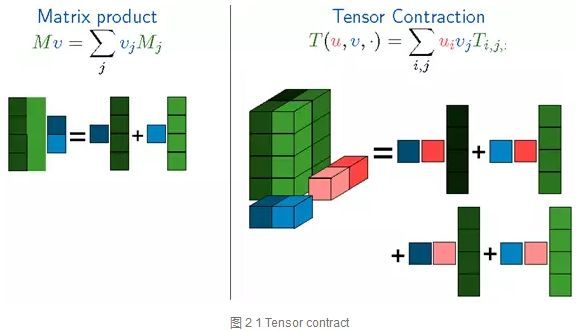
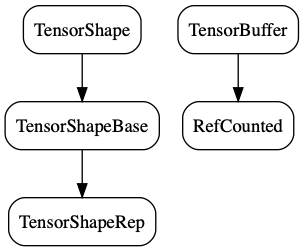

目录

<!-- TOC -->

- [简介](#%E7%AE%80%E4%BB%8B)
    - [总体结构](#%E6%80%BB%E4%BD%93%E7%BB%93%E6%9E%84)
    - [代码结构](#%E4%BB%A3%E7%A0%81%E7%BB%93%E6%9E%84)
        - [tensorflow/core](#tensorflowcore)
        - [tensorflow/stream_executor](#tensorflowstreamexecutor)
        - [tensorflow/contrib](#tensorflowcontrib)
        - [tensroflow/python](#tensroflowpython)
        - [third_party](#thirdparty)
- [tf核心概念](#tf%E6%A0%B8%E5%BF%83%E6%A6%82%E5%BF%B5)
    - [Tensor](#tensor)
        - [tensor contraction](#tensor-contraction)
        - [Tensor实现](#tensor%E5%AE%9E%E7%8E%B0)
            - [Tensor的两个主要的成员变量](#tensor%E7%9A%84%E4%B8%A4%E4%B8%AA%E4%B8%BB%E8%A6%81%E7%9A%84%E6%88%90%E5%91%98%E5%8F%98%E9%87%8F)
            - [Tensor的主要函数](#tensor%E7%9A%84%E4%B8%BB%E8%A6%81%E5%87%BD%E6%95%B0)
            - [Eigen::Tensor](#eigentensor)

<!-- /TOC -->

参考：

+ [A tour through the TensorFlow codebase](http://public.kevinrobinsonblog.com/docs/A%20tour%20through%20the%20TensorFlow%20codebase%20-%20v4.pdf)
+ [『深度长文』Tensorflow代码解析（一）](https://zhuanlan.zhihu.com/p/25646408)
+ [『深度长文』Tensorflow代码解析（二）](https://zhuanlan.zhihu.com/p/25927956)
+ [『深度长文』Tensorflow代码解析（三）](https://zhuanlan.zhihu.com/p/25929909)
+ [『深度长文』Tensorflow代码解析（四）](https://zhuanlan.zhihu.com/p/25932160)
+ [『深度长文』Tensorflow代码解析（五）](https://zhuanlan.zhihu.com/p/26031658)

## 简介

### 总体结构

从底向上分为**设备管理**和**通信**层、**数据操作**层、**图计算**层、**API接口**层、**应用**层。

+ 底层设备通信层负责网络通信和设备管理。
    + 设备管理可以实现TF**设备异构**的特性，支持CPU、GPU、Mobile等不同设备。
    + 网络通信依赖**gRPC**通信协议实现不同设备间的数据传输和更新。
+ 数据操作层是Tensor的**OpKernels**实现。这些OpKernels**以Tensor为处理对象**，依赖**网络通信和设备内存分配**，实现了各种Tensor操作或计算。Opkernels不仅包含MatMul等**计算操作**，还包含Queue等**非计算操作**
+ 图计算层（Graph），包含**本地计算流图**和**分布式计算流图**的实现。Graph模块包含Graph的**创建**、**编译**、**优化**和**执行**等部分，Graph中**每个节点都是OpKernels类型表示**。
+ API接口层。**Tensor C API**是对TF功能模块的接口封装，便于其他语言平台调用。
+ 应用层。不同编程语言在应用层通过API接口层调用TF核心功能实现相关实验和应用。

### 代码结构

**以2018.09.23的master为基准**:

#### tensorflow/core

其中，```tensorflow/core```目录包含了TF核心模块代码：

+ ```public```: API接口头文件目录，用于外部接口调用的API定义，主要是```session.h```。
+ ```client```: API接口实现文件目录。（目前已经没有这个目录了…）
+ ```platform```: ```OS系统```相关```接口文件```，如file system, env等。
+ ```protobuf```: 均为.proto文件，用于数据传输时的结构序列化。（都是proto3的语法）
+ ```common_runtime```: 公共运行库，包含```session```, ```executor```, ```threadpool```, ```rendezvous```, ```memory管理```, ```设备分配算法```等。
+ ```distributed_runtime```: 分布式执行模块，如```rpc session```, ```rpc master```, ```rpc worker```, ```graph manager```。
+ ```framework```: 包含基础功能模块，如```log```, ```memory```, ```tensor```
+ ```graph```: **计算流图**相关操作，如```construct```, ```partition```, ```optimize```, ```execute```等
+ ```kernels```: 核心Op，如```matmul```, ```conv2d```, ```argmax```, ```batch_norm```等
+ ```lib```: 公共基础库，如```gif```、```gtl(google模板库)```、```hash```、```histogram```、```jpeg```、```png```、```wav```等。
+ ```ops```: **基本**ops运算(```xxx_ops.cc```)，ops**梯度**运算（```xxx_grad.cc```），**io相关的ops***（```io_ops.cc```），***控制流和数据流***操作（```control_flow_ops.cc```和```data_flow_ops.cc```）

#### tensorflow/stream_executor

tensorflow/stream_executor目录是并行计算框架，由google stream executor团队开发。

#### tensorflow/contrib

tensorflow/contrib目录是contributor开发目录。

#### tensroflow/python

tensroflow/python目录是python API客户端脚本

#### third_party

+ eigen3：eigen矩阵运算库，tf基础ops调用
+ gpus: 封装了cuda/cudnn编程库

## tf核心概念

tf的核心是围绕Graph展开的，简而言之，就是**Tensor沿着Graph传递闭包完成Flow**的过程。

### Tensor

Matrix表示二维线性映射，Tensor表示多维线性映射。TF中Tensor的维数描述为阶，数值是0阶，向量是1阶，矩阵是2阶，以此类推，可以表示n阶高维数据。

#### tensor contraction

matrix的product和tensor的contract运算如下：

<html>
<br/>


<br/>

</html>

可见，一个4x2的A与一个2x1的B矩阵相乘，可以变成两个矩阵相加，每一个是一个1x1与一个4x1相乘，就是A矩阵的两列分别与B的两列分别相乘，再相加

contract是tensor的运算，python实现可以看：```tensorflow/tensorflow/python/ops/math_ops.py```，即```tensordot```（也称为张量收缩）对从a和b所指定的索引a_axes和b_axes**的元素的乘积**进行**求和**。a_axes和b_axes是两个数组，指定沿其收缩张量的那些轴对。对于所有range(0, len(a_axes))中的i，a的轴a_axes[i]必须与b的轴b_axes[i]具有相同的维度。列表a_axes和b_axes必须具有相同的长度，并由唯一的整数组成，用于为每个张量指定有效的坐标轴。

该操作对应于```numpy.tensordot(a, b, axes)```，[numpy.tensordot文档](https://docs.scipy.org/doc/numpy/reference/generated/numpy.tensordot.html)。

+ 示例1：当a和b是矩阵（2阶）时，```axes = 1```相当于矩阵乘法。
+ 示例2：当a和b是矩阵（2阶）时，```axes = [[1], [0]]```相当于矩阵乘法。
+ 示例3：假设`\(a_ {ijk}\)`和`\(b_ {lmn}\)`表示3阶的两个张量。那么，```contract(a, b, [[0], [2]])```是4阶张量`\(c_ {jklm}\)`，其条目对应于索引`\((j,k,l,m)\)`由下式给出：

`\[
c_{jklm} = \sum_i a_{ijk} b_{lmi}
\]`

可见，因为传入的是[[0],[2]]，所以ijk的第0维，即i，和lmn的第2维，即n，都变成了i，然后求和~

一般来说，```order(c) = order(a) + order(b) - 2*len(axes[0])```。

#### Tensor实现

Tensor在高维空间数学运算比Matrix计算复杂，计算量也非常大，**加速张量并行运算**是TF优先考虑的问题，如**add**, **contract**, **slice**, **reshape**, **reduce**, **shuffle**等运算。

TF中Tensor支持的数据类型有很多，如**tf.float16**, **tf.float32**, **tf.float64**, **tf.uint8**, **tf.int8**, **tf.int16**, **tf.int32**, **tf.int64**, **tf.string**, **tf.bool**, **tf.complex64**等，所有Tensor运算都使用**泛化的数据类型*`*(可以重载\*和+运算咯)表示。

Tensor定义和运算主要是**调用Eigen**矩阵计算库完成的。

Tensor的定义在```tensorflow/core/framework/tensor.h```中。

##### Tensor的两个主要的成员变量

```c++
TensorShape shape_;
TensorBuffer* buf_;
```

<html>
<br/>


<br/>

</html>


+ ```TensorShape```在```tensorflow/core/framework/tensor_shape.h```中定义，基类是```TensorShapeBase```：

```c++
class TensorShape : public TensorShapeBase<TensorShape>
```

TensorShapeBase如下：

```c++
/// Represents the shape of a Tensor.
///
/// A tensor's shape is denoted by its number of dimensions and a size for each
/// dimension.  For example, a Tensor represented by a 3 x 4 matrix would have
/// a shape of 2-D, [3,4].
///
/// If you know the exact shape of your Tensor when you create the TensorShape
/// object, you can specify it then, or you can create a TensorShape with
/// zero dimensions and one element, and call AddDim() to add dimensions later.
class TensorShape : public TensorShapeBase<TensorShape> {
 public:
  using TensorShapeBase<TensorShape>::TensorShapeBase;

  /// Allow a TensorShape to be used as a PartialTensorShape without copying
  operator const PartialTensorShape&() const;  // NOLINT(runtime/explicit)

  /// Returns true if `*this` and `b` have the same sizes. Ignores
  /// dimension names.
  bool IsSameSize(const TensorShape& b) const;
  bool operator==(const TensorShape& b) const { return IsSameSize(b); }
  bool operator!=(const TensorShape& b) const { return !IsSameSize(b); }

  /// Fill `*dsizes` from `*this`.
  template <int NDIMS>
  Eigen::DSizes<Eigen::DenseIndex, NDIMS> AsEigenDSizes() const;

  /// Same as `AsEigenDSizes()` but allows for `NDIMS > dims()` -- in
  /// which case we pad the rest of the sizes with 1.
  template <int NDIMS>
  Eigen::DSizes<Eigen::DenseIndex, NDIMS> AsEigenDSizesWithPadding() const;

 private:
  // These CHECK fail to ease debugging.
  // REQUIRES: dims() == NDIMS
  void CheckDimsEqual(int NDIMS) const;
  // REQUIRES: dims() >= NDIMS
  void CheckDimsAtLeast(int NDIMS) const;
};
```

其中，```TensorShapeBase```是```TensorShapeRep```的子类

```c++
/// Base class for TensorShape and PartialTensorShape.
/// The class is templatized by either TensorShape or PartialTensorShape to
/// allow skipping known/unknown checks in the TensorShape case, but the
/// representation is shared exactly for fast conversion.
template <class Shape>
class TensorShapeBase : public TensorShapeRep
```

+ ```TensorBuffer```是```tensorflow/core/lib/core/refcount.h```的```RefCounted```(引用计数器)的子类

```c++
class TensorBuffer : public core::RefCounted
```

##### Tensor的主要函数

返回Eigen::Tensor类型的主要函数：

```c++
  template <typename T>
  typename TTypes<T>::Vec vec() {
    return tensor<T, 1>();
  }
  // 其中，typedef Eigen::TensorMap<Eigen::Tensor<T, 1, Eigen::RowMajor, IndexType>, Eigen::Aligned> Vec;

  template <typename T>
  typename TTypes<T>::Matrix matrix() {
    return tensor<T, 2>();
  }
  // 其中，typedef Eigen::TensorMap<Eigen::Tensor<T, 2, Eigen::RowMajor, IndexType>, Eigen::Aligned> Matrix;

  template <typename T, size_t NDIMS>
  typename TTypes<T, NDIMS>::Tensor tensor();
  // 其中，typedef Eigen::TensorMap<Eigen::Tensor<T, NDIMS, Eigen::RowMajor, IndexType>, Eigen::Aligned> Tensor;
```

其中的```TTypes```定义在```tensorflow/core/framework/tensor_types.h```中，如下：

```c++
// Helper to define Tensor types given that the scalar is of type T.
template <typename T, int NDIMS = 1, typename IndexType = Eigen::DenseIndex>
struct TTypes {
  // Rank-<NDIMS> tensor of scalar type T.
  typedef Eigen::TensorMap<Eigen::Tensor<T, NDIMS, Eigen::RowMajor, IndexType>,
                           Eigen::Aligned>
      Tensor;
  typedef Eigen::TensorMap<
      Eigen::Tensor<const T, NDIMS, Eigen::RowMajor, IndexType>, Eigen::Aligned>
      ConstTensor;

  // Unaligned Rank-<NDIMS> tensor of scalar type T.
  typedef Eigen::TensorMap<Eigen::Tensor<T, NDIMS, Eigen::RowMajor, IndexType> >
      UnalignedTensor;
  typedef Eigen::TensorMap<
      Eigen::Tensor<const T, NDIMS, Eigen::RowMajor, IndexType> >
      UnalignedConstTensor;

  typedef Eigen::TensorMap<Eigen::Tensor<T, NDIMS, Eigen::RowMajor, int>,
                           Eigen::Aligned>
      Tensor32Bit;

  // Scalar tensor (implemented as a rank-0 tensor) of scalar type T.
  typedef Eigen::TensorMap<
      Eigen::TensorFixedSize<T, Eigen::Sizes<>, Eigen::RowMajor, IndexType>,
      Eigen::Aligned>
      Scalar;
  typedef Eigen::TensorMap<Eigen::TensorFixedSize<const T, Eigen::Sizes<>,
                                                  Eigen::RowMajor, IndexType>,
                           Eigen::Aligned>
      ConstScalar;

  // Unaligned Scalar tensor of scalar type T.
  typedef Eigen::TensorMap<
      Eigen::TensorFixedSize<T, Eigen::Sizes<>, Eigen::RowMajor, IndexType> >
      UnalignedScalar;
  typedef Eigen::TensorMap<Eigen::TensorFixedSize<const T, Eigen::Sizes<>,
                                                  Eigen::RowMajor, IndexType> >
      UnalignedConstScalar;

  // Rank-1 tensor (vector) of scalar type T.
  typedef Eigen::TensorMap<Eigen::Tensor<T, 1, Eigen::RowMajor, IndexType>,
                           Eigen::Aligned>
      Flat;
  typedef Eigen::TensorMap<
      Eigen::Tensor<const T, 1, Eigen::RowMajor, IndexType>, Eigen::Aligned>
      ConstFlat;
  typedef Eigen::TensorMap<Eigen::Tensor<T, 1, Eigen::RowMajor, IndexType>,
                           Eigen::Aligned>
      Vec;
  typedef Eigen::TensorMap<
      Eigen::Tensor<const T, 1, Eigen::RowMajor, IndexType>, Eigen::Aligned>
      ConstVec;

  // Unaligned Rank-1 tensor (vector) of scalar type T.
  typedef Eigen::TensorMap<Eigen::Tensor<T, 1, Eigen::RowMajor, IndexType> >
      UnalignedFlat;
  typedef Eigen::TensorMap<
      Eigen::Tensor<const T, 1, Eigen::RowMajor, IndexType> >
      UnalignedConstFlat;
  typedef Eigen::TensorMap<Eigen::Tensor<T, 1, Eigen::RowMajor, IndexType> >
      UnalignedVec;
  typedef Eigen::TensorMap<
      Eigen::Tensor<const T, 1, Eigen::RowMajor, IndexType> >
      UnalignedConstVec;

  // Rank-2 tensor (matrix) of scalar type T.
  typedef Eigen::TensorMap<Eigen::Tensor<T, 2, Eigen::RowMajor, IndexType>,
                           Eigen::Aligned>
      Matrix;
  typedef Eigen::TensorMap<
      Eigen::Tensor<const T, 2, Eigen::RowMajor, IndexType>, Eigen::Aligned>
      ConstMatrix;

  // Unaligned Rank-2 tensor (matrix) of scalar type T.
  typedef Eigen::TensorMap<Eigen::Tensor<T, 2, Eigen::RowMajor, IndexType> >
      UnalignedMatrix;
  typedef Eigen::TensorMap<
      Eigen::Tensor<const T, 2, Eigen::RowMajor, IndexType> >
      UnalignedConstMatrix;
};
```

用法如下：

```c++
    typedef float T;
    Tensor my_mat(...built with Shape{rows: 3, cols: 5}...);
    auto mat = my_mat.matrix<T>();    // 2D Eigen::Tensor, 3 x 5.
    auto mat = my_mat.tensor<T, 2>(); // 2D Eigen::Tensor, 3 x 5.
    auto vec = my_mat.vec<T>();       // CHECK fails as my_mat is 2D.
    auto vec = my_mat.tensor<T, 3>(); // CHECK fails as my_mat is 2D.
    auto mat = my_mat.matrix<int32>();// CHECK fails as type mismatch.

```

##### Eigen::Tensor

Eigen::Tensor不属于Eigen官方维护的程序，由贡献者提供文档和维护，所以Tensor定义在Eigen unsupported模块中(```#include "third_party/eigen3/unsupported/Eigen/CXX11/Tensor"```)

一元运算（Unary），如sqrt、square、exp、abs等。

二元运算（Binary），如add，sub，mul，div等

选择运算（Selection），即if / else条件运算

归纳运算（Reduce），如reduce_sum， reduce_mean等

几何运算（Geometry），如reshape，slice，shuffle，chip，reverse，pad，concatenate，extract_patches，extract_image_patches等

张量积（Contract）和卷积运算（Convolve）是重点运算，后续会详细讲解。
