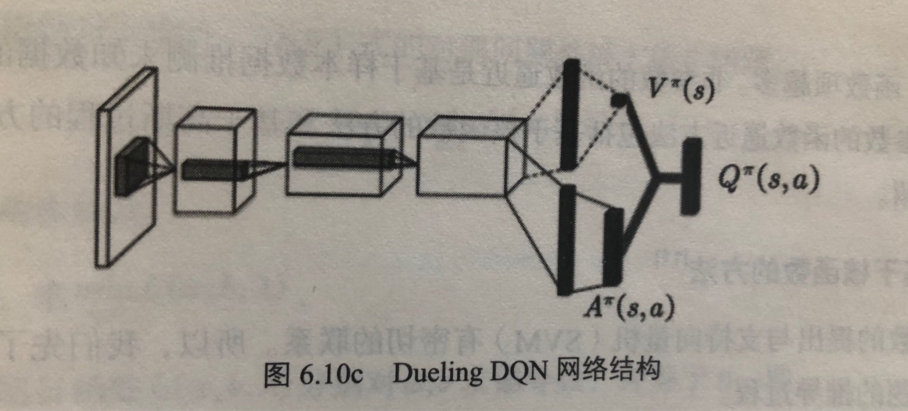
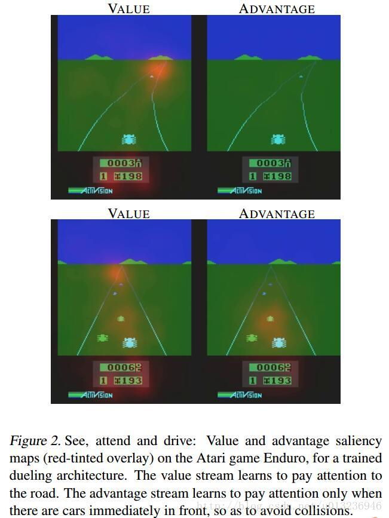

目录

<!-- TOC -->

- [1. 基于值函数逼近的理论讲解](#1-基于值函数逼近的理论讲解)
- [2. DQN及其变种](#2-dqn及其变种)
    - [2.1 DQN方法](#21-dqn方法)
        - [2.1.1 利用深度卷积神经网络逼近行为值函数](#211-利用深度卷积神经网络逼近行为值函数)
        - [2.1.2 在强化学习的学习过程中引入经验回放](#212-在强化学习的学习过程中引入经验回放)
        - [2.1.3 设立了独立的目标网络单独处理时间差分算法中的TD偏差](#213-设立了独立的目标网络单独处理时间差分算法中的td偏差)
    - [2.2 Double DQN](#22-double-dqn)
        - [2.2.1 Qlearning的过估计](#221-qlearning的过估计)
    - [2.3 优先回放(Prioritized Replay)](#23-优先回放prioritized-replay)
    - [2.4 Dueling DQN](#24-dueling-dqn)
- [3. 函数逼近方法](#3-函数逼近方法)
    - [3.1 基于非参数的函数逼近](#31-基于非参数的函数逼近)
        - [基于核函数的方法](#基于核函数的方法)
        - [基于高斯过程的函数逼近方法](#基于高斯过程的函数逼近方法)
    - [3.2 基于参数的函数逼近](#32-基于参数的函数逼近)
    - [3.3 卷积神经网络](#33-卷积神经网络)
        - [3.3.1 卷积运算](#331-卷积运算)
            - [稀疏连接](#稀疏连接)
            - [权值共享](#权值共享)
        - [3.3.2 池化](#332-池化)

<!-- /TOC -->

参考**《深入浅出强化学习》**

## 1. 基于值函数逼近的理论讲解

## 2. DQN及其变种

### 2.1 DQN方法

DeepMind发表在Nature上的文章[Human-level control through deep reinforcement learning](https://daiwk.github.io/assets/dqn.pdf)

最主要创新点是两个：

+ 经验回放
+ 设立单独的目标网络

大体框架是复用**传统强化学习**里的**Qlearning**方法。Qlearning包括两个关键点：

+ 异策略：**行动策略**与 **要评估的策略**不是同一个策略。
    + 行动策略（用来选择行动`\(a\)`的策略）是**`\(\epsilon -greedy\)`策略**
    + 要评估和改进的策略是**贪婪策略**（即`\(max_aQ(s_{t+1},a)\)`，当前状态`\(s_{t+1}\)`下，使用各种a使`\(Q(s_{t+1},a)\)`达到的**最大值**），即，是最大的`\(Q\)`，与行动策略里随机选一个`\(a\)`得到的`\(Q\)`不同
+ 时间差分（temporal difference, TD）：使用时间差分目标（即，`\(r_t+\gamma max_aQ(s_{t+1},a)\)`）来更新当前的行为值函数

注意，时间差分方法其实包括了异策略和同策略两种，

+ **异策略(即off-policy)**，如Qlearning，
+ **同策略**如Sarsa强化学习算法 **（行为策略和目标策略都是`\(\epsilon \) -greedy`策略）**(书p77-79)

Qlearning的算法流程如下：

>1. 初始化`\(Q(s,a),\forall s\in S,a\in A(s)\)`，给定参数`\(\alpha, \gamma\)`
>1. Repeat
>    1. 给定起始状态`\(s\)`，并根据`\(\epsilon -greedy\)`策略在状态`\(s\)`选择动作`\(a\)`
>    1. Repeat
>        1. 根据`\(\epsilon -greedy\)`策略选择动作`\(a_t\)`，得到回报`\(r_t\)`和下一个状态`\(s_{t+1}\)`
>        1. 使用时间差分方法更新行为值函数`\(Q(s_t,a_t)\leftarrow Q(s_t,a_t)+\alpha [r_t+\gamma max_a(Q(s_{t+1},a))-Q(s_t,a_t)]\)`
>        1. `\(s=s'\)`, `\(a=a'\)`
>    1. Until `\(s\)`是最终状态
>1. Until 所有的`\(Q(s,a)\)`收敛
>1. 输出最终策略：`\(\pi (s)=argmax_aQ(s,a)\)`

DQN对Qlearning主要进行了如下三个修改：

+ 利用深度卷积神经网络逼近行为值函数
+ 在强化学习的学习过程中引入经验回放
+ 设立了独立的目标网络单独处理时间差分算法中的TD偏差

#### 2.1.1 利用深度卷积神经网络逼近行为值函数

行为值函数`\(Q(s,a)\)`用参数为`\(\theta\)`的非线性参数逼近`\(Q(s,a;\theta)\)`来近似

#### 2.1.2 在强化学习的学习过程中引入经验回放

其实20世纪90年代就已经有用神经网络逼近行为值函数的方法了，但常常出现**不稳定不收敛**的情况。

deepmind的创始人Hassabis是神经科学的博士，他是研究人类大脑中负责记忆和学习的主要部分——海马体的。**在人类睡觉时，海马体会把一天的记忆重放给大脑皮层。**

训练**神经网络**时，存在的**假设**是**训练数据是独立同分布**的，但通过强化学习采集的**数据间存在关联性**，利用这些数据进行训练，神经网络就不会稳定。而经验回放就可以打破数据间的关联。

#### 2.1.3 设立了独立的目标网络单独处理时间差分算法中的TD偏差

经验回放的技巧可以打破数据间的关联性，这个技巧在2013年的NIPS已经发布了，而2015年的Nature论文进一步提出了**目标网络**，**进一步降低数据间的关联性**。

正常的Qlearning更新值函数的方法如下：

`\[
Q(s_t,a_t)\leftarrow Q(s_t,a_t)+\alpha [r_t+\gamma max_a(Q(s_{t+1},a))-Q(s_t,a_t)]
\]`

但现在使用卷积神经网络来逼近，所以需要更新的是参数`\(\theta\)`，使用的方式自然是梯度下降：

`\[
\theta_{t+1}=\theta _t+\alpha [r+\gamma max_{a'}(Q(s',a';\theta))-Q(s',a';\theta)]\nabla Q(s,a;\theta)
\]`

而这里的`\(r+\gamma max_{a'}(Q(s',a';\theta))\)`是TD目标，在计算`\(max_{a'}(Q(s',a';\theta))\)`时用到的网络参数为`\(\theta\)`。

在DQN之前，计算TD目标的动作值函数所用的网络参数`\(\theta\)`与梯度计算中要逼近的动作值函数所用的网络参数相同，这样就容易导致数据间存在关联性，从而使训练不稳定。

所以DQN的做法就是将TD目标的网络表示为`\(\theta ^{-}\)`，用于动作值函数逼近的网络`\(\theta\)`每一步都更新，而用于计算TD目标的网络`\(\theta ^{-}\)`则是每固定的步数才更新一次【这就可以使得在一段时间里目标Q值是保持不变的，从而使得在一段时间里能集中力量去优化真正的目标`\(theta\)`，等真正的目标好一点了，再去更新`\(\theta^-\)`】：

`\[
\theta_{t+1}=\theta _t+\alpha [r+\gamma max_{a'}(Q(s',a';\theta ^{-}))-Q(s,a;\theta)]\nabla Q(s,a;\theta)
\]`

DQN的训练算法如下：

>1. 初始化replay memory `\(D\)`，capacity设为`\(N\)`
>1. 使用随机权重`\(\theta\)`初始化动作值函数`\(Q\)`
>1. 使用权重`\(\theta^{-}=\theta\)`初始化目标动作值函数`\(\hat {Q}\)`
>1. For `\(episode = [1,...,M]\)` do
>    1. 初始化事件的第一个状态(`\(x_1\)`是第一张图片)`\(s_1=\{x_1\}\)`，并通过预处理得到状态对应的特征输入`\(\phi _1=\phi(s_1)\)`
>    1. For `\(t=[1,...T]\)` do
>        1. 根据概率`\(\epsilon\)`随机选择一个动作`\(a_t\)`
>        1. 如果小概率事件没有发生，就用贪婪策略选择当前行为值函数最大的那个动作：`\(a_t=argmax_a(Q(\phi(s_t),a;\theta))\)`【上面那行和这行就是所谓的行动策略，`\(\epsilon -greedy\)`策略】
>        1. 在模拟器中执行动作`\(a_t\)`，得到回报`\(r_t\)`以及图片`\(x_{t+1}\)`
>        1. 令`\(s_{t+1}=s_t,a_t,x_{t+1}\)`，然后预处理`\(\phi _{t+1}=\phi(s_{t+1})\)` 
>        1. 将transition `\((\phi_t,a_t,r_t,\phi _{t+1})\)`存入`\(D\)`。
>        1. 从`\(D\)`中随机sample出一个minibatch的transitions，`\((\phi _j,a_j,r_j,\phi _{j+1})\)`
>        1. 令`\(y_j=\left\{\begin{matrix}r_j & if\ episode\ terminates\ at\ step\ j+1\\ r_j+\gamma max_{a'}\hat {Q}(\phi_{j+1},a';\theta^{-}) & otherwise \end{matrix}\right.\)`
>        1. 对`\((y_j-Q(\phi _j,a_j;\theta))^2\)`的参数`\(\theta\)`进行一个梯度下降step的更新，`\(\theta_{t+1}=\theta _t+\alpha [r+\gamma max_{a'}(\hat {Q}(s',a';\theta ^{-}))-Q(s,a;\theta)]\nabla Q(s,a;\theta)\)`
>        1. 每`\(C\)`个step，令`\(\hat {Q}=Q\)`，即令`\(\theta ^{-}=\theta \)` 
>    1. End For
> 1. End For

### 2.2 Double DQN

#### 2.2.1 Qlearning的过估计

DQN无法克服Qlearning本身固有的缺点：过估计

过估计指的是**估计的值函数比真实值函数大**，Qlearning出现过估计的问题，根源在于其中的**最大化操作**：

对于表格型，值函数评估的更新公式：

`\[
Q(s_t,a_t)\leftarrow Q(s_t,a_t)+\alpha [r_t+\gamma \underset{a}{max}Q(s_{t+1},a)-Q(s_t,a_t)]
\]`

对于基于函数逼近的方法，值函数更新公式为：

`\[
\theta _{t+1}=\theta_t+\alpha(R_{t+1}+\gamma \underset{a}{max}Q(S_{t+1},a;\theta_t)-Q(S_t,A_t;\theta_t))\triangledown _{\theta_t}Q(S_t,A_t;\theta_t)
\]`

可以发现不管是表格型，还是基于值函数逼近的方法，更新公式中都有max操作，使得估计的值函数比值函数的真实值大。

**如果过估计是均匀的**，即值函数的每一点的值都被过估计了相同的幅度，那么由于最优策略是贪婪策略，即找最在的值函数所对应的动作，在这种情况下一不会影响最优策略（因为每个值函数都变大一样的幅度，所以原来最大的那个还是最大），这样因为强化学习的目标是找到最优策略，所以不会影响我们解决问题~

但实际情况中，过估计量并不是均匀的，所以会影响最终策略，使得最终策略并非最优！！

在Qlearning的值函数更新中，TD目标为：

`\[
Y^Q_t=R_{t+1}+\gamma max_aQ(S_{t+1},a;\theta_t)
\]`

+ 动作选择

在求TD目标`\(Y^Q_t\)`时，首先需要选择一个动作`\(a^*\)`，该动作`\(a^*\)`应该满足在状态`\(S_{t+1}\)`处使得`\(Q(s_{t+1},a)\)`最大，这就是**动作选择**。

+ 动作评估

选出`\(a^*\)`后，利用`\(a^*\)`处的动作值函数构造TD目标。

**一般的Qlearning使用同一个参数`\(\theta_t\)`来选择和评估动作。**

Double Qlearning将动作的选择和动作的评估分别用不同的值函数来实现，从而其TD目标为：

`\[
Y^{DoubleQ}_t=R_{t+1}+\gamma Q(S_{t+1},argmax_aQ(S_{t+1},a;\theta_t);\theta_t')
\]`

所以，我们可以看出，动作的选择所选择的`\(a^*\)`为

`\[
a^*=argmax_aQ(S_{t+1},s;\theta_t)
\]`

动作值函数网络的参数是`\(\theta_t\)`。当选出最大动作`\(a^*\)`之后，动作评估的公式为：

`\[
Y^{DoubleQ}_t=R_{t+1}+\gamma Q(S_{t+1},a^*;\theta_t')
\]`

所以，引入DQN就是Double DQN：

[Deep Reinforcement Learning with Double Q-learning](https://arxiv.org/abs/1509.06461)

将TD error修改为：

`\[
r+\gamma Q(s',argmax_{a'}Q(s',a',\theta),\theta^-)-Q(s,a,\theta)
\]`

其中

+ `\(\theta\)`是当前的网络参数，用来选择动作
+ `\(\theta^-\)`是前一步的网络参数（`\(delayed theta\)`），用来评估动作

因为原来的DQN就已经引入了目标网络`\(\theta^-\)`，所以其实改动不大。
但注意！！区别在于，原来DQN的TD error是`\(r+\gamma Q(s',argmax_{a'}Q(s',a',\theta^-),\theta^-)\)`，即动作选择和动作评估都是`\(\theta^-\)`。而Double DQN动作选择是`\(\theta\)`，动作评估是`\(\theta^-\)`

### 2.3 优先回放(Prioritized Replay)

### 2.4 Dueling DQN

参考书本，以及[https://blog.csdn.net/u013236946/article/details/73161586](https://blog.csdn.net/u013236946/article/details/73161586)

竞争网络（dueling net）从网络结构上改进了DQN，将**动作值函数分解**为**状态值函数**和**优势函数**，即：

`\[
Q^{\pi}(s,a)=V^{\pi}(s)+A^{\pi}(s,a)
\]`

以往的DQN都是直接用神经网络逼近`\(Q^{\pi}(s,a)\)`，而Dueling DQN则是对`\(V^{\pi}(s)\)`和`\(A^{\pi}(s,a)\)`分别用神经网络来逼近。

+ 状态值函数`\(V^{\pi}(s)\)`表示静态的状态环境本身具有的价值。是一个scalar。
+ 依赖状态的动作优势函数`\(A^{\pi}(s,a)\)`(advantage function)，表示选择某个Action额外带来的价值。是一个vector。

更详细地，**状态价值函数**表示为

`\[
V(s;\theta,\beta)
\]`

**动作优势函数**表示为

`\[
A(s,a;\theta,\alpha)
\]`

动作Q值为两者相加

`\[
Q(s,a;\theta,\alpha,\beta) = V(s;\theta,\beta)+A(s,a;\theta,\alpha)
\]`

其中，`\(\theta\)`是卷积层的参数，`\(\beta\)`和`\(\alpha\)`是两个支路全连接层的参数。

而在实际中，一般要将动作优势流设置为**单独动作优势**函数**减去**某状态下**所有动作优势函数的平均值**，这样做可以保证该状态下各动作的优势函数**相对排序不变**，而且可以**缩小Q值的范围**，去除多余的自由度，提高算法**稳定性**。 

`\[
Q(s,a;\theta,\alpha,\beta) = V(s;\theta,\beta)+(A(s,a;\theta,\alpha)-\frac{1}{|A|}\sum_{a'}A(s,a';\theta,\alpha))
\]`

<html>
 

 

</html>

这种竞争结构能学到在**没有动作的影响**下**环境状态**的价值`\(V(s)\)`。如下图，在训练过程中，上下两行图表示不同时刻，左右两列表示属于`\(V(s)\)`和`\(A(a)\)`，（通过某种方法处理后）图中红色区域代表`\(V(s)\)` 和`\(A(a)\)`所关注的地方。`\(V(s)\)`关注于地平线上**是否有车辆出现**（此时动作的选择影响不大）以及分数；`\(A(a)\)`则更关心**会立即造成碰撞的车辆**，此时动作的选择很重要。 

<html>
 

 

</html>

论文中dueling net结合了DDQN(double dqn)以及优先级采样（Prioritized Experience Replay）的训练方式。

## 3. 函数逼近方法

### 3.1 基于非参数的函数逼近

#### 基于核函数的方法

#### 基于高斯过程的函数逼近方法

### 3.2 基于参数的函数逼近

### 3.3 卷积神经网络

#### 3.3.1 卷积运算

##### 稀疏连接

##### 权值共享

#### 3.3.2 池化
