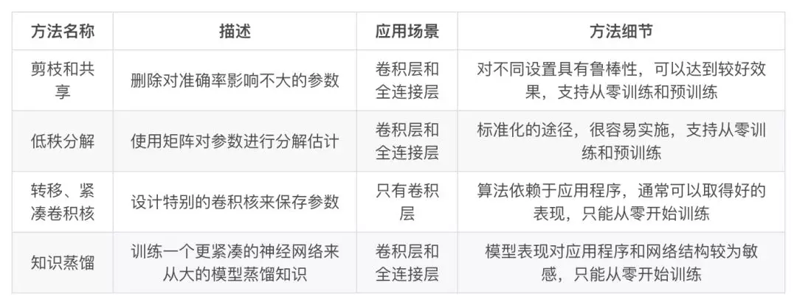

目录

<!-- TOC -->

- [背景](#%e8%83%8c%e6%99%af)
- [研究现状](#%e7%a0%94%e7%a9%b6%e7%8e%b0%e7%8a%b6)
- [paddle的slim](#paddle%e7%9a%84slim)
- [DAFL](#dafl)

<!-- /TOC -->

参考 [当前深度神经网络模型压缩和加速都有哪些方法？](https://mp.weixin.qq.com/s?__biz=MzIwMTc4ODE0Mw==&mid=2247488630&idx=1&sn=894b06c31b37ccdad3e9bfdd7323a33f&chksm=96e9cbf6a19e42e0c666d6727430a39fe4e09db047c3cfc0465a34923b87a36dfbe7585fe339&mpshare=1&scene=1&srcid=0424GVwdeHItD7HnyFTeDqEK&pass_ticket=ELDwWNrhj5p4OHcAdT%2BpNCVXGsuewWdPEQ9M8Z%2BwtE9PmYD%2Bq%2FrOC6%2BTyLhZIu%2Bd#rd)

论文：[A Survey of Model Compression and Acceleration for Deep Neural Networks](https://arxiv.org/pdf/1710.09282.pdf)

## 背景

在2012年，Krizhevsky等人提出的alexnet（[ImageNet Classification with Deep Convolutional](https://papers.nips.cc/paper/4824-imagenet-classification-with-deep-convolutional-neural-networks.pdf)），以超过第二名以传统人工设计特征方法准确率 10% 的巨大领先取得了 ImageNet图像分类比赛冠军。

alexnet是1个包**含5个卷积层**和**3个全连接层**的**6000万参数**的网络。通常情况下，即使使用当时性能顶级的GPU NVIDIA **K40**来训练整个模型仍需要花费**两到三天**时间。对于使用全连接的大规模网络，其参数规模甚至可以达到数十亿量级。

为了解决全连接层参数规模的问题，人们转而考虑**增加卷积层**，使全连接参数降低。随之带来的负面影响便是**大大增长了计算时间与能耗**。

Krizhevsky在2014年的文章中，提出的两点观察结论为后来的研究深度模型的压缩与加速提供了统计依据：

现代卷积神经网络主要由两种层构成，他们具有不一样的属性和性能(!!!!!!参考[卷积神经网络的并行化模型——One weird trick for parallelizing convolutional neural networks](https://blog.csdn.net/xsc_c/article/details/42420167))：

+ **卷积层**，占据了**90% ~ 95%的计算量**，**5%的参数**，但是对结果具有**很大的表达能力**。
+ **全连接层**，占据了**5% ~ 10%的计算量**，**95%的参数**，但是对于结果具有相对**较小的表达的能力**。

综上：卷积层计算量大，所需参数系数 W 少，全连接层计算量小，所需参数系数 W 多。因此对于**卷积层**适合使用**数据并行**，对于**全连接层**适合使用**模型并行**。

一个典型的例子是具有50个卷积层的ResNet-50需要超过 95MB的存储器以及38亿次浮点运算。在丢弃了一些冗余的权重后，网络仍照常工作，但节省了超过75％的参数和50％的计算时间。

## 研究现状

+ **参数修剪和共享**（parameter pruning and sharing)：针对**模型参数的冗余**性，试图去除冗余和不重要的项。
+ **低秩因子分解**（low-rank factorization）：使用**矩阵/张量分解**来**估计深度学习模型的信息参数**。
+ **转移/紧凑卷积滤波器**（transferred/compact convolutional filters）：设计了**特殊的结构卷积滤波器**来降低存储和计算复杂度。
+ **知识蒸馏**（knowledge distillation）：通过学习一个**蒸馏模型**，训练一个**更紧凑的神经网络**来重现一个更大的网络的输出。

参数修剪和共享、低秩分解和知识蒸馏方法可以用于**全连接层**和**卷积层**的CNN，但另一方面，使用转移/紧凑型卷积核的方法**仅支持卷积层**(因为只是修改卷积filter)。

低秩因子分解和基于转换/紧凑型卷积核的方法提供了一个**端到端**的流水线，可以很容易地在 CPU/GPU 环境中实现。

参数修剪和共享使用不同的方法，如矢量量化，二进制编码和稀疏约束来执行任务，这导致常**需要几个步骤**才能达到目标。

关于训练协议，基于参数修剪/共享、低秩分解的模型**可以从预训练模型**或者**从头开始**训练，因此灵活而有效。然而转移/紧凑的卷积核和知识蒸馏模型**只能支持从零开始**训练。

<html>
 

 

</html>

## paddle的slim

[自动模型压缩与架构搜索，这是飞桨PaddleSlim最全的解读](https://mp.weixin.qq.com/s?__biz=MzA3MzI4MjgzMw==&mid=2650765628&idx=2&sn=62b7034b2a68422f0b434f423e157306&chksm=871abd42b06d3454a083d54b4c25d8bdf973dd1183e471b586e59a8c7cf016b95de53868e7d5&scene=0&xtrack=1&pass_ticket=zzUnWIgdqTLvX39vSLCKaOJN8KVDYuvxPgj7h5mQNNMiTnEMdrWSwBJSd3ch3aLL#rd)

## DAFL

[重磅开源！ ICCV 2019，华为诺亚提出无需数据网络压缩技术](https://mp.weixin.qq.com/s/jMuIfkxvpYNGP9lqWUvIzg)

[DAFL：Data-Free Learning of Student Networks](https://arxiv.org/pdf/1904.01186)

github: [https://github.com/huawei-noah/DAFL](https://github.com/huawei-noah/DAFL)

绝大多数的神经网络压缩算法都假设训练数据是可以获得的。然而，在现实生活应用中，数据集往往由于隐私、法律或传输限制等原因是不可获得的。

有很少的工作关注在无数据情况下的网络压缩，然而，这些方法得到的压缩后的网络准确率下降很多，这是因为这些方法没有利用待压缩网络中的信息。

提出了一个新的无需训练数据的网络压缩方法。具体的，我们把给定的待压缩网络看作一个固定的判别器，接着，我们设计了一系列的损失函数来训练生成网络，使得生成图片可以代替训练数据集进行训练，最后，我们使用生成数据结合蒸馏算法得到压缩后的网络。
