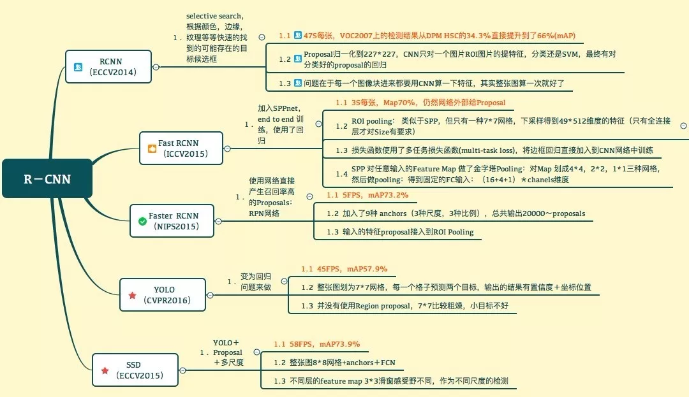

目录

<!-- TOC -->

<!-- /TOC -->

[从RCNN到SSD，这应该是最全的一份目标检测算法盘点](https://mp.weixin.qq.com/s?__biz=MzA3MzI4MjgzMw==&mid=2650741534&idx=1&sn=02dc164ffcedbf22124b97841ba67fe5&chksm=871adf60b06d567690fa2328b161c012a464687768e50f812a51b5533a7d68b99af1cf8f02b8&scene=0&pass_ticket=INCrGaryVZRn7Xp0qFQ7uod1VN14o8mkpvq1bswtroEgKQavvDm7mmg4E7yTOH6d#rd)

同时参考[一文读懂目标检测：R-CNN、Fast R-CNN、Faster R-CNN、YOLO、SSD](https://mp.weixin.qq.com/s?__biz=MzU1NTUxNTM0Mg==&mid=2247489070&idx=1&sn=d7b00a6e66de9191d898ee654be448cc&chksm=fbd27a8fcca5f39950a9ef8d423afcc39f4ad5ba01f84bedca905975b53f34817f660fca1795&mpshare=1&scene=1&srcid=0723zzseCRdY3SSK8GKzxTvO&pass_ticket=dxpPUDHz41aBj1bP227WEg1oWcCDfep3IeGSCzYrlaZP9ZqENPugpUQrWsVELUK8#rd)

1. 传统的目标检测算法：Cascade + HOG/DPM + Haar/SVM以及上述方法的诸多改进、优化；
2. 候选区域/框 + 深度学习分类：通过提取候选区域，并对相应区域进行以深度学习方法为主的分类的方案，如：
R-CNN（Selective Search + CNN + SVM）
SPP-net（ROI Pooling）
Fast R-CNN（Selective Search + CNN + ROI）
Faster R-CNN（RPN + CNN + ROI）
R-FCN等系列方法；
3. 基于深度学习的回归方法：YOLO/SSD/DenseBox 等方法；以及最近出现的结合RNN算法的RRC detection；结合DPM的Deformable CNN等

<html>
 

 
</html>
