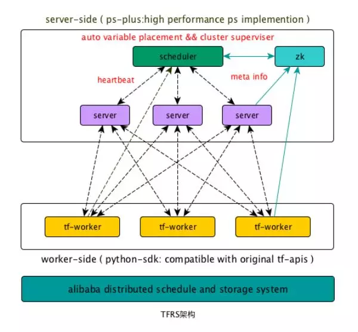
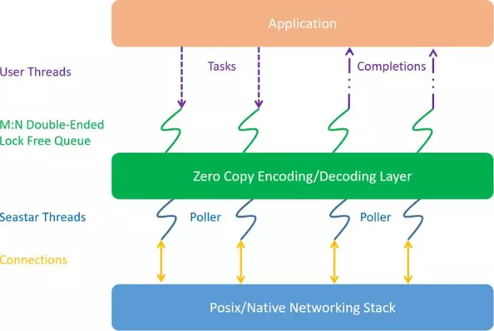
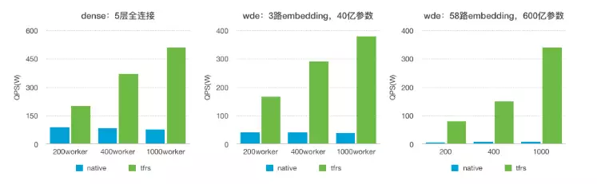
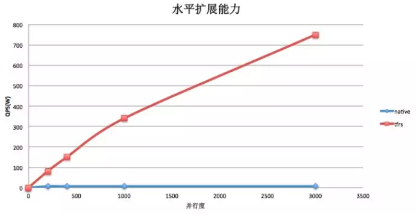
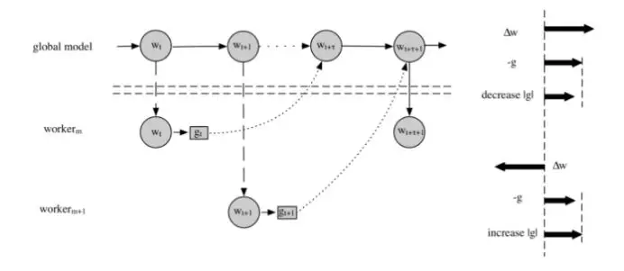
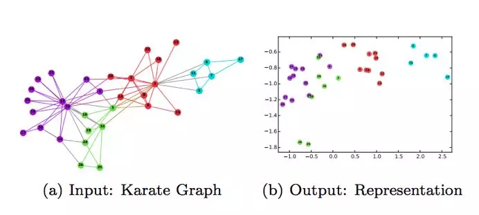
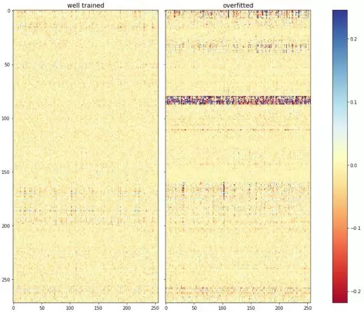

目录

<!-- TOC -->

- [阿里的TensorTlowRS](#阿里的tensortlowrs)
    - [简介](#简介)
    - [TensorFlowRS分布式架构](#tensorflowrs分布式架构)
    - [PS-Plus](#ps-plus)
        - [智能参数分配](#智能参数分配)
        - [去ID化特征支持](#去id化特征支持)
        - [通信层优化](#通信层优化)
    - [性能](#性能)
    - [在线学习](#在线学习)
        - [非ID化特征支持](#非id化特征支持)
        - [特征动态增删](#特征动态增删)
        - [模型增量实时导出](#模型增量实时导出)
        - [AUC Decay](#auc-decay)
    - [大规模训练场景下的收敛效果优化](#大规模训练场景下的收敛效果优化)
        - [问题阐述](#问题阐述)
        - [梯度补偿](#梯度补偿)
        - [实验结果](#实验结果)
    - [高级训练模式](#高级训练模式)
        - [Graph Embedding](#graph-embedding)
        - [Memory Network](#memory-network)
    - [可视化模型分析系统DeepInsight](#可视化模型分析系统deepinsight)

<!-- /TOC -->

## 阿里的TensorTlowRS

[专栏 \| 阿里妈妈基于TensorFlow做了哪些深度优化？TensorFlowRS架构解析](https://mp.weixin.qq.com/s?__biz=MzA3MzI4MjgzMw==&mid=2650741534&idx=4&sn=605076cdf0f45812c8f0fafd5e4e01b5&chksm=871adf60b06d5676852cb30c2c5cad45d5b74fc072dcad6e9f28c86245fa97426c9a47b676a8&mpshare=1&scene=1&srcid=0429va5QwRaha7z2IE3w6B7l&pass_ticket=INCrGaryVZRn7Xp0qFQ7uod1VN14o8mkpvq1bswtroEgKQavvDm7mmg4E7yTOH6d#rd)

### 简介

相比图像、语音、视频等领域，搜索、广告、推荐等场景有着独特的场景特点: **样本规模**和**特征空间**通常非常巨大，千亿样本、百亿特征并不罕见，同时存在**大量的稀疏特征**作为Embedding输入。

阿里妈妈的优化：

+ 解决了原生TF**水平扩展能力**不足的问题。在我们的测试中，绝大多数搜索广告模型的训练性能提升在十倍以上，某些模型的极限性能最高可提升百倍。
+ 支持完备的**在线学习语义**，**模型变更实时写出**；**稀疏特征无需做连续ID化**，可以直接使用原始特征表征进行训练，大幅简化了特征工程的复杂度。
+ **异步训练**的**梯度修正优化器**（grad-compensation optimizer），有效减少了异步大规模并发引起的训练效果损失。
+ 集成了高效的**Graph Embedding**、**Memory Network**、**Cross Media**等多种高级训练模式。
+ 模型**可视化系统**DeepInSight提供深度模型训练的多维度可视化分析。

### TensorFlowRS分布式架构

TF作为一个分布式训练系统有两个主要的问题：

+ **水平扩展能力差**：在大部分模型的性能测试中,我们发现随着**数据并行度的增加**，**单个worker的样本处理QPS急剧下降**。当**worker数量**增大到一定规模的时候，系统**整体QPS不再有增长甚至有所下降**。
+ 缺乏**完备的分布式Failover机制**：
    + TF基于**静态拓扑配置**来构建cluster，**不支持动态组网**，这就意味着当**某个ps或者worker挂掉重启之后，如果ip或者端口发生变化（例如机器crash），训练将无法继续。**
    + 另外，TF的**checkpoint**只包含**server存储的参数**信息，**不包含worker端的状态**，**不是全局一致性**的checkpoint，**无法实现Exactly-Once等基本的Failover语义**。

TensorFlowRS的解决方案：

+ 通过**对接独立参数服务器**提升水平扩展能力

在对TF做过细致的profiling之后，我们发现**TF原生的PS**由于设计和实现方面的多种原因（**grpc**，**lock**，**graph-engine**），很难达良好的水平扩展能力。于是我们决定丢掉TF-PS的包袱，**重新实现一个高性能的参数服务器**：PS-Plus。此外我们提供了完整的TF on PS-Plus方案，可以支持用户在**Native-PS**和**PS-Plus**之间**自由切换**，并且**完全兼容**TensorFlow的**Graph语义**和**所有API**。用户可以在深度网络代码一行不改的情况下，将参数分布和运行在PS-Plus上，享受高性能的参数交换和良好的水平扩展能力。 

+ 重新设计Failover机制，支持**动态组网**和**Exactly-Once**的Failover

TensorFlowRS**引入了worker state**，在checkpoint中存储了worker的状态信息，**worker重启后**，会**从接着上次的进度继续训练**。此外TensorFlowRS通过**zk**生成**cluster配置**，支持了**动态组网**的Failover。新的Failover机制可以保证**任意角色挂掉**的情况下，系统都能在**分钟级完成Failover**，并且**不多算**和**漏算**数据。

所谓的exactly-once，参考：[https://www.jianshu.com/p/5d889a67dcd3](https://www.jianshu.com/p/5d889a67dcd3):

在分布式系统中，构成系统的**任何节点**都是被定义为**可以彼此独立失败的**。比如在 Kafka中，broker可能会crash，在producer推送数据至topic的过程中也可能会遇到网络问题。根据producer处理此类故障所采取的提交策略类型，我们可以获得不同的语义：

+ **at-least-once**：如果**producer收到**来自Kafka **broker的确认（ack）或者acks = all**，则表示该消息**已经写入**到Kafka。但如果producer **ack超时或收到错误**，则可能会**重试发送消息**，客户端会认为该消息未写入Kafka。如果**broker**在**发送Ack之前失败**，但在消息成功写入Kafka之后，此重试将**导致该消息被写入两次**，因此消息会被不止一次地传递给最终consumer，这种策略可能导致重复的工作和不正确的结果。
+ **at-most-once**：如果在**ack超时或返回错误时**producer**不重试**，则该消息**可能最终不会写入**Kafka，因此不会传递给consumer。在大多数情况下，这样做是为了**避免重复**的可能性，业务上必须接受**数据传递可能的丢失**。
+ **exactly-once**：**即使producer重试**发送消息，消息也会**保证最多一次地传递**给最终consumer。该语义是最理想的，但也难以实现，这是因为它需要**消息系统本身**与**生产**和**消费**消息的应用程序进行**协作**。例如如果在**消费**消息**成功后**，将Kafka **consumer的偏移量rollback**，我们将会再次**从该偏移量开始接收**消息。这表明**消息传递系统**和**客户端应用程序**必须**配合调整**才能实现excactly-once。

<html>
<br/>

<br/>
</html>

### PS-Plus

+ **高性能**：PS-Plus通过**智能参数分配**，**零拷贝**，**seastar**等多项技术，进一步提升了**单台server的服务能力**和系统**整体的水平扩展能力**。在实测中，在64core的机器上单个server能轻松用满55+的核心，在dense场景下io能打满双25G网卡，系统整体在**1~4000 worker**的范围内都具有**近似线性**的**水平扩展能力**
+ **高度灵活**：PS-Plus拥有完善的**UDF接口**，用户可使用**SDK**开发定制化的UDF插件，并且可以通过简单的**C++**以及**Python**接口进行调用。
+ **完备的在线学习支持**：PS-Plus支持**非ID化特征训练**，**特征动态增删**，以及**模型增量实时导出**等支撑在线学习的重要特性。

#### 智能参数分配

**参数分配策略**(variable **placement**)，决定了如何将一个参数**切分**并**放置**到不同的server上。placement策略的好坏在**高并发**的情况下对**PS的整体性能**有着重大的影响。传统ParameterServer的placement方案是由系统**预先**实现几种常见的placement算法（比如**平均切分+roundrobin**），或者由**用户**在**创建参数的时候手工划分**，往往没有综合考虑**全局的参数规模**、**Server的负载**等。

PS-Plus实现了**基于模拟退火算法**的**启发式**参数分配策略，后续也在考虑实现**基于运行时负载**，**动态rebalance**的placement策略(是不是可以试试基于rl的呢，手动滑稽。。。)。PS-Plus的placement设计有如下优点：

+ 综合考虑了**全局参数**的**shape**信息，在**cpu**，**内存**，**网络带宽**等限制条件下给出了**近似最优**的placement方案，避免了手工分配造成的不均匀、热点等问题。
+ 整个**参数分配过程**由**系统内部自动完成**，用户无需配置即可获得接近最优的性能，用户无需了解PS底层实现的具体细节。
+ **Partition由框架自动完成**，在上层算法代码，如TF代码中，**不需要额外使用PartitionedVariable**等机制，使用简单方便。

#### 去ID化特征支持

目前主流的深度学习框架都是以**连续的内存**来存储训练参数，通过**偏移量（ID值）**来**寻址**到具体的权重。为了**避免内存的浪费**，需要对**特征**做**从0开始**的**连续ID化编码**，这一过程我们称之为**特征ID化**。特征ID化是一个非常复杂的过程，尤其是**当样本和特征数量非常庞大**的时候，特征ID化会**占用大量的时间和机器资源**，给样本构建带来了很大的复杂度。

PS-Plus内部实现了一个**定制化**的**hashmap**，针对参数交换场景做了专门的优化，在**支持特征动态增删**的同时提供了超高的性能。通过hashmap，PS-Plus直接实现了**对非ID特征的支持**，极大的简化了样本构建的复杂度。

#### 通信层优化

对于Parameter Server架构，延迟是影响整体性能的重要原因。尤其是在模型复杂度不高的情况下，模型计算部分往往在10~100ms量级，那么**总体通信的延迟**就成为一个关键因素。

在传统的**pipeline线程模型**

+ **高并发**情况下**中断**和**线程上下文切换**会导致**很大的开销**，同时会引起**大量的cache-line miss**。
+ 此外，**高频**的**锁竞争**是带来延迟的最主要原因之一，即便是各类**SpinLock**、**读写锁**等优化也并不能有效消除这个问题。

我们认为**polling** + **run to completion**是一个正确的选择，并且设计了我们的整体通信层架构。

在新的通信层中，我们使用了**Seastar**作为底层的框架。对于**Server**、**Worker**上的**connection**，都严格保证**connection绑定到固定的线程**，同时**线程与CPU核心绑定**。Request、response直接采用**run to completion**的方式在**当前线程**处理。整体架构如下图所示：

<html>
<br/>

<br/>
</html>

在Seastar的基础上，做了很多功能、性能的改进和优化

+ **外部线程交互队列**。我们借鉴Seastar核心之间的交互机制，提供了一个**M:N无锁生产者消费者队列**，用于**外部线程**与**Seastar内部线程**进行**交互**。相比传统队列性能有极大的提升。
+ **写请求顺序调度**。**从外部线程poll到的写请求**，如果直接调用Seastar的写接口，会导致**写buffer无法保证有序**。我们通过队列机制的改造，**自动保证了写顺序**，同时**基本不损失多connection的并发写**的性能。
+ **灵活的编解码层**。我们提供了一套**编解码层的抽象接口**，方便用户使用，从而**不需要借助protobuf等传统的序列化、反序列化的第三方库**，同时也**避免了protobuf的一些性能问题**。

注：更多关于SeaStar可以参考：[https://daiwk.github.io/posts/platform-seastar.html](https://daiwk.github.io/posts/platform-seastar.html)

关于run to completion：[https://en.wikipedia.org/wiki/Run_to_completion_scheduling](https://en.wikipedia.org/wiki/Run_to_completion_scheduling)

### 性能

在Dense以及WDE(Wide-Deep-Embedding)两种经典模型的性能指标：

+ dense:
    + Batch-size: 100
    + Input-dimension: 1130
    + Hidden-units: 5层全连接：256,128,64,32,1
+ wde:
    + Batch-size: 100
    + Deep:
        + Input-dimension:310
        + Hidden-units:256,128,64,32,1
    + Wide:
        + Input-dimension:0.2B
        + Output-dimension: 1
    + Embedding: 
        + Input-dimension:0.5B / 7.5B
        + Output-dimension: 8

<html>
<br/>

<br/>
</html>

水平扩展能力比较:

<html>
<br/>

<br/>
</html>

### 在线学习

TensorFlowRS通过对接PS-Plus，给出了一套完整的端到端的在线学习解决方案，赋予了TF支持**千亿**规模**非ID化特征**在线训练的能力。

#### 非ID化特征支持

在在线学习的场景下做**特征实时ID化**是比较复杂的，需要一个**超高性能**的**全局**的ID生成器，这给样本生成带来了很大的复杂度。TensorFlowRS利用PS-Plus**直接实现**了对**非ID特征**的支持，极大的简化了**实时样本构建**的复杂度。

#### 特征动态增删

在在线训练的场景下，**训练任务**会以**service**的形式**长期运行**，在训练过程中，不断会有新特征加入到模型中，为了保证训练可以长期进行而不会因为新特征的不断加入导致OOM，PS-Plus在**支持特征动态添加**的同时，还提供了**默认的特征删除策略**，可以将**低频或者低权重**的特征**删除**掉，用户还可以通过**UDF定制**符合自身业务需求的删除策略

#### 模型增量实时导出

在线学习模型更新的常见方式有全量和增量两种。在模型参数较多的情况下，全量更新的方式会对在线系统的带宽带来巨大的压力，而降低更新频率又会使模型的实效性降低。PS-Plus支持以**任意频率**将模型**增量部分实时写出到消息队列**，在**大幅减少网络IO**的同时实现了真正意义上的模型实时更新。

#### AUC Decay

在在线学习的场景下，我们希望在**训练的过程中**就可以尽快的**发现模型本身的异常**，而不是等模型更新到线上之后。因此我们需要有一些方法来评估模型在训练过程中的 AUC等指标。TF里**默认的streaming auc**的实现在**历史数据累积了一定量**的时候，**无法及时反应当前模型的状态**，反馈有很大的**滞后性**。因此我们引入了新的AUC计算机制：**AUC Decay**。AUC Decay本质上是一种**特殊的Moving Average**，通过**基于时间的减益方式**，**弱化历史样本和模型**在**当前AUC**计算中的**比重**，以达到更快反应模型变化的目的。

### 大规模训练场景下的收敛效果优化

#### 问题阐述

大数据模型引入了分布式并行训练，同步并行训练受长尾worker的制约，并发数容易受限。**异步并行**是快速训练的主流。异步并行训练打破了普通SGD训练的串行性，计算的梯度与更新的模型不是严格一致，引入了梯度delay的问题。

在基于ParameterServer的训练框架里，系统分为两个角色：worker和ps。

+ **ps**的职责是模型的**切块存储**与**更新**；
+ **worker**的职责是**加载从ps端获得最新的模型**，读取数据进行**模型训练**，最后把学到**梯度发送给ps**，由ps更新模型。

异步并发训练**打破**了普通SGD训练的**串行性**，引入了梯度delay的问题。

<html>
<br/>

<br/>
</html>

如图，`\(worker_m\)`拿到了模型`\(w_t\)`，计算得到梯度`\(g_t\)`，但传给ps时，已经有r个worker向ps提交了梯度更新，所以，这个时候应用到的是模型`\(w_{t+r}\)`。虽然梯度更新的大方向可能偏差不大，但与模型`\(w_{t+r}\)`期望的梯度`\(g_{t+r}\)`相比，`\(g_t\)`是存在细微偏差的。

#### 梯度补偿

微软在ICML2017提出过**DC-ASGD optimizer**【[
Asynchronous Stochastic Gradient Descent with Delay Compensation](https://arxiv.org/abs/1609.08326)】，使用**泰勒展开**来**近似梯度补偿**。我们测试在**50并发以内收益良好**。可是在**上百并发**训练里，**泰勒展开超过了近似收敛半径**，导致的误差增大，效果下降。

各框架实现dc-asgd的issue：

+ tf: [https://github.com/tensorflow/tensorflow/issues/8744](https://github.com/tensorflow/tensorflow/issues/8744)，但后来被removed了【[https://github.com/tensorflow/tensorflow/pull/9551](https://github.com/tensorflow/tensorflow/pull/9551)】，因为```it was lacking an _apply_dense() implementation, there were typos that caused failures when used, etc.The commit is obviously in the history for somebody to re-use and fix, if they wanted, but they'd need to write more tests and probably refactor it to make it something that the team could accept to TensorFlow.```
+ mxnet: [https://github.com/apache/incubator-mxnet/pull/3614](https://github.com/apache/incubator-mxnet/pull/3614)，代码在```mxnet.optimizer.DCASGD```

改进：引入`\(\Delta w\)`【maybe就是下面第一篇里讲到的隐式动量？，，再看看】与g的**相关因子**来衡量**梯度delay的严重程度**，从而用来boost**主流**的**sgd-based optimizer**。在每一维度上：

+ 如果大部分`\(\Delta w\)`与-g是**正相关**，说明大部分worker都在**往同方向更新**，模型w**在这个方向上已经走的挺远了**，继续前进需要**谨慎**。这个时候，**保持g的方向不变，但减少g的绝对值。**
+ 如果大部分`\(\Delta w\)`与-g是**负相关**，说明大部分worker都在往反方向更新，此时**g是一个比较强烈的转折信号**，揭示了模型w的更新方向要发生变化，我们需要重视这个信号，所以我们**保持g的方向不变，但增大了g的绝对值**。

引入相关因子是基于以下原因：

+ 异步训练时，存在**隐式**的**梯度动量加速**情况。参见[Asynchrony begets(产生) Momentum, with an Application to Deep Learning](https://arxiv.org/abs/1605.09774)，**并发越大**，**隐式动量越大**，造成**梯度往一个方向过度前进**的情况。此文的abstract里说：```For convolutional neural networks, we experimentally validate that the degree of asynchrony directly correlates with the momentum, confirming our main result. An important implication is that tuning the momentum parameter is important when considering different levels of asynchrony.```
+ 如果**不是很老的w**，**相关因子**是**转折信号**，暗示模型在**多个worker的动量累积推动**下**前进的有些过度**了。
+ 存在着tradeoff，**太老的w**，**信号准确率会下降**，这时要**控制(调小)**系数**lambda**。

所以`\(\Delta w\)`与g的相关性具备普适性，可以和主流的sgd-based optimizer结合，适应不同场景的不同优化器并发训练需求。

#### 实验结果

用相关性因子boost了SGD、Momentum、AdaGrad三种算法，

+ WDE模型

<html>
<center>
<table border="2" cellspacing="0" cellpadding="6" rules="all" frame="border">

<thead>
<tr>
<th scope="col" class="left">并行度</th>
<th scope="col" class="left">Boosted-sgd auc</th>
<th scope="col" class="left">Boosted-moment auc</th>
<th scope="col" class="left">Boosted-adagrad auc</th>
</tr>
</thead>

<tbody>
<tr>
<td class="left">100</td>
<td class="left">+0.012%</td>
<td class="left">+0.01%</td>
<td class="left">+0.012%</td>
</tr>

<tr>
<td class="left">200</td>
<td class="left">+0.028%</td>
<td class="left">+0.045%</td>
<td class="left">+0.051%</td>
</tr>

<tr>
<td class="left">400</td>
<td class="left">+0.043%</td>
<td class="left">+0.064%</td>
<td class="left">+0.058%</td>
</tr>

</tbody>
</table></center>
</html>

+ Cifar10 Alexnet模型

<html>
<center>
<table border="2" cellspacing="0" cellpadding="6" rules="all" frame="border">

<thead>
<tr>
<th scope="col" class="left">并行度</th>
<th scope="col" class="left">Boosted-sgd accuracy</th>
<th scope="col" class="left">Boosted-moment accuracy</th>
<th scope="col" class="left">Boosted-adagrad accuracy</th>
</tr>
</thead>

<tbody>
<tr>
<td class="left">30</td>
<td class="left">+0.43%</td>
<td class="left">+0.2%</td>
<td class="left">+0.25%</td>
</tr>

<tr>
<td class="left">60</td>
<td class="left">+0.56%</td>
<td class="left">+0.25%</td>
<td class="left">+0.46%</td>
</tr>

</tbody>
</table></center>
</html>

### 高级训练模式

TFRS中集成了多种高阶训练模式，例如Graph Embedding，Memory Network，Cross Media Training等。

#### Graph Embedding

Graph Embedding，图是一种表征能力极强的数据结构，但是**无法直接作为神经网络的输入**。TFRS**支持样本以图的形式进行输入**，并支持**多种随机游走算法动态生成正负样本**。目前Graph Embedding已经应用在了淘宝搜索直通车的向量化召回等多个项目里，通过**在User-Query-Item**三种节点的**异构有向图**中随机游走，**生成**深度神经网络能够处理的**稀疏特征**。最终学习出User，Query和Item三者的**高维向量化的表示**，用于线上广告的向量化召回。

值得一提的是，除了Graph Embedding，我们同样**支持对图的结构进行学习**，例如在**训练过程**中**反馈调整图中的边的权重**等。

<html>
<br/>

<br/>
</html>

#### Memory Network

Memory Network记忆网络最早由Facebook在2015年提出，用于QA系统中。在本模型出现之前，机器学习的模型都缺乏可以读取和写入外部知识的组件。对很多任务来说，这是一个很强的限制。比如，给定一系列事实或故事，然后要求回答关于该主题的问题，虽然原则上这可以用**RNN等模型**进行处理，然而**它们的记忆（隐藏状态和权重编码）通常太小**，并且**不能精确地记住过去的事实**。在阿里妈妈搜索广告场景下，我们使用记忆网络对用户行为进行建模。

相比一般的在样本组织阶段进行记忆体生成的方式，TFRS通过在**训练过程中**引入**动态记忆存储模块**，**支持长短期记忆**，大幅提高了序列化类行为数据的训练效率。

注：区分neural turing machine与memory networks：[https://blog.csdn.net/u012436149/article/details/52959593](https://blog.csdn.net/seahailang/article/details/78146350)

+ NTM与MN同样都使用了一个**外部记忆单元**。在NTM中，其最精彩的部分是**基于内容和地址**的**soft addressing**，soft addressing**选择性**的**读取和写入**记忆单元的**某些位置**，同时soft addressing 的引入也使得**原来不可微分的寻址过程**变成了**可微分的过程**，使得整个模型可以使用基于梯度的方法来进行训练 
+ MN相对来说实现比较简单，它比较**类似于attention model**。**读和写**的过程都比较**直接**。

ntm以及对应的tf源码解析：[https://blog.csdn.net/u012436149/article/details/52959593](https://blog.csdn.net/u012436149/article/details/52959593)

mn以及对应的代码：[https://blog.csdn.net/u011274209/article/details/53384232](https://blog.csdn.net/u011274209/article/details/53384232)

facebook的官方memNN的代码(有lua的torch7，也有tf的实现)：[https://github.com/facebook/MemNN](https://github.com/facebook/MemNN)

### 可视化模型分析系统DeepInsight

DeepInsight是一个深度学习可视化质量评估系统，支持**训练阶段**模型**内部数据**的**全面透出**与**可视化分析**，用以解决模型评估、分析、调试等一系列问题，提高深度模型的可解释性。

下面我们通过一个**过拟合**的例子来说明DeepInsight在模型质量分析和问题定位方面发挥的作用：

<html>
<br/>

<br/>
</html>

上图是通过DeepInsight生成的特征权重分布,从图中我们可以看到**右侧过拟合**模型的**边权重大小分布很不均匀**，出现了**大量权重极大的边**，且**集中**在一条**带状区域**内，其为**某一组特征**输入所**连接的所有边**，这表明模型**过度拟合**了**该组特征**的信息。在使用正则项和dropout之后，过拟合的问题仍然没解决，因此我们最终**定位到问题出现在该组特征的输入**上。

