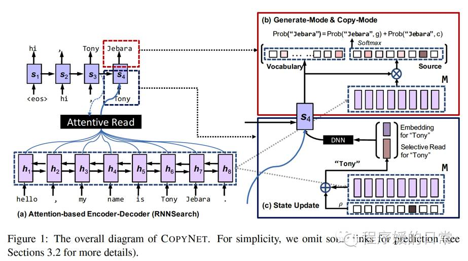
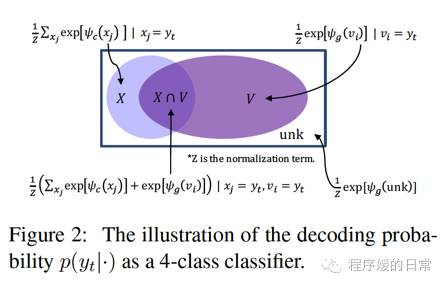
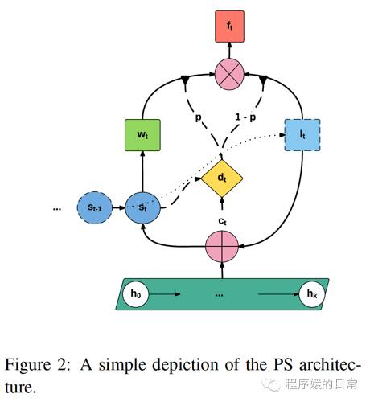

目录

<!-- TOC -->

- [CopyNet](#copynet)
- [Pointer Network](#pointer-network)

<!-- /TOC -->

参考[干货 \| Pointer Network 与 CopyNet 之上有哪些新颖任务](http://www.sohu.com/a/140364283_297288)

+ [1] [Incorporating Copying Mechanism in Sequence-to-Sequence Learning](http://aclweb.org/anthology/P16-1154)
+ [Pointing the Unknown Words](https://arxiv.org/abs/1603.08148)
+ [2] [Joint Copying and Restricted Generation for Paraphrase](https://arxiv.org/abs/1611.09235)
+ [Generating Natural Answer by Incorporating Copying and Retrieving Mechanisms in Sequence-to-Sequence Learning](http://www.nlpr.ia.ac.cn/cip/shizhuhe/articles/acl2017-coreqa.pdf)
+ [Program Induction by Rationale Generation:Learning to Solve and Explain Algebraic Word Problems](https://arxiv.org/abs/1705.04146)

首先讲前两篇ACL2016的文章，为了解决如何把 sequence2sequence任务（不只是机器翻译 MT）中的某些信息“原封不动”地保留下来（而不是翻译）而提出的。

## CopyNet

作者提出的网络叫做 CopyNet，提出的机制叫做 Copying Mechanism。

其实就是说，比如我们在对话过程中，会出现“你好啊，我叫小S”，然后另一方要回答，“很高兴认识啊小S。”那么这个小S，也就是说**实体信息**或者**日期信息**等等，就是在对话的 input-output 中，被“复制”的。这个信息是应该“原封不动”地被保留，从 sequence2sequence 的输入端被复制到输出端的。现有的 end2end sequence2sequence 等模型，即使加了 attention 机制，也很难做到这点。

难点主要有两个:

+ 一是要判断输入端中**哪个/些信息，即sub-sequences**是应该被“复制”的
+ 二是要决定在**输出端的哪个地方粘贴**这些信息。

<html>
 

 
</html>

CopyNet 的框架如上图。主要结构还是基于 Bahdanau 2014 提出的**attention-based encoder-decoder**框架。但是，在**decoder部分**，CopyNet 做出了一些改进：

+ 因为要决定是“粘贴”还是选择“生成”，有一个由概率建模的**generate-mode**和**copy-mode**。由于copy-mode的加入，**decoder可以产生出一些 OOV words（直接“复制”过来）**
+ 可能是收到 Neural Turing Machine（NTM）的启发，他们把**decoder部分的hidden state计算变成了location-specific**的，这个改进的好处是更能让模型去注意**要『复制』的**那些信息所在的**输入端的位置**
+ 如果说把（2）的改进看做一种**seletive read**，再加上attention-based encoder-decoder本身的**attentive read**，这两种机制就更需要比较好的**hybrid coordination**。

这样一来，CopyNet 就能比较好地『复制』出一条**完整的subsequences**，而不是只复制了片段。

<html>
 

 
</html>

在实验部分，CopyNet 被重点应用在了**text summarization**的任务上。实验结果非常不错，case study 也给出了很多分析，比如它是完美解决 OOV 问题的。从某个角度来说，CopyNet

+ 一方面可以保留『复制』输入端（原始文章）中的重要信息，
+ 另一方面又可以在输出端生成一些和原始文章措辞不同的摘要

也就可以把CopyNet认为是一种**extractive和abstractive summarization的结合**。

## Pointer Network

然而，其实[1] 的工作暂时有一个比较大的局限是，它因为是“原封不动”地“复制”输入端的信息，CopyNet 还不能被应用到机器翻译 MT 这个**输入端和输出端语言不同**的任务上。这也是[1] 和 [2] 的一个重大不同。[2] 的工作乍一看复杂一些，但是灵活性可能就相对高一点。如果说 [1] 里的 CopyNet 要解决的是，what to copy 和 where to paste；那么这篇论文[2] 解决的就是**learn to point** 和**when to point**。这俩问题都是通过他们[2] 提出的 Pointer Softmax（PS）model 解决的。

<html>
 

 
</html>

在PS里，有两个softmax输出层：

+ shortlist softmax就是传统的softmax(图中绿色正方形)，对应CopyNet中的generate-mode
+ location softmax则是比较重要的创新，它表示着某个词**在输入端的位置**(图中蓝色正方形)。对应CopyNet中的copy-mode

也就是说，当 PS 决定走 shortlist softmax 时，就开启generate-mode，从shortlist中**生成**一个词给decoder；而如果是相反，则从location softmax获取**要『复制』的词在输入端的位置**。那么，帮PS决定是**走哪个softmax**的方式就是通过一个实际上是**MLP的switch network**。

因为**不是直接『复制』输入端**的具体内容，而是**找到输入端的内容的位置**，所以 PS 可以完成机器翻译这种输入端和输出端不是同一种语言的任务。在实验中，这篇论文[2] 也分别在 detect rare words，机器翻译MT 和 summarization 上都进行了测试。
