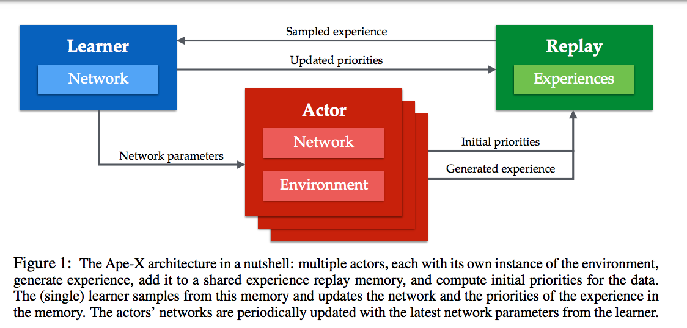
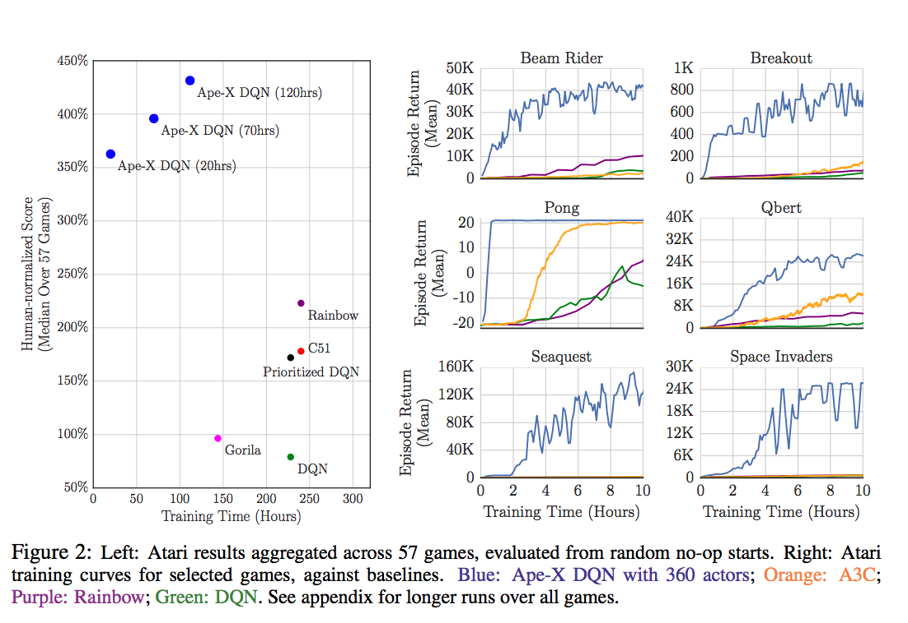

目录

<!-- TOC -->

- [1. 概述](#1-%E6%A6%82%E8%BF%B0)
- [2. A3C](#2-a3c)
- [3. PPO](#3-ppo)
- [4. rainbow](#4-rainbow)
- [5. APE-X](#5-ape-x)
    - [5.1 简介](#51-%E7%AE%80%E4%BB%8B)
    - [5.2 Actor的算法](#52-actor%E7%9A%84%E7%AE%97%E6%B3%95)
    - [5.3 Learner的算法](#53-learner%E7%9A%84%E7%AE%97%E6%B3%95)
    - [代码](#%E4%BB%A3%E7%A0%81)
- [6. rudder](#6-rudder)

<!-- /TOC -->


## 1. 概述

略
大部分在ray中都已经有啦，还有openai的baselines

[https://github.com/ray-project/ray/blob/master/doc/source/rllib-algorithms.rst](https://github.com/ray-project/ray/blob/master/doc/source/rllib-algorithms.rst)

[https://github.com/openai/baselines](https://github.com/openai/baselines)

## 2. A3C

参考[https://blog.csdn.net/jinzhuojun/article/details/72851548](https://blog.csdn.net/jinzhuojun/article/details/72851548)

ICML2016，提出了[Asynchronous Methods for Deep Reinforcement Learning](https://arxiv.org/abs/1602.01783)，即A3C（asynchronous advantage actor-critic）算法。

A3C不仅适用于**离散**也适用于**连续动作空间**的控制问题。DRL领域也确实有很成功的分布式机器学习系统，比如Google的Gorila。这篇文章另辟蹊径，发明了“平民版”的DRL算法，而且效果还不比前者差。

传统经验认为，online的RL算法在和DNN简单结合后会不稳定。主要原因是观察数据往往波动很大且前后sample相互关联。像Neural fitted Q iteration和TRPO方法通过**将经验数据batch**，或者像DQN中通过**experience replay memory对之随机采样**，这些方法有效解决了前面所说的两个问题，但是也**将算法限定在了off-policy方法中**。

而A3C是通过创建多个agent，在多个环境实例中并行且异步的执行和学习。于是，在DNN下，解锁了一大批online/offline的RL算法（如Sarsa, AC, Q-learning）。A3C不那么依赖于GPU或大型分布式系统，可以跑在一个多核CPU上。

将value function的估计作为baseline可以使得PG方法有更低的variance。这种设定下，就有了所谓的A - advantage，即，`\(R_t−b_t(s_t)\)`，即`\(A(s_t,s_t)=Q(a_t,s_t)−V(s_t)\)`，就是advantage function的估计。

将**one-step Sarsa**, **one-step Q-learning**, **n-step Q-learning**和**advantage AC**扩展至多线程异步架构。

注意，该框架是具有通用性的，例如，AC是on-policy的policy搜索方法，而Q-learning是off-policy value-based方法。

每个线程都有agent运行在环境的拷贝中，每一步生成一个参数的梯度，多个线程的这些梯度累加起来，一定步数后一起更新共享参数。

优点：

+ 它运行在**单个机器的多个CPU线程**上，而非使用parameter server的分布式系统，这样就可以**避免通信开销**和**利用lock-free的高效数据同步方法**（Hogwild!方法）【2011年的[Hogwild ! : A Lock-Free Approach to Parallelizing Stochastic Gradient Descent](https://people.eecs.berkeley.edu/~brecht/papers/hogwildTR.pdf)是一种并行SGD方法。该方法在多个CPU时间进行并行。处理器通过共享内存来访问参数，并且这些参数不进行加锁。它为每一个cpu分配不重叠的一部分参数（分配互斥），每个cpu只更新其负责的参数。该方法只适合处理数据特征是稀疏的。该方法几乎可以达到一个最优的收敛速度，因为cpu之间不会进行相同信息重写。】
+ 多个并行的actor可以有助于exploration。在不同线程上使用不同的探索策略，使得经验数据在时间上的相关性很小。这样**不需要DQN中的experience replay**也可以起到**稳定学习过程**的作用，意味着学习过程**可以是on-policy的**，所以可以使用on-policy方法（如Sarsa），且能保证稳定。

A3C和DDPG类似，通过DNN维护了policy和value function的估计，但它**没用deterministic policy**。在学习过程中**使用n-step回报**来**同时更新policy和value function**。

网络结构使用了CNN，其中一个softmax output作为policy，即`\(\pi(a_t|s_t;\theta)\)`，另一个linear output为value function，即`\(V(s_t;\theta _v)\)`，其余layer都共享。

作者还发现一个古老的技巧，即**将policy的entropy加到目标函数**可以避免收敛到次优确定性解。直观上，加上该正则项后**目标函数更鼓励找entropy大的**，即形状“扁平”的分布，这样就不容易在训练过程中聚集到某一个动作上去。

在优化方法上，作者使用了基于RPMProp的一种变体。

ray的a3c代码：[https://github.com/ray-project/ray/tree/master/python/ray/rllib/agents/a3c](https://github.com/ray-project/ray/tree/master/python/ray/rllib/agents/a3c)

## 3. PPO

参考[业界 \| OpenAI 提出强化学习近端策略优化，可替代策略梯度法](https://mp.weixin.qq.com/s?__biz=MzA3MzI4MjgzMw==&mid=2650729155&idx=4&sn=476365254e360e88a9d0d4aea9e86875&chksm=871b2ebdb06ca7abbcc0c513806844bd30f686fe637c1f2f52484516560e2f57d73a28a510cd&scene=0#rd)

[Proximal Policy Optimization Algorithms](https://openai-public.s3-us-west-2.amazonaws.com/blog/2017-07/ppo/ppo-arxiv.pdf)

openai的blog：[https://blog.openai.com/openai-baselines-ppo/](https://blog.openai.com/openai-baselines-ppo/)

策略梯度法（Policy gradient methods）是近来使用深度神经网络进行控制的突破基础，不论是视频游戏还是   3D   移动或者围棋控制等，它们都基于策略梯度法。但但是通过策略梯度法获得优秀的结果是十分困难的，policy gradient有以下几点不足：

+ 它对步长大小的选择非常敏感。如果迭代步长太小，那么训练进展会非常慢，但如果迭代步长太大，那么信号将受到噪声的强烈干扰，因此我们会看到性能会急剧降低。
+ 策略梯度法有非常低的样本效率，它需要数百万（或数十亿）的时间步骤来学习一个简单的任务。

研究人员希望能通过约束或其他优化策略更新（policy update）大小的方法来消除这些缺陷，如 TRPO 和 ACER 等方法。

+ ACER（[Sample Efficient Actor-Critic with Experience Replay](https://arxiv.org/abs/1611.01224)）方法要比PPO方法复杂得多，需要额外添加代码来**修正off-policy**和**重构缓冲器**，但它在Atari基准上仅仅比PPO好一点点
+ TRPO（[Trust region policy optimization](https://arxiv.org/abs/1502.05477)，置信域策略优化）虽然对**连续**控制任务非常有用，但它并不容易与那些在**策略**和**值函数或辅助损失函数**（auxiliary losses）间**共享参数**的算法兼容，即那些用于解决 Atari 和其他视觉输入很重要领域的算法。

PPO 算法很好地权衡了实现简单性、样本复杂度和调参难度，它尝试在每一迭代步计算一个更新以最小化成本函数，在计算梯度时还需要确保与先前策略有相对较小的偏差。

之前介绍过一个 PPO 变体（在NIPS2016上有一个talk [Deep Reinforcement Learning Through Policy Optimization](https://channel9.msdn.com/Events/Neural-Information-Processing-Systems-Conference/Neural-Information-Processing-Systems-Conference-NIPS-2016/Deep-Reinforcement-Learning-Through-Policy-Optimization)），即使用一个**适应性 KL 惩罚项**来控制**每一次迭代中的策略改变**。这次的目标函数实现了一种**与随机梯度下降相匹配的置信域（Trust Region）更新**方法，它同时还**移除了 KL 惩罚项**以简化算法和构建适应性更新。在测试中该算法在连续控制任务中取得了最好的性能，并且尽管实现起来非常简单，但它同样在 Atari 上获得了与 ACER 算法相匹配的性能。

## 4. rainbow

[Rainbow: Combining improvements in deep reinforcement learning](https://arxiv.org/abs/1710.02298)

参考[DeepMind提出Rainbow：整合DQN算法中的六种变体](https://www.jiqizhixin.com/articles/2017-10-10-2)

+ Double DQN（DDQN；van Hasselt、Guez&Silver；2016）通过解耦选择（decoupling selection）和引导行动评估解决了Q-learning过度估计偏差的问题。
+ Prioritized experience replay（Schaul 等人；2015）通过重放（replay）学习到更频繁的转换，提升了数据效率。
+ dueling 网络架构（Wang 等人；2016）可以通过分别表示状态值和动作奖励来概括各种动作。
+ 从多步骤引导程序目标中学习（Sutton；1988；Sutton & Barto 1998）如 A3C（Mnih 等人；2016）中使用偏差-方差权衡，而帮助将最新观察到的奖励快速传播到旧状态中。
+ 分布式 Q-learning（Bellemare、Dabney & Munos；2017）学习了折扣回报（discounted returns）的分类分布（代替了估计平均值）。
+ Noisy DQN（Fortunato 等人；2017）使用随机网络层进行exploration。

以上这些算法各自都可以提升 DQN 性能的某个方面，因为它们都着力于解决不同的问题，而且都构建在同一个框架上，所以能够被我们整合起来。

## 5. APE-X

### 5.1 简介

参考[最前沿：当我们以为Rainbow就是Atari游戏的巅峰时，Ape-X出来把Rainbow秒成了渣！](https://zhuanlan.zhihu.com/p/36375292)

[Distributed Prioritized Experience Replay](https://openreview.net/pdf?id=H1Dy---0Z)

只使用一个learner和一个Replay buffer，但是分布式的使用了多个Actor来生成数据，paper中实验使用了360个Actor（一个Actor一个CPU）。DeepMind产生专门做这个的想法主要是从Rainbow的研究中发现：```Prioritization was found to be the most important ingredient contributing
to the agent’s performance.```

**Replay的优先级对于性能影响是最大的**，而之前的Prioritised Replay Buffer只用单一Actor来采集数据，效率偏低。那么这篇文章中，加上分布式，并且**让每一个Actor都不完全一样**，用`\(\varepsilon -greedy\)`采样时的`\(\varepsilon \)`不一样。这样可以更好的做explore，并且更全面的寻找优先级最高的replay来训练。

+ 比以前方法**大得多得多的Replay Buffer**，毕竟同时用几百个actor来采集数据，充分挖掘了计算资源。这个本身可以大幅度加快训练速度。
+ 通过**不同的Actor得到不同优先级Priority的Replay**，如上面所说，**大幅度提升explore的能力，防止过拟合**。这是为什么Ape-X效果提升的最主要原因。

<html>
<br/>

<br/>
</html>

整个算法也就是训练架构上发生改变，算法实质并没有变化。同时，由于**使用Replay Buffer是Off-Policy独有**，因此，这篇paper就在DQN和DDPG上进行改变验证。

如上图，

+ 多个actor，每个有自己的环境，并且可以产生experience，并将其写入一个共享的experience replay memory，并且能计算initial priorities
+ 一个learner，从memory中sample，然后更新memory中的experience的priorities，并更新网络参数
+ 每个actor的网络定期地从learner获取最新的网络参数

### 5.2 Actor的算法

>1. procedure `\(ACTOR(B, T)\)` // 在environment instance中运行agent，并存储experiences
>    1. `\(\theta_0\leftarrow LEARNER.PARAMETERS()\)` // remote call以获取最新的网络参数
>    1. `\(s_0\leftarrow ENVIRONMENT.INITIALIZE() \)` // 从环境中获取初始状态
>    1. for t = 1 to T do
>        1. `\(a_{t-1}\leftarrow \pi \theta _{t-1}(s_{t-1})\)` // 使用当前policy选择一个动作
>        1. `\(r_t,\gamma_t,s_t\leftarrow ENVIRONMENT.STEP(a_{t-1})\)` // 在环境中执行这个动作
>        1. `\(LOCALBUFFER.ADD((s_{t-1},a_{t-1},r_t,\gamma_t))\)` // 将data放入local buffer中
>        1. if `\(LOCALBUFFER.SIZE() \gt B\)` then // 在一个后台线程中，定期地send data to replay
>            1. `\(\tau \leftarrow LOCALBUFFER.GET(B)\)` // 获取buffered data(例如，batch of multi-step transitions)
>            1. `\(p \leftarrow COMPUTEPRIORITIES(\tau)\)` // 计算experience的优先级（例如，绝对TD error）
>            1. `\(REPLAY.ADD(\tau,p)\)` // remote call以将experience加入replay memory中
>        1. endif
>        1. `\(PERIODICALLY(\theta_t\leftarrow LEARNER.PARAMETERS())\)` // 获取最新的网络参数
>    1. endfor
>1. end procedure

### 5.3 Learner的算法

>1. procedure `\(LEARNER(T)\)` // 使用从memory中sampled的batches来更新网络
>    1. `\(\theta_0\leftarrow INITIALIZENETWORK()\)` 
>    1. for t = 1 to T do // 更新参数T次
>        1. `\(id,\tau \leftarrow REPLAY.SAMPLE()\)` // 在后台线程中sample一个 prioritized batch的transitions
>        1. `\(l_t \leftarrow COMPUTELOSS(\tau;\theta_t)\)` // Apply learning rule，例如double Q-learning或者DDPG
>        1. `\(\theta_{t+1}\leftarrow UPDATEPARAMETERS(l_t;\theta_t)\)` 
>        1. `\(p \leftarrow COMPUTEPRIORITIES()\)` // 计算experience的优先级（例如，绝对TD error）【和Actor一样】
>        1. `\(REPLAY.SETPRIORITY(id,p)\)` // remote call以更新优先级
>        1. `\(PERIODICALLY(REPLAY.REMOVETOFIT())\)` // 从replay memory中删掉旧的experience
>    1. endfor
>1. end procedure

效果：

<html>
<br/>

<br/>
</html>

### 代码

ray的ape-x代码：[https://github.com/ray-project/ray/blob/master/python/ray/rllib/agents/dqn/apex.py](https://github.com/ray-project/ray/blob/master/python/ray/rllib/agents/dqn/apex.py)

## 6. rudder

参考[比TD、MC、MCTS指数级快，性能超越A3C、DDQN等模型，这篇RL算法论文在Reddit上火了](https://www.jiqizhixin.com/articles/2018-06-22-3)

在强化学习中，**延迟奖励**的存在会严重影响性能，主要表现在随着延迟步数的增加，**对时间差分（TD）估计偏差的纠正时间的指数级增长**，和**蒙特卡洛（MC）估计方差的指数级增长**。针对这一问题，来自奥地利约翰开普勒林茨大学 LIT AI Lab 的研究者提出了一种**基于返回值分解**的新方法 RUDDER。实验表明，RUDDER 的速度是 TD、MC 以及 MC 树搜索（MCTS）的指数级，并在特定 Atari 游戏的训练中很快超越 rainbow、A3C、DDQN 等多种著名强化学习模型的性能。

[RUDDER: Return Decomposition for Delayed Rewards](https://arxiv.org/abs/1806.07857)

源码：[https://github.com/ml-jku/baselines-rudder](https://github.com/ml-jku/baselines-rudder)
