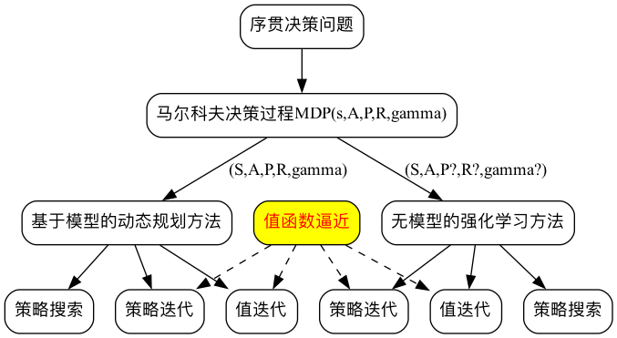
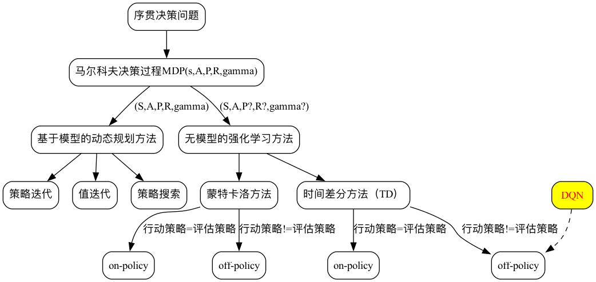
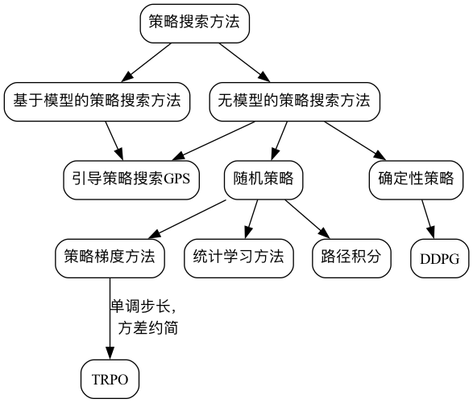

目录

<!-- TOC -->

- [概览](#概览)
- [基于值函数的强化学习方法](#基于值函数的强化学习方法)
- [策略搜索方法](#策略搜索方法)

<!-- /TOC -->

## 概览

<html>
 

 
</html>

## 基于值函数的强化学习方法

<html>
 

 
</html>

## 策略搜索方法

<html>
 

 
</html>

