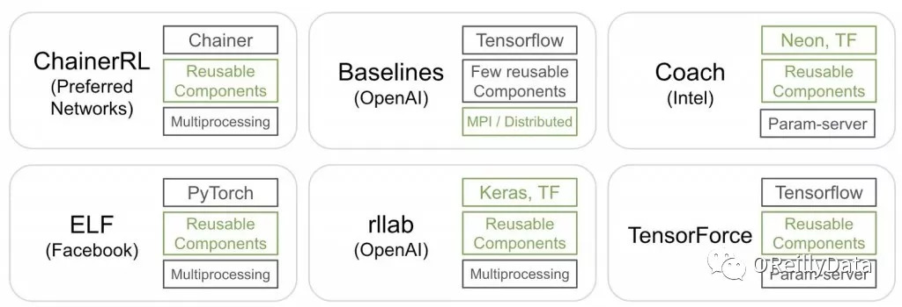

目录

<!-- TOC -->

- [简介](#%E7%AE%80%E4%BB%8B)
- [tune](#tune)
- [使用](#%E4%BD%BF%E7%94%A8)
    - [gym自带的环境](#gym%E8%87%AA%E5%B8%A6%E7%9A%84%E7%8E%AF%E5%A2%83)

<!-- /TOC -->

## 简介

[RLlib: Abstractions for Distributed Reinforcement Learning](https://arxiv.org/abs/1712.09381)

部分参考自：[https://blog.csdn.net/zkh880loLh3h21AJTH/article/details/79620311](https://blog.csdn.net/zkh880loLh3h21AJTH/article/details/79620311)

现有的强化学习libs：

<html>
<br/>

<br/>
</html>

几个出发点：

+ **需要支持现有的机器学习库。**因为RL通常使用基于梯度下降或进化算法来学习和拟合策略函数，所以您需要它支持您最喜欢的库（TensorFlow，Keras，PyTorch等）。
+ **可扩展性。**RL是**计算密集型**的，并且在关键应用程序中开始使用RL时，可以选择以分布式方式运行。
+ **可组合性。**RL算法通常涉及模拟和许多其他组件。 您将需要一个库，允许您**重用与多种深度学习框架兼容的RL算法组件（例如策略图，走子演算[这是啥。。]等）**，并提供**可组合的分布式执行原语（嵌套并行）**。


## tune

[https://daiwk.github.io/posts/platform-ray-tune.html](https://daiwk.github.io/posts/platform-ray-tune.html)

## 使用

最基础用法(使用```lib/python2.7/site-packages/ray/rllib/train.py```)：

```shell
python ./train.py --run DQN --env CartPole-v0 
python ./train.py --run APEX --env CartPole-v0
python ./train.py --run APEX_DDPG --env Pendulum-v0
python ./train.py --run DDPG --env Pendulum-v0
python ./train.py --run DDPG2 --env Pendulum-v0
python ./train.py --run A3C --env CartPole-v0 
```

<html>
<br/>

<br/>
</html>

<html>
<br/>

<br/>
</html>

### gym自带的环境

gym的所有自带的环境（注意，rllib里的ddpg适用的问题是Box的，Discrete的不能解）

[https://github.com/openai/gym/wiki/Table-of-environments](https://github.com/openai/gym/wiki/Table-of-environments)

