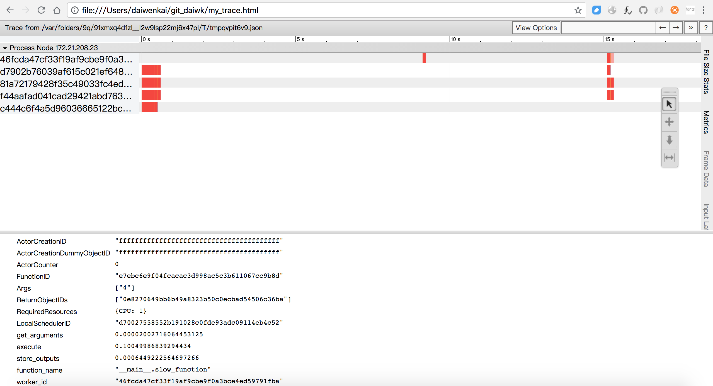
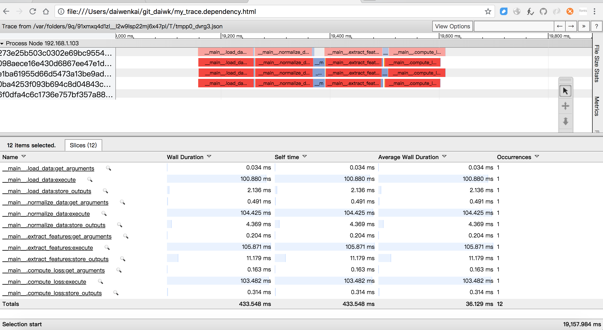

目录

<!-- TOC -->

- [简介](#简介)
- [ray的ui](#ray的ui)
- [使用](#使用)
    - [简单的数据并行](#简单的数据并行)
    - [有任务依赖的并行](#有任务依赖的并行)
- [ray-rllib](#ray-rllib)

<!-- /TOC -->

## 简介

参考[伯克利AI分布式框架Ray，兼容TensorFlow、PyTorch与MXNet](https://www.jiqizhixin.com/articles/2018-01-10-2)

github: [https://github.com/ray-project](https://github.com/ray-project)

tutorials: [http://ray.readthedocs.io/en/latest/tutorial.html](http://ray.readthedocs.io/en/latest/tutorial.html)

## ray的ui

首先参考[http://ipywidgets.readthedocs.io/en/latest/user_install.html](http://ipywidgets.readthedocs.io/en/latest/user_install.html)

```shell
pip install ipywidgets
```

然后设置一下：

```shell
jupyter nbextension enable --py widgetsnbextension
```

再然后，启动jupyter:

```shell
nohup jupyter notebook &
```

还需要装个chrome的插件trace-viewer：

[https://github.com/catapult-project/catapult](https://github.com/catapult-project/catapult)

```shell
git clone https://github.com/catapult-project/catapult.git
```


然后还要安装bokeh

```shell
pip install bokeh
```

在我们执行```ray.init(num_cpus=4, redirect_output=True)```的时候会有提示，例如：

```shell
View the web UI at http://localhost:8889/notebooks/ray_ui82961.ipynb?token=43724f05dc0a2b1897bf50e9c9d01541a1bfef8ba9030eac
```

点开这个url，就可以看到ui的几个用法了：

```python
import ray.experimental.ui as ui
ray.init(redis_address=os.environ["REDIS_ADDRESS"]) ## 从刚init的那个环境再init一下下

```

使用```ui.object_search_bar()```可以查看objectid的信息，例如：

```python
Search for an object: 95f3bf18ee668c11d8f3d2c51861718daea2240d
## 输出
{'DataSize': 516,
 'Hash': '725b5c6d41876612000000001400000095f3bf18ee668c11d8f3d2c51861718d',
 'IsPut': False,
 'ManagerIDs': ['ba72fda097848a8638b6b6d66a7eb58d65748e88'],
 'TaskID': '94f3bf18ee668c11d8f3d2c51861718daea2240d'}
```

使用```ui.task_search_bar()```可以查看taskid的信息，例如：

```python
Search for a task: 94f3bf18ee668c11d8f3d2c51861718daea2240d
{'ExecutionDependencies': [],
 'ExecutionDependenciesString': b'\x0c\x00\x00\x00\x00\x00\x06\x00'
                                b'\x08\x00\x04\x00\x06\x00\x00\x00'
                                b'\x04\x00\x00\x00\x00\x00\x00\x00',
 'LocalSchedulerID': 'd70027558552b191028c0fde93adc09114eb4c52',
 'SpillbackCount': 0,
 'State': 16,
 'TaskSpec': {'ActorCounter': 0,
              'ActorCreationDummyObjectID': 'ffffffffffffffffffffffffffffffffffffffff',
              'ActorCreationID': 'ffffffffffffffffffffffffffffffffffffffff',
              'ActorID': 'ffffffffffffffffffffffffffffffffffffffff',
              'Args': [1],
              'DriverID': '6ed2713441d1e526abb1f1bc591727511c627f4b',
              'FunctionID': 'e7ebc6e9f04fcacac3d998ac5c3b611067cc9b8d',
              'ParentCounter': 25,
              'ParentTaskID': 'b256658bf683d1525d52fb4a6b6faed08fba35ac',
              'RequiredResources': {'CPU': 1.0},
              'ReturnObjectIDs': [ObjectID(95f3bf18ee668c11d8f3d2c51861718daea2240d)],
              'TaskID': '94f3bf18ee668c11d8f3d2c51861718daea2240d'}}
```

而使用```ui.task_timeline()```则稍微有点复杂。。点击"View task timeline"，会生成一个json文件，例如```/var/folders/9q/91xmxq4d1zl__l2w9lsp22mj6x47pl/T/tmpr6x81_js.json```，然后就需要执行：

```shell
catapult/tracing/bin/trace2html /var/folders/9q/91xmxq4d1zl__l2w9lsp22mj6x47pl/T/tmpr6x81_js.json --output=my_trace.html && open my_trace.html
```

这样就可以在浏览器中打开啦~

<html>
<br/>

<br/>
</html>

参考：[https://daiwk.github.io/assets/my_trace.html](https://daiwk.github.io/assets/my_trace.html)

从图中可以看出，我跑了三次，

+ 第一次是20多个tasks，分布在4个不同的worker上并行执行
+ 第二次1个task，建了一个新的worker
+ 第三次7个task，分布在4个worker上并行执行

另外，下面这几个是基于bokeh的，可以直接在jupyter里看：

```python
ui.task_completion_time_distribution()
ui.cpu_usage()
ui.cluster_usage()
```

## 使用

### 简单的数据并行

定义：

```python
# A regular Python function.
def regular_function(x):
    return x

# A Ray remote function.
@ray.remote
def remote_function(x):
    return x
```

运行时，```remote_function.remote()```返回的是一个objectID，然后create了一个task。想要拿到结果，就要执行```ray.get```：

```python
 >>> regular_function()
 1

 >>> remote_function.remote(1)
 ObjectID(1c80d6937802cd7786ad25e50caf2f023c95e350)

 >>> ray.get(remote_function.remote(1))
 1
```

数据并行：

```python
results = [slow_function.remote(i) for i in range(7)]
ray.get(results)
```

会发现最后的结果是保持了原来的顺序的，应该是并行执行，然后最后会按先后顺序聚合。

### 有任务依赖的并行

只要不get，就可以把objectid一路传下去，最后get一下就行，这样多个remote间就是有依赖关系的了，例如(只get了一次：```ray.get(losses)```)：

```python
@ray.remote
def load_data(filename):
    time.sleep(0.1)
    return np.ones((1000, 100))
@ray.remote
def normalize_data(data):
    time.sleep(0.1)
    return data - np.mean(data, axis=0)
@ray.remote
def extract_features(normalized_data):
    time.sleep(0.1)
    return np.hstack([normalized_data, normalized_data ** 2])
@ray.remote
def compute_loss(features):
    num_data, dim = features.shape
    time.sleep(0.1)
    return np.sum((np.dot(features, np.ones(dim)) - np.ones(num_data)) ** 2)

time.sleep(2.0)
start_time = time.time()

losses = []
for filename in ['file1', 'file2', 'file3', 'file4']:
    data = load_data.remote(filename)
    normalized_data = normalize_data.remote(data)
    features = extract_features.remote(normalized_data)
    loss = compute_loss.remote(features)
    losses.append(loss)

print('The losses are {}.'.format(losses) + '\n')
loss = sum(ray.get(losses))

end_time = time.time()
duration = end_time - start_time

print('The loss is {}. This took {} seconds. Run the next cell to see '
      'if the exercise was done correctly.'.format(loss, duration))
```

<html>
<br/>

<br/>
</html>

可见一个task里，是串行地执行load_data->normalize_data->extract_features->compute_loss的。而每一个函数内部又分为get_arguments->execute->store_outputs三个阶段。

参考：[https://daiwk.github.io/assets/my_trace.dependency.html](https://daiwk.github.io/assets/my_trace.dependency.html)

## ray-rllib

参考[https://daiwk.github.io/posts/platform-ray-rllib.html](https://daiwk.github.io/posts/platform-ray-rllib.html)
