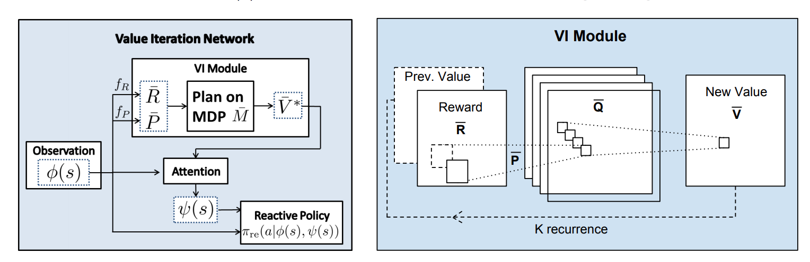

目录

<!-- TOC -->

- [1. 背景](#1-背景)
    - [1.1 DQN的缺陷](#11-dqn的缺陷)
    - [2.2 具有规划能力的策略网络](#22-具有规划能力的策略网络)
- [2. 值迭代网络](#2-值迭代网络)
- [3. 代码解读](#3-代码解读)
    - [3.1 基础知识：](#31-基础知识)
        - [python的slice函数](#python的slice函数)
        - [tf.nn.conv2d](#tfnnconv2d)
        - [tf.reduce_*](#tfreduce_)
    - [3.2 代码](#32-代码)

<!-- /TOC -->


参考**《深入浅出强化学习》**

## 1. 背景

[Value Iteration Networks](http://papers.nips.cc/paper/6046-value-iteration-networks.pdf)

参考 [https://zhuanlan.zhihu.com/p/25515755](https://zhuanlan.zhihu.com/p/25515755)

slide：[https://daiwk.github.io/assets/value-iteration-networks-slide.pdf](https://daiwk.github.io/assets/value-iteration-networks-slide.pdf)

### 1.1 DQN的缺陷

先从以下几个角度来理解DQN：

+ DQN是一个深度神经网络：是一个由3个卷积层和2个全连接层组成的深度神经网络
+ DQN的训练方法是强化学习：调整神经网络权值有很多方法，只是在DQN中使用的是强化学习。详见第6章（[https://daiwk.github.io/posts/rl-stepbystep-chap6.html](https://daiwk.github.io/posts/rl-stepbystep-chap6.html)）

Tamar等发现，**已经调优的深度神经网络，很难泛化到其他游戏中，即，该网络并没有学到本质。。。**

原因就在于，DQN的网络结构是前向的多层神经网络。**输入是状态，输出是动作，也就是策略。**Tamar等人称这种策略为**『reactive policy(反应式策略)』**。也就是给定一个状态，得到一个反应动作。

从强化学习要解决的任务来看，强化学习要解决的是序贯决策问题，**即当前的决策要考虑后续的决策，使得整个策略总体最优**，而反应式策略并不能表达后续策略对当前策略的影响。。

### 2.2 具有规划能力的策略网络

所谓的规划就是**考虑后续的回报**。目前大部分强化学习所用的深度网络都是反应是网络，缺少显式的规划计算。但由于**训练方法用的是强化学习训练方法，在训练时考虑了规划问题**，所以很多网络还是比较成功的。但由于网络本身没有规划模块，所以运用到新环境时，大部分需要重新训练，即泛化能力差。

如果训练策略本身有规划模块，有以下两个好处：

+ 可以利用**已经训练好的规划模块**规划新的任务，泛化能力很强
+ 训练方法可以更灵活，不必依赖强化学习算法。**可以利用成熟的监督学习方法和模仿学习方法**。而，**如果没有数据标签时，仍然要用强化学习的训练方法**。

## 2. 值迭代网络

最常用的规划算法是值迭代算法，第3章讲了动态规划的思想。规划实际蕴含的是一个优化问题，基于贝尔曼优化原理：

`\[
\upsilon ^*(s)=\underset{a}{max}R^a_{s}+\gamma \sum _{s'\in S}P^a_{ss'}\upsilon ^*(s')
\]`

基于该原理，具体的算法实现是值迭代算法，在第3章中提到了[https://daiwk.github.io/posts/rl-stepbystep-chap3.html#13-%E5%80%BC%E5%87%BD%E6%95%B0%E8%BF%AD%E4%BB%A3%E7%AE%97%E6%B3%95](https://daiwk.github.io/posts/rl-stepbystep-chap3.html#13-%E5%80%BC%E5%87%BD%E6%95%B0%E8%BF%AD%E4%BB%A3%E7%AE%97%E6%B3%95)：


>1. 输入：状态转移概率`\(P^a_{ss'}\)`，回报函数`\(R^a_{s}\)`，折扣因子`\(\gamma\)`，初始化值函数`\(\upsilon(s)=0\)`，初始化策略`\(\pi_0\)`
>1. Repeat `\(l=0,1,...\)`
>1.    for every `\(s\)` do
>1.        `\(\upsilon _{l+1}(s)=\underset{a}{max}R^a_{s}+\gamma \sum _{s'\in S}P^a_{ss'}\upsilon _l(s')\)` 
>1. Until `\(\upsilon _{l+1}=\upsilon _l\)`
>1. 输出：`\(\pi(s)=argmax_aR^a_{s}+\gamma \sum _{s'\in S}P^a_{ss'}\upsilon _l(s')\)`

由于值迭代的计算过程与CNN的传播过程很相似，所以可以**利用CNN来表示值迭代过程。**

先看看值迭代计算过程与CNN传播过程的相似之处：

值迭代中，最关键的公式是：

`\[
\upsilon _{l+1}(s)=\underset{a}{max}R^a_{s}+\gamma \sum _{s'\in S}P^a_{ss'}\upsilon _l(s')
\]`

可以分解为两个步骤：

+ 遍历动作`\(a\)`，得到不同动作`\(a\)`对应的值函数更新，即：

`\[
\upsilon _{l+1}(s)=R^a_{s}+\gamma \sum _{s'\in S}P^a_{ss'}\upsilon _l(s')
\]`

这一步相当于CNN中的卷积操作。相当于图中的，输入`\(\bar{R}\)`和`\(Prev.\ Value\)`，得到`\(\bar{Q}\)`

+ 遍历动作`\(a\)`，找到最大的`\(\upsilon_{l+1}(s,a)\)`：

`\[
\upsilon _{l+1}(s)=\underset{a}{max}\upsilon _{l+1}(s,a)
\]`

这一步相当于CNN中的池化操作。相当于图中的，输入`\(\bar{Q}\)`，得到`\(New\ Value\ \bar{V}\)`

所以，可以将值迭代的过程用CNN嵌入到策略网络中，而与CNN有如下的不同：

+ 偏移量`\(R^a_s\)`对应着每个像素的偏移量(bias)
+ 状态转移函数`\(P^a_{ss'}\)`对应着卷积核，因为它要和`\(\bar{V}\)`进行点积再求和
+ 卷积核的个数对应着动作空间的维数

<html>
<br/>


<br/>

</html>

这个网络迭代k次，可以理解为网络往后多看了k步之后的值函数。【相当于一个k个时间步的cnn(conv+maxpooling)，然后再和原始输入做个attention？】

k步之后得到的最优策略为：

`\[
\pi ^*(s)=argmax_aR(s,a)+\gamma \sum _{s'} P(s'|s,a)V^*(s')
\]`

状态`\(s\)`处的策略只和它的邻域的值函数`\(V^*(s')\)`有关。而在nn中，当给定的标签只与输入特征的一个局部相关时，就是attention机制。所以，VIN在VI模块后，加了一个attention网络。

训练方法的话，可以采用模仿学习（IL），也可以采用强化学习（RL）。模仿学习就是利用专家数据对网络参数进行训练，例如针对导航任务，专家数据可以来自传统的规划算法，如Dijkstra算法或者`\(A^*\)`算法。

## 3. 代码解读 

tf：[https://github.com/TheAbhiKumar/tensorflow-value-iteration-networks](https://github.com/TheAbhiKumar/tensorflow-value-iteration-networks)

pytorch：[https://github.com/kentsommer/pytorch-value-iteration-networks](https://github.com/kentsommer/pytorch-value-iteration-networks)

tf版本

### 3.1 基础知识：

#### python的slice函数

```python
class slice(stop)
class slice(start, stop[, step])
### start -- 起始位置
### stop -- 结束位置
### step -- 间距
## 示例

>>>myslice = slice(5)    # 设置截取5个元素的切片
>>> myslice
slice(None, 5, None)
>>> arr = range(10)
>>> arr
[0, 1, 2, 3, 4, 5, 6, 7, 8, 9]
>>> arr[myslice]         # 截取 5 个元素
[0, 1, 2, 3, 4]
>>>

```

#### tf.nn.conv2d

参考[https://daiwk.github.io/posts/knowledge-tf-usage.html#tfnnconv2d](https://daiwk.github.io/posts/knowledge-tf-usage.html#tfnnconv2d)

#### tf.reduce_*

参考[https://daiwk.github.io/posts/knowledge-tf-usage.html#tfreduce_](https://daiwk.github.io/posts/knowledge-tf-usage.html#tfreduce_)

### 3.2 代码

```python

def flipkernel(kern):
    return kern[(slice(None, None, -1),) * 2 + (slice(None), slice(None))]

def conv2d_flipkernel(x, k, name=None):
    return tf.nn.conv2d(x, flipkernel(k), name=name,
                        strides=(1, 1, 1, 1), padding='SAME')

def VI_Block(X, S1, S2, config):
    k    = config.k    # Number of value iterations performed
    ch_i = config.ch_i # Channels in input layer
    ch_h = config.ch_h # Channels in initial hidden layer
    ch_q = config.ch_q # Channels in q layer (~actions)
    state_batch_size = config.statebatchsize # k+1 state inputs for each channel

    bias  = tf.Variable(np.random.randn(1, 1, 1, ch_h)    * 0.01, dtype=tf.float32)
    # weights from inputs to q layer (~reward in Bellman equation)
    w0    = tf.Variable(np.random.randn(3, 3, ch_i, ch_h) * 0.01, dtype=tf.float32) # 从X到h？
    w1    = tf.Variable(np.random.randn(1, 1, ch_h, 1)    * 0.01, dtype=tf.float32) # 从h到reward？
    w     = tf.Variable(np.random.randn(3, 3, 1, ch_q)    * 0.01, dtype=tf.float32) # 从reward到q？
    # feedback weights from v layer into q layer (~transition probabilities in Bellman equation)
    w_fb  = tf.Variable(np.random.randn(3, 3, 1, ch_q)    * 0.01, dtype=tf.float32)
    w_o   = tf.Variable(np.random.randn(ch_q, 8)          * 0.01, dtype=tf.float32)

    # initial conv layer over image+reward prior
    h = conv2d_flipkernel(X, w0, name="h0") + bias

    r = conv2d_flipkernel(h, w1, name="r")
    q = conv2d_flipkernel(r, w, name="q")
    v = tf.reduce_max(q, axis=3, keep_dims=True, name="v") # 相当于maxpooling

    for i in range(0, k-1):
        rv = tf.concat([r, v], 3) # reward和上一步的v一起，接下来进行卷积
        wwfb = tf.concat([w, w_fb], 2)
        q = conv2d_flipkernel(rv, wwfb, name="q")
        v = tf.reduce_max(q, axis=3, keep_dims=True, name="v")

    # do one last convolution
    q = conv2d_flipkernel(tf.concat([r, v], 3),
                          tf.concat([w, w_fb], 2), name="q")

    # CHANGE TO THEANO ORDERING
    # Since we are selecting over channels, it becomes easier to work with
    # the tensor when it is in NCHW format vs NHWC
    q = tf.transpose(q, perm=[0, 3, 1, 2])

    # Select the conv-net channels at the state position (S1,S2).
    # This intuitively corresponds to each channel representing an action, and the convnet the Q function.
    # The tricky thing is we want to select the same (S1,S2) position *for each* channel and for each sample
    # TODO: performance can be improved here by substituting expensive
    #       transpose calls with better indexing for gather_nd
    bs = tf.shape(q)[0]
    rprn = tf.reshape(tf.tile(tf.reshape(tf.range(bs), [-1, 1]), [1, state_batch_size]), [-1])
    ins1 = tf.cast(tf.reshape(S1, [-1]), tf.int32)
    ins2 = tf.cast(tf.reshape(S2, [-1]), tf.int32)
    idx_in = tf.transpose(tf.stack([ins1, ins2, rprn]), [1, 0])
    q_out = tf.gather_nd(tf.transpose(q, [2, 3, 0, 1]), idx_in, name="q_out")

    # add logits
    logits = tf.matmul(q_out, w_o)
    # softmax output weights
    output = tf.nn.softmax(logits, name="output")
    return logits, output
```