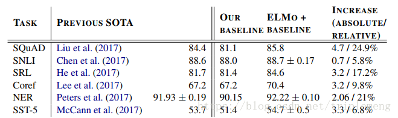
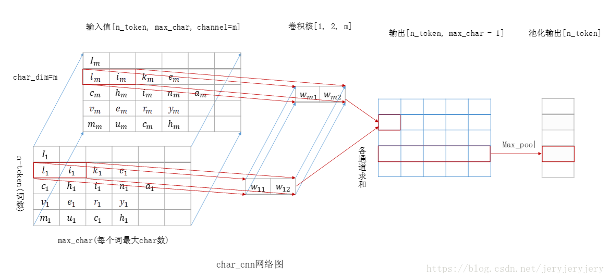
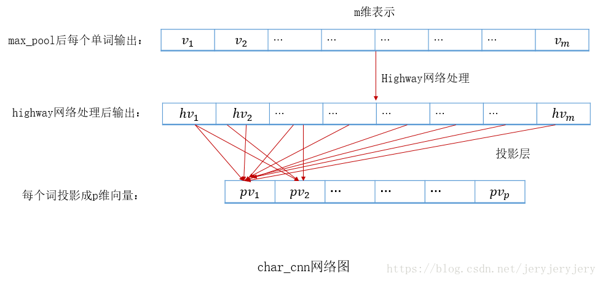
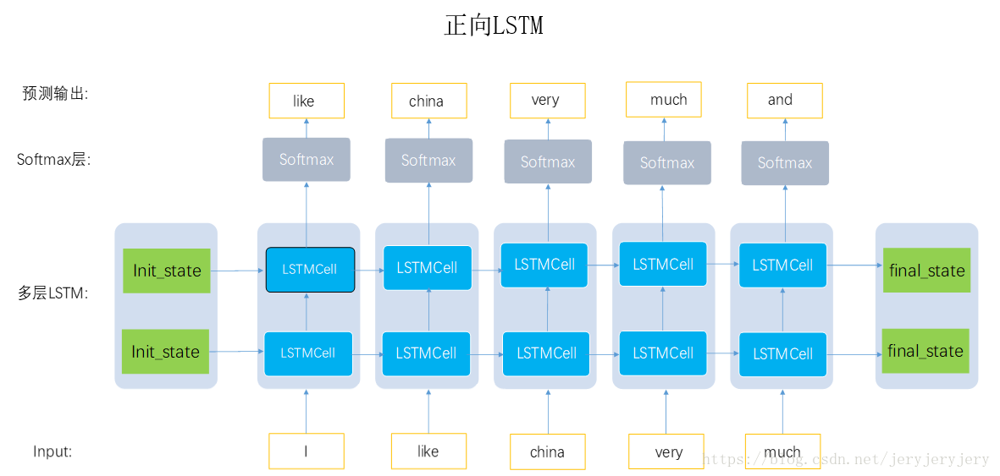
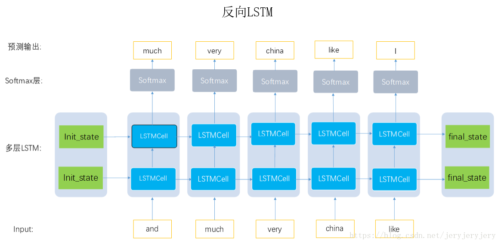

目录

<!-- TOC -->

- [概述](#概述)
- [ELMo](#elmo)
- [代码](#代码)
    - [pytorch版本](#pytorch版本)
    - [tensorflow版本](#tensorflow版本)

<!-- /TOC -->

[https://zhuanlan.zhihu.com/p/37915351](https://zhuanlan.zhihu.com/p/37915351)

[https://cstsunfu.github.io/2018/06/ELMo/](https://cstsunfu.github.io/2018/06/ELMo/)

[https://blog.csdn.net/triplemeng/article/details/82380202](https://blog.csdn.net/triplemeng/article/details/82380202)

[Deep contextualized word representations](https://arxiv.org/abs/1802.05365)

[https://allennlp.org/elmo](https://allennlp.org/elmo)

## 概述

之前的glove以及word2vec的word embedding在nlp任务中都取得了最好的效果, 现在几乎没有一个NLP的任务中不加word embedding.

我们常用的获取embedding方法都是通过训练language model, 将language model中预测的hidden state做为word的表示, 给定N个tokens的序列`\((t_1, t_2,...,t_n)\)`, 前向language model就是通过前k-1个输入序列`\((t_1, t_2, ...,t_k)\)`的hidden表示, 预测第k个位置的token, 反向的language model就是给定后面的序列, 预测之前的, 然后将language model的第k个位置的hidden输出做为word embedding。

之前的做法的缺点是对于每一个单词都有唯一的一个embedding表示, 而对于多义词显然这种做法不符合直觉, 而单词的意思又和上下文相关, ELMo的做法是我们**只预训练language model**, 而**word embedding是通过输入的句子实时输出**的, 这样单词的意思就是上下文相关的了, 这样就很大程度上缓解了歧义的发生。且ELMo输出多个层的embedding表示, 试验中已经发现每层LM输出的信息对于不同的任务效果不同, 因此**对每个token用不同层的embedding表示会提升效果**。

## ELMo

使用双向的language model, 给定N个tokens`\((t1, t2,…,tN)\)`, language model通过给定前面的k-1个位置的token序列计算第k个token的出现的概率:

`\[
p(t_1, t_2, ..., t_N) = \prod_{k=1}^N p(t_k|t_1, t_2, ..., t_{k-1})
\]`

后向的计算方法与前向相似:

`\[
p(t_1, t_2, ..., t_N) = \prod_{k=1}^N p(t_k\vert t_{k+1}, t_{k+2}, ..., t_{N})
\]`

双向的biLM训练过程中的目标就是最大化:

`\[
\sum^N_{k=1}(\log p(t_k| t_1, ...,t_{k-1};\Theta _x, \overrightarrow{\Theta}_{LSTM}, \Theta _s) + \log p(t_k\vert t_{k+1}, ...,t_{N}; \Theta _x, \overleftarrow{\Theta}_{LSTM}, \Theta _s))
\]`

ELMo对于每一个token `\(t_k\)`，通过一个L层的biLM得到2L+1个表示：

`\[
R_k = \{x_k^{LM}, \overrightarrow{h}_{k,j}^{LM}, \overleftarrow{h}_{k, j}^{LM} \vert j=1, ..., L\} = \{h_{k,j}^{LM} \vert j=0,..., L\}
\]`

其中，

+ `\[h_{k,0}^{LM}\]`是对token直接编码的结果((这里是对字符进行CNN编码)，即上式的`\[x_k^{LM}\]`
+ `\(h_{k,j}^{LM} = [\overrightarrow{h}_{k,j}^{LM}; \overleftarrow{h}_{k, j}^{LM}]\)`是每个biLSTM层输出的结果

在应用中，将ELMo中所有层的输出R压缩为单个向量`\(ELMo_k = E(R_k;\Theta _\epsilon)\)`， 最简单的压缩方法是取最后一层的输出做为token的表示: `\(E(R_k) = h_{k,L}^{LM}\)`。更通用的做法是通过一些参数来联合所有层的信息:

`\[
ELMo_k^{task} = E(R_k;\Theta ^{task}) = \gamma ^{task} \sum _{j=0}^L s_j^{task}h_{k,j}^{LM}
\]`

其中，

+ `\(s_j\)`是一个softmax出来的结果
+ `\(\gamma\)`是任务相关的scale参数

Pre-trained的language model是用了两层的biLM, 对token进行上下文无关的编码是通过CNN对字符进行编码, 然后将三层的输出scale到1024维,最后对每个token输出3个1024维的向量表示。

这里之所以将3层的输出都作为token的embedding表示是因为实验已经证实不同层的LM输出的信息对于不同的任务作用是不同的, 也就是所不同层的输出捕捉到的token的信息是不相同的.

ELMo只是提供了word级别的解决方案：利用它的pretrained biLM来产生word embedding,然后提供给下游的模型。这里的模型往往是sequence model，其效果已经在相应的NLP任务上得到验证。

如何使用ElMo产生的表征呢？对于一个supervised NLP任务，可以分以下三步:

+ 产生pre-trained biLM模型。模型由两层bi-LSTM组成，之间用residual connection连接起来。
+ 在任务语料上(注意是语料，忽略label)fine tuning上一步得到的biLM模型。可以把这一步看为biLM的domain transfer。
+ 利用ELMo的word embedding来对任务进行训练。通常的做法是把它们作为输入加到已有的模型中，一般能够明显的提高原模型的表现。

在QA，Textual entailment，Semanic role labeling, Coreference resolution, NER， 和 Sentiment analysis上的表现：

<html>
 

 

</html>

和state of art比基本上每个任务都有明显的改善。表中的OUR BASELINE在论文中有详细介绍，它指的是作者选定的某些已有的模型。ELMo+BASELINE指的是作者把ELMo的word representation作为输入提供给选定的模型。这样我们可以清楚的比较在使用和不使用ELMo词嵌入时的效果。

## 代码

### pytorch版本

[https://github.com/allenai/allennlp/blob/master/tutorials/how_to/elmo.md](https://github.com/allenai/allennlp/blob/master/tutorials/how_to/elmo.md)

### tensorflow版本

[https://github.com/allenai/bilm-tf](https://github.com/allenai/bilm-tf)

代码解析：[https://blog.csdn.net/jeryjeryjery/article/details/81183433](https://blog.csdn.net/jeryjeryjery/article/details/81183433)

看下cnn部分：

<html>
 

 

</html>

<html>
 

 

</html>

正向lstm：每个时间步预测下一个词：

<html>
 

 

</html>

反向lstm：输入序列逆序，每个时间步还是预测下一个词：

<html>
 

 

</html>

