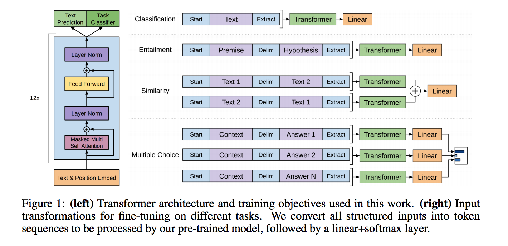

目录

<!-- TOC -->

- [gpt](#gpt)
- [gpt-2](#gpt-2)

<!-- /TOC -->

## gpt

openai的gpt(generative pre-training)：[Improving language understanding with unsupervised learning](https://s3-us-west-2.amazonaws.com/openai-assets/research-covers/language-unsupervised/language_understanding_paper.pdf)。。改名字了『Improving Language Understanding by Generative Pre-Training』

代码[https://github.com/openai/finetune-transformer-lm](https://github.com/openai/finetune-transformer-lm)

参考[https://www.jiqizhixin.com/articles/2018-06-12-6](https://www.jiqizhixin.com/articles/2018-06-12-6)

blog原文：[https://blog.openai.com/language-unsupervised/](https://blog.openai.com/language-unsupervised/)

该方法主要结合了两个已存的研究，即 Transformer 和无监督预训练。实验结果提供了非常令人信服的证据，其表明联合监督学习方法和无监督预训练能够得到非常好的性能。

研究者开发的这种方式借鉴了他们关于 Sentiment Neuron，即[https://blog.openai.com/unsupervised-sentiment-neuron/](https://blog.openai.com/unsupervised-sentiment-neuron/)方面的研究成果，他们发现无监督学习技术在足够多的数据集上训练能产生令人惊讶的可区分特征。

主要分为两个阶段：

+ 首先以无监督的方式在大型数据集上训练一个 Transformer，即使用语言建模作为训练信号，
+ 然后在小得多的有监督数据集上精调模型以解决具体任务。

<html>
 

 

</html>

+ 左图是transformer的结构，有两个目标
+ 右图是不同应用场景下的fine-tuning方法

这一项研究任务建立在[Semi-supervised Sequence Learning](https://arxiv.org/abs/1511.01432)论文中所提出的方法，该方法展示了如何通过无监督预训练的 LSTM 与有监督的精调提升文本分类性能。这一项研究还扩展了论文[Universal Language Model Fine-tuning for Text Classification](https://arxiv.org/abs/1801.06146)所提出的 ULMFiT 方法，它展示了单个与数据集无关的 LSTM 语言模型如何进行精调以在各种文本分类数据集上获得当前最优的性能。

OpenAI 的研究工作展示了如何使用基于 Transformer 的模型，并在精调后能适应于除文本分类外其它更多的任务，例如常识推理、语义相似性和阅读理解。

该方法与 ELMo 相似但更加通用，ELMo 同样也结合了预训练，但需要使用为任务定制的架构以在各种任务中取得当前顶尖的性能。

OpenAI 只需要很少的调整就能实现最后的结果。所有数据集都使用单一的前向语言模型，且不使用任何集成方法，超参配置也与大多数研究成果相同。

缺点：

+ 计算需求：很多之前的解决 NLP 任务的方法可以在单块 GPU 上从零开始训练相对较小的模型。OpenAI 的方法在**预训练步骤中需要很高的成本——在 8 块 GPU 上训练 1 个月**。幸运的是，这仅需要做一次，OpenAI 会发布他们的模型，从而其他人可以避免这一步。它也是一个很大的模型（相比于之前的工作），因而需要更多的计算和内存。OpenAI 使用了一个**37 层（12 个模块）的 Tranformer**架构，并且在达到**512 个 token的序列**上训练。多数实验都是在 4 和 8 块 GPU 的系统上构建的。该模型确实能很快速地精调到新的任务上，这缓解了额外的资源需求。
+ 通过文本学习而导致的对世界理解的局限和偏差：在互联网上可用的书籍和文本并没有囊括关于世界的完整甚至是准确的信息。近期的研究表明特定类型的信息很难仅通过文本学习到，其它研究表明模型会从数据分布中学习和利用偏差。
+ 泛化能力仍然很脆弱：虽然 OpenAI 的方法在多种任务中提高了性能，目前的深度学习 NLP 模型仍然展现出令人吃惊的和反直觉的行为，特别是当在系统化、对抗性或超出数据分布的方式进行评估的时候。OpenAI 的方法相比于之前的纯神经网络的方法在文本蕴涵任务上展示了提升的词法鲁棒性。在 Glockner 等人的论文《Breaking NLI Systems with Sentences that Require Simple Lexical Inferences》引入的数据集中，他们的模型达到了 83.75% 的准确率，和 KIM（Knowledge-based Inference Model，来自《NATURAL LANGUAGE INFERENCE WITH EXTERNAL KNOWLEDGE》）的性能相近（通过 WordNet 整合了外部知识）。

未来方向：

+ 扩展该方法：研究者观察到语言模型性能的提高和下游任务的提高有很大关联。他们目前使用的是**商用 GPU（单个 8GPU 机器）以及仅包含数千本书籍的训练数据集（约 5GB 的文本）。**这意味着如果使用验证效果好的方法以及更多的计算资源和数据，该模型还有很大的提升空间。
+ 改善精调过程：研究者的方法目前还很简单。有可能使用更复杂的适应和迁移技术例如在ULMFiT中所探索的方法，可以让该模型获得显著的提升。
+ 更好地理解生成式预训练的有效性：虽然本文中片面地讨论了一些思想，更多的目标指向的实验和研究将帮助分辨不同的解释。例如，实验中观察到的性能增益有多少是由于处理更广泛上下文的能力的提高，有多少是由于世界知识的提高。

## gpt-2

[完全图解GPT-2：看完这篇就够了（一）](https://mp.weixin.qq.com/s/67Z_dslvwTyRl3OMrArhCg)
[完全图解GPT-2：看完这篇就够了（二）](https://mp.weixin.qq.com/s/xk5fWrSBKErH8tvl-3pgtg)

[https://jalammar.github.io/illustrated-gpt2/](https://jalammar.github.io/illustrated-gpt2/)
