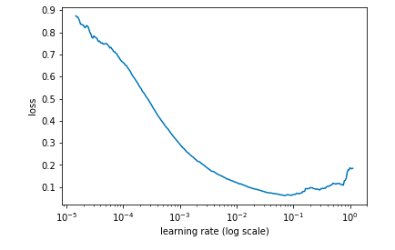
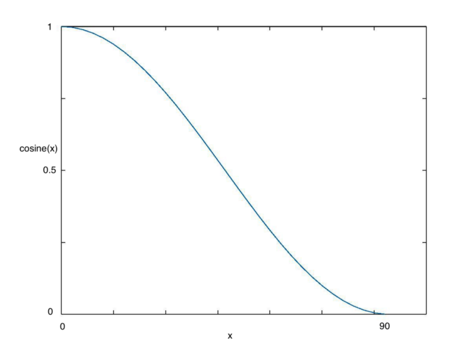
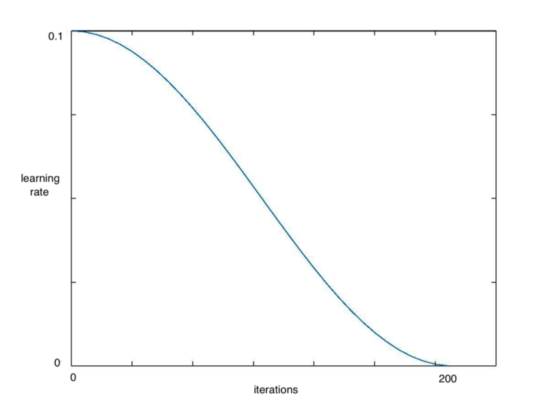
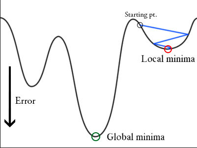
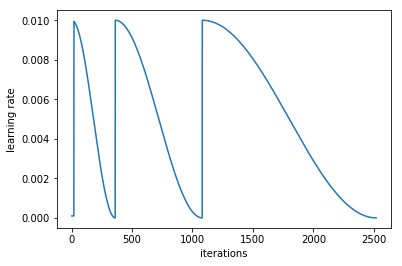

目录

<!-- TOC -->

- [使用多个而不是单一学习率](#使用多个而不是单一学习率)
- [如何找到合适的学习率](#如何找到合适的学习率)
- [cosine annealing](#cosine-annealing)
- [带重启的SGD算法](#带重启的sgd算法)

<!-- /TOC -->

参考[称霸Kaggle的十大深度学习技巧](https://mp.weixin.qq.com/s/gf6Ebj9Nnh-QH7fLurH_WA)

原文：[https://blog.floydhub.com/ten-techniques-from-fast-ai/](https://blog.floydhub.com/ten-techniques-from-fast-ai/)

安装直接(目前这个版本要求torch<0.4，而autokeras要求>=0.4.0，会有点小diff咯)

```shell
pip install fastai
```

## 使用多个而不是单一学习率

差分学习率（Differential Learning rates）意味着在训练时**变换网络层**比提高网络深度更重要。

参考[https://github.com/fastai/fastai/blob/master/courses/dl1/lesson1-vgg.ipynb](https://github.com/fastai/fastai/blob/master/courses/dl1/lesson1-vgg.ipynb)

例如：

```python
from fastai.imports import *

from fastai.transforms import *
from fastai.conv_learner import *
from fastai.model import *
from fastai.dataset import *
from fastai.sgdr import *
from fastai.plots import *

# import library for creating learning object for convolutional #networks

sz=224
arch=vgg16

# assign model to resnet, vgg, or even your own custom model
PATH = './imgs' ##文件夹要是imgs/train/1/xx.jpg, images/valid/1/xx.jpg
data = ImageClassifierData.from_paths(PATH, tfms=tfms_from_model(arch, sz))

# create fast ai data object, in this method we use from_paths where 
# inside PATH each image class is separated into different folders

learn = ConvLearner.pretrained(arch, data, precompute=True)

# create a learn object to quickly utilise state of the art
# techniques from the fast ai library

```

然后，冻结前面网络层并微调后面网络层：

```python
learn.freeze()

# freeze layers up to the last one, so weights will not be updated.

learning_rate = 0.1
learn.fit(learning_rate, epochs=3)

# train only the last layer for a few epochs
```

当后面的网络效果比较好的时候，可以用差分学习率来改变前面的网络层，实践中，一般将学习率的缩小倍数设置为10倍：

```python
learn.unfreeze()

# set requires_grads to be True for all layers, so they can be updated

learning_rate = [0.001, 0.01, 0.1]
# learning rate is set so that deepest third of layers have a rate of 0.001, # middle layers have a rate of 0.01, and final layers 0.1.

learn.fit(learning_rate, epochs=3)
# train model for three epoch with using differential learning rates
```

## 如何找到合适的学习率

一篇周期性学习率的paper:[Cyclical Learning Rates for Training Neural Networks](https://arxiv.org/abs/1506.01186)

用较低的学习率来训练，但在每个batch中以指数形式增加：

```python
learn.lr_find()
# run on learn object where learning rate is increased  exponentially

learn.sched.plot_lr()
# plot graph of learning rate against iterationslr
```

<html>
<br/>


<br/>

</html>

然后可以看看学习率和loss的关系

```python
learn.sched.plot()
# plots the loss against the learning rate
```

<html>
<br/>


<br/>

</html>

通过找出**学习率最高**且**Loss值仍在下降的值**来确定最佳学习率。在上述情况中，该值将为0.01。

## cosine annealing

当逐渐接近loss最小值时，学习率应该变得更小来使得模型不会超调且尽可能接近这一点。余弦退火（Cosine annealing）利用余弦函数来降低学习率。

<html>
<br/>


<br/>

</html>

从上图可以看出，随着x的增加，余弦值**首先缓慢下降**，然后**加速下降**，再次**缓慢下降**。

```python
learn.fit(0.1, 1)
# Calling learn fit automatically takes advantage of cosine annealing
```

Fast.ai库中的learn.fit()函数，来快速实现这个算法，在整个周期中不断降低学习率，如下图所示：

<html>
<br/>


<br/>

</html>

## 带重启的SGD算法

梯度下降算法可能陷入局部最小值，而不是全局最小值。

<html>
<br/>


<br/>

</html>

可以通过**突然提高学习率**，来**跳出局部最小值**并找到通向全局最小值的路径。这种方式称为**带重启**的随机梯度下降方法（stochastic gradient descent with restarts, SGDR），这个方法在Loshchilov和Hutter的ICLR论文中展示出了很好的效果。[SGDR: Stochastic Gradient Descent with Warm Restarts](https://arxiv.org/abs/1608.03983)

当调用```learn.fit(learning_rate, epochs)```函数时，学习率在每个周期开始时**重置为参数输入时的初始值**，然后像上面**余弦退火**部分描述的那样，逐渐减小。

<html>
<br/>


<br/>

</html>

每当学习率下降到最小点，在上图中为每100次迭代，我们称为一个循环。

```python
cycle_len = 1
# decide how many epochs it takes for the learning rate to fall to
# its minimum point. In this case, 1 epoch

cycle_mult=2
# at the end of each cycle, multiply the cycle_len value by 2

learn.fit(0.1, 3, cycle_len=2, cycle_mult=2)
# in this case there will be three restarts. The first time with
# cycle_len of 1, so it will take 1 epoch to complete the cycle.
# cycle_mult=2 so the next cycle with have a length of two epochs, 
# and the next four.
```

如果我们把cycle_mult设成2：

<html>
<br/>


<br/>

</html>

关于这两个cycle_mult和cycle_len的函数，可以参考[http://forums.fast.ai/t/understanding-cycle-len-and-cycle-mult/9413/8](http://forums.fast.ai/t/understanding-cycle-len-and-cycle-mult/9413/8)
