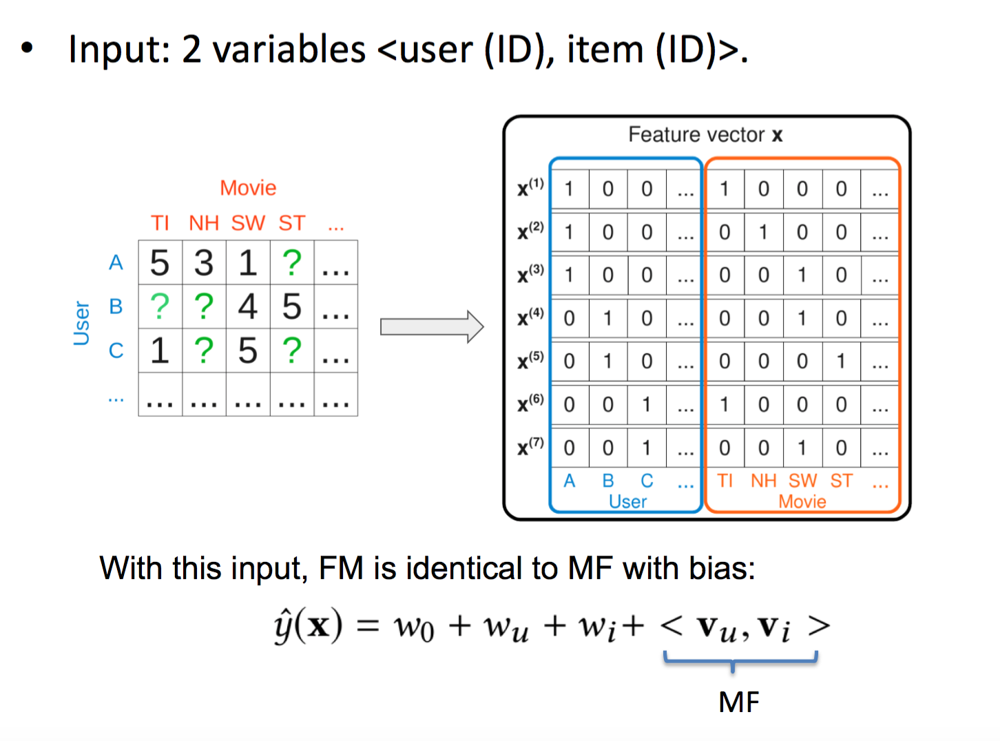
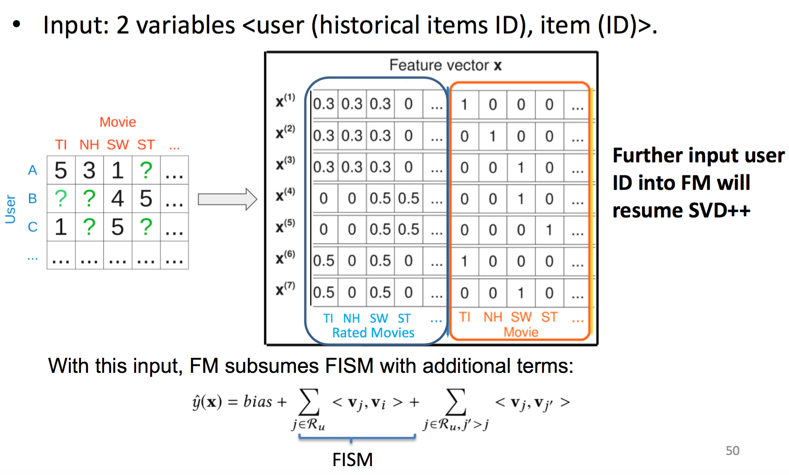

<!-- TOC -->

- [概述](#%E6%A6%82%E8%BF%B0)
- [搜索领域的传统匹配模型](#%E6%90%9C%E7%B4%A2%E9%A2%86%E5%9F%9F%E7%9A%84%E4%BC%A0%E7%BB%9F%E5%8C%B9%E9%85%8D%E6%A8%A1%E5%9E%8B)
  - [使用机器翻译匹配](#%E4%BD%BF%E7%94%A8%E6%9C%BA%E5%99%A8%E7%BF%BB%E8%AF%91%E5%8C%B9%E9%85%8D)
    - [Statistical Machine Translation (SMT)](#Statistical-Machine-Translation-SMT)
    - [Word-based Model: IBM Model One](#Word-based-Model-IBM-Model-One)
    - [使用Word-based Translation Models进行匹配](#%E4%BD%BF%E7%94%A8Word-based-Translation-Models%E8%BF%9B%E8%A1%8C%E5%8C%B9%E9%85%8D)
    - [使用Phrase-based translation models进行匹配](#%E4%BD%BF%E7%94%A8Phrase-based-translation-models%E8%BF%9B%E8%A1%8C%E5%8C%B9%E9%85%8D)
  - [在latent space中匹配](#%E5%9C%A8latent-space%E4%B8%AD%E5%8C%B9%E9%85%8D)
    - [Partial Least Square (PLS)](#Partial-Least-Square-PLS)
    - [Regularized Mapping to Latent Space(RMLS)](#Regularized-Mapping-to-Latent-SpaceRMLS)
- [推荐领域的传统匹配模型](#%E6%8E%A8%E8%8D%90%E9%A2%86%E5%9F%9F%E7%9A%84%E4%BC%A0%E7%BB%9F%E5%8C%B9%E9%85%8D%E6%A8%A1%E5%9E%8B)
  - [Collaborative Filtering Models](#Collaborative-Filtering-Models)
    - [Memory-based CF](#Memory-based-CF)
    - [Model-based CF](#Model-based-CF)
    - [Item-based CF in Latent Space](#Item-based-CF-in-Latent-Space)
    - [Fusing User-based and Item-based CF in Latent Space](#Fusing-User-based-and-Item-based-CF-in-Latent-Space)
  - [Generic Feature-based Models](#Generic-Feature-based-Models)
    - [Factorization Machine](#Factorization-Machine)
    - [隐式反馈vs 显式反馈](#%E9%9A%90%E5%BC%8F%E5%8F%8D%E9%A6%88vs-%E6%98%BE%E5%BC%8F%E5%8F%8D%E9%A6%88)
    - [top-k 推荐](#top-k-%E6%8E%A8%E8%8D%90)

<!-- /TOC -->

这里讲传统部分，深度学习部分见：[https://daiwk.github.io/posts/dl-match-for-search-recommendation.html](https://daiwk.github.io/posts/dl-match-for-search-recommendation.html)

## 概述

## 搜索领域的传统匹配模型

### 使用机器翻译匹配

#### Statistical Machine Translation (SMT)

#### Word-based Model: IBM Model One

#### 使用Word-based Translation Models进行匹配

#### 使用Phrase-based translation models进行匹配

### 在latent space中匹配

#### Partial Least Square (PLS)

#### Regularized Mapping to Latent Space(RMLS)

## 推荐领域的传统匹配模型

### Collaborative Filtering Models

#### Memory-based CF

#### Model-based CF

#### Item-based CF in Latent Space

#### Fusing User-based and Item-based CF in Latent Space

MF

FISM

SVD++

### Generic Feature-based Models

#### Factorization Machine

Rendle, ICDM’10

FM使得矩阵分解更容易加特征了，所以，可以模仿以下模型的效果：

MF,SVD++,timeSVD(Koren,KDD’09),PIFT(Rendle,WSDM’10)etc.

例如：

当xxxx时，FM和MF+bias是等价的：

<html>
 

 
</html>

当xxxx时，FM和SVD++是等价的：

<html>
 

 
</html>

#### 隐式反馈vs 显式反馈

#### top-k 推荐

