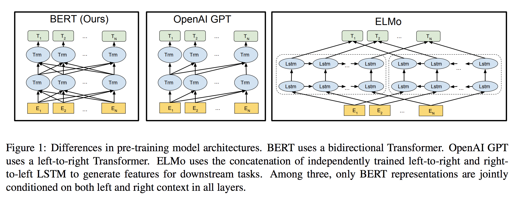
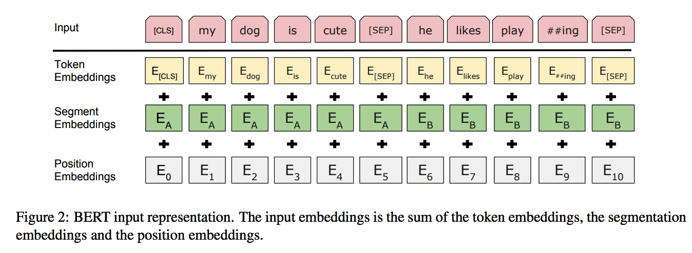
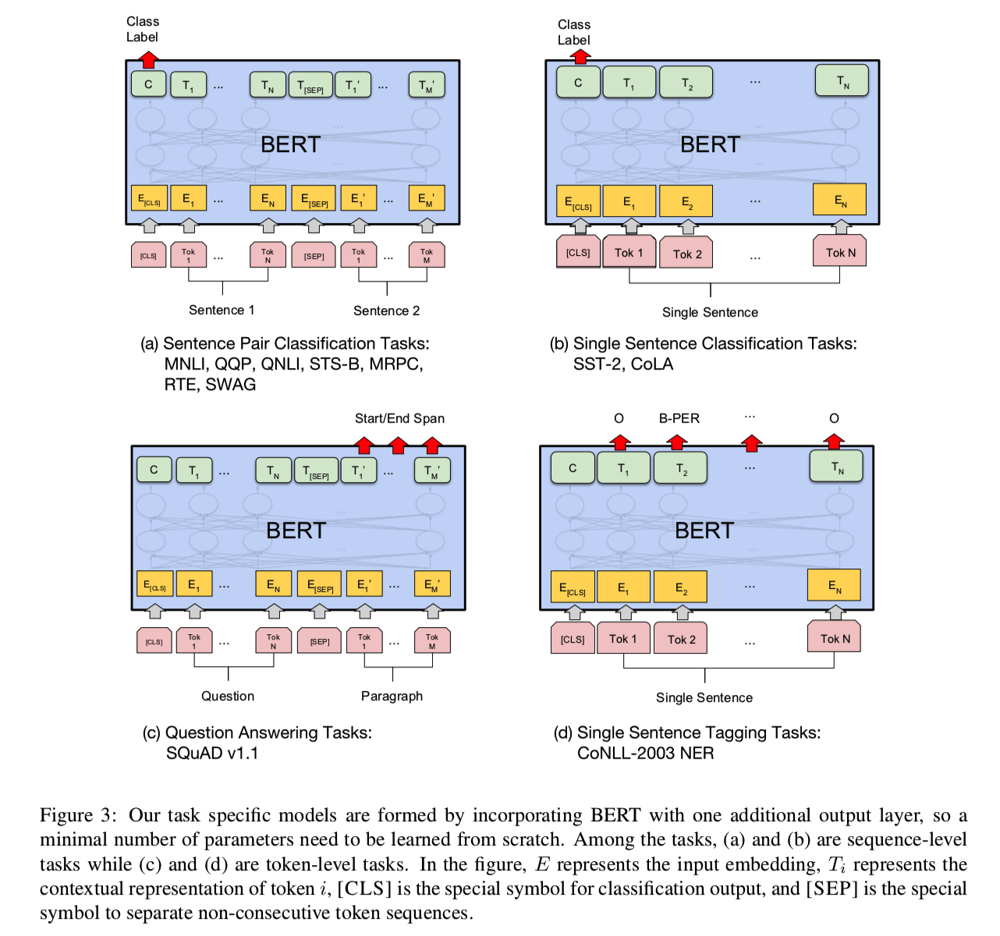
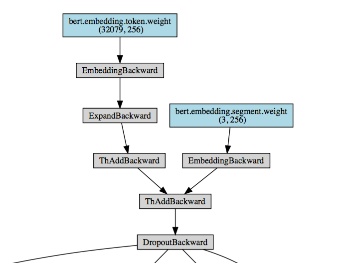

目录

<!-- TOC -->

- [概述](#%E6%A6%82%E8%BF%B0)
- [BERT](#bert)
    - [模型架构](#%E6%A8%A1%E5%9E%8B%E6%9E%B6%E6%9E%84)
    - [Input Representation](#input-representation)
    - [Pre-training Tasks](#pre-training-tasks)
        - [Task #1: Masked LM](#task-1-masked-lm)
        - [Task #2: Next Sentence Prediction](#task-2-next-sentence-prediction)
    - [Pre-training Procedure](#pre-training-procedure)
    - [Fine-tuning Procedure](#fine-tuning-procedure)
    - [Comparison of BERT and OpenAI GPT](#comparison-of-bert-and-openai-gpt)
- [实验](#%E5%AE%9E%E9%AA%8C)
    - [GLUE Datasets](#glue-datasets)
        - [GLUE Results](#glue-results)
    - [SQuAD v1.1](#squad-v11)
    - [Named Entity Recognition](#named-entity-recognition)
    - [SWAG](#swag)
- [Ablation Studies](#ablation-studies)
    - [Effect of Pre-training Tasks](#effect-of-pre-training-tasks)
    - [Effect of Model Size](#effect-of-model-size)
    - [Effect of Number of Training Steps](#effect-of-number-of-training-steps)
    - [Feature-based Approach with BERT](#feature-based-approach-with-bert)
- [代码实现](#%E4%BB%A3%E7%A0%81%E5%AE%9E%E7%8E%B0)
    - [pytorch版本](#pytorch%E7%89%88%E6%9C%AC)
        - [代码解读](#%E4%BB%A3%E7%A0%81%E8%A7%A3%E8%AF%BB)
            - [基础知识](#%E5%9F%BA%E7%A1%80%E7%9F%A5%E8%AF%86)
            - [position encoding](#position-encoding)
            - [position-wise feed forward](#position-wise-feed-forward)
- [官方版](#%E5%AE%98%E6%96%B9%E7%89%88)

<!-- /TOC -->

参考[最强NLP预训练模型！谷歌BERT横扫11项NLP任务记录](https://www.jiqizhixin.com/articles/2018-10-12-13)

参考[https://www.zhihu.com/question/298203515/answer/509703208](https://www.zhihu.com/question/298203515/answer/509703208)

## 概述

本文介绍了一种新的语言表征模型BERT——来自**Transformer的双向编码器表征**。与最近的语言表征模型不同，BERT旨在基于**所有层**的**左、右语境**来预训练深度双向表征。BERT是首个在**大批句子层面**和**token层面**任务中取得当前最优性能的**基于微调的表征模型**，其性能超越许多使用任务特定架构的系统，刷新了11项NLP任务的当前最优性能记录。

目前将预训练语言表征应用于下游任务存在两种策略：feature-based的策略和fine-tuning策略。

+ feature-based策略（如 ELMo）使用**将预训练表征**作为**额外特征**的任务专用架构。
+ fine-tuning策略（如生成预训练 Transformer (OpenAI GPT)）引入了**任务特定最小参数**，通过**简单地微调预训练参数**在下游任务中进行训练。

在之前的研究中，两种策略在**预训练期间使用相同的目标函数**，利用**单向语言模型**来学习通用语言表征。

作者认为现有的技术严重制约了预训练表征的能力，微调策略尤其如此。其主要局限在于**标准语言模型是单向**的，这**限制了可以在预训练期间使用的架构类型**。例如，OpenAI GPT使用的是**从左到右**的架构，其中**每个token只能注意Transformer自注意力层中的先前token**。这些局限对于**句子层面的任务**而言不是最佳选择，对于**token级任务**（如 SQuAD 问答）则可能是毁灭性的，**因为在这种任务中，结合两个方向的语境至关重要**。

BERT（Bidirectional Encoder Representations from Transformers）改进了**基于微调的策略**。

BERT提出一种新的**预训练目标**——**遮蔽语言模型（masked language model，MLM）**，来克服上文提到的单向局限。MLM 的灵感来自 Cloze 任务（Taylor, 1953）。MLM**随机遮蔽输入中的一些token**，目标在于**仅基于遮蔽词的语境**来**预测其原始词汇id**。与从左到右的语言模型预训练不同，MLM目标**允许表征融合左右两侧的语境**，从而**预训练一个深度双向Transformer**。除了 MLM，我们还引入了一个**"下一句预测"（next sentence prediction）任务**，该任务**联合预训练**文本对表征。

贡献：

+ 展示了**双向预训练**语言表征的重要性。不同于 Radford 等人（2018）使用**单向语言模型进行预训练**，BERT使用MLM预训练深度双向表征。本研究与 Peters 等人（2018）的研究也不同，后者使用的是**独立训练**的**从左到右和从右到左LM**的**浅层级联**。
+ 证明了**预训练表征**可以**消除对许多精心设计的任务特定架构的需求**。BERT是首个在大批句子层面和token层面任务中取得当前最优性能的基于微调的表征模型，其性能超越许多使用任务特定架构的系统。
+ BERT 刷新了11项NLP任务的当前最优性能记录。本论文还报告了BERT的模型简化测试（ablation study），证明该模型的**双向特性是最重要的一项新贡献**。代码和预训练模型将发布在[goo.gl/language/bert](goo.gl/language/bert)。

## BERT

### 模型架构

BERT 旨在基于所有层的左、右语境来预训练深度双向表征。因此，预训练的 BERT 表征可以仅用一个额外的输出层进行微调，进而为很多任务（如问答和语言推断任务）创建当前最优模型，无需对任务特定架构做出大量修改。

BERT 的模型架构是一个多层双向Transformer编码器，基于Vaswani 等人 (2017)描述的原始实现，在tensor2tensor库中发布(当然，可以抽空看看[https://daiwk.github.io/posts/platform-tensor-to-tensor.html](https://daiwk.github.io/posts/platform-tensor-to-tensor.html)和[https://daiwk.github.io/posts/platform-tensor-to-tensor-coding.html](https://daiwk.github.io/posts/platform-tensor-to-tensor-coding.html))。

本文中，我们将**层数（即Transformer块）**表示为`\(L\)`，将**隐层的size**表示为`\(H\)`、**自注意力头数**表示为`\(A\)`。在所有实验中，我们将feed-forward/filter的size设置为`\(4H\)`，即H=768时为3072，H=1024时为4096。我们主要看下在两种模型尺寸上的结果：

+ **`\(BERT_{BASE}\)`**: L=12, H=768, A=12, Total Parameters=110M
+ **`\(BERT_{LARGE}\)`**:  L=24, H=1024, A=16, Total Parameters=340M

其中，`\(BERT_{BASE}\)`和OpenAI GPT的大小是一样的。BERT Transformer使用双向自注意力机制，而GPT Transformer使用受限的自注意力机制，导致每个token只能关注其左侧的语境。**双向Transformer**在文献中通常称为**“Transformer 编码器”**，而只**关注左侧语境的版本**则因能用于文本生成而被称为**“Transformer 解码器”**。

下图显示了BERT/GPT Transformer/ELMo的结构区别：

<html>
<br/>

<br/>
</html>

+ BERT 使用双向Transformer
+ OpenAI GPT 使用从左到右的Transformer
+ ELMo 使用独立训练的从左到右和从右到左LSTM的级联来生成下游任务的特征。

三种模型中，只有BERT表征会基于**所有层中的左右两侧语境**。

### Input Representation

论文的输入表示（input representation）能够在一个token序列中明确地表示**单个文本句子**或**一对文本句子**（例如， [Question, Answer]）。对于给定token，其输入表示通过对相应的token、segment和position embeddings进行求和来构造：

<html>
<br/>

<br/>
</html>

+ 使用WordPiece嵌入【GNMT，[Google’s neural machine translation system: Bridging the gap between human and machine translation](https://arxiv.org/abs/1609.08144)】和30,000个token的词汇表。用##表示分词。
+ 使用learned positional embeddings，支持的序列长度最多为512个token。
+ 每个序列的第一个token始终是特殊分类嵌入（\[CLS\]）。对应于该token的最终隐藏状态（即，Transformer的输出）被用作分类任务的聚合序列表示。对于非分类任务，将忽略此向量。
+ 句子对被打包成一个序列。以两种方式区分句子。
  + 首先，用特殊标记（\[SEP\]）将它们分开。
  + 其次，添加一个learned sentence A嵌入到第一个句子的每个token中，一个sentence B嵌入到第二个句子的每个token中。
+ 对于单个句子输入，只使用 sentence A嵌入。


### Pre-training Tasks

+ 它在训练双向语言模型时以减小的概率把少量的词替成了Mask或者另一个随机的词。感觉其目的在于使模型被迫增加对上下文的记忆。（知乎的回答）
+ 增加了一个预测下一句的loss。

#### Task #1: Masked LM

标准条件语言模型只能从左到右或从右到左进行训练，因为双向条件作用将允许每个单词在多层上下文中间接地“see itself”。

为了训练一个深度双向表示（deep bidirectional representation），研究团队采用了一种简单的方法，即随机屏蔽（masking）部分输入token，然后只预测那些被屏蔽的token。论文将这个过程称为“masked LM”(MLM)，尽管在文献中它经常被称为Cloze任务(Taylor, 1953)。

在这个例子中，与masked token对应的最终隐藏向量被输入到词汇表上的输出softmax中，就像在标准LM中一样。在团队所有实验中，随机地屏蔽了每个序列中15%的WordPiece token。与去噪的自动编码器（Vincent et al.， 2008）相反，只预测masked words而不是重建整个输入。

虽然这确实能让团队获得双向预训练模型，但这种方法有两个缺点。

+ 缺点1：预训练和finetuning之间不匹配，因为在finetuning期间从未看到```[MASK]```token。

为了解决这个问题，团队并不总是用实际的```[MASK]```token替换被“masked”的词汇。相反，训练数据生成器**随机选择15％的token**。

例如在这个句子“my dog is hairy”中，它选择的token是“hairy”。然后，执行以下过程：

数据生成器将执行以下操作，而不是始终用```[MASK]```替换所选单词：

+ 80％的时间：用```[MASK]```标记替换单词，例如，```my dog is hairy → my dog is [MASK]```
+ 10％的时间：用一个**随机的单词**替换该单词，例如，```my dog is hairy → my dog is apple```
+ 10％的时间：**保持单词不变**，例如，```my dog is hairy → my dog is hairy```. 这样做的目的是将表示偏向于实际观察到的单词。

Transformer encoder不知道它将被要求预测哪些单词或哪些单词已被随机单词替换，因此它**被迫保持每个输入token的分布式上下文表示**。此外，因为随机替换只发生在所有token的1.5％（即**15％的10％**），这似乎不会损害模型的语言理解能力。

+ 缺点2：每个batch只预测了15％的token，这表明模型可能需要更多的预训练步骤才能收敛。

团队证明MLM的收敛速度略慢于 left-to-right的模型（预测每个token），但MLM模型在实验上获得的提升远远超过增加的训练成本。

#### Task #2: Next Sentence Prediction

在为了训练一个理解句子的模型关系，预先训练一个二分类的下一句测任务，这一任务可以从任何单语语料库中生成。具体地说，当选择句子A和B作为预训练样本时，B有50％的可能是A的下一个句子，也有50％的可能是来自语料库的随机句子。例如：

```shell
Input = 
[CLS] the man went to [MASK] store [SEP]
he bought a gallon [MASK] milk [SEP]
Label = IsNext

Input = 
[CLS] the man [MASK] to the store [SEP]
penguin [MASK] are flight ##less birds [SEP]
Label = NotNext
```

完全随机地选择了NotNext语句，最终的预训练模型在此任务上实现了97％-98％的准确率。

### Pre-training Procedure

使用gelu激活函数（[Bridging nonlinearities and stochastic regularizers with gaus- sian error linear units](http://arxiv.org/abs/1606.08415)），在pytorch里实现如下：

```python
class GELU(nn.Module):
    """
    Paper Section 3.4, last paragraph notice that BERT used the GELU instead of RELU
    """

    def forward(self, x):
        return 0.5 * x * (1 + torch.tanh(math.sqrt(2 / math.pi) * (x + 0.044715 * torch.pow(x, 3))))
```


### Fine-tuning Procedure

### Comparison of BERT and OpenAI GPT

## 实验

网络结构如下：

<html>
<br/>

<br/>
</html>

### GLUE Datasets

#### GLUE Results

### SQuAD v1.1

### Named Entity Recognition

### SWAG

## Ablation Studies

### Effect of Pre-training Tasks

### Effect of Model Size

### Effect of Number of Training Steps

### Feature-based Approach with BERT


## 代码实现

### pytorch版本

[https://github.com/codertimo/BERT-pytorch](https://github.com/codertimo/BERT-pytorch)

fork了一份：[https://github.com/daiwk/BERT-pytorch](https://github.com/daiwk/BERT-pytorch)

输入```data/corpus.small```：

```shell
Welcome to the \t the jungle \n
I can stay \t here all night \n
```


可视化，需要：

```shell
brew install graphviz # mac
pip3 install git+https://github.com/szagoruyko/pytorchviz
```

画出bert的架构图的方法(先生成vocab，如果机器的dot不支持pdf，只支持png/jpg等，需要在```lib/python3.6/site-packages/torchviz/dot.py```中把```dot = Digraph(node_attr=node_attr, graph_attr=dict(size="12,12"))```改成```dot = Digraph(node_attr=node_attr, graph_attr=dict(size="12,12"), format="png")```)：

```python
import torch
from torch import nn
from torchviz import make_dot, make_dot_from_trace

import sys

sys.path.append("./bert_pytorch-0.0.1a4.src/")
#from trainer import BERTTrainer
from model import BERTLM, BERT
from dataset import BERTDataset, WordVocab
from torch.utils.data import DataLoader

def demo():
    lstm_cell = nn.LSTMCell(128, 128)
    x = torch.randn(1, 128)
    dot = make_dot(lstm_cell(x), params=dict(list(lstm_cell.named_parameters())))
    file_out = "xx"
    dot.render(file_out)

def bert_dot():
    """
    """
    vocab_size = 128
    train_dataset_path = "data/bert_train_data.xxx"
    vocab_path = "data/vocab.all.xxx"
    vocab = WordVocab.load_vocab(vocab_path)

    train_dataset = BERTDataset(train_dataset_path, vocab, seq_len=20,
                                corpus_lines=2000, on_memory=True)


    train_data_loader = DataLoader(train_dataset, batch_size=8, num_workers=8)
    bert = BERT(len(vocab), hidden=256, n_layers=8, attn_heads=8)
    device = torch.device("cpu")
    mymodel = BERTLM(bert, vocab_size).to(device)
    data_iter = train_data_loader
    out_idx = 0
    for data in data_iter:
        data = {key: value.to(device) for key, value in data.items()}
        if out_idx == 0:
            g = make_dot(mymodel(data["bert_input"], data["segment_label"]), params=dict(mymodel.named_parameters()))
            g.render("./bert-arch")
            break

bert_dot()

```

可以画出这么个图。。图太大，自己下载看看

[https://daiwk.github.io/assets/bert-arch.jpeg](https://daiwk.github.io/assets/bert-arch.jpeg)

对应的pdf如

[https://daiwk.github.io/assets/bert-arch.pdf](https://daiwk.github.io/assets/bert-arch.pdf)

对应的dot文件

[https://daiwk.github.io/assets/bert-arch](https://daiwk.github.io/assets/bert-arch)

把dot文件转换成其他格式的方式：

```shell
input=./bert-arch
output=./bert-arch
dot $input -Tjpeg -o $output.jpeg
dot $input -Tpdf -o $output.pdf
```

#### 代码解读

transformer部分参考[http://nlp.seas.harvard.edu/2018/04/03/attention.htm](http://nlp.seas.harvard.edu/2018/04/03/attention.htm)

##### 基础知识

+ torch.nn的操作
  
  [https://pytorch-cn.readthedocs.io/zh/latest/package_references/torch-nn/](https://pytorch-cn.readthedocs.io/zh/latest/package_references/torch-nn/)

  + ```torch.nn.Embedding```：参考[https://pytorch-cn.readthedocs.io/zh/latest/package_references/torch-nn/#sparse-layers](https://pytorch-cn.readthedocs.io/zh/latest/package_references/torch-nn/#sparse-layers)。一个保存了固定字典和大小的简单查找表。这个模块常用来保存词嵌入和用下标检索它们。模块的输入是一个下标的列表，输出是对应的词嵌入。```torch.nn.Embedding(num_embeddings, embedding_dim, padding_idx=None, max_norm=None, norm_type=2, scale_grad_by_freq=False, sparse=False)```。
    + num_embeddings：嵌入字典的大小。
    + embedding_dim：每个嵌入向量的大小。
    + padding_idx：如果提供的话，输出遇到此下标时用零填充。
    + max_norm：如果提供的话，会重新归一化词嵌入，使它们的范数小于提供的值。
    + norm_type：对于max_norm选项计算p范数时的p。
    + scale_grad_by_freq：如果提供的话，会根据字典中单词频率缩放梯度。
  + xxx

+ torch的操作

  [https://pytorch-cn.readthedocs.io/zh/latest/package_references/torch/](https://pytorch-cn.readthedocs.io/zh/latest/package_references/torch/)

  + ```torch.addmm```: 对矩阵mat1和mat2进行矩阵乘操作(用@表示)。矩阵mat加到最终结果。```out=(beta∗M)+(alpha∗mat1@mat2)```。```torch.addmm(beta=1, mat, alpha=1, mat1, mat2, out=None)```
  + ```torch.mm```: 对矩阵mat1和mat2进行相乘。```torch.mm(mat1, mat2, out=None)```
  + ```torch.unsqueeze```: 返回一个新的张量，对输入的指定位置插入维度1。注意： 返回张量与输入张量共享内存，所以改变其中一个的内容会改变另一个。

  用法：

  ```python
  >>> max_len=10
  >>> position = torch.arange(0, max_len).float().unsqueeze(1)
  >>> position
  tensor([[0.],
          [1.],
          [2.],
          [3.],
          [4.],
          [5.],
          [6.],
          [7.],
          [8.],
          [9.]])
  >>> position = torch.arange(0, max_len).float().unsqueeze(0)
  >>> position
  tensor([[0., 1., 2., 3., 4., 5., 6., 7., 8., 9.]])
  >>>
  ```

+ torch.Tensor的操作

  [https://pytorch-cn.readthedocs.io/zh/latest/package_references/Tensor/](https://pytorch-cn.readthedocs.io/zh/latest/package_references/Tensor/)

  + ```view(*args)```: 返回一个有相同数据但大小不同的tensor。 返回的tensor必须有与原tensor相同的数据和相同数目的元素，但可以有不同的大小。(类似reshape)
  + ```masked_fill_(mask, value)```: 在mask值为1的位置处用value填充。mask的元素个数需和本tensor相同，但尺寸可以不同。

##### position encoding

代码

```python
class PositionalEncoding(nn.Module):
    "Implement the PE function."
    def __init__(self, d_model, dropout, max_len=5000):
        super(PositionalEncoding, self).__init__()
        self.dropout = nn.Dropout(p=dropout)
        
        # Compute the positional encodings once in log space.
        pe = torch.zeros(max_len, d_model)
        position = torch.arange(0, max_len).unsqueeze(1)
        div_term = torch.exp(torch.arange(0, d_model, 2) *
                             -(math.log(10000.0) / d_model))
        pe[:, 0::2] = torch.sin(position * div_term)
        pe[:, 1::2] = torch.cos(position * div_term)
        pe = pe.unsqueeze(0)
        self.register_buffer('pe', pe)
        
    def forward(self, x):
        x = x + Variable(self.pe[:, :x.size(1)], 
                         requires_grad=False)
        return self.dropout(x)
```

输入是shape为(max_len, d_model)的矩阵，d_model是emb的size。如下图，输入是一个max_len=100，d_model=20的矩阵，图中画的是这20维里的4、5、6、7每一维在100个position的取值。

<html>
<br/>

<br/>
</html>

bert里改名了一下：

```python
class PositionalEmbedding(nn.Module):

    def __init__(self, d_model, max_len=512):
        super().__init__()

        # Compute the positional encodings once in log space.
        pe = torch.zeros(max_len, d_model).float()
        pe.require_grad = False

        position = torch.arange(0, max_len).float().unsqueeze(1)
        div_term = (torch.arange(0, d_model, 2).float() * -(math.log(10000.0) / d_model)).exp()

        pe[:, 0::2] = torch.sin(position * div_term)
        pe[:, 1::2] = torch.cos(position * div_term)

        pe = pe.unsqueeze(0)
        self.register_buffer('pe', pe)

    def forward(self, x):
        return self.pe[:, :x.size(1)]

```

而bert还有另外两个embedding，就是segment和token，这里用很简单的实现：

```python
class SegmentEmbedding(nn.Embedding):
    def __init__(self, embed_size=512):
        ### 输入是segment_label，表示是第1句话，第2句话，还是padding，所以num_embeddings是3
        super().__init__(3, embed_size, padding_idx=0)

class TokenEmbedding(nn.Embedding):
    def __init__(self, vocab_size, embed_size=512):
        super().__init__(vocab_size, embed_size, padding_idx=0)
```

用的时候是把三者加起来：

```python
class BERTEmbedding(nn.Module):
    """
    BERT Embedding which is consisted with under features
        1. TokenEmbedding : normal embedding matrix
        2. PositionalEmbedding : adding positional information using sin, cos
        2. SegmentEmbedding : adding sentence segment info, (sent_A:1, sent_B:2)

        sum of all these features are output of BERTEmbedding
    """

    def __init__(self, vocab_size, embed_size, dropout=0.1):
        """
        :param vocab_size: total vocab size
        :param embed_size: embedding size of token embedding
        :param dropout: dropout rate
        """
        super().__init__()
        self.token = TokenEmbedding(vocab_size=vocab_size, embed_size=embed_size)
        self.position = PositionalEmbedding(d_model=self.token.embedding_dim)
        self.segment = SegmentEmbedding(embed_size=self.token.embedding_dim)
        self.dropout = nn.Dropout(p=dropout)
        self.embed_size = embed_size

    def forward(self, sequence, segment_label):
        x = self.token(sequence) + self.position(sequence) + self.segment(segment_label)
        return self.dropout(x)
```

这部分画出来的图就应该是下面这个了：

<html>
<br/>

<br/>
</html>

##### position-wise feed forward

```python
class PositionwiseFeedForward(nn.Module):
    "Implements FFN equation."
    def __init__(self, d_model, d_ff, dropout=0.1):
        super(PositionwiseFeedForward, self).__init__()
        self.w_1 = nn.Linear(d_model, d_ff)
        self.w_2 = nn.Linear(d_ff, d_model)
        self.dropout = nn.Dropout(dropout)

    def forward(self, x):
        return self.w_2(self.dropout(F.relu(self.w_1(x))))
```

在bert中，把relu改为gelu，所以：

```python
class GELU(nn.Module):
    """
    Paper Section 3.4, last paragraph notice that BERT used the GELU instead of RELU
    """

    def forward(self, x):
        return 0.5 * x * (1 + torch.tanh(math.sqrt(2 / math.pi) * (x + 0.044715 * torch.pow(x, 3))))


class PositionwiseFeedForward(nn.Module):
    "Implements FFN equation."

    def __init__(self, d_model, d_ff, dropout=0.1):
        super(PositionwiseFeedForward, self).__init__()
        self.w_1 = nn.Linear(d_model, d_ff)
        self.w_2 = nn.Linear(d_ff, d_model)
        self.dropout = nn.Dropout(dropout)
        self.activation = GELU()

    def forward(self, x):
        return self.w_2(self.dropout(self.activation(self.w_1(x))))
```


## 官方版

[https://github.com/google-research/bert](https://github.com/google-research/bert)

