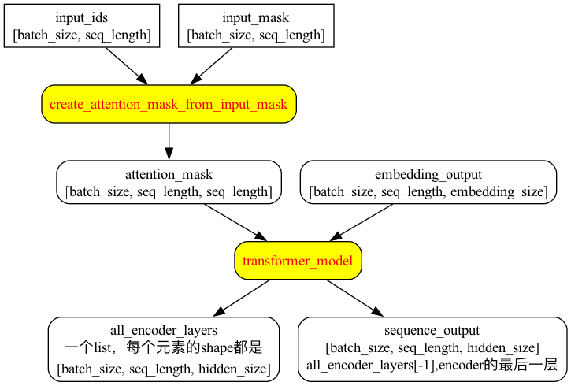

目录

<!-- TOC -->

- [modeling.py](#modelingpy)
  - [公共函数](#%E5%85%AC%E5%85%B1%E5%87%BD%E6%95%B0)
    - [reshape-to-matrix](#reshape-to-matrix)
    - [reshape-from-matrix](#reshape-from-matrix)
    - [assert-rank](#assert-rank)
    - [get-shape-list](#get-shape-list)
    - [gelu](#gelu)
    - [create-initializer](#create-initializer)
    - [dropout](#dropout)
    - [layer-norm](#layer-norm)
    - [layer-norm-and-dropout](#layer-norm-and-dropout)
    - [embedding-lookup](#embedding-lookup)
    - [embedding-postprocessor](#embedding-postprocessor)
    - [create-attention-mask-from-input-mask](#create-attention-mask-from-input-mask)
    - [attention-layer](#attention-layer)
    - [transformer-model](#transformer-model)
  - [BertConfig](#bertconfig)
    - [BertConfig初始化](#bertconfig%E5%88%9D%E5%A7%8B%E5%8C%96)
    - [BertConfig方法](#bertconfig%E6%96%B9%E6%B3%95)
    - [from-dict(classmethod)](#from-dictclassmethod)
    - [from-json-file(classmethod)](#from-json-fileclassmethod)
    - [to-dict](#to-dict)
    - [to-json-string](#to-json-string)
  - [BertModel](#bertmodel)
    - [初始化](#%E5%88%9D%E5%A7%8B%E5%8C%96)
    - [get-pooled-output](#get-pooled-output)
    - [get-sequence-output](#get-sequence-output)
    - [get-all-encoder-layers](#get-all-encoder-layers)
    - [get-embedding-output](#get-embedding-output)
    - [get-embedding-table](#get-embedding-table)
- [extract-features.py](#extract-featurespy)
- [optimization.py](#optimizationpy)
- [tokenization.py](#tokenizationpy)
- [小结](#%E5%B0%8F%E7%BB%93)
  - [embedding部分](#embedding%E9%83%A8%E5%88%86)
  - [transformer部分](#transformer%E9%83%A8%E5%88%86)
  - [pool部分](#pool%E9%83%A8%E5%88%86)

<!-- /TOC -->

**注：由于标题不能有下划线，所以把函数名/文件名里的_换成了-**

## modeling.py

高仿[https://github.com/tensorflow/tensor2tensor/blob/master/tensor2tensor/layers/transformer_layers.py#L99](https://github.com/tensorflow/tensor2tensor/blob/master/tensor2tensor/layers/transformer_layers.py#L99)的transformer_encoder部分。

### 公共函数

#### reshape-to-matrix

```python
def reshape_to_matrix(input_tensor):
  """Reshapes a >= rank 2 tensor to a rank 2 tensor (i.e., a matrix)."""
  ndims = input_tensor.shape.ndims
  if ndims < 2:
    raise ValueError("Input tensor must have at least rank 2. Shape = %s" %
                     (input_tensor.shape))
  if ndims == 2:
    return input_tensor

  width = input_tensor.shape[-1]
  output_tensor = tf.reshape(input_tensor, [-1, width])
  return output_tensor
```

#### reshape-from-matrix

```python
def reshape_from_matrix(output_tensor, orig_shape_list):
  """Reshapes a rank 2 tensor back to its original rank >= 2 tensor."""
  if len(orig_shape_list) == 2:
    return output_tensor

  output_shape = get_shape_list(output_tensor)

  orig_dims = orig_shape_list[0:-1]
  width = output_shape[-1]

  return tf.reshape(output_tensor, orig_dims + [width])
```

#### assert-rank

注意：

tensor的rank表示一个tensor**需要的索引数目**来唯一表示任何一个元素。也就是通常所说的 “order”, “degree”或”ndims”，不是矩阵的秩。。参考[https://blog.csdn.net/lenbow/article/details/52152766](https://blog.csdn.net/lenbow/article/details/52152766)

例如：

```python
#’t’ is [[[1, 1, 1], [2, 2, 2]], [[3, 3, 3], [4, 4, 4]]]
# shape of tensor ‘t’ is [2, 2, 3]
rank(t) = 3
```

函数的功能：如果输入tensor的rank和预期的不一样，就抛异常

参数：

+ tensor：输入的tf.Tensor
+ expected_rank：Python integer or list of integers，期望的rank
+ name：error message中的tensor的名字

```python
def assert_rank(tensor, expected_rank, name=None):
  if name is None:
    name = tensor.name

  expected_rank_dict = {}
  if isinstance(expected_rank, six.integer_types):
    expected_rank_dict[expected_rank] = True
  else:
    for x in expected_rank:
      expected_rank_dict[x] = True

  actual_rank = tensor.shape.ndims
  if actual_rank not in expected_rank_dict:
    scope_name = tf.get_variable_scope().name
    raise ValueError(
        "For the tensor `%s` in scope `%s`, the actual rank "
        "`%d` (shape = %s) is not equal to the expected rank `%s`" %
        (name, scope_name, actual_rank, str(tensor.shape), str(expected_rank)))
```

#### get-shape-list

参数：

+ tensor：一个需要返回shape的tf.Tensor
+ expected_rank：int。输入tensor期望的rank，如果输入tensor的rank不等于这个数，会抛异常

```python
def get_shape_list(tensor, expected_rank=None, name=None):
  if name is None:
    name = tensor.name

  if expected_rank is not None:
    assert_rank(tensor, expected_rank, name)

  shape = tensor.shape.as_list()

  non_static_indexes = []
  for (index, dim) in enumerate(shape):
    if dim is None:
      non_static_indexes.append(index)

  if not non_static_indexes:
    return shape

  dyn_shape = tf.shape(tensor)
  for index in non_static_indexes:
    shape[index] = dyn_shape[index]
  return shape
```

#### gelu

其中的tf.erf是```tensorflow/python/ops/gen_math_ops.py```中的函数，计算```Gauss error function of `x` element-wise.```

```python
def gelu(input_tensor):
  """Gaussian Error Linear Unit.

  This is a smoother version of the RELU.
  Original paper: https://arxiv.org/abs/1606.08415

  Args:
    input_tensor: float Tensor to perform activation.

  Returns:
    `input_tensor` with the GELU activation applied.
  """
  cdf = 0.5 * (1.0 + tf.erf(input_tensor / tf.sqrt(2.0)))
  return input_tensor * cdf
```

#### create-initializer

对```tf.truncated_normal_initializer```的简单封装

```python
def create_initializer(initializer_range=0.02):
  """Creates a `truncated_normal_initializer` with the given range."""
  return tf.truncated_normal_initializer(stddev=initializer_range)
```

#### dropout

```python
def dropout(input_tensor, dropout_prob):
  """Perform dropout.

  Args:
    input_tensor: float Tensor.
    dropout_prob: Python float. The probability of dropping out a value (NOT of
      *keeping* a dimension as in `tf.nn.dropout`).

  Returns:
    A version of `input_tensor` with dropout applied.
  """
  if dropout_prob is None or dropout_prob == 0.0:
    return input_tensor

  output = tf.nn.dropout(input_tensor, 1.0 - dropout_prob)
  return output
```

#### layer-norm

只在shape的最后一维做layer norm


```python
def layer_norm(input_tensor, name=None):
  """Run layer normalization on the last dimension of the tensor."""
  return tf.contrib.layers.layer_norm(
      inputs=input_tensor, begin_norm_axis=-1, begin_params_axis=-1, scope=name)
```

#### layer-norm-and-dropout

```python
def layer_norm_and_dropout(input_tensor, dropout_prob, name=None):
  """Runs layer normalization followed by dropout."""
  output_tensor = layer_norm(input_tensor, name)
  output_tensor = dropout(output_tensor, dropout_prob)
  return output_tensor
```

#### embedding-lookup

返回一个shape是```[batch_size, seq_length, embedding_size]```的tensor，还有shape为```[vocab_size, embedding_size]```的整个embedding_table

参数：

+ input_ids：shape为包含了word ids的```[batch_size, seq_length]```的tensor
+ vocab_size：embedding vocabulary的size
+ embedding_size：word embeddings的width
+ initializer_range：Embedding初始化的range
+ word_embedding_name：embedding table的名字
+ use_one_hot_embeddings：true: 使用one-hot的embedding；false：使用```tf.nn.embedding_lookup()```，如下所述，tpu用one-hot好，cpu/gpu用非one-hot好

```python
def embedding_lookup(input_ids,
                     vocab_size,
                     embedding_size=128,
                     initializer_range=0.02,
                     word_embedding_name="word_embeddings",
                     use_one_hot_embeddings=False):
  ## 此函数假设输入的shape是[batch_size, seq_length, num_inputs]。如果是[batch_size, seq_length]，会reshape成[batch_size, seq_length, 1]
  if input_ids.shape.ndims == 2:
    ## tf.expand_dims在axis处插入维度1进入一个tensor中
    input_ids = tf.expand_dims(input_ids, axis=[-1])

  ## shape是[vocab_size, embedding_size]的embedding table
  embedding_table = tf.get_variable(
      name=word_embedding_name,
      shape=[vocab_size, embedding_size],
      initializer=create_initializer(initializer_range))

  if use_one_hot_embeddings:
    ## 把[batch_size, seq_length, 1]的input_ids变成[batch_size*seq_length]的一个tensor
    flat_input_ids = tf.reshape(input_ids, [-1])
    ## 变成一个[batch_size*seq_length, vocab_size]的one-hot的tensor，depth参数的含义就是vocab_size
    one_hot_input_ids = tf.one_hot(flat_input_ids, depth=vocab_size)
    ## [batch_size*seq_length, vocab_size]的one_hot_input_ids和[vocab_size, embedding_size]的embedding_table矩阵相乘，得到[batch_size*seq_length,embedding_size]的output
    output = tf.matmul(one_hot_input_ids, embedding_table)
  else:
    ## [batch_size, seq_length, 1]的input_ids去[vocab_size, embedding_size]的embedding_table中lookup，得到一个[batch_size, seq_length, 1, embedding_size]的output
    output = tf.nn.embedding_lookup(embedding_table, input_ids)

  input_shape = get_shape_list(input_ids)

  ## reshape成[batch_size, seq_length, 1 * embedding_size]的输出
  output = tf.reshape(output,
                      input_shape[0:-1] + [input_shape[-1] * embedding_size])
  return (output, embedding_table)
```

#### embedding-postprocessor

参数：

+ input_tensor：shape是```[batch_size, seq_length, embedding_size]```的float Tensor
+ use_token_type：是否要为embedding加上```token_type_ids```
+ token_type_ids：shape是```[batch_size, seq_length]```的int32 Tensor
+ token_type_vocab_size：```token_type_ids```的vocabulary size
+ token_type_embedding_name：```token_type_ids```的embedding_table的名字，默认"token_type_embeddings"
+ use_position_embeddings：是否要为序列里每个token的位置加上position embeddings
+ position_embedding_name：position_embeddings的embedding_table的名字，默认"position_embeddings"
+ initializer_range：权重初始化的range
+ max_position_embeddings：最大的sequence length，可以比输入的sequence length长，但不能比它短
+ dropout_prob：**最终输出tensor**的dropout rate

```python
def embedding_postprocessor(input_tensor,
                            use_token_type=False,
                            token_type_ids=None,
                            token_type_vocab_size=16,
                            token_type_embedding_name="token_type_embeddings",
                            use_position_embeddings=True,
                            position_embedding_name="position_embeddings",
                            initializer_range=0.02,
                            max_position_embeddings=512,
                            dropout_prob=0.1):
  ## input_shape是[batch_size, seq_length, embedding_size]
  input_shape = get_shape_list(input_tensor, expected_rank=3)
  batch_size = input_shape[0]
  seq_length = input_shape[1]
  width = input_shape[2]

  if seq_length > max_position_embeddings:
    raise ValueError("The seq length (%d) cannot be greater than "
                     "`max_position_embeddings` (%d)" %
                     (seq_length, max_position_embeddings))

  output = input_tensor

  if use_token_type:
    if token_type_ids is None:
      raise ValueError("`token_type_ids` must be specified if"
                       "`use_token_type` is True.")
    ## 搞一个[token_type_vocab_size, embedding_size]的token_type的embedding_table
    token_type_table = tf.get_variable(
        name=token_type_embedding_name,
        shape=[token_type_vocab_size, width],
        initializer=create_initializer(initializer_range))
    # 由于token_type的vocab很小，所以直接用one-hot，这样能更快，这个用法和上面的embedding_lookup函数一样，不再赘述
    flat_token_type_ids = tf.reshape(token_type_ids, [-1])
    one_hot_ids = tf.one_hot(flat_token_type_ids, depth=token_type_vocab_size)
    token_type_embeddings = tf.matmul(one_hot_ids, token_type_table)
    token_type_embeddings = tf.reshape(token_type_embeddings,
                                       [batch_size, seq_length, width])
    output += token_type_embeddings

  if use_position_embeddings:
    full_position_embeddings = tf.get_variable(
        name=position_embedding_name,
        shape=[max_position_embeddings, width],
        initializer=create_initializer(initializer_range))
    # position embedding table是一个learned variable，对[0, 1, 2, ..., max_position_embeddings-1]来讲，
    # full_position_embeddings的shape就是[max_position_embeddings, width]
    #
    # 而当前的序列长度是seq_length，所以针对[0, 1, 2, ... seq_length-1], 可以对full_position_embeddings做个slice
    # 传入给slice的begin是[0,0]，size是[seq_length,-1]，所以是对输入的shape取[0:seq_len, 0:-1]，所以
    # slice的结果position_embeddings的shape是[seq_length, width]
    if seq_length < max_position_embeddings:
      position_embeddings = tf.slice(full_position_embeddings, [0, 0],
                                     [seq_length, -1])
    else:
      position_embeddings = full_position_embeddings
    # output.shape是[batch_size, seq_length, embedding_size]，num_dims是3
    num_dims = len(output.shape.as_list())

    ## 其实这里就是把position_broadcast_shape写成[1, seq_length, width]
    position_broadcast_shape = []
    for _ in range(num_dims - 2):
      position_broadcast_shape.append(1)
    position_broadcast_shape.extend([seq_length, width])
    # 把position_embeddings从[seq_length, width]给reshape成[1, seq_length, width]，方便和output相加
    # 第一维是1，是因为batch里的每一条数据，相同position加的position embedding是一样的
    position_embeddings = tf.reshape(position_embeddings,
                                     position_broadcast_shape)
    output += position_embeddings
  # 注意,layer_norm里只对最后一维做norm，即只对embedding_size这一维做norm
  output = layer_norm_and_dropout(output, dropout_prob)
  return output
```

#### create-attention-mask-from-input-mask

输入：

+ from_tensor：2D或者3D的Tensor，shape是```[batch_size, from_seq_length]```或者```[batch_size, from_seq_length, xxx]```
+ to_mask：int32的Tensor，shape是```[batch_size, to_seq_length]```

```python
def create_attention_mask_from_input_mask(from_tensor, to_mask):
  """Create 3D attention mask from a 2D tensor mask.

  Args:
    from_tensor: 2D or 3D Tensor of shape [batch_size, from_seq_length, ...].
    to_mask: int32 Tensor of shape [batch_size, to_seq_length].

  Returns:
    float Tensor of shape [batch_size, from_seq_length, to_seq_length].
  """
  # 确保输入的tensor是2D或者3D，前两维是batch_size和from_seq_length
  from_shape = get_shape_list(from_tensor, expected_rank=[2, 3])
  batch_size = from_shape[0]
  from_seq_length = from_shape[1]

  # 确保to_mask是2D的，shape是[batch_size, to_seq_length]
  to_shape = get_shape_list(to_mask, expected_rank=2)
  to_seq_length = to_shape[1]

  # 1. 把to_mask的shape从[batch_size, to_seq_length]转成[batch_size, 1, to_seq_length]
  # 2. 把to_mask的数据类型从int32转成float
  to_mask = tf.cast(
      tf.reshape(to_mask, [batch_size, 1, to_seq_length]), tf.float32)

  # We don't assume that `from_tensor` is a mask (although it could be). We
  # don't actually care if we attend *from* padding tokens (only *to* padding)
  # tokens so we create a tensor of all ones.
  #
  # `broadcast_ones` = [batch_size, from_seq_length, 1]
  # broadcast_ones是一个float32的[batch_size, from_seq_length, 1]的全1 tensor
  broadcast_ones = tf.ones(
      shape=[batch_size, from_seq_length, 1], dtype=tf.float32)

  # [batch_size, from_seq_length, 1]和[[batch_size, 1, from_seq_length]相乘(element-wise乘积)，经过broadcast后
  # 得到[batch_size, from_seq_length, from_seq_length]
  mask = broadcast_ones * to_mask

```

对```mask = broadcast_ones * to_mask```的理解如下：

参考[https://www.cnblogs.com/yangmang/p/7125458.html](https://www.cnblogs.com/yangmang/p/7125458.html)提到的广播原则：如果两个数组的后缘维度(即：**从末尾开始算起的维度**)的**轴长相符**或**其中一方的长度为1**，则认为它们是广播兼容的，广播会在**缺失和(或)长度为1的轴上进行**。

```python
>>> b = np.random.randn(2,1,3)
>>> a = np.ones((2,3,1))
>>> b
array([[[-0.79036561, -0.6795738 , -0.80898213]],

       [[-1.03638711, -0.34853504, -1.48699898]]])
>>> a
array([[[1.],
        [1.],
        [1.]],

       [[1.],
        [1.],
        [1.]]])
>>> c=a*b
>>> c
array([[[-0.79036561, -0.6795738 , -0.80898213],
        [-0.79036561, -0.6795738 , -0.80898213],
        [-0.79036561, -0.6795738 , -0.80898213]],

       [[-1.03638711, -0.34853504, -1.48699898],
        [-1.03638711, -0.34853504, -1.48699898],
        [-1.03638711, -0.34853504, -1.48699898]]])
>>> c.shape
(2, 3, 3)
```

#### attention-layer

如果```from_tensor```和```to_tensor```一样，那就是self-attention。```from_tensor```的每一个timestep会attend to ```to_tensor```的对应序列，然后返回一个fixed-with vector。

首先，将```from_tensor```映射到一个"query" tensor，并把```to_tensor```映射成"key" tensors和"value" tensors。这些是一个长度为```num_attention_heads```的list的tensors，每个tensor的shape是```[batch_size, seq_length, size_per_head]```。

然后，对query和key tensors进行dot-product，然后scale。这是通过softmax来获得attention probabilities。然后把value tensors通过这些probabilities进行interpolate(插值？。。)，再然后concate到一起形成一个single tensor并返回。

**实践中，multi-head attention通过transpose和reshape，而非真正地将tensors进行separate。。**

参数如下：

+ from_tensor：float Tensor，shape是```[batch_size, from_seq_length, from_width]```
+ to_tensor：float Tensor，shape是```[batch_size, to_seq_length, to_width]```
+ attention_mask：int32 Tensor，shape是```[batch_size, from_seq_length, to_seq_length]```，每个元素的值要是0/1。如果mask的值是0，那它对应的attention score会被设成**-infinity**，如果是mask的值是1，那么attention score不变。
+ num_attention_heads：attention heads的个数
+ size_per_head：每个attention head的size
+ query_act：query transform的激活函数
+ key_act：key transform的激活函数
+ value_act：value transform的激活函数
+ attention_probs_dropout_prob：attention probabilities的dropout rate
+ initializer_range：weight初始化的range
+ do_return_2d_tensor：是否返回2d tensor。具体取值和对应的返回shape如下所述
+ batch_size：如果输入是2D，这个参数是3D版本的```from_tensor```和```to_tensor```的batch_size
+ from_seq_length：如果输入是2D，这个参数是3D版本的```from_tensor```的seq_length
+ to_seq_length：如果输入是2D，这个参数是```to_tensor```的seq_length

返回值：

+ 如果```do_return_2d_tensor```是true，那么返回一个shape是```[batch_size, from_seq_length,num_attention_heads * size_per_head]```的float Tensor
+ 反之，返回一个shape是```[batch_size * from_seq_length, num_attention_heads * size_per_head]```的float Tensor。

```python
def attention_layer(from_tensor,
                    to_tensor,
                    attention_mask=None,
                    num_attention_heads=1,
                    size_per_head=512,
                    query_act=None,
                    key_act=None,
                    value_act=None,
                    attention_probs_dropout_prob=0.0,
                    initializer_range=0.02,
                    do_return_2d_tensor=False,
                    batch_size=None,
                    from_seq_length=None,
                    to_seq_length=None):
  def transpose_for_scores(input_tensor, batch_size, num_attention_heads,
                           seq_length, width):
    output_tensor = tf.reshape(
        input_tensor, [batch_size, seq_length, num_attention_heads, width])

    output_tensor = tf.transpose(output_tensor, [0, 2, 1, 3])
    return output_tensor

  from_shape = get_shape_list(from_tensor, expected_rank=[2, 3])
  to_shape = get_shape_list(to_tensor, expected_rank=[2, 3])

  if len(from_shape) != len(to_shape):
    raise ValueError(
        "The rank of `from_tensor` must match the rank of `to_tensor`.")

  if len(from_shape) == 3:
    batch_size = from_shape[0]
    from_seq_length = from_shape[1]
    to_seq_length = to_shape[1]
  elif len(from_shape) == 2:
    if (batch_size is None or from_seq_length is None or to_seq_length is None):
      raise ValueError(
          "When passing in rank 2 tensors to attention_layer, the values "
          "for `batch_size`, `from_seq_length`, and `to_seq_length` "
          "must all be specified.")

  # Scalar dimensions referenced here:
  #   B = batch size (number of sequences)
  #   F = `from_tensor` sequence length
  #   T = `to_tensor` sequence length
  #   N = `num_attention_heads`
  #   H = `size_per_head`

  from_tensor_2d = reshape_to_matrix(from_tensor)
  to_tensor_2d = reshape_to_matrix(to_tensor)

  # `query_layer` = [B*F, N*H]
  query_layer = tf.layers.dense(
      from_tensor_2d,
      num_attention_heads * size_per_head,
      activation=query_act,
      name="query",
      kernel_initializer=create_initializer(initializer_range))

  # `key_layer` = [B*T, N*H]
  key_layer = tf.layers.dense(
      to_tensor_2d,
      num_attention_heads * size_per_head,
      activation=key_act,
      name="key",
      kernel_initializer=create_initializer(initializer_range))

  # `value_layer` = [B*T, N*H]
  value_layer = tf.layers.dense(
      to_tensor_2d,
      num_attention_heads * size_per_head,
      activation=value_act,
      name="value",
      kernel_initializer=create_initializer(initializer_range))

  # `query_layer` = [B, N, F, H]
  query_layer = transpose_for_scores(query_layer, batch_size,
                                     num_attention_heads, from_seq_length,
                                     size_per_head)

  # `key_layer` = [B, N, T, H]
  key_layer = transpose_for_scores(key_layer, batch_size, num_attention_heads,
                                   to_seq_length, size_per_head)

  # Take the dot product between "query" and "key" to get the raw
  # attention scores.
  # `attention_scores` = [B, N, F, T]
  attention_scores = tf.matmul(query_layer, key_layer, transpose_b=True)
  attention_scores = tf.multiply(attention_scores,
                                 1.0 / math.sqrt(float(size_per_head)))

  if attention_mask is not None:
    # `attention_mask` = [B, 1, F, T]
    attention_mask = tf.expand_dims(attention_mask, axis=[1])

    # Since attention_mask is 1.0 for positions we want to attend and 0.0 for
    # masked positions, this operation will create a tensor which is 0.0 for
    # positions we want to attend and -10000.0 for masked positions.
    adder = (1.0 - tf.cast(attention_mask, tf.float32)) * -10000.0

    # Since we are adding it to the raw scores before the softmax, this is
    # effectively the same as removing these entirely.
    attention_scores += adder

  # Normalize the attention scores to probabilities.
  # `attention_probs` = [B, N, F, T]
  attention_probs = tf.nn.softmax(attention_scores)

  # This is actually dropping out entire tokens to attend to, which might
  # seem a bit unusual, but is taken from the original Transformer paper.
  attention_probs = dropout(attention_probs, attention_probs_dropout_prob)

  # `value_layer` = [B, T, N, H]
  value_layer = tf.reshape(
      value_layer,
      [batch_size, to_seq_length, num_attention_heads, size_per_head])

  # `value_layer` = [B, N, T, H]
  value_layer = tf.transpose(value_layer, [0, 2, 1, 3])

  # `context_layer` = [B, N, F, H]
  context_layer = tf.matmul(attention_probs, value_layer)

  # `context_layer` = [B, F, N, H]
  context_layer = tf.transpose(context_layer, [0, 2, 1, 3])

  if do_return_2d_tensor:
    # `context_layer` = [B*F, N*V]
    context_layer = tf.reshape(
        context_layer,
        [batch_size * from_seq_length, num_attention_heads * size_per_head])
  else:
    # `context_layer` = [B, F, N*V]
    context_layer = tf.reshape(
        context_layer,
        [batch_size, from_seq_length, num_attention_heads * size_per_head])

  return context_layer
```

#### transformer-model

最后一个隐层的shape是```[batch_size, seq_length, hidden_size]```。

参数：

+ input_tensor：shape为```[batch_size, seq_length, hidden_size]```的float Tensor
+ attention_mask：shape为```[batch_size, seq_length, seq_length]```的int32 Tensor（实际上是float??）。1表示可以被attended to的positions，0表示不能
+ hidden_size：Transformer的hidden size
+ num_hidden_layers：Transformer中的layers (blocks)个数
+ num_attention_heads：Transformer中的attention heads数
+ intermediate_size："intermediate"层(例如feed-forward)的size
+ intermediate_act_fn："intermediate"层输出的激活函数
+ hidden_dropout_prob：隐层的dropout rate
+ attention_probs_dropout_prob：attention probabilities的dropout rate
+ initializer_range：初始化权重的range
+ do_return_all_layers：返回所有层或者只返回最后一层

```python
def transformer_model(input_tensor,
                      attention_mask=None,
                      hidden_size=768,
                      num_hidden_layers=12,
                      num_attention_heads=12,
                      intermediate_size=3072,
                      intermediate_act_fn=gelu,
                      hidden_dropout_prob=0.1,
                      attention_probs_dropout_prob=0.1,
                      initializer_range=0.02,
                      do_return_all_layers=False):
  ## 首先保证hidden_size能被num_attention_heads整除，因为后面要hidden_size / num_attention_heads
  if hidden_size % num_attention_heads != 0:
    raise ValueError(
        "The hidden size (%d) is not a multiple of the number of attention "
        "heads (%d)" % (hidden_size, num_attention_heads))

  attention_head_size = int(hidden_size / num_attention_heads)
  ## 输入的shape是[batch_size, seq_length, hidden_size]
  input_shape = get_shape_list(input_tensor, expected_rank=3)
  batch_size = input_shape[0]
  seq_length = input_shape[1]
  input_width = input_shape[2]

  # The Transformer performs sum residuals on all layers so the input needs
  # to be the same as the hidden size.
  if input_width != hidden_size:
    raise ValueError("The width of the input tensor (%d) != hidden size (%d)" %
                     (input_width, hidden_size))

  # We keep the representation as a 2D tensor to avoid re-shaping it back and
  # forth from a 3D tensor to a 2D tensor. Re-shapes are normally free on
  # the GPU/CPU but may not be free on the TPU, so we want to minimize them to
  # help the optimizer.
  prev_output = reshape_to_matrix(input_tensor)

  all_layer_outputs = []
  for layer_idx in range(num_hidden_layers):
    with tf.variable_scope("layer_%d" % layer_idx):
      layer_input = prev_output

      with tf.variable_scope("attention"):
        attention_heads = []
        with tf.variable_scope("self"):
          attention_head = attention_layer(
              from_tensor=layer_input,
              to_tensor=layer_input,
              attention_mask=attention_mask,
              num_attention_heads=num_attention_heads,
              size_per_head=attention_head_size,
              attention_probs_dropout_prob=attention_probs_dropout_prob,
              initializer_range=initializer_range,
              do_return_2d_tensor=True,
              batch_size=batch_size,
              from_seq_length=seq_length,
              to_seq_length=seq_length)
          attention_heads.append(attention_head)

        attention_output = None
        if len(attention_heads) == 1:
          attention_output = attention_heads[0]
        else:
          # In the case where we have other sequences, we just concatenate
          # them to the self-attention head before the projection.
          attention_output = tf.concat(attention_heads, axis=-1)

        # Run a linear projection of `hidden_size` then add a residual
        # with `layer_input`.
        with tf.variable_scope("output"):
          attention_output = tf.layers.dense(
              attention_output,
              hidden_size,
              kernel_initializer=create_initializer(initializer_range))
          attention_output = dropout(attention_output, hidden_dropout_prob)
          attention_output = layer_norm(attention_output + layer_input)

      # The activation is only applied to the "intermediate" hidden layer.
      with tf.variable_scope("intermediate"):
        intermediate_output = tf.layers.dense(
            attention_output,
            intermediate_size,
            activation=intermediate_act_fn,
            kernel_initializer=create_initializer(initializer_range))

      # Down-project back to `hidden_size` then add the residual.
      with tf.variable_scope("output"):
        layer_output = tf.layers.dense(
            intermediate_output,
            hidden_size,
            kernel_initializer=create_initializer(initializer_range))
        layer_output = dropout(layer_output, hidden_dropout_prob)
        layer_output = layer_norm(layer_output + attention_output)
        prev_output = layer_output
        all_layer_outputs.append(layer_output)

  if do_return_all_layers:
    final_outputs = []
    for layer_output in all_layer_outputs:
      ## 将输出reshape成和input_shape一样的shape，即[batch_size, seq_length, hidden_size]
      final_output = reshape_from_matrix(layer_output, input_shape)
      final_outputs.append(final_output)
    return final_outputs
  else:
    ## 将输出reshape成和input_shape一样的shape，即[batch_size, seq_length, hidden_size]
    final_output = reshape_from_matrix(prev_output, input_shape)
    return final_output
```

### BertConfig

#### BertConfig初始化

```python
class BertConfig(object):
  """Configuration for `BertModel`."""

  def __init__(self,
               vocab_size,
               hidden_size=768,
               num_hidden_layers=12,
               num_attention_heads=12,
               intermediate_size=3072,
               hidden_act="gelu",
               hidden_dropout_prob=0.1,
               attention_probs_dropout_prob=0.1,
               max_position_embeddings=512,
               type_vocab_size=16,
               initializer_range=0.02):
    self.vocab_size = vocab_size
    self.hidden_size = hidden_size
    self.num_hidden_layers = num_hidden_layers
    self.num_attention_heads = num_attention_heads
    self.hidden_act = hidden_act
    self.intermediate_size = intermediate_size
    self.hidden_dropout_prob = hidden_dropout_prob
    self.attention_probs_dropout_prob = attention_probs_dropout_prob
    self.max_position_embeddings = max_position_embeddings
    self.type_vocab_size = type_vocab_size
    self.initializer_range = initializer_range
```

参数如下：

+ vocab_size：```inputs_ids```的vocabulary size
+ hidden_size：encoder layers和pooler layer的size
+ num_hidden_layers：Transformer encoder的hidden layer数
+ num_attention_heads：Transformer encoder的每个attention layer的attention heads数
+ intermediate_size：Transformer encoder的"intermediate" layer(例如feed-forward)的size
+ hidden_act：encoder and pooler的激活函数
+ hidden_dropout_prob：embeddings, encoder, 和pooler的所有全连接的dropout rate
+ attention_probs_dropout_prob：attention probabilities的dropout rate
+ max_position_embeddings：最大的sequence长度，通常设得比较大（512 or 1024 or 2048）
+ type_vocab_size：```token_type_ids```的vocabulary size
+ initializer_range：所有权重矩阵的truncated_normal_initializer的stdev

#### BertConfig方法

+ classmethod

注：```classmethod```修饰符对应的函数**不需要实例化**，**不需要self参数**，但第一个参数需要是表示自身类的cls参数，可以来**调用类的属性，类的方法，实例化对象等**。

例如：

```python
class A(object):
    bar = 1
    def func1(self):  
        print ('foo') 
    @classmethod
    def func2(cls):
        print ('func2')
        print (cls.bar)
        cls().func1()   # 调用 foo 方法
 
A.func2()               # 不需要实例化
```

+ ```__dict__```变量

实例的__dict__仅存储与该实例相关的实例属性，

```python
>>> x = BertConfig(vocab_size=None)
>>> print x.__dict__
{'type_vocab_size': 16, 'vocab_size': None, 'num_attention_heads': 12, 'num_hidden_layers': 12, 'attention_probs_dropout_prob': 0.1, 'max_position_embeddings': 512, 'initializer_range': 0.02, 'hidden_act': 'gelu', 'hidden_size': 768, 'intermediate_size': 3072, 'hidden_dropout_prob': 0.1}
```

类的__dict__存储所有实例共享的变量和函数(类属性，方法等)，类的__dict__并不包含其父类的属性。

```python
class A(object):
    def __init__(self, a):
        self.a = a
    def func1(self, xx):
        self.xx = xx

    @classmethod
    def func2(cls, mm):
        return mm

ccc = A(a=3)
print ccc.__dict__
print A.__dict__

# 输出

{'a': 3}
{'func2': <classmethod object at 0x100812478>, '__module__': '__main__', 'func1': <function func1 at 0x1007fc758>, '__dict__': <attribute '__dict__' of 'A' objects>, '__weakref__': <attribute '__weakref__' of 'A' objects>, '__doc__': None, '__init__': <function __init__ at 0x1007fc140>}

```

看看BertConfig的方法们：

#### from-dict(classmethod)

```python
  @classmethod
  def from_dict(cls, json_object):
    """Constructs a `BertConfig` from a Python dictionary of parameters."""
    config = BertConfig(vocab_size=None)
    for (key, value) in six.iteritems(json_object):
      config.__dict__[key] = value
    return config
```

其中的```six.iteritems```函数如下：

```python
    def iteritems(d, **kw):
        return iter(d.items(**kw))
```

使用如下：

```python
>>> a={"a":3, "b":9}
>>> for i in six.iteritems(a):
...     print i
...
('a', 3)
('b', 9)
```

#### from-json-file(classmethod)

```python
  @classmethod
  def from_json_file(cls, json_file):
    """Constructs a `BertConfig` from a json file of parameters."""
    with tf.gfile.GFile(json_file, "r") as reader:
      text = reader.read()
    return cls.from_dict(json.loads(text))
```

#### to-dict

关于deepcopy，参考[https://daiwk.github.io/posts/knowledge-python.html#copy-deepcopy](https://daiwk.github.io/posts/knowledge-python.html#copy-deepcopy)

```python
  def to_dict(self):
    """Serializes this instance to a Python dictionary."""
    output = copy.deepcopy(self.__dict__)
    return output
```

#### to-json-string

```python
  def to_json_string(self):
    """Serializes this instance to a JSON string."""
    return json.dumps(self.to_dict(), indent=2, sort_keys=True) + "\n"
```

### BertModel

#### 初始化

```python
class BertModel(object):
  def __init__(self,
               config,
               is_training,
               input_ids,
               input_mask=None,
               token_type_ids=None,
               use_one_hot_embeddings=True,
               scope=None):
```

参数如下：

+ config：```BertConfig```instance.
+ is_training：true: training model；false：eval model。用于控制是否dropout。
+ input_ids：shape是```[batch_size, seq_length]```的int32 Tensor。
+ input_mask：shape是```[batch_size, seq_length]```的int32 Tensor。
+ token_type_ids：shape是```[batch_size, seq_length]```的int32 Tensor。
+ use_one_hot_embeddings：使用one-hot embedding，还是```tf.embedding_lookup()```。TPU上设成True会更快，cpu/gpu上设成False更快。
+ scope：variable scope，默认是```bert```。

实现分成以下几步：

首先是input_mask/token_type_ids/batch_size/seq_length的确定：

```python
    config = copy.deepcopy(config)
    if not is_training:
      config.hidden_dropout_prob = 0.0
      config.attention_probs_dropout_prob = 0.0
    # 期望input_ids的shape是两维，即[batch_size, seq_length]
    input_shape = get_shape_list(input_ids, expected_rank=2)
    batch_size = input_shape[0]
    seq_length = input_shape[1]

    if input_mask is None:
      ## 默认input_mask全是1
      input_mask = tf.ones(shape=[batch_size, seq_length], dtype=tf.int32)

    if token_type_ids is None:
      ## 默认token_type_ids全是0
      token_type_ids = tf.zeros(shape=[batch_size, seq_length], dtype=tf.int32)
```

然后确定网络结构：

```python
    with tf.variable_scope("bert", scope):
      with tf.variable_scope("embeddings"):
        # 对输入的word ids进行emb
        (self.embedding_output, self.embedding_table) = embedding_lookup(
            input_ids=input_ids,
            vocab_size=config.vocab_size,
            embedding_size=config.hidden_size,
            initializer_range=config.initializer_range,
            word_embedding_name="word_embeddings",
            use_one_hot_embeddings=use_one_hot_embeddings)
        # 对wordid的emb结果，加上type embed和position emb，然后normalize并dropout输出
        self.embedding_output = embedding_postprocessor(
            input_tensor=self.embedding_output,
            use_token_type=True,
            token_type_ids=token_type_ids,
            token_type_vocab_size=config.type_vocab_size,
            token_type_embedding_name="token_type_embeddings",
            use_position_embeddings=True,
            position_embedding_name="position_embeddings",
            initializer_range=config.initializer_range,
            max_position_embeddings=config.max_position_embeddings,
            dropout_prob=config.hidden_dropout_prob)

      with tf.variable_scope("encoder"):
        # 将shape是[batch_size, seq_length]的input_ids和
        # shape是[batch_size, seq_length]的input_mask转成
        # shape是[batch_size, seq_length, seq_length]的3D mask，给attention scores用
        attention_mask = create_attention_mask_from_input_mask(
            input_ids, input_mask)

        # Run the stacked transformer.
        # `sequence_output` shape = [batch_size, seq_length, hidden_size].
        self.all_encoder_layers = transformer_model(
            input_tensor=self.embedding_output,
            attention_mask=attention_mask,
            hidden_size=config.hidden_size,
            num_hidden_layers=config.num_hidden_layers,
            num_attention_heads=config.num_attention_heads,
            intermediate_size=config.intermediate_size,
            intermediate_act_fn=get_activation(config.hidden_act),
            hidden_dropout_prob=config.hidden_dropout_prob,
            attention_probs_dropout_prob=config.attention_probs_dropout_prob,
            initializer_range=config.initializer_range,
            do_return_all_layers=True)

      # sequence_output只取all_encoder_layers的最后一个元素，shape是[batch_size, seq_length, hidden_size]
      self.sequence_output = self.all_encoder_layers[-1]
      # 对于segment-level或者segment-pair-level的分类任务，我们需要对segment的一个
      # fixed dimensional representation，所以需要这么一个"pool"操作，
      # 把shape是[batch_size, seq_length, hidden_size]的tensor变成
      # shape是[batch_size, hidden_size]的输出
      with tf.variable_scope("pooler"):
        # We "pool" the model by simply taking the hidden state corresponding
        # to the first token. We assume that this has been pre-trained
        # 假设已经pretrained:
        # 只拿出batchsize个序列的每个序列的第一个token的向量(下面的[:,0:1,:])出来
        # 从[batch_size, seq_length, hidden_size]变成了[batch_size, hidden_size]
        first_token_tensor = tf.squeeze(self.sequence_output[:, 0:1, :], axis=1)
        # 接一个size是hidden_size的fc，输出的shape还是[batch_size, hidden_size]
        self.pooled_output = tf.layers.dense(
            first_token_tensor,
            config.hidden_size,
            activation=tf.tanh,
            kernel_initializer=create_initializer(config.initializer_range))

```

#### get-pooled-output

返回pooled_output

```python
  def get_pooled_output(self):
    return self.pooled_output
```

#### get-sequence-output

返回encoder的最后一个隐层

```python
  def get_sequence_output(self):
    """Gets final hidden layer of encoder.

    Returns:
      float Tensor of shape [batch_size, seq_length, hidden_size] corresponding
      to the final hidden of the transformer encoder.
    """
    return self.sequence_output
```

#### get-all-encoder-layers

返回all_encoder_layers

```python
  def get_all_encoder_layers(self):
    return self.all_encoder_layers
```

#### get-embedding-output

返回embedding_output，shape是```[batch_size, seq_length, hidden_size]```，是加好了positional embeddings和token type embeddings，然后过了layer norm的结果，即transformer的input。

```python
  def get_embedding_output(self):
    """Gets output of the embedding lookup (i.e., input to the transformer).

    Returns:
      float Tensor of shape [batch_size, seq_length, hidden_size] corresponding
      to the output of the embedding layer, after summing the word
      embeddings with the positional embeddings and the token type embeddings,
      then performing layer normalization. This is the input to the transformer.
    """
    return self.embedding_output
```

#### get-embedding-table

返回embedding_table

```python
  def get_embedding_table(self):
    return self.embedding_table
```

## extract-features.py

## optimization.py

## tokenization.py


## 小结

### embedding部分

<html>
<br/>


<br/>

</html>

### transformer部分

<html>
<br/>


<br/>

</html>

### pool部分

<html>
<br/>


<br/>

</html>
