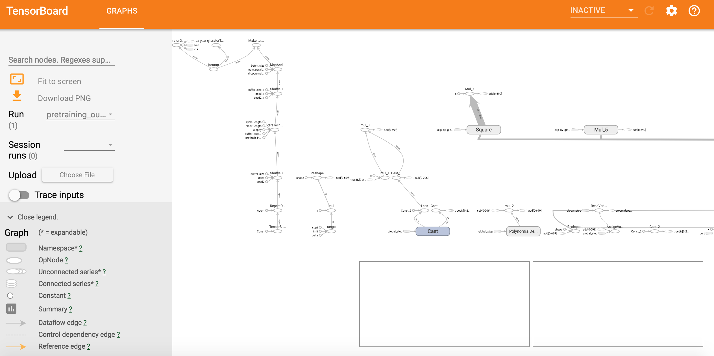
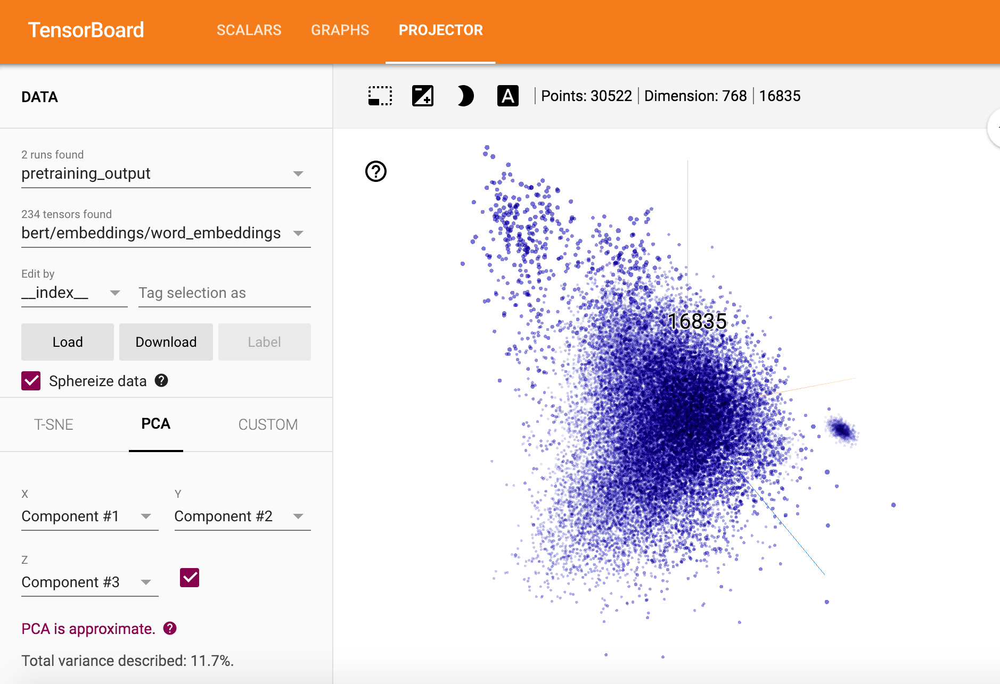

目录

<!-- TOC -->

- [pretrained model](#pretrained-model)
- [Sentence (and sentence-pair) classification tasks](#sentence-and-sentence-pair-classification-tasks)
  - [glue data数据集](#glue-data%E6%95%B0%E6%8D%AE%E9%9B%86)
  - [运行](#%E8%BF%90%E8%A1%8C)
- [pretraining](#pretraining)
  - [step1. create_pretraining_data](#step1-createpretrainingdata)
  - [step2. run_pretraining](#step2-runpretraining)
  - [pretrain tips and caveats](#pretrain-tips-and-caveats)
- [抽取feature vector(类似ELMo)](#%E6%8A%BD%E5%8F%96feature-vector%E7%B1%BB%E4%BC%BCelmo)

<!-- /TOC -->

北京时间10.31 23时许，bert官方版代码正式出炉~

[https://github.com/google-research/bert](https://github.com/google-research/bert)

原文的解读和pytorch版本的解读参考：[https://daiwk.github.io/posts/nlp-bert.html](https://daiwk.github.io/posts/nlp-bert.html)

参考参考机器之心发的[谷歌终于开源BERT代码：3 亿参数量，机器之心全面解读](https://mp.weixin.qq.com/s/vFdm-UHns7Nhbmdoiu6jWg)


代码结构：

```
`-- bert
    |-- CONTRIBUTING.md
    |-- create_pretraining_data.py
    |-- extract_features.py
    |-- __init__.py
    |-- LICENSE
    |-- modeling.py
    |-- modeling_test.py
    |-- optimization.py
    |-- optimization_test.py
    |-- README.md
    |-- run_classifier.py
    |-- run_pretraining.py
    |-- run_squad.py
    |-- sample_text.txt
    |-- tokenization.py
    `-- tokenization_test.py

1 directory, 16 files
```

## pretrained model

有这几个版本（在进行WordPiece分词之前是否区分大小写：是：cased，否：uncased(即全部转为小写)）：

+ BERT-Base, Uncased: 12-layer, 768-hidden, 12-heads, 110M parameters
+ BERT-Large, Uncased: 24-layer, 1024-hidden, 16-heads, 340M parameters
+ BERT-Base, Cased: 12-layer, 768-hidden, 12-heads , 110M parameters
+ BERT-Large, Cased: 24-layer, 1024-hidden, 16-heads, 340M parameters (Not available yet. Needs to be re-generated).
+ BERT-Base, Multilingual: 102 languages, 12-layer, 768-hidden, 12-heads, 110M parameters
+ BERT-Base, Chinese: Chinese Simplified and Traditional, 12-layer, 768-hidden, 12-heads, 110M parameters

每个zip中包含如下三个文件：

+ 一个TensorFlow checkpoint (bert_model.ckpt) ：包含pre-trained weights（里面有3个文件）
+ 一个vocab文件(vocab.txt)：将WordPiece映射成word id
+ 一个config file (bert_config.json) ：存储hyperparameters


例如：

```shell
uncased_L-12_H-768_A-12
|-- bert_config.json
|-- bert_model.ckpt.data-00000-of-00001
|-- bert_model.ckpt.index
|-- bert_model.ckpt.meta
|-- checkpoint
`-- vocab.txt

0 directories, 6 files
```

## Sentence (and sentence-pair) classification tasks

### glue data数据集

下载glue数据，使用[https://gist.github.com/W4ngatang/60c2bdb54d156a41194446737ce03e2e](https://gist.github.com/W4ngatang/60c2bdb54d156a41194446737ce03e2e)的py，执行【记住要是python3!!!!!】。。不过在墙内好像怎么都下不下来。。

```shell
python download_glue_data.py --data_dir glue_data --tasks all
```

### 运行

```shell
export BERT_BASE_DIR=/path/to/bert/uncased_L-12_H-768_A-12
export GLUE_DIR=/path/to/glue

python run_classifier.py \
  --task_name=MRPC \
  --do_train=true \
  --do_eval=true \
  --data_dir=$GLUE_DIR/MRPC \
  --vocab_file=$BERT_BASE_DIR/vocab.txt \
  --bert_config_file=$BERT_BASE_DIR/bert_config.json \
  --init_checkpoint=$BERT_BASE_DIR/bert_model.ckpt \
  --max_seq_length=128 \
  --train_batch_size=32 \
  --learning_rate=2e-5 \
  --num_train_epochs=3.0 \
  --output_dir=/tmp/mrpc_output/
```

输出：

```
***** Eval results *****
  eval_accuracy = 0.845588
  eval_loss = 0.505248
  global_step = 343
  loss = 0.505248
```

表示dev set上有84.55%的准确率，像MRPC（glue_data中的一个数据集）这样的小数据集，即使从pretrained的checkpoint开始，仍然可能在dev set的accuracy上会有很高的variance（跑多次，可能结果在84-88%之间）。


## pretraining

### step1. create_pretraining_data

paper的源码是用c++写的，这里用py又实现了一遍。。实现masked lm和next sentence prediction。

输入文件的格式：一行一句话（对于next sentence prediction这很重要），不同文档间用空行分隔。例如```sample_text.txt```：

```
Something glittered in the nearest red pool before him.
Gold, surely!
But, wonderful to relate, not an irregular, shapeless fragment of crude ore, fresh from Nature's crucible, but a bit of jeweler's handicraft in the form of a pla
in gold ring.
Looking at it more attentively, he saw that it bore the inscription, "May to Cass."
Like most of his fellow gold-seekers, Cass was superstitious.

The fountain of classic wisdom, Hypatia herself.
As the ancient sage--the name is unimportant to a monk--pumped water nightly that he might study by day, so I, the guardian of cloaks and parasols, at the sacred
 doors of her lecture-room, imbibe celestial knowledge.
From my youth I felt in me a soul above the matter-entangled herd.
She revealed to me the glorious fact, that I am a spark of Divinity itself.
```

输出是一系列的```TFRecord```的```tf.train.Example```。

注意：这个脚本把整个输入文件都放到内存里了，所以对于大文件，你可能需要把文件分片，然后跑多次这个脚本，得到一堆```tf_examples.tf_record*```，然后把这些文件都作为下一个脚本```run_pretraining.py```的输入。

参数：

+ max_predictions_per_seq：每个序列里最大的masked lm predictions。建议设置为```max_seq_length*masked_lm_prob```（这个脚本不会自动设置）


```shell
python create_pretraining_data.py \
  --input_file=./sample_text.txt \
  --output_file=/tmp/tf_examples.tfrecord \
  --vocab_file=$BERT_BASE_DIR/vocab.txt \
  --do_lower_case=True \
  --max_seq_length=128 \
  --max_predictions_per_seq=20 \
  --masked_lm_prob=0.15 \
  --random_seed=12345 \
  --dupe_factor=5
```

输出如下：

```
INFO:tensorflow:*** Example ***
INFO:tensorflow:tokens: [CLS] indeed , it was recorded in [MASK] star that a fortunate early [MASK] ##r had once picked up on the highway a solid chunk [MASK] gold quartz which the [MASK] had freed from its inc [MASK] ##ing soil , and washed into immediate and [MASK] popularity . [SEP] rainy season , [MASK] insult show habit of body , and seldom lifted their eyes to the rift ##ed [MASK] india - ink washed skies [MASK] them . " cass " beard [MASK] elliot early that morning , but not with a view to [MASK] . a leak in his [MASK] roof , - - quite [MASK] with his careless , imp ##rov ##ide ##nt habits , - - had rouse ##d him at 4 a [MASK] m [SEP]
INFO:tensorflow:input_ids: 101 5262 1010 2009 2001 2680 1999 103 2732 2008 1037 19590 2220 103 2099 2018 2320 3856 2039 2006 1996 3307 1037 5024 20000 103 2751 20971 2029 1996 103 2018 10650 2013 2049 4297 103 2075 5800 1010 1998 8871 2046 6234 1998 103 6217 1012 102 16373 2161 1010 103 15301 2265 10427 1997 2303 1010 1998 15839 4196 2037 2159 2000 1996 16931 2098 103 2634 1011 10710 8871 15717 103 2068 1012 1000 16220 1000 10154 103 11759 2220 2008 2851 1010 2021 2025 2007 1037 3193 2000 103 1012 1037 17271 1999 2010 103 4412 1010 1011 1011 3243 103 2007 2010 23358 1010 17727 12298 5178 3372 14243 1010 1011 1011 2018 27384 2094 2032 2012 1018 1037 103 1049 102
INFO:tensorflow:input_mask: 1 1 1 1 1 1 1 1 1 1 1 1 1 1 1 1 1 1 1 1 1 1 1 1 1 1 1 1 1 1 1 1 1 1 1 1 1 1 1 1 1 1 1 1 1 1 1 1 1 1 1 1 1 1 1 1 1 1 1 1 1 1 1 1 1 1 1 1 1 1 1 1 1 1 1 1 1 1 1 1 1 1 1 1 1 1 1 1 1 1 1 1 1 1 1 1 1 1 1 1 1 1 1 1 1 1 1 1 1 1 1 1 1 1 1 1 1 1 1 1 1 1 1 1 1 1 1 1
INFO:tensorflow:segment_ids: 0 0 0 0 0 0 0 0 0 0 0 0 0 0 0 0 0 0 0 0 0 0 0 0 0 0 0 0 0 0 0 0 0 0 0 0 0 0 0 0 0 0 0 0 0 0 0 0 0 1 1 1 1 1 1 1 1 1 1 1 1 1 1 1 1 1 1 1 1 1 1 1 1 1 1 1 1 1 1 1 1 1 1 1 1 1 1 1 1 1 1 1 1 1 1 1 1 1 1 1 1 1 1 1 1 1 1 1 1 1 1 1 1 1 1 1 1 1 1 1 1 1 1 1 1 1 1 1
INFO:tensorflow:masked_lm_positions: 7 12 13 25 30 36 45 52 53 54 68 74 81 82 93 99 103 105 125 0
INFO:tensorflow:masked_lm_ids: 17162 2220 4125 1997 4542 29440 20332 4233 1037 16465 2030 2682 2018 13763 5456 6644 1011 8335 1012 0
INFO:tensorflow:masked_lm_weights: 1.0 1.0 1.0 1.0 1.0 1.0 1.0 1.0 1.0 1.0 1.0 1.0 1.0 1.0 1.0 1.0 1.0 1.0 1.0 0.0
INFO:tensorflow:next_sentence_labels: 0
INFO:tensorflow:*** Example ***
INFO:tensorflow:tokens: [CLS] and there burst on phil ##am ##mon ' s astonished eyes a vast semi ##ci ##rcle of blue sea [MASK] ring ##ed with palaces and towers [MASK] [SEP] like most of [MASK] fellow gold - seekers , cass was super ##sti [MASK] . [SEP]
INFO:tensorflow:input_ids: 101 1998 2045 6532 2006 6316 3286 8202 1005 1055 22741 2159 1037 6565 4100 6895 21769 1997 2630 2712 103 3614 2098 2007 22763 1998 7626 103 102 2066 2087 1997 103 3507 2751 1011 24071 1010 16220 2001 3565 16643 103 1012 102 0 0 0 0 0 0 0 0 0 0 0 0 0 0 0 0 0 0 0 0 0 0 0 0 0 0 0 0 0 0 0 0 0 0 0 0 0 0 0 0 0 0 0 0 0 0 0 0 0 0 0 0 0 0 0 0 0 0 0 0 0 0 0 0 0 0 0 0 0 0 0 0 0 0 0 0 0 0 0 0 0 0 0
INFO:tensorflow:input_mask: 1 1 1 1 1 1 1 1 1 1 1 1 1 1 1 1 1 1 1 1 1 1 1 1 1 1 1 1 1 1 1 1 1 1 1 1 1 1 1 1 1 1 1 1 1 0 0 0 0 0 0 0 0 0 0 0 0 0 0 0 0 0 0 0 0 0 0 0 0 0 0 0 0 0 0 0 0 0 0 0 0 0 0 0 0 0 0 0 0 0 0 0 0 0 0 0 0 0 0 0 0 0 0 0 0 0 0 0 0 0 0 0 0 0 0 0 0 0 0 0 0 0 0 0 0 0 0 0
INFO:tensorflow:segment_ids: 0 0 0 0 0 0 0 0 0 0 0 0 0 0 0 0 0 0 0 0 0 0 0 0 0 0 0 0 0 1 1 1 1 1 1 1 1 1 1 1 1 1 1 1 1 0 0 0 0 0 0 0 0 0 0 0 0 0 0 0 0 0 0 0 0 0 0 0 0 0 0 0 0 0 0 0 0 0 0 0 0 0 0 0 0 0 0 0 0 0 0 0 0 0 0 0 0 0 0 0 0 0 0 0 0 0 0 0 0 0 0 0 0 0 0 0 0 0 0 0 0 0 0 0 0 0 0 0
INFO:tensorflow:masked_lm_positions: 10 20 23 27 32 39 42 0 0 0 0 0 0 0 0 0 0 0 0 0
INFO:tensorflow:masked_lm_ids: 22741 1010 2007 1012 2010 2001 20771 0 0 0 0 0 0 0 0 0 0 0 0 0
INFO:tensorflow:masked_lm_weights: 1.0 1.0 1.0 1.0 1.0 1.0 1.0 0.0 0.0 0.0 0.0 0.0 0.0 0.0 0.0 0.0 0.0 0.0 0.0 0.0
INFO:tensorflow:next_sentence_labels: 1
INFO:tensorflow:Wrote 60 total instances
```

### step2. run_pretraining

+ 如果你是从头开始pretrain，不要include init_checkpoint
+ 模型配置（包括vocab size）在bert_config_file中设置
+ num_train_steps在现实中一般要设置10000以上
+ max_seq_length和max_predictions_per_seq要和传给create_pretraining_data的一样


```shell
python run_pretraining.py \
  --input_file=/tmp/tf_examples.tfrecord \
  --output_dir=/tmp/pretraining_output \
  --do_train=True \
  --do_eval=True \
  --bert_config_file=$BERT_BASE_DIR/bert_config.json \
  --init_checkpoint=$BERT_BASE_DIR/bert_model.ckpt \
  --train_batch_size=32 \
  --max_seq_length=128 \
  --max_predictions_per_seq=20 \
  --num_train_steps=20 \
  --num_warmup_steps=10 \
  --learning_rate=2e-5
```

跑的时候发现会充分利用显存，具体不是特别清楚，显存太小应该也跑不了吧。由于sample_text.txt很小，所以会overfit。log如下(最后会生成一个```eval_results.txt```文件，记录```***** Eval results *****```部分)：

```
INFO:tensorflow:Done running local_init_op.
INFO:tensorflow:Evaluation [10/100]
INFO:tensorflow:Evaluation [20/100]
INFO:tensorflow:Evaluation [30/100]
INFO:tensorflow:Evaluation [40/100]
INFO:tensorflow:Evaluation [50/100]
INFO:tensorflow:Evaluation [60/100]
INFO:tensorflow:Evaluation [70/100]
INFO:tensorflow:Evaluation [80/100]
INFO:tensorflow:Evaluation [90/100]
INFO:tensorflow:Evaluation [100/100]
INFO:tensorflow:Finished evaluation at 2018-10-31-18:13:12
INFO:tensorflow:Saving dict for global step 20: global_step = 20, loss = 0.27842212, masked_lm_accuracy = 0.94665253, masked_lm_loss = 0.27976906, next_sentence_accuracy = 1.0, next_sentence_loss = 0.0002133457
INFO:tensorflow:Saving 'checkpoint_path' summary for global step 20: ./pretraining_output/model.ckpt-20
INFO:tensorflow:***** Eval results *****
INFO:tensorflow:  global_step = 20
INFO:tensorflow:  loss = 0.27842212
INFO:tensorflow:  masked_lm_accuracy = 0.94665253
INFO:tensorflow:  masked_lm_loss = 0.27976906
INFO:tensorflow:  next_sentence_accuracy = 1.0
INFO:tensorflow:  next_sentence_loss = 0.0002133457
```

具体可以看对应的tensorboard，比较卡，猜测是模型比较大，截图如下：


<html>
<br/>


<br/>

</html>

还有个projector，如下：

<html>
<br/>


<br/>

</html>

### pretrain tips and caveats

+ 如果你的任务有很大的domain-specific语料，最好从bert的checkpoint开始，在你的语料上进行多一些的pre-train
+ paper中的学习率设为1e-4，如果基于已有bert checkpoint继续pretrain，建议把学习率调小（如2e-5）
+ 当前的bert模型只是English的，2018年11月底会放出更多语言的！！
+ 更长的序列的计算代价会非常大，因为attention是序列长度平方的复杂度。例如，一个长度是512的minibatch-size=64的batch，比一个长度为128的minibatch-size=256的batch计算代码要大得多。对于全连接或者cnn来讲，其实这个计算代价是一样的。但对attention而言，长度是512的计算代价会大得多。所以，建议对长度为128的序列进行9w个step的预训练，然后对长度为512的序列再做1w个step的预训练是更好的~对于非常长的序列，最需要的是学习positional embeddings，这是很快就能学到的啦。注意，这样做就需要使用不同的max_seq_length来生成两次数据。
+ 如果你从头开始pretrain，计算代价是很大的，特别是在gpu上。建议的是在一个preemptible Cloud TPU v2上pretrain一个bert-base（2周要500美刀…）。如果在一个single cloud TPU上的话，需要把batchsize scale down。建议使用能占满TPU内存的最大batchsize...

## 抽取feature vector(类似ELMo)

输入文件```input.txt```格式：

+ 如果是两个句子，那就是```sentence A ||| sentence B```
+ 如果是一个句子，那就是```sentence A```，不要分隔符

```shell
python extract_features.py \
  --input_file=input.txt \
  --output_file=/tmp/output.json \
  --vocab_file=$BERT_BASE_DIR/vocab.txt \
  --bert_config_file=$BERT_BASE_DIR/bert_config.json \
  --init_checkpoint=$BERT_BASE_DIR/bert_model.ckpt \
  --layers=-1,-2,-3,-4 \
  --max_seq_length=128 \
  --batch_size=8
```

例如输入的内容是『大家』，那么输出的```output.json```格式如下：

其中的"linex_index"表示第几行

```shell
{
  "linex_index": 0,
  "features": [{
    "token": "[CLS]",
    "layers": [{
      "index": -1,
      "values": [1.507966, -0.155272, 0.108119, ..., 0.111],
    }, {
      "index": -2,
      "values": [1.39443, 0.307064, 0.483496, ..., 0.332],
    }, {
      "index": -3,
      "values": [0.961682, 0.757408, 0.720898, ..., 0.332],
    }, {
      "index": -4,
      "values": [-0.275457, 0.632056, 1.063737, ..., 0.332],
    }, {
    "token": "大",
    "layers": [{
      "index": -1,
      "values": [0.326004, -0.313136, 0.233399, ..., 0.111],
    }, {
      "index": -2,
      "values": [0.795364, 0.361322, -0.116774, ..., 0.332],
    }, {
      "index": -3,
      "values": [0.807957, 0.206743, -0.359639, ..., 0.332],
    }, {
      "index": -4,
      "values": [-0.226106, -0.129655, -0.128466, ..., 0.332],
    }, {
    "token": "家",
    "layers": [{
      "index": -1,
      "values": [1.768678, -0.814265, 0.016321, ..., 0.111],
    }, {
      "index": -2,
      "values": [1.76887, -0.020193, 0.44832, 0.193271, ..., 0.332],
    }, {
      "index": -3,
      "values": [1.695086, 0.050979, 0.188321, -0.537057, ..., 0.332],
    }, {
      "index": -4,
      "values": [0.745073, -0.09894, 0.166217, -1.045382, ..., 0.332],
    }, {
    "token": "[SEP]",
    "layers": [{
      "index": -1,
      "values": [0.881939, -0.34753, 0.210375, ..., 0.111],
    }, {
      "index": -2,
      "values": [-0.047698, -0.030813, 0.041558, ..., 0.332],
    }, {
      "index": -3,
      "values": [-0.049113, -0.067705, 0.018293, ..., 0.332],
    }, {
      "index": -4,
      "values": [0.000215, -0.057331, -3.2e-05, ..., 0.332],
    }]
  }]
}
```

