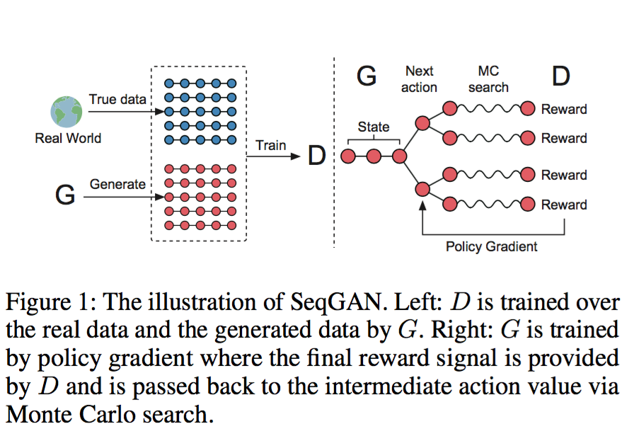

目录

<!-- TOC -->

- [概述](#概述)
    - [SeqGAN via Policy Gradient](#seqgan-via-policy-gradient)
        - [生成器相关](#生成器相关)
        - [判别器相关](#判别器相关)
        - [算法流程](#算法流程)
    - [The Generative Model for Sequences](#the-generative-model-for-sequences)
    - [The Discriminative Model for Sequences](#the-discriminative-model-for-sequences)

<!-- /TOC -->

[SeqGAN: Sequence Generative Adversarial Nets with Policy Gradient](https://arxiv.org/abs/1609.05473)

参考[https://www.jianshu.com/p/e1b87286bfae](https://www.jianshu.com/p/e1b87286bfae)

参考[https://zhuanlan.zhihu.com/p/36880287](https://zhuanlan.zhihu.com/p/36880287)

## 概述

GAN 在生成**连续离散序列**时会遇到两个问题：

+ 一是因为生成器的输出是离散的，**梯度更新**从**判别器传到生成器**比较困难；
+ 二是**判别器**只有当**序列被完全生成后**才能进行判断，但此刻**指导用处已不太大**，而如果**生成器生成序列的同时判别器来判断**，**如何平衡当前序列的分数和未来序列的分数**又是一个难题。

在这篇论文中：

+ 将生成器看作是强化学习中的**随机policy**，这样就可以**直接通过gradient policy**的更新来避免生成器中的求导问题。
+ 判别器对**整个序列的评分**作为强化学习的reward信号可以通过**Monte Carlo搜索**传递到序列生成的**中间时刻**。

<html>
 

 
</html>

G和D的定义如下：

+ 通过生成器`\(G_{\theta}\)`产生序列`\(Y_{1 : T}=\left(y_{1}, \ldots, y_{t}, \ldots, y_{T}\right), y_{t} \in \mathcal{Y}\)`，其中的`\(\mathcal{Y}\)`是整个词表。在时间步`\(t\)`时，
    + 状态是前`\(t-1\)`的序列`\(\left(y_{1}, \ldots, y_{t-1}\right)\)`，
    + 动作是`\(y_{t}\)`
    + `\(G_{\theta}\left(y_{t} | Y_{1 : t-1}\right)\)`是随机策略
    + 状态转移是确定性的
+ 通过判别器`\(D_{\phi}\left(Y_{1 : T}\right)\)`判断序列`\(Y_{1 : T}\)`是真实序列的概率。

训练过程如下：

+ 通过正样本（真实序列）和负样本（生成的序列）来训练判别器
+ 基于判别器给出的reward，通过policy gradient和MC搜索来训练生成器。其中的reward是通过生成器能欺骗判别器的likelihood来估计的。

### SeqGAN via Policy Gradient

#### 生成器相关

对于生成器`\(G_{\theta}\left(y_{t} | Y_{1 : t-1}\right)\)`来讲，其实没有中间的reward，只有整个sequence生成之后的final reward，所以目标就是最大化：

`\[
J(\theta)=\mathbb{E}\left[R_{T} | s_{0}, \theta\right]=\sum_{y_{1} \in \mathcal{Y}} G_{\theta}\left(y_{1} | s_{0}\right) \cdot Q_{D_{\phi}}^{G_{\theta}}\left(s_{0}, y_{1}\right)
\]`

上式中的`\(R_{T}\)`是完整的长度为T的序列的reward。

而`\(Q_{D_{\phi}}^{G_{\theta}}(s, a)\)`是一个序列的action-value function。指的是从状态s开始，执行动作a，再`\(G_{\theta}\)`，再得到的累积期望reward。

对于倒数第二个状态，执行一步就是长度为T的序列了，那么，这个reward就是判别器的输出：

`\[
Q_{D_{\phi}}^{G_{\theta}}\left(a=y_{T}, s=Y_{1 : T-1}\right)=D_{\phi}\left(Y_{1 : T}\right)
\]`

而对于中间状态呢，就要用MC了。

先看下面这个式子，给定一个长度为t-1的序列，使用带有roll-out policy `\(G_{\beta}\)`的MC搜索采样N次，每次采样T-t个token，得到一个长度为T的序列。所以产生的就是N个长度为T的序列。在这里，`\(G_{\beta}\)`和生成器`\(G_\theta\)`一样。

`\[
\left\{Y_{1 : T}^{1}, \ldots, Y_{1 : T}^{N}\right\}=\mathrm{MC}^{G_{\beta}}\left(Y_{1 : t} ; N\right)
\]`

于是，t<T时，就是采样出N个长度为T的结果，然后每个结果算一下D，再对这N个结果取平均

`\[
Q_{D_{\phi}}^{G_{\theta}}\left(s=Y_{1 : t-1}, a=y_{t}\right)=\left\{\begin{array}{ll}{\frac{1}{N} \sum_{n=1}^{N} D_{\phi}\left(Y_{1 : T}^{n}\right), Y_{1 : T}^{n} \in \mathrm{MC}^{G_{\beta}}\left(Y_{1 : t} ; N\right)} & {\text { for } t<T} \\ {D_{\phi}\left(Y_{1 : t}\right)} & {\text { for } t=T}\end{array}\right.
\]`

然后生成器的目标函数的导数就是：

`\[
\nabla_{\theta} J(\theta)=\sum_{t=1}^{T} \mathbb{E}_{Y_{1 : t-1} \sim G_{\theta}}\left[\sum_{y_{t} \in \mathcal{Y}} \nabla_{\theta} G_{\theta}\left(y_{t} | Y_{1 : t-1}\right) \cdot Q_{D_{\phi}}^{G_{\theta}}\left(Y_{1 : t-1}, y_{t}\right)\right]
\]`

近似一下就是：

`\[
\begin{array}{l}{\nabla_{\theta} J(\theta) \simeq \sum_{t=1}^{T} \sum_{y_{t} \in \mathcal{Y}} \nabla_{\theta} G_{\theta}\left(y_{t} | Y_{1 : t-1}\right) \cdot Q_{D_{\phi}}^{G_{\theta}}\left(Y_{1 : t-1}, y_{t}\right)} \\ {=\sum_{t=1}^{T} \sum_{y_{t} \in \mathcal{Y}} G_{\theta}\left(y_{t} | Y_{1 : t-1}\right) \nabla_{\theta} \log G_{\theta}\left(y_{t} | Y_{1 : t-1}\right) \cdot Q_{D_{\phi}}^{G_{\theta}}\left(Y_{1 : t-1}, y_{t}\right)} \\ {=\sum_{t=1}^{T} \mathbb{E}_{y_{t} \sim G_{\theta}\left(y_{t} | Y_{1 : t-1}\right)}\left[\nabla_{\theta} \log G_{\theta}\left(y_{t} | Y_{1 : t-1}\right) \cdot Q_{D_{\phi}}^{G_{\theta}}\left(Y_{1 : t-1}, y_{t}\right)\right]}\end{array}    
\]`

其中的`\(Y_{1 : t-1}\)`是从`\(G_{\theta}\)`里sample出来的observed的中间状态。然后通过上面这个梯度来对`\(\theta\)`进行梯度下降更新。

#### 判别器相关

训练判别器使用的损失函数则是

`\[
\min _{\phi}-\mathbb{E}_{Y \sim p_{\text {data }}}\left[\log D_{\phi}(Y)\right]-\mathbb{E}_{Y \sim G_{\theta}}\left[\log \left(1-D_{\phi}(Y)\right)\right]
\]`

把负号取出来，第一项就是要让真实分布采样出来的最大，第二项就是让从G出来的最小也就是1-D最大。

#### 算法流程

### The Generative Model for Sequences

使用rnn

### The Discriminative Model for Sequences

使用cnn
