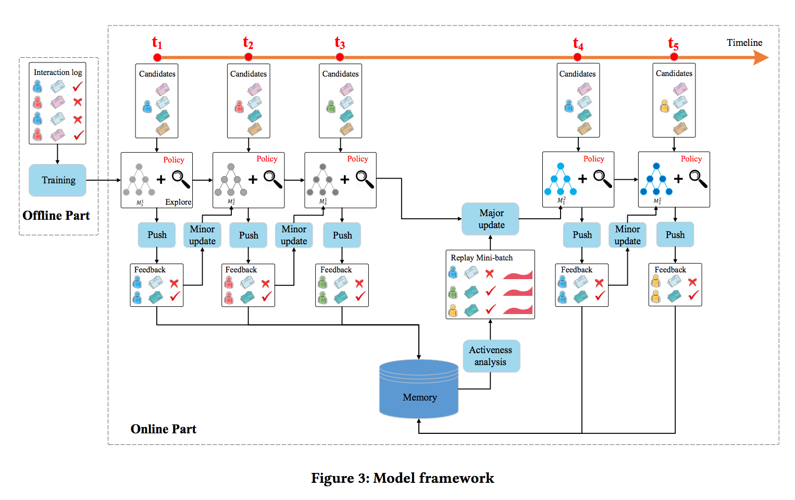
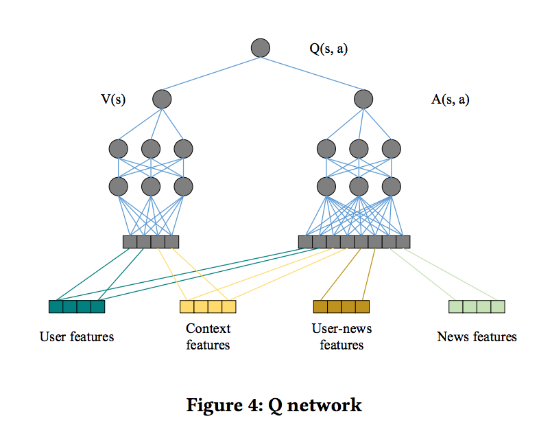
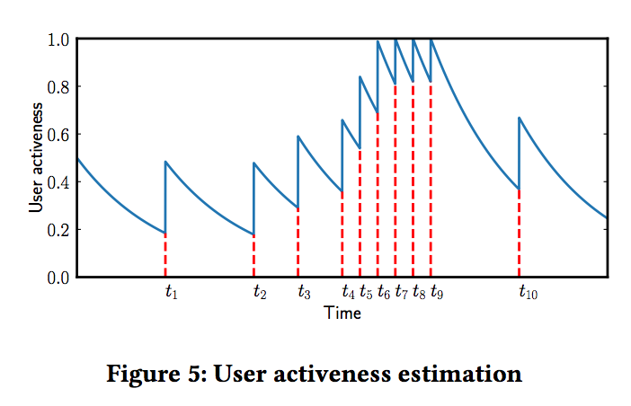
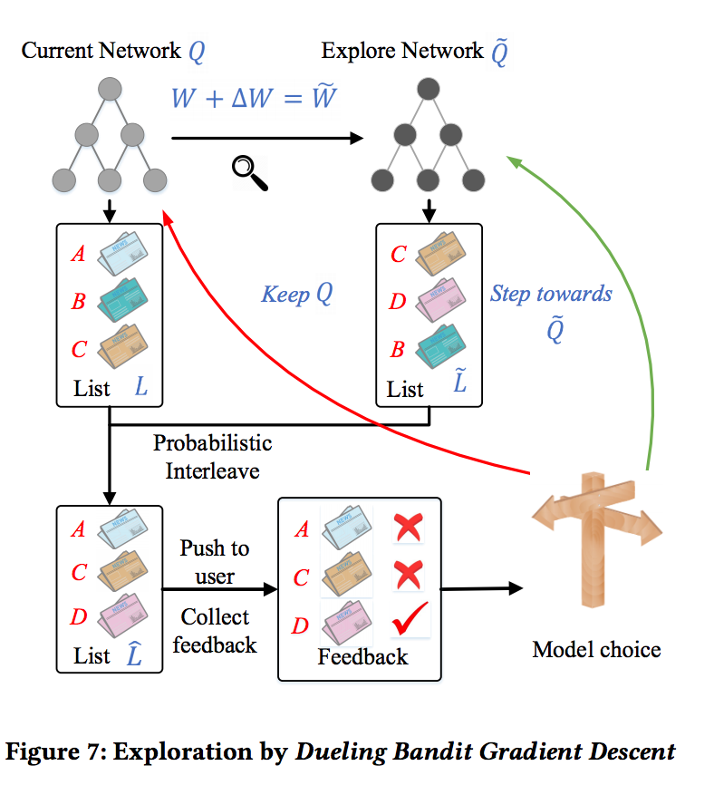

目录

<!-- TOC -->

- [背景](#%E8%83%8C%E6%99%AF)
- [模型](#%E6%A8%A1%E5%9E%8B)
- [具体实现](#%E5%85%B7%E4%BD%93%E5%AE%9E%E7%8E%B0)
  - [dueling double DQN](#dueling-double-dqn)
  - [User activeness](#user-activeness)
  - [Exploration](#exploration)

<!-- /TOC -->

参考[强化学习系列一——基于深度强化学习的新闻推荐模型DRN](https://zhuanlan.zhihu.com/p/58280384)

[DRN: A Deep Reinforcement Learning Framework for News Recommendation](http://www.personal.psu.edu/~gjz5038/paper/www2018_reinforceRec/www2018_reinforceRec.pdf)

## 背景

现有推荐模型的几大问题：

+ 新闻推荐中的**动态变化**难以处理

动态变化表现在两种层次：一个是新闻的**时效性**，可能会很快过时；另一个是**用户的浏览兴趣**，随着时间会动态变化。虽然通过在线学习的方式可以捕获新闻特征和用户兴趣的动态变化，但是这些方法**只注重短期回报，并未考虑长期回报**。

+ 仅使用**是否点击**作为用户反馈

现有方法只考虑是否点击或者打分来作为用户的反馈。作者提出引入**用户返回APP的时间**，因为该指标也反映了用户对推荐的**满意度**。

+ 现有方法推荐结果**重复**较多

现有方法倾向于给用户推荐相似item，而这将降低用户对相似topic的兴趣，也不利于探索用户新的兴趣。

## 模型

<html>
 

 

</html>

将用户和news的特征表示输入给DQN来预测可能的reward，也就是用户**点击news的概率**。该框架通过DQN的**在线更新**来处理新闻推荐中的动态变化，并**注重长期回报**。框架除了用户点击的反馈之外，引入了user activeness（用户在一次推荐后返回到APP的频率）作为回报。另外为避免传统的exploration策略比如`\(\varepsilon-greedy\)`或UCB可能带来的不准确推荐，作者引入**Dueling Bandit Gradient Descent**策略来改善推荐的**多样性**。

+ 离线部分：主要是使用离线的用户点击日志来训练，给点击和未点击的news不同的奖励，然后训练一个Q网络，其实就是一个监督学习的过程。

+ 在线部分：涉及推荐agent和用户的交互过程，按下面的流程对网络进行更新：
  + Push：每当用户发送一个请求，推荐智能体G会根据**用户和候选news集合**的特征表示，综合exploitation network和exploration network两个网络的结果，**生成top-k**的news列表L
  + FeedBack：用户针对接受的列表L将会有**点击行为**。
  + Minor Update：在**每个时间戳**后，根据user、news列表L和反馈B，智能体G将会比较**exploitation network** `\(Q\)`和**exploration network** `\(\tilde{Q}\)`的推荐效果来**更新模型**。如果`\(\tilde{Q}\)`给出的推荐结果最终效果更好，则将Q往 `\(\tilde{Q}\)`的方向更新，否则`\(Q\)`保持不变。**每次推荐发生之后都会进行Minor update**。
  + Major Update：在一个**特定时期**`\(T_R\)`后，智能体G将使用**用户反馈B**和**用户activeness**来更新网络Q。这里使用**经验回放**来实现，智能体G保存近期历史click和用户activeness记录，当触发Major Update时，智能体**随机选择一个batch**来更新模型。Major Update通常**间隔比如一个小时**来进行，在这段时间会收集很多次的展现和反馈的记录。

## 具体实现

### dueling double DQN

使用DQN来建模用户是否点击某一news的概率，而这一概率也是智能体能得到的奖励即reward：

`\[
y_{s,a}=Q(s,a)=r_{immediate}+\gamma r_{future}
\]`

+ **状态state**：context feature和user feature
+ **动作action**：news feature和user-news交互特征
+ `\(r_{immediate}\)`和`\(r_{future}\)`分别表示**当前情况**下奖励（也就是用户是否点击新闻）和**未来回报**。

<html>
 

 

</html>

给定当前状态s、动作a和时间戳t，使用DDQN来对total reward进行预测：

`\[
y_{s,a,t}=r_{a,t+1}+\gamma Q(s_{a,t+1},\mathop{\arg\max}_{a^{'}}Q(s_{a,t+1},a^{'};w_t);w_{t}^{'})
\]`

其中，`\(r_{a,t+1}\)`表示采取**动作a的立即回报**，`\(w_t\)`和`\(w_t^{'}\)`表示DQN中的两个**不同参数集合**。

+ 首先**给定候选动作集**，在参数`\(w_t\)`的设置下根据**长期回报最大**选择出动作`\(a^{'}\)`。
+ 然后**估计**`\(s_{a,t+1}\)`采取动作`\(a^{'}\)`所得到的**长期回报**。
+ 每几轮迭代之后`\(w_t\)`和`\(w_t^{'}\)`将互换。

DDQN(double DQN)可解决Q值过高估计的问题。通过这个过程，模型可兼顾total reward进行决策。

Q网络底层将四类特征输入到网络中，user feature和context feature作为**state feature**，而user-news feature和news feature作为**action feature**。

+ 一方面，在一个特定状态采用某个动作的**reward和所有特征均有关**。
+ 另一方面，reward**受user本身特征的影响（例如user是否active，user今天是否看了足够多的News了已经）**要**大于****只**用用户和context特征。

基于此，文中类似Dueling Network将Q函数分解成`\(V(s)\)`和`\(A(s,a)\)`，其中`\(V(s)\)`**只受state**特征(即user+context)影响，而`\(A(s,a)\)`则会**受到state特征和action特征**（即user+context+item+user-item-cross）影响。

### User activeness

采用**留存模型**来对用户activeness来建模。时间t后用户返回App的概率定义为`\(s(t)=e^{-\int_{0}^{t}\lambda(x)dx}\)`，其中一个生命周期`\(T_{0}=\int_{0}^{\infty}s(t)dt\)`（文中`\(T_0\)`设为一天）。每次检测到一个**用户返回App**，我们将使得`\(s(t)=s(t)+s_a\)`。如下图，开始时`\(s_0=0.5\)`，然后activeness衰减，在`\(t_1\)`时刻用户返回App，使得activeness增加`\(s_a=0.32\)`，后续以此类推。整个过程保证活跃度保持在0-1之间，**如果超过1的话直接截断成1**。这里`\(s_0\)`、`\(s_a\)`等值的设定都是数据中的真实用户行为模式确定的。

<html>
 

 

</html>

### Exploration

常见的探索方法包括`\(\epsilon-greedy\)`和UCB等，其中前者会随机推荐一些新item，后者会选择一些未探索充分的item，这些都会导致推荐效果有一定下降。因此作者使用了Dueling Bandit Gradient Descent算法(最早来自online LTR领域)来进行exploration。智能体G使用当前网络Q产出推荐列表L，并使用explore网络`\(\tilde{Q}\)`产生另一个推荐列表`\(\tilde{L}\)`。`\(\tilde{Q}\)`的参数可以通过**Q的参数基础上增加微小扰动得到**。然后使用L和`\(\tilde{L}\)`进行interleave来产生一个**融合的列表**`\(\hat L\)`。如果探索网络`\(\tilde{Q}\)`产生的item得到更好的反馈，则智能体G将网络Q**向`\(\tilde{Q}\)`的方向更新**，表示为`\(w^{'}=w+\eta \tilde{w}\)`，否则Q的参数保持不变。

<html>
 

 

</html>

