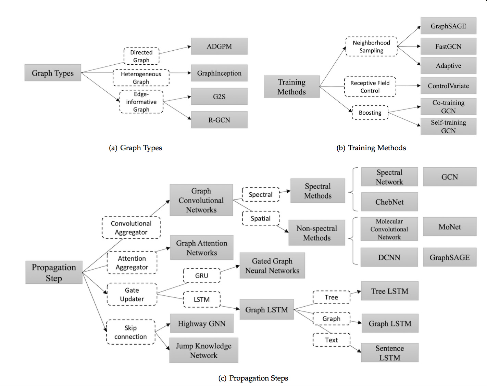
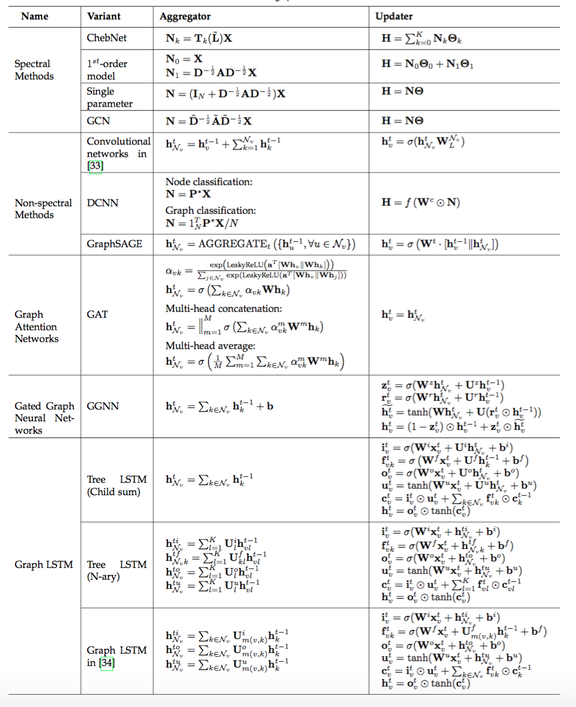
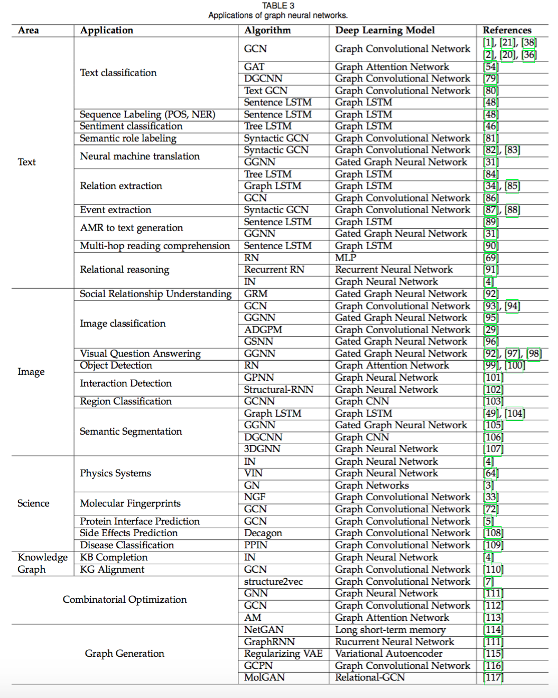

目录

<!-- TOC -->

- [概述](#%E6%A6%82%E8%BF%B0)
- [引言](#%E5%BC%95%E8%A8%80)
- [模型](#%E6%A8%A1%E5%9E%8B)
  - [原始GNN](#%E5%8E%9F%E5%A7%8Bgnn)
  - [GNN变种](#gnn%E5%8F%98%E7%A7%8D)
    - [图类型](#%E5%9B%BE%E7%B1%BB%E5%9E%8B)
      - [Directed Graphs](#directed-graphs)
      - [Heterogeneous Graphs](#heterogeneous-graphs)
      - [Graphs with Edge Information](#graphs-with-edge-information)
    - [传播类型(propagation types)](#%E4%BC%A0%E6%92%AD%E7%B1%BB%E5%9E%8Bpropagation-types)
    - [训练方法](#%E8%AE%AD%E7%BB%83%E6%96%B9%E6%B3%95)
  - [General Frameworks](#general-frameworks)
    - [Message Passing Neural Networks(MPNN)](#message-passing-neural-networksmpnn)
    - [Non-local Neural Networks(NLNN)](#non-local-neural-networksnlnn)
    - [Graph Networks(GN)](#graph-networksgn)
- [应用](#%E5%BA%94%E7%94%A8)
  - [结构化场景](#%E7%BB%93%E6%9E%84%E5%8C%96%E5%9C%BA%E6%99%AF)
  - [非结构化场景](#%E9%9D%9E%E7%BB%93%E6%9E%84%E5%8C%96%E5%9C%BA%E6%99%AF)
  - [其他场景](#%E5%85%B6%E4%BB%96%E5%9C%BA%E6%99%AF)
- [开放性问题](#%E5%BC%80%E6%94%BE%E6%80%A7%E9%97%AE%E9%A2%98)

<!-- /TOC -->

## 概述

最近图神经网络有点火。。先mark一下：

[清华大学孙茂松组：图神经网络必读论文列表](https://mp.weixin.qq.com/s?__biz=MzA3MzI4MjgzMw==&mid=2650754602&idx=2&sn=7d55e6c20bbf4d85d19d62fc67045b85&chksm=871a8a54b06d03429b5fb811c7ef7f22d368c3c2db2ebb71b3abd3d6a9737088e54a402c5ac2&mpshare=1&scene=1&srcid=1228olcW24R33IxsQlPTzwYg&pass_ticket=SzwEuJ2YzNx6f6qRO8kkEzvCJzmwLfJnp2tSTApgym2Eec7lBnwb3SzGw6NeSiqz#rd)

github链接：[https://github.com/thunlp/GNNPapers](https://github.com/thunlp/GNNPapers)

综述[Graph Neural Networks: A Review of Methods and Applications](https://arxiv.org/pdf/1812.08434)

解读：[图神经网络综述：模型与应用](https://mp.weixin.qq.com/s?__biz=MzIwMTc4ODE0Mw==&mid=2247493906&idx=1&sn=15c9f18a1ce6baa15dc85ecb52e799f6&chksm=96ea3692a19dbf847c1711e6e194ad60d80d11138daf0938f90489a054d77cfd523bee2dc1d2&mpshare=1&scene=1&srcid=1226x1tdeDKTzwcuszAuh1O0&pass_ticket=SzwEuJ2YzNx6f6qRO8kkEzvCJzmwLfJnp2tSTApgym2Eec7lBnwb3SzGw6NeSiqz#rd)

又一篇综述：[图神经网络概述第三弹：来自IEEE Fellow的GNN综述](https://mp.weixin.qq.com/s?__biz=MzA3MzI4MjgzMw==&mid=2650755237&idx=1&sn=2dd0468552e69057681eec58fd265cbb&chksm=871a94dbb06d1dcd90451b17cc94a38811619fd49c07f1d1cf1909436746bae9b79717c345b2&mpshare=1&scene=1&srcid=01078WbXsi7srXvp72V6GitX&pass_ticket=mPnDPDR4heSU20VXT7N8W622Cb1dZmIzkNcF8BygI%2Bp60d7GrSesIej%2FlrFbnO84#rd)

## 引言

图是一种数据结构，它对一组对象 **（节点）** 及其关系 **（边）** 进行建模。图神经网络（GNN）是一类基于深度学习的**处理图域信息**的方法。由于其较好的**性能**和**可解释性**，GNN 最近已成为一种广泛应用的图分析方法。

GNN的第一个动机源于**卷积神经网络（CNN）**：CNN只能在规则的Euclidean数据上运行，如图像（2维网格）和文本（1维序列）。如何将CNN应用于**图结构这一非欧几里德空间**，成为GNN模型重点解决的问题。

GNN的另一个动机来自**图嵌入（Graph Embedding）**，它学习图中**节点**、**边**或**子图**的低维向量空间表示。DeepWalk、node2vec、LINE、SDNE等方法在网络表示学习领域取得了很大的成功。然而，这些方法在**计算上较为复杂**并且在**大规模上的图上**并**不是最优**的，GNN旨在解决这些问题。

## 模型

<html>
 

 
</html>

### 原始GNN

2009年的第一篇GNN的文章[The graph neural network model](http://citeseerx.ist.psu.edu/viewdoc/download?doi=10.1.1.1015.7227&rep=rep1&type=pdf)。GNN的target是要学习包括了每个节点的邻居的信息的state embedding `\(h_v\in R^s\)`。这里的state embedding `\(h_v\)`是节点`\(v\)`的一个`\(s\)`维的向量，能用来产生输出`\(o_v\)`，例如节点的label。`\(f\)`是一个带有参数的函数，称为local transition function，被所有的节点共享，能根据输入的邻居来更新节点状态。`\(g\)`是local output function，表示如何产生output。所以：

`\[
\begin{matrix}
h_v=f(x_v,x_{co[v]},h_{ne[v]},x_{ne[v]})\\
o_v=g(h_v,x_v)\\
\end{matrix}
\]`

其中，

+ `\(x_v\)`：节点`\(v\)`的特征。
+ `\(x_{co[v]}\)`：节点`\(v\)`的边的特征。
+ `\(h_{ne[v]}\)`：节点`\(v\)`的邻居节点的state。
+ `\(x_{ne[v]}\)`：节点`\(v\)`的邻居节点的特征。

把所有状态、输出、特征、所有节点的特征stack到一起，就有了向量`\(X\)`、`\(O\)`、`\(X\)`和`\(X_N\)`。所以有：

`\[
\begin{matrix}
H=F(H,X)\\
O=G(H,X_N)\\
\end{matrix}
\]`

使用如下方式对状态进行迭代：

`\[
H^{t+1}=F(H^t,X)
\]`

### GNN变种

#### 图类型

##### Directed Graphs

有向图。如图中的ADGPM【[Rethinking knowledge graph propagation for zero-shot learning](https://arxiv.org/abs/1805.11724)】，有两种权重矩阵`\(W_p\)`和`\(W_c\)`

`\[H^t=\sigma(D^{-1}_pA_p\sigma(D^{-1}_cA_cH^{t-1}W_c)W_p)\]`

其中的`\(D^{-1}_pA_p\)`和`\(D^{-1}_cA_c\)`分别是parent和children的normalized adjacency matrix。

##### Heterogeneous Graphs

异构图。如图中的GraphInception。

##### Graphs with Edge Information

边带有信息的图，如图中的G2S以及R-GCN。

#### 传播类型(propagation types)

**propagation step**和**output step**这两部是很重要的，主要分为以下类别：

+ **卷积**：Graph Convolutional Network（GCN）希望将卷积操作应用在图结构数据上，主要分为Spectral Method和Spatial Method（Non-spectral Method）两类。
  + **Spectral Method**：希望使用**谱分解**的方法，应用图的**拉普拉斯矩阵分解**进行节点的信息收集。
  + **Spatial Method**：**直接使用图的拓扑结构**，根据图的**邻居信息**进行信息收集。
+ **注意力机制**：Graph Attention Network 致力于将注意力机制应用在图中的**信息收集阶段**。
+ **门机制**：门机制应用于**节点更新阶段**。Gated graph neural network 将**GRU**机制应用于节点更新。很多工作致力于将 **LSTM**应用于不同类型的图上，主要包括**Tree LSTM**、**Graph LSTM**和**Sentence LSTM**等
+ **残差连接**：堆叠多层图神经网络可能引起噪声在指数级增加的邻居中传播，所以很多工作将残差机制应用于图神经网络中。主要包括**Highway GNN**和**Jump Knowledge Network**两种不同的处理方式。

信息传递函数主要包括**信息收集（agggregation）**和节点**信息更新（update）**两个部分，公式见：

<html>
 

 
</html>

#### 训练方法

譬如**GraphSAGE**从**附近的邻居**收集信息，并且能够应用于**inductive learning**领域；**FastGCN**使用了**importance sampling**的方法，使用**采样**替代使用节点所有的邻居信息，加快了训练过程。

### General Frameworks

图神经网络通用框架主要包括MPNN（Message Passing Neural Network）、NLNN（Non-local Neural Network）以及 Deepmind 的 GN（Graph Network）。

#### Message Passing Neural Networks(MPNN)

MPNN将模型总结为信息传递阶段和节点更新阶段，概括了多种图神经网络和图卷积神经网络方法。

#### Non-local Neural Networks(NLNN)

NLNN总结了很多种基于自注意力机制的方法。

#### Graph Networks(GN)

GN提出了更加通用的模型，能够总结概括几乎所有文中提到的框架，并且拥有更加灵活的表示能力、易于配置的块内结构以及易于组合的多模块架构。

## 应用

应用见：

<html>
 

 
</html>

### 结构化场景

GNN 被广泛应用在社交网络、推荐系统、物理系统、化学分子预测、知识图谱等领域。

### 非结构化场景

在图像和文本中的应用

### 其他场景

图生成模型以及使用GNN来解决组合优化问题的场景。

## 开放性问题

1. **浅层结构**。经验上使用更多参数的神经网络能够得到更好的实验效果，然而堆叠多层的GNN却会产生**over-smoothing**的问题。具体来说，堆叠层数越多，节点考虑的**邻居个数也会越多**，导致最终**所有节点的表示**会**趋向于一致**。
2. **动态图**。目前大部分方法关注于在静态图上的处理，对于如何处理**节点信息**和**边信息**随着时间步**动态变化**的图仍是一个开放问题。
3. **非结构化场景**。虽然很多工作应用于非结构化的场景（比如文本），然而并没有**通用的方法**用于处理非结构化的数据。
4. **扩展性**。虽然已经有一些方法尝试解决这个问题，将图神经网络的方法**应用于大规模数据**上仍然是一个开放性问题。
