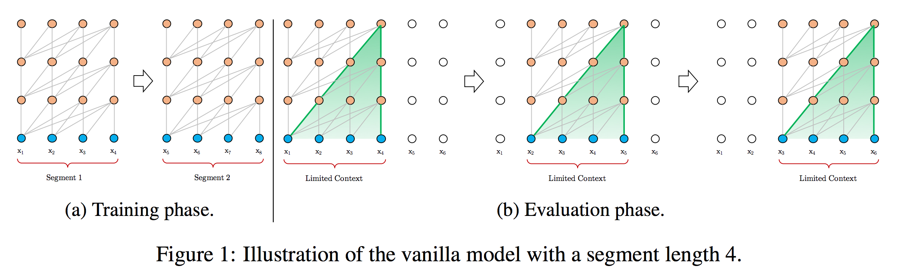
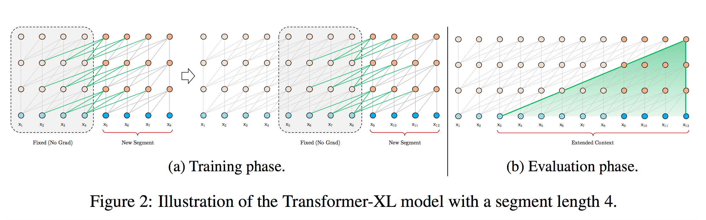

目录

<!-- TOC -->

- [对比论文](#对比论文)
- [模型架构](#模型架构)
    - [原始transformer](#原始transformer)
    - [transformer-xl](#transformer-xl)

<!-- /TOC -->

参考[谷歌、CMU重磅论文：Transformer升级版，评估速度提升超1800倍！](https://mp.weixin.qq.com/s?__biz=MzI3MTA0MTk1MA==&mid=2652036193&idx=3&sn=9d2953603e864f124d96944964adf7a4&chksm=f121a890c65621869557432255957ece686a434d0f30c67b8dbc18efdc306f73fad9850da944&mpshare=1&scene=1&srcid=0113pKJ1LJ0Kc8iZHYGhjsZF&pass_ticket=GbqnkzYDgSDQxJoviNYzckA8ZJ6bULsWpoyug4CHgCsT0B80C5nEC38bRj4CywCT#rd)

[Transformer-XL: Attentive Language Models Beyond a Fixed-Length Context](https://arxiv.org/pdf/1901.02860.pdf)

github：[https://github.com/kimiyoung/transformer-xl](https://github.com/kimiyoung/transformer-xl)

Transformer网络具有学习较长期依赖关系的潜力，但是在语言建模的设置中受到**固定长度上下文**(fixed-length context)的限制。

Transformer-XL使Transformer能够在不破坏时间一致性的情况下学习固定长度以外的依赖性。它由一个**segment-level**的**递归机制**和一种**新的位置编码**方案组成。这一方法不仅能够捕获长期依赖关系，而且**解决了上下文碎片**的问题。

Transformer-XL学习的依赖关系比RNN长80%，比vanilla Transformer长450%，在**短序列和长序列上都获得了更好的性能**，并且在**评估**中比**vanilla Transformer快1800+倍**。

Transformer-XL在5个数据集上都获得了强大的结果。研究人员在enwiki8上将bpc/perplexity的最新 state-of-the-art(SoTA)结果从1.06提高到0.99，在text8上从1.13提高到1.08，在WikiText-103上从20.5提高到18.3，在One Billion Word, 上从23.7提高到21.8，在Penn Treebank上从55.3提高到54.5。

## 对比论文

[Character-level language modeling with deeper self-attention](https://arxiv.org/pdf/1808.04444.pdf)

这篇论文在char-level的语言模型中，用了很深的transformer(64层)…

## 模型架构

**不再从头开始计算**每个**新的段(segment)**的隐藏状态，而是**重用**(reuse)在**前一段中获得的隐藏状态**。被重用的隐藏状态用作当前段的memory，这就在段之间建立一个**循环连接**。提出了一个简单但更有效的**相对位置编码公式**，该公式可以推广到比训练中观察到的更长的attention lengths。

因此：

+ 建模**非常长期的依赖关系**成为可能，因为信息可以通过循环连接传播
+ 从上一段传递信息也可以**解决上下文碎片**(context fragmentation)的问题。
+ 展示了使用**相对位置编码**而不是绝对位置编码的必要性，以便在不造成时间混乱的情况下**实现状态重用**。

### 原始transformer

为了将Transformer或self-attention应用到语言建模中，核心问题是如何训练Transformer有效地将**任意长的上下文**编码为**固定大小的表示**。

给定**无限内存和计算**，一个简单的解决方案是使用无条件Transformer解码器**处理整个上下文序列**，类似于前馈神经网络。然而，在实践中，由于资源有限，这通常是不可行的。

<html>
 

 
</html>

一种可行但比较粗略的近似方法是将**整个语料库**分割成**可管理大小**的**更短的片段**，只在**每个片段中训练模型**，**忽略**来自**前一段的所有上下文信息**。这是上面讲到的[对比论文](xx)提出的想法，我们称之为原始模型(vanilla model)，它的图示如图1a。

在**评估**过程中，vanilla 模型在每个步骤都消耗与训练期间相同长度的一个segment，但是**在最后一个位置**只是进行**一次**预测。然后，在**下一步**中，这个segment**只向右移动一个位置**，**新的segment必须从头开始**处理。

如图1b所示，该过程保证了每个预测在训练过程中**利用的上下文尽可能长**，同时也**缓解了**训练过程中遇到的**上下文碎片**问题。然而，这个**评估过程成本是非常高的**。

### transformer-xl

为了解决固定长度上下文的局限性，我们在Transformer架构中引入一种**递归机制(recurrence mechanism)**。

<html>
 

 
</html>

在训练过程中，对**上一个segment**计算的**隐藏状态序列**进行**fixed和cached**，并在模型**处理下一个新的segment时**将其缓存为可重用的扩展上下文，如图2a所示。

这种递归机制应用于整个语料库的**每两个连续的segment**，它本质上是在隐藏状态中创建一个**segment-level的递归**。因此，所使用的有效上下文可以远远超出两个segments。

除了实现超长的上下文和解决碎片问题外，这种递归方案的另一个好处是**显著加快了评估速度**。

具体地说，在评估期间，可以重用前面部分的表示，而不是像普通模型那样从头开始计算。在enwiki8数据集的实验中，Transformer-XL在评估过程比普通模型快1800倍以上。
