<!-- TOC -->

- [Introduction](#introduction)
- [part1-Node Representation Learning](#part1-node-representation-learning)
  - [Node Representation Methods](#node-representation-methods)
    - [LINE](#line)
      - [一阶相似度](#%E4%B8%80%E9%98%B6%E7%9B%B8%E4%BC%BC%E5%BA%A6)
      - [二阶相似度](#%E4%BA%8C%E9%98%B6%E7%9B%B8%E4%BC%BC%E5%BA%A6)
      - [优化trick](#%E4%BC%98%E5%8C%96trick)
      - [讨论](#%E8%AE%A8%E8%AE%BA)
      - [实验](#%E5%AE%9E%E9%AA%8C)
    - [DeepWalk](#deepwalk)
    - [Node2vec](#node2vec)
  - [Graph and High-dimensional Data Visualization](#graph-and-high-dimensional-data-visualization)
    - [t-SNE](#t-sne)
    - [Visualizing Large-scale and High-dimensional Data](#visualizing-large-scale-and-high-dimensional-data)
      - [Learning the Layout of KNN Graph](#learning-the-layout-of-knn-graph)
      - [A Probabilistic Model for Graph Layout](#a-probabilistic-model-for-graph-layout)
  - [Knowledge Graph Embedding](#knowledge-graph-embedding)
    - [relation patterns](#relation-patterns)
    - [RotatE](#rotate)
      - [Relation as Elementwise Rotation in Complex Space](#relation-as-elementwise-rotation-in-complex-space)
      - [RoteE的优化](#rotee%E7%9A%84%E4%BC%98%E5%8C%96)
  - [A High-performance Node Representation System](#a-high-performance-node-representation-system)
- [part2-Graph Neural Networks](#part2-graph-neural-networks)
  - [基础知识](#%E5%9F%BA%E7%A1%80%E7%9F%A5%E8%AF%86)
      - [Neighborhood Aggregation](#neighborhood-aggregation)
  - [Graph Convolutional Networks(GCN)](#graph-convolutional-networksgcn)
  - [GraphSAGE](#graphsage)
  - [Gated Graph Neural Networks](#gated-graph-neural-networks)
    - [Gated Graph Neural Networks介绍](#gated-graph-neural-networks%E4%BB%8B%E7%BB%8D)
    - [Message-Passing Neural Networks介绍](#message-passing-neural-networks%E4%BB%8B%E7%BB%8D)
  - [Graph Attention Networks(GAT)](#graph-attention-networksgat)
  - [Subgraph Embeddings](#subgraph-embeddings)
- [part3-Deep Generative Models for Graph Generation](#part3-deep-generative-models-for-graph-generation)
  - [深度生成模型](#%E6%B7%B1%E5%BA%A6%E7%94%9F%E6%88%90%E6%A8%A1%E5%9E%8B)
    - [Variational Autoencoders (VAEs)](#variational-autoencoders-vaes)
    - [Generative Adversarial Networks (GANs)](#generative-adversarial-networks-gans)
    - [Deep Auto-regressive Models](#deep-auto-regressive-models)
  - [GraphVAE](#graphvae)
  - [JTVAE](#jtvae)
  - [MolGAN](#molgan)
  - [GCPN](#gcpn)
- [未来方向](#%E6%9C%AA%E6%9D%A5%E6%96%B9%E5%90%91)

<!-- /TOC -->

参考AAAI2019的tutorial：[AAAI2019《图表示学习》Tutorial, 180 页 PPT 带你从入门到精通（下载）](https://mp.weixin.qq.com/s?__biz=MzI3MTA0MTk1MA==&mid=2652037887&idx=4&sn=730e6bd0cce6c3e40f4aec2de190f99d&chksm=f121960ec6561f1842640aff963fbe609e52fdd695386a442a9726016551c0a3697a196fd5a1&mpshare=1&scene=1&srcid=0202IYksgop7SmowGXrFkpMV&pass_ticket=IHFhi51iDztgrpluZGaofR7zoGSfaB%2F4Y6iACEc6lvxZ3KgGvbkA%2Fhp2MAVH09RS#rd)

ppt下载：[https://pan.baidu.com/s/1hRjm1nbMcj4_ynZ0niE2JA](https://pan.baidu.com/s/1hRjm1nbMcj4_ynZ0niE2JA)

传统的机器学习方法依赖于用户定义的启发式模型来提取关于图的结构信息的特征编码 (例如，degree statistics或核函数)。然而，近年来，使用基于深度学习和非线性降维的技术，自动学习将**图结构**编码为**低维embedding**的方法激增。

## Introduction

graph的几大传统ml任务：

+ **Node classification**：预测给定的结点的type
+ **Link prediction**：预测两个结点是否有边相连
+ **Community detection**：发现联系紧密的nodes的clusters
+ **Network similarity**：两个（子）网是否相似

目前的深度学习：

+ cnn：固定大小的图片/网格
+ rnn/w2v：文本/序列

图更加复杂：

+ 复杂的拓扑结构（例如，不像网格那样有spatial locality(空间局部性，在最近的将来将用到的信息很可能与现在正在使用的信息在**空间地址上是临近的**。)）
+ 没有固定的结点顺序或者参考点（reference point）(例如，isomorphism（同构）问题)
+ 经常是动态的并且有multimodal（多模态）的features

## part1-Node Representation Learning

### Node Representation Methods

问题定义：给定`\(G=(V,E,W)\)`，其中，`\(V\)`是结点集合，`\(E\)`是边的集合，`\(W\)`是**边**的权重集合。所谓的node embedding就是对结点`\(i\)`学习一个向量`\(u_i\in R^d\)`。

相关工作：

+ 传统graph embedding算法：MDS, IsoMap, LLE, Laplacian Eigenmap, ...。缺点：hard to scale up
+ Graph factorization(Ahmed et al. 2013)：只适用于无向图，并非专门为网络表示而设计
+ Neural word embeddings(Bengio et al. 2003)：Neural language model；word2vec (skipgram), paragraph vectors, etc.

#### LINE

WWW2015上的[LINE: Large-scale Information Network Embedding](http://www.www2015.it/documents/proceedings/proceedings/p1067.pdf)

LINE代码（c++）：[https://github.com/tangjianpku/LINE](https://github.com/tangjianpku/LINE)

特点：

+ 任意类型的网络（有向图、无向图、有/无权重）
+ 明确的目标函数（一阶和二阶相似性（first/second proximity））
+ 可扩展性
    + 异步sgd
    + 百万级的结点和十亿级别的边：单机数小时

##### 一阶相似度

**First-order Proximity（一阶相似度）**：两个**顶点之间**的**自身**相似（不考虑其他顶点）。因为有些结点的link并没有被观测到，所以一阶相似度不足以保存网络结构。

分布：(定义在**无向**边`\(i-j\)`上)

一阶相似度的经验分布：

`\[
\hat{p_1}(v_i,v_j)=\frac{w_{ij}}{\sum_{(m,n)\in E}w_{mn}}
\]`

一阶相似度的模型分布：

`\[
p_1(v_i,v_j)=\frac{\exp(\vec{u_i}^T\vec{u_j})}{\sum_{(m,n)\in V\times V}\exp(\vec{u_m}^T\vec{u_n})}
\]`

其中，`\(\vec{u_i}\)`是节点`\(i\)`的embedding，其实就是sigmoid：

`\[
p_1(v_i,v_j)=\frac{1}{1+\exp(-\vec{u_i}^T\vec{u_j})}
\]`

目标函数是**KL散度**：

`\[
O_1=KL(\hat{p_1},p_1)
\]`

干掉常量`\(\sum_{(m,n)\in E}w_{mn}\)`，还有`\(\sum _{(i,j)\in E}w_{ij}\log w_{ij}\)`之后：

`\[
O_1=\sum _{(i,j)\in E}w_{ij}\log w_{ij}-\sum _{(i,j)\in E}w_{ij}\log p_1(v_i,v_j)\approx -\sum _{(i,j)\in E}w_{ij}\log p_1(v_i,v_j)
\]`

只考虑一阶相似度的情况下，改变同一条边的方向对于最终结果没有什么影响。因此一阶相似度只能用于**无向图**，不能用于有向图。

##### 二阶相似度

**Second-order Proximity（二阶相似度）**：网络中一对顶点`\((u,v)\)`之间的二阶相似度是它们**邻近网络结构**之间的相似性。

分布：(定义在**有向**边`\(i\rightarrow j\)`上)

邻近网络的经验分布：

`\[
\hat{p_2}(v_j|v_i)=\frac{w_{ij}}{\sum_{k\in V}w_{ik}}
\]`

邻近网络的模型分布，其中，`\(u_i\)`是`\(v_i\)`被视为顶点时的表示，`\(u'_i\)`是`\(v_i\)`被视为"context"时的表示：

`\[
p_2(v_j|v_i)=\frac{\exp(\vec{u'_j}^T\vec{u_i})}{\sum_{k\in V}\exp(\vec{u'_k}^T\vec{u_i})}
\]`

目标函数是**KL散度**：

`\[
O_2=\sum_i KL(\hat{p_2}(\cdot |v_i),p_2(\cdot|v_i))=-\sum _{(i,j)\in E}w_{ij}\log p_2(v_j|v_i)
\]`

##### 优化trick

+ sgd+negative sampling：随机sample一条边，以及多个negative的边

例如针对二阶的，对每条边`\((i,j)\)`来说，它的目标函数就是：

`\[
\log \sigma(\vec{u'_j}^T\vec{u'_i})+\sum ^K_{i=1}E_{v_n\sim P_n(v)}[\log \sigma (-\vec{u'_n}^T\vec{u_i})]
\]`

其中`\(\sigma(x)=1/(1+\exp(-x))\)`，设置`\(P_n(v)\propto d_v^{3/4}\)`，其中`\(d_v\)`是节点的出度（即`\(d_i=\sum _{k\in N(i)}w_{ik}\)`，其中`\(N(i)\)`是`\(v_i\)`的为起点的邻居的集合）。

针对一阶的，把上面式子里的第一项里的`\(\vec{u'_j}^T\)`换成`\(\vec{u_j}^T\)`就行啦~

+ 边`\((i,j)\)`的embedding的梯度：

`\[
\frac{\partial O_2}{\partial \vec{u_i}}=w_{ij}\frac{\partial \log \hat{p_2}(v_j|v_i)}{\partial \vec{u_i}}
\]`

+ 当边的权重方差很大的时候，从上式可知，目标函数的梯度是`\(p_2\)`的梯度再乘以边权重，所以目标函数的梯度的方差也会很大，这样会有问题。
+ 解决方法：**edge sampling**：根据边的权重来采样边，然后把采样到的边当成binary的，也就是把每条边的权重看成一样的！(例如一个边的权重是`\(w\)`，那么拆成`\(w\)`条binary的边)
+ 复杂度：`\(O(d\times K \times |E|)\)`：`\(d\)`是embedding的维数，`\(K\)`是负样本的个数，`\(|E|\)`是边的总数

##### 讨论

+ 对只有少量邻居的节点（low degree vertices）进行embed：
    + 通过增加高阶邻居来扩展邻居
    + BFS(breadth-first search)，使用广度优先搜索策略扩展每个顶点的邻域，即递归地添加邻居的邻居
    + 在大部分场景下，只增加二阶邻居就足够了
+ 对新节点进行emb（如果新节点和已有节点有边相连，可以如下方式来搞；否则，future work...）:
    + 保持现有节点的embedding不变
    + 根据新节点的embedding求经验分布和模型分布，从而优化目标函数 w.r.t. 新node的embedding

所以，对于新节点`\(i\)`，直接最小化如下目标函数：

`\[
-\sum_{j\in N(i)}w_{ji}\log p_1(v_j,v_i)
\]`

或者

`\[
-\sum _{j\in N(i)}w_{ji}\log p_2(v_j|v_i)
\]`

##### 实验

LINE(1st)只适用于无向图，LINE(2nd)适用于各种图。

LINE (1st+2nd)：同时考虑一阶相似度和二阶相似度。将由LINE（1st）和LINE（2nd）学习得到的两个向量表示，**连接成一个更长的向量**。在连接之后，对维度**重新加权**以**平衡两个表示**。因为在无监督的任务中，设定权重很困难，所以**只应用于监督学习**的场景。

更适合的方法是共同训练一阶相似度和二阶相似度的目标函数，比较复杂，文章中没有实现。

#### DeepWalk

KDD14上的[DeepWalk: Online Learning of Social Representations](http://www.perozzi.net/publications/14_kdd_deepwalk.pdf)

使用学习word representation的方法来学习node representation（例如skip gram）

将网络上的随机游走视为句子。

分成两步：

+ 通过随机游走生成结点的context
+ 预测周围的节点:

`\[
p(v_j|v_i)=\frac{\exp(\vec{u'_i}^T \vec{u_j})}{\sum _{k\in V}\exp(\vec{u'_k}^T\vec{u_i})}
\]`

#### Node2vec

KDD16上的[node2vec: Scalable Feature Learning for Networks](https://cs.stanford.edu/people/jure/pubs/node2vec-kdd16.pdf)

通过如下混合策略去寻找一个node的context：

+ Breadth-firstSampling(BFS): homophily（同质性）
+ Depth-firstSampling(DFS): structuralequivalence（结构等价）

使用带有参数`\(p\)`和`\(q\)`的**Biased Random Walk**来进行context的扩展，在BFS和DFS中达到一个平衡，同时考虑到微观局部(BFS)和宏观全局(DFS)的信息，并且具有很高的适应性：

+ `\(p\)`：Return parameter，控制在walk的过程中，**revisit**一个节点的概率，对应BFS
+ `\(q\)`：In-out parameter，控制探索"**outward**"节点的概率，对应DFS
+ 在有标签的数据上，用**cross validation**来寻找最优的`\(p\)`和`\(q\)`

<html>
 
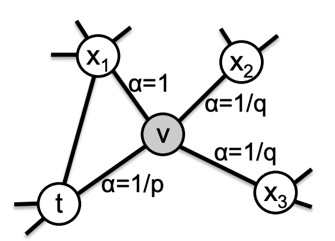
 
</html>

刚从edge`\((t,v)\)`过来，现在在节点`\(v\)`上，要决定下一步`\((v,x)\)`怎么走：

`\[
\alpha _{pq}(t,x)=\left\{\begin{matrix}
\frac{1}{p}&if\ d_{tx}=0\\ 
1 &if\ d_{tx}=1\\ 
\frac{1}{q}&if\ d_{tx}=2
\end{matrix}\right.
\]`

其中的`\(d_{tx}\)`表示节点`\(t\)`到节点`\(x\)`间的最短路径：

+ 为0表示回到节点`\(t\)`本身
+ 为1表示节点`\(t\)`和节点`\(x\)`直接相连，但上一步却选择了节点`\(v\)`
+ 为2表示节点`\(t\)`和`\(x\)`不直接相连，但节点`\(v\)`和节点`\(x\)`直接相连

最简单的给random walk加上bias的方法就是转移概率`\(\pi _{vx}=w_{vx}\)`，而我们的方法就是`\(\pi _{vx}=\alpha _{pq}(t,x)w_{vx}\)`，相当于还考虑了跳到`\(v\)`之前的节点`\(t\)`。

优化目标和LINE的**一阶相似度**类似

LINE、DeepWalk、Node2vec的对比：

<html>
 
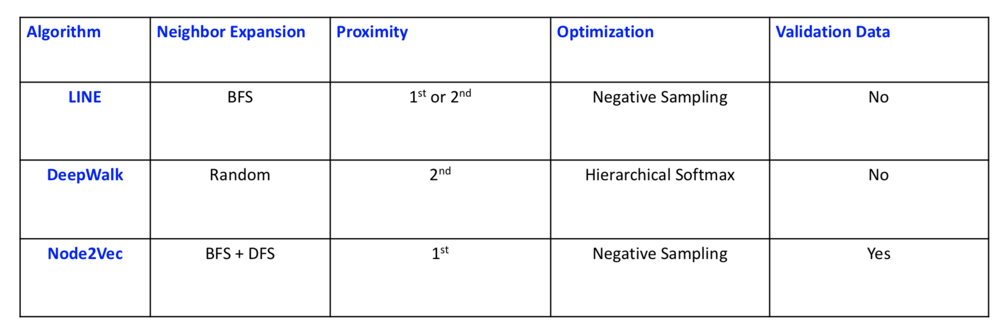
 
</html>

node representation的应用：

+ Node **classification** (Perozzi et al. 2014, Tang et al. 2015a, Grover et al. 2015 )
+ Node **visualization** (Tang et al. 2015a)
+ **Link** prediction (Grover et al. 2015)
+ **Recommendation** (Zhao et al. 2016)
+ **Text** representation (Tang et al. 2015a, Tang et al. 2015b)

node representation的扩展：

+ Leverage **global structural information** (Cao et al. 2015)
+ Non-linear methods based on **autoencoders** (Wang et al. 2016) • Matrix-factorization based approaches (Qiu et al. 2018)
+ **Directed** network embedding (Ou et al. 2016)
+ **Signed** network embedding (Wang et al. 2017)
+ **Multi-view** networks ( Qu and Tang et al. 2017)
+ Networks with **node attributes** (Yang et al. 2015)
+ **Heterogeneous(异构)** networks (Chang et al. 2015)
+ **Task-specific** network embedding (Chen et al. 2017)

### Graph and High-dimensional Data Visualization

#### t-SNE

高维数据可视化的一个state-of-the-art的方法，tensorboard就用的这个。

缺点：

+ K-NNG(K-Nearest Neighbor Graph) construction: 复杂度是`\(O(NlogN)\)`，假设图中有`\(N\)`个数据点
+ Graph layout: 复杂度是`\(O(NlogN)\)`
+ 对参数非常敏感（Very sensitive parameters）

#### Visualizing Large-scale and High-dimensional Data

www16的best paper提名[Visualizing Large-scale and High-dimensional Data](https://arxiv.org/abs/1602.00370)

largevis代码（c++&python）：[https://github.com/lferry007/LargeVis](https://github.com/lferry007/LargeVis)

特点：

+ K-NNG construction的高效近似：
    + 比t-SNE的速度快30倍（300w的数据点）
    + 更好的time-accuracy tradeoff
+ graph layout的高效的probabilistic model
    + 从`\(O(NlogN)\)`到`\(O(N)\)`
    + 比t-SNE快7倍（300w的数据点）
    + 更好的visualization layouts
    + 在不同数据集间有更stable的参数

##### Learning the Layout of KNN Graph

+ 保持2D/3D空间的节点的相似度
    + 对每个节点使用一个2D/3D的向量来表示
    + 保持相似的数据距离近而不相似的距离远
+ 观测节点`\((i,j)\)`间的一条**binary**的边的概率：

`\[
p(e_{ij}=1)=\frac{1}{1+\left \|\vec{y_i}-\vec{y_j}\right \|^2}
\]`

+ 观测节点`\((i,j)\)`间的一条**有权重**的边的likelihood：

`\[
p(e_{ij}=w_{ij})=p(e_{ij}=1)^{w_{ij}}
\]`

##### A Probabilistic Model for Graph Layout

目标函数：

`\[
O=\prod _{(i,j)\in E}p(e_{ij}=w_{ij})\prod _{(i,j)\in \bar{E}}(1-p(e_{ij}=w_{ij})^{\gamma }
\]`

其中`\(\gamma\)`是给**negative edge**赋值的**unified weight**

+ 随机sample一些negative edges
+ 使用异步sgd来优化
+ 时间复杂度：与数据点数是**线性**关系

### Knowledge Graph Embedding

知识图谱是异构图，有多种类型的relations

用(head entity, relation, tail entity)的三元组来表示facts的集合。

related works：

+ 将entities用embeddings来表示
+ 将relations用embeddings或者matrices来表示

<html>
 
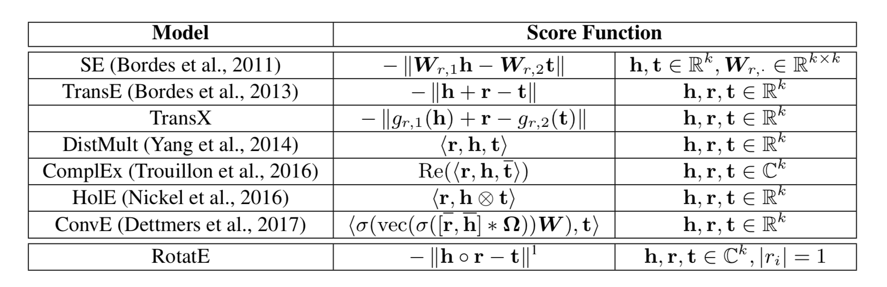
 
</html>

kg的核心任务：预测missing links

kg的核心idea：根据观测到的knowledge facts，对kg中的relation patterns进行建模和infer。也就是学习**relations的relations**。

#### relation patterns

+ 对称和反对称：
    + 对称(Symmetric)：例如，marriage
    + 反对称(Antisymmetric)：例如，Filiation(父子关系)

形式化定义：

`\[
\begin{matrix}
r\ is\ Symmetric & r(x,y)\Rightarrow r(y,x)\ if\ \forall x,y\\ 
r\ is\ Antisymmetric & r(x,y)\Rightarrow \neg r(y,x)\ if\ \forall x,y\\ 
\end{matrix}
\]`   

+ Inverse relations:
    + Hypernym(上位词) and hyponym(下位词)：花是鲜花的上位词，鲜花是花的下位词
    + 丈夫和妻子

形式化定义：

`\[
r_1\ is\ inverse\ to\ relation\ r_2:\ r_2(x,y)\Rightarrow r_1(y,x)\ if\ \forall x,y
\]`

+ Composition Relations
    + My mother’s husband is my father

形式化定义：

`\[
\begin{matrix}
r_1\ is\ a\ composition\ of\ relation\ r_2\ and\ relation\ r_3: & \ r_2(x,y)\wedge r_3(y,z) \Rightarrow r_1(x,z)\ if\ \forall x,y,z
\end{matrix}
\]`

目前的方法没有一种能同时infer上面这所有3种relation patterns，只有RotatE可以！！

<html>
 
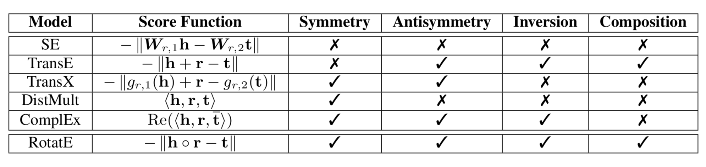
 
</html>

#### RotatE

ICLR19 [RotatE: Knowledge Graph Embedding by Relational Rotation in Complex Space.](https://openreview.net/pdf?id=HkgEQnRqYQ)

RotatE代码（pytorch）:[https://github.com/DeepGraphLearning/KnowledgeGraphEmbedding](https://github.com/DeepGraphLearning/KnowledgeGraphEmbedding)

每一个relation可以看成是从source entity到target entity在complex(复数)向量空间上的elementwise rotation

RotatE可以同时建模和infer上面这所有3种relation patterns

优化RotatE可以用高效的negative sampling

在kg的link prediction的benchmarks中能达到state-of-the-art的效果

##### Relation as Elementwise Rotation in Complex Space

head entity：`\(h\in \mathbb{C}^k\)`；tail entity：`\(t\in \mathbb{C}^k\)`

relation `\(r\)`：是一个从`\(h\)`到`\(t\)`的elementwise rotation：

`\[
t=h\circ r,\ where\ |r_i|=1
\]`

其中，`\(\circ\)`是element-wise product，所以`\(t_i=h_ir_i\)`，其中

`\[
r_i=e^{\mathbf{i}\theta _{r,i}}
\]`

里面的`\(\theta _{r,i}\)`是`\(r\)`的第`\(i\)`维的phase angle，e的`\(\mathbf{i}\theta_{r,i}\)`的第一个`\(\mathbf{i}\)`是虚数单位，第二个`\(i\)`是第i维。

定义distance function：

`\[
d_r(h,t)=\left \| h\circ r-t \right \|
\]`

+ 如左图，transE建模的是`\(h+r\)`和`\(t\)`的距离，也就是在**实数直线**上以**translation**的方式建模`\(r\)`；
+ 如右图，RotatE建模的是`\(h\circ r\)`和`\(t\)`的距离，也就是在**复平面**上以**rotation**的方式建模`\(r\)`。

<html>
 
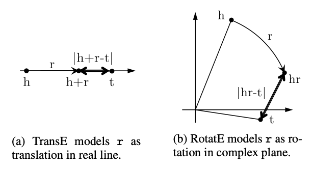
 
</html>

先科普一下，在复变函数中，自变量`\(z\)`可以写成`\(z=r\times (\cos \theta + \mathbf{i}\sin \theta)\)`，`\(r\)`是`\(z\)`的模，即`\(r=|z|\)`；`\(\theta\)`是`\(z\)`的辐角，记作`\(Arg(z)\)`。在`\(-\pi\)`到`\(\pi\)`间的辐角称为辐角主值，记作`\(arg(z)\)`。指数形式`\(z=r(\cos \theta + i\sin \theta)=re^{\mathbf{i}\theta}\)`。

+ relation `\(r\)`是对称的，当且仅当，`\(r_i=\pm 1\)`，也就是`\(\theta_{r,i}=0\ or\ \pi\)`，例如下图，`\(r_i=-1\)`也就是`\(\theta _{r,i}=\pi\)`

<html>
 
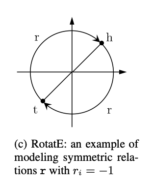
 
</html>

+ relation `\(r\)`是反对称的，当且仅当，`\(r\circ r\neq 1\)`
+ relation `\(r_1\)`和`\(r_2\)`是inverse，当且仅当，`\(r_2=r^{-1}_1\)`，也就是`\(\theta _{2,i}=-\theta _{1,i}\)`
+ relation `\(r_3=e^{\mathbf{i}\theta_3}\)`是两个relation `\(r_1=e^{\mathbf{i}\theta_1}\)`和`\(r_2=e^{\mathbf{i}\theta_2}\)`的composition，当且仅当，`\(r_3=r_1\circ r_2\)`，也就是`\(\theta _3=\theta _1 + \theta _2\)`

##### RoteE的优化

Negative sampling loss如下：

`\[
L=-\log\sigma (\gamma -d_r(h,t))-\sum ^k_{i=1}\frac{1}{k}\log \sigma (d_r(h'_i,t'_i)-\gamma)
\]`

其中的`\(\gamma\)`是一个fixed margin，`\(\sigma\)`是sigmoid，`\((h'_i,r,t'_i)\)`是第`\(i\)`个negative三元组。

然后我们要变成self-adversarial negative sampling：

+ 传统地，负样本通过uniform的方式（均匀分布，即等概率）来采样
    + 随着训练的继续，因为很多样本是obviously false了，所以这种采样是inefficient的
    + 没有提供有用的信息
+ self-adversarial negative sampling：
    + 根据当前的embedding model来进行negative三元组的采样
    + 从更简单的samples开始，逐步变难
    + Curriculum Learning（递进学习，课程学习，可以参考[https://blog.csdn.net/qq_25011449/article/details/82914803](https://blog.csdn.net/qq_25011449/article/details/82914803)），从如下分布中进行采样：

`\[
p(h'_j,r,t'_j|\{(h_i,r_i,t_i)\})=\frac{\exp \alpha f_r(h'_j,t'_j)}{\sum _i \exp \alpha f_r(h'_i,t'_i)}
\]`

其中，`\(\alpha\)`是sampling的temperature，`\(f_r(h'_j,t'_j)\)`衡量三元组的salience(突出程度)

但在实际应用中，从上面这个分布去sample的代价是很大的，所以我们把这个概率直接作为负样本的权重，所以最终的loss如下：

`\[
L=-\log\sigma (\gamma -d_r(h,t))-\sum ^k_{i=1}p(h'_i,r,t'_i)\log \sigma (d_r(h'_i,t'_i)-\gamma)
\]`

### A High-performance Node Representation System

A High-Performance CPU-GPU Hybrid System for Node Embedding，投稿www19

algorithm and system co-design的一个node embeddings的系统

+ CPUs: online random walk generation
+ GPUs: training node embeddings
+ Efficient and effective collaboration strategies between CPUs and GPUs

比现有的系统快50倍，一个有100w节点的网络只要1min

## part2-Graph Neural Networks

### 基础知识

通过一个encoder函数`\(ENC\)`，把原始网络的结点`\(u\)`和结点`\(v\)`映射到embedding space的`\(d\)`维向量`\(z_u\)`和`\(z_v\)`，然后希望原空间的相似度和embedding space的相似度（例如内积）接近：

`\[
similarity(u,v)\approx z_v^Tz_u
\]`

之前的encoder是shallow的，也就是一个`\(Z\)`矩阵，使用embedding lookup，矩阵大小是node_num \* emb_dim。缺点如下：

+ **需要`\(O(|V|)\)`的参数**：每个node有自己的unique的embedding vector，**没有参数共享**！！
+ **Inherently "transductive"**：固有的『直推式』。也就是说，对于**训练中没有见过的结点**，不可能生成一个embedding
+ **没有包含节点feature**：很多图有一些我们必须要考虑和利用好的feature。

因此需要使用deeper的encoder，而这些更复杂的encoder也自带了similarity函数。

参考2017年的综述[Representation Learning on Graphs: Methods and Applications](https://arxiv.org/abs/1709.05584)

还有2005年的[The Graph Neural Network Model](https://ieeexplore.ieee.org/document/4700287/)

定义：

+ `\(G\)`：图
+ `\(V\)`：节点集合
+ `\(A\)`：邻接矩阵(假设是binary的)
+ `\(X\in R ^{m\times |V|}\)`：**节点features**的矩阵
    + 类别型的特征、文本、图像数据等
    + 节点度数、clustering coefficients(聚集系数，参考[https://blog.csdn.net/pennyliang/article/details/6838956](https://blog.csdn.net/pennyliang/article/details/6838956))等
    + Indicator vectors(例如，每个节点的one-hot vector)

##### Neighborhood Aggregation

核心思想：使用nn对节点的邻居的信息进行汇聚，生成这个节点的embedding

如下图：

+ node在每一层都有embedding
+ 模型的depth可以任意
+ 节点`\(u\)`在第0层的embedding是它的input-feature `\(x_u\)`

<html>
 
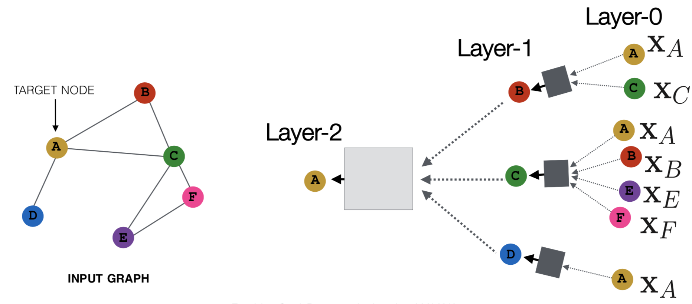
 
</html>

neighborhood aggregateion其实数学上和spectral graph convolutions(参考[Geometric deep learning: going beyond Euclidean data](https://arxiv.org/abs/1611.08097))很像，可以看成是一种center-surround filter。

关键在于上图的layer1和layer2用什么样的网络结构，一种basic的方法就是，layer2先average，然后再接一个神经网络：

`\[
\begin{align*}
h^0_v &=x_v \\ 
h^k_v &=\sigma (W_k\sum _{u\in N(v)}\frac{h^{k-1}_u}{|N(v)|}+B_kh^{k-1}_v) ,\forall k>0\\ 
z_v&=h^K_v\\
\end{align*}
\]`

+ `\(h^0_v\)`：第0层的embedding就是node的特征
+ `\(h^k_v\)`：第`\(k\)`层的embedding，包括的两项分别是邻居节点的前一层的emb的平均，还有当前节点的前一层的emb
+ `\(\sigma\)`：非线性，可以是relu/tanh等
+ `\(W_k\)`和`\(B_k\)`是两个待训练的矩阵
+ `\(z_v\)`：最终的输出结果，也就是第`\(K\)`层的输出

训练可以使用无监督的方法，loss可以是前面讲到的任意的node embedding的方法：

+ Random walks (node2vec, DeepWalk)
+ Graph factorization
+ 或者直接训练保证相似的node有相似的embedding

也可以直接用监督学习的方法来训（例如是一个node的分类问题），其中的`\(\theta\)`是classification weights：

`\[
L=\sum _{v\in V}y_v\log (\sigma (z^T_v\theta )+(1-y_v)\log(1-\sigma (z^T_v\theta)))
\]`

归纳能力（inductive capability）：

+ 所有节点共享相同的aggretation parameters
+ 模型参数是`\(|V|\)`的sublinear，而且可以对没见过的node生成embed

### Graph Convolutional Networks(GCN)

参考ICLR17的[Semi-Supervised Classification with Graph Convolutional Networks](https://arxiv.org/abs/1609.02907)

在neighborhood aggretagtion上有一些小改动：

`\[
h^k_v=\sigma(W_k\sum_{u\in N(v)\cup v}\frac{h^{k-1}_u}{\sqrt{|N(u)||N(v)|}})
\]`

和普通gnn的区别：

+ self和neighbor的embedding共用同一个权重`\(W_k\)`，而普通的gnn是两个权重`\(B_k\)`和`\(W_k\)`，好处就是有**更多的参数共享**
+ 每一个neighbor都有normalization(即`\(\sqrt{|N(u)||N(v)|}\)`)，好处就是可以**减小度数多的邻居的权重**

### GraphSAGE

参考NIPS17的[Inductive Representation Learning on Large Graphs](https://arxiv.org/abs/1706.02216)

出发点：把上面在aggretate之后使用的神经网络换成任意一个可以把一堆vectors映射成一个单独的vector的可微函数（也就是下面的`\(AGG(\{h^{k-1}_u,\forall u\in N(v)\})\)`）：

`\[
h^k_v=\sigma ([A_k\cdot AGG(\{h^{k-1}_u,\forall u\in N(v)\}),B_kh^{k-1}_v])
\]`

上面的`\([A_k\cdot AGG(\{h^{k-1}_u,\forall u\in N(v)\}),B_kh^{k-1}_v]\)`是把这self embedding和neighbor embedding这两个向量**concate**到一起。

AGG的变种：

+ mean：

`\[
AGG=\sum _{u\in N(v)}\frac{h^{k-1}_u}{|N(v)|}
\]`

+ pool：对neighbor vectors进行转换（例如下面的`\(Q\)`），并进行symmetric vector函数变换（例如下面的`\(\gamma\)`就是element-wise mean/max）

`\[
AGG=\gamma (\{Qh^{k-1}_u,\forall u \in N(v)\})
\]`

+ lstm：对neighbor的一个**随机排列**（random permutation）使用lstm

`\[
AGG=LSTM([h^{k-1}_u, \forall u\in \pi(N(v))])
\]`

### Gated Graph Neural Networks

参考ICLR16的[Gated Graph Sequence Neural Networks](https://arxiv.org/abs/1511.05493)

参考ICML17的[Neural Message Passing for Quantum Chemistry](https://arxiv.org/pdf/1704.01212.pdf)

GCNs和GraphSAGE大部分情况下只有**2-3层**深，层数加深有如下挑战：

+ 参数太多导致过拟合
+ bp的过程中出现梯度消失/爆炸

思路：

+ 层间参数共享
+ Recurrent state update：各层的神经网络使用RNN。

#### Gated Graph Neural Networks介绍

Recurrent state update这种方法分成两步：

+ 在step `\(k\)`从neighbors获取"message"，**这个聚合函数与`\(k\)`无关**：

`\[
m^k_v=W\sum _{u\in N(v)}h^{k-1}_u
\]`

+ 通过gru来更新节点的"state"。新节点的state依赖old state以及neighbors的"message"：

`\[
h^k_v=GRU(h^{k-1}_v,m^k_v)
\]`

优点：

+ 可以处理**20+的层数**
+ 绝大部分真实世界的网络有比较小的diameters（直径，放大倍率），**大部分小于等于7**
+ 能够将**global的图结构**的复杂信息传播给所有结点
+ 对复杂网络的表示很有用（例如Logical formulas，或者程序）

#### Message-Passing Neural Networks介绍

从以下两个方面来对gated graph neural networks进行泛化：

+ 在step `\(k\)`从neighbors获取"message"：

其中的`\(M\)`可以是一个一般(generic)的"message"函数，例如sum或者MLP。`\(e_{u,v}\)`把**边的信息**考虑进来了！

`\[
m^k_v=\sum _{u\in N(v)}M(h^{k-1}_u,h^{k-1}_v,e_{u,v})
\]`

+ 更新node的"state"：

其中的`\(U\)`可以是一个一般(generic)的"update"函数，例如LSTM或者GRU

`\[
h^k_v=U(h^{k-1}_v,m^k_v)
\]`

所以，其实这是一个通用的conceptual（概念性的） framework，可以归纳大部分GNNs。

### Graph Attention Networks(GAT)

参考ICLR18的[Graph Attention Networks](https://arxiv.org/pdf/1710.10903.pdf)

key idea：某些neighbor更重要，所以可以使用attention机制来搞

`\[
h^k_v=\sigma (\sum _{u\in N(v)\cup \{v\}}\alpha _{v,u}W^kh^{k-1}_u)
\]`

其中：

+ `\(\sigma\)`是非线性；
+ `\(\sum _{u\in N(v)\cup \{v\}}\)`意味着把所有neighbor(包括节点自己！！)都加起来
+ `\(\alpha _{v,u}\)`是学习到的attention权重

各种attention都是可以的，原始GAT用的是如下attention权重：

`\[
\alpha _{v,u}=\frac{\exp(LeakyReLU(a^T[Qh_v,Qh_u]))}{\sum _{u'\in N(v)\cup \{v\}}\exp(LeakyReLU(a^T[Qh_v,Qh_{u'}]))}
\]`

对照上面讲到的通用的conceptual（概念性的） framework，其实就是**把attention加到获取"message"那步里去**。

其他新的东西：

+ Generalizations based on spectral convolutions: 
    + Geometric Deep Learning (Bronstein et al., 2017, [Geometric deep learning: going beyond Euclidean data](https://arxiv.org/abs/1611.08097)) 
    + Mixture Model CNNs (Monti et al., 2017, [Geometric deep learning on graphs and manifolds using mixture model CNNs](https://arxiv.org/pdf/1611.08402.pdf))
+ Speed improvements via subsampling: 
    + FastGCNs (Chen et al., 2018, [FastGCN: Fast Learning with Graph Convolutional Networks via Importance Sampling](https://arxiv.org/abs/1801.10247))
    + Stochastic GCNs (Chen et al., 2017, [Stochastic Training of Graph Convolutional Networks with Variance Reduction](https://arxiv.org/abs/1710.10568))

### Subgraph Embeddings

+ 方法一：直接把子图中的node的emb进行sum或者avg

`\[
z_S=\sum _{v\in S}z_v
\]`

见2016年的[Convolutional Networks on Graphs for Learning Molecular Fingerprints](https://arxiv.org/abs/1509.09292)

+ 方法二：引入"virtual node"来表示子图，并走一个完整的gnn

如下图

<html>
 
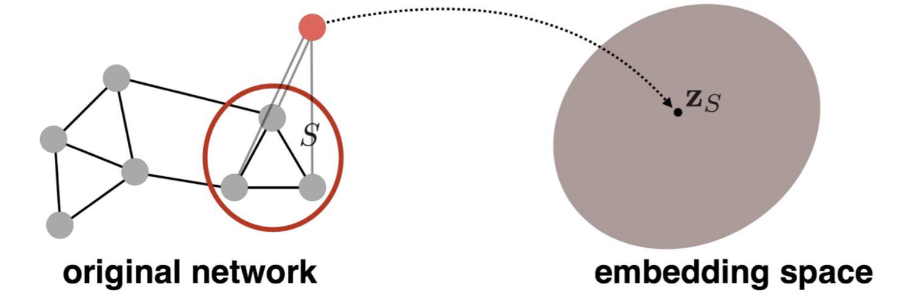
 
</html>

见2016年的[Gated Graph Sequence Neural Networks](https://arxiv.org/abs/1511.05493)

+ 方法三：对节点进行层次聚类

见2018年的[Hierarchical Graph Representation Learning with Differentiable Pooling](https://arxiv.org/pdf/1806.08804.pdf)

<html>
 
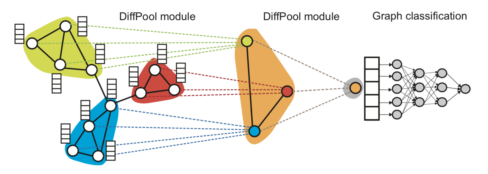
 
</html>

大致流程如下：

1. 在图上跑GNN，得到node的embeddings
1. 对node embeddings进行聚类，得到一个“coarsened” graph（粗糙的）
1. 在“coarsened” graph上跑GNN
1. 重复

学习clustering的不同方式：

+ 使用softmax weight的soft clustering（2018年的[Hierarchical Graph Representation Learning with Differentiable Pooling](https://arxiv.org/pdf/1806.08804.pdf)）
+ 使用hard clustering（2018年的[Towards Sparse Hierarchical Graph Classifiers](https://arxiv.org/pdf/1811.01287.pdf)和2018年的[GRAPH U-NET](https://openreview.net/pdf?id=HJePRoAct7)）

## part3-Deep Generative Models for Graph Generation

### 深度生成模型

深度生成模型的目标：为数据分布`\(p(x)\)`隐式或者显式地建模，`\(x\)`是一个高维随机变量

#### Variational Autoencoders (VAEs)

原始论文：2014年Kingma et al.的[Auto-Encoding Variational Bayes](https://arxiv.org/pdf/1312.6114.pdf)

Latent variable model: 

+ 一个encoder `\(q_{\phi}(z|x)\)`
+ 一个decoder `\(q_{\theta}(x|z)\)`

最大化log likelihood `\(\log p(x)\)`：inference是intractable（棘手）的，因为`\(z\)`是连续的

最大化variational的下界`\(L(\phi, \theta;x)\)`

通过reparametrization trick来jointly优化encoder和decoder：

`\[
L(\phi, \theta;x)=E_{q_{\phi}(z|x)}\log p_{\theta }(x|z)-KL[q_{\phi}(z|x)||p(z)]
\]`

其中的`\(E_{q_{\phi}(z|x)}\log p_{\theta }(x|z)\)`是reconstruction，`\(KL[q_{\phi}(z|x)||p(z)]\)`是regularization

<html>
 
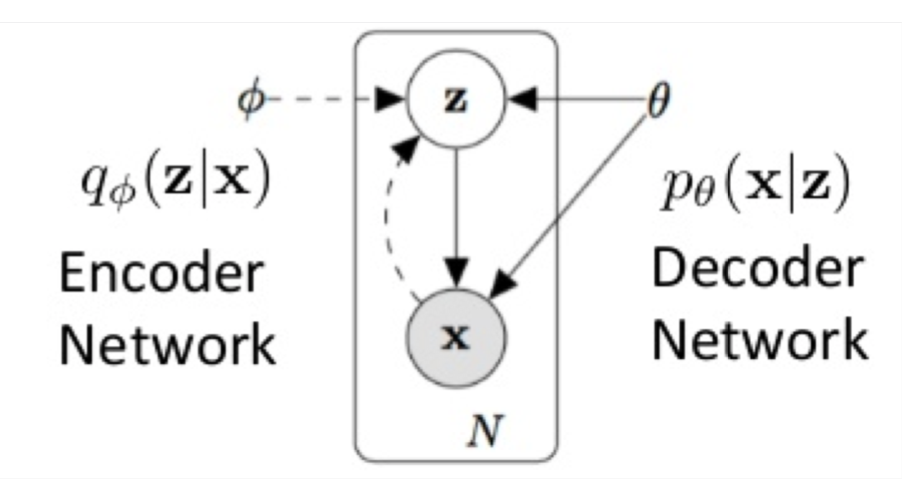
 
</html>

小结一下，encoder是`\(q_{\phi}\)`，decoder是`\(p_{\theta}\)`，encoder根据`\(x\)`生成`\(z\)`，decoder根据`\(z\)`生成`\(x\)`。

可以参考[https://blog.csdn.net/antkillerfarm/article/details/80648805](https://blog.csdn.net/antkillerfarm/article/details/80648805)

重构的过程是希望没噪声的，而KL loss则希望有高斯噪声的，两者是对立的。所以，VAE跟GAN一样，内部其实是包含了一个对抗的过程，只不过它们两者是混合起来，共同进化的。

公式推导可以看[https://blog.csdn.net/weixin_40955254/article/details/82315909](https://blog.csdn.net/weixin_40955254/article/details/82315909)

#### Generative Adversarial Networks (GANs)

原始论文：2014年Goodfellow et al.的[Generative Adversarial Networks](https://arxiv.org/abs/1406.2661)

一个两个玩家的Minimax游戏：

+ Generator `\(G: z\rightarrow x\)`。目标是迷惑discriminator
+ Discriminator `\(D: x\rightarrow \{0,1\}\)`。目标是区分真实数据和生成的数据

`\[
\underset{G}{\min}\underset{D}{\max}V(D,G)=E_{x\sim p_{data}(x)}[\log D(x)]+E_{z\sim p_z(z)}[\log (1-D(G(z)))]
\]`

直观地理解，这个式子包括两部分，一部分是判别真实数据是正例的概率，另一部分是判别生成的数据是负例的的概率，对于`\(G\)`来讲，期望这个式子min，而对于`\(D\)`来讲，期望这个式子max

#### Deep Auto-regressive Models

深度自回归模型：例如RNN

例如，PixelRNN（2016年Oort et al.的[Pixel Recurrent Neural Networks](https://arxiv.org/abs/1601.06759)）和PixelCNN（2016年也是Oort et al.的[Conditional Image Generation with PixelCNN Decoders](https://arxiv.org/pdf/1606.05328v2.pdf)）：

+ 一个pixel一个pixel地生成图像
+ 通过一个神经网络来对条件概率分布建模

WaveNet（2017年Oort et al.的[WaveNet: A Generative Model for Raw Audio](https://arxiv.org/abs/1609.03499)）

`\[
p(x)=\prod ^{n^2}_{i=1}p(x_i|x_1,...,x_{i-1})
 \]`

<html>
 
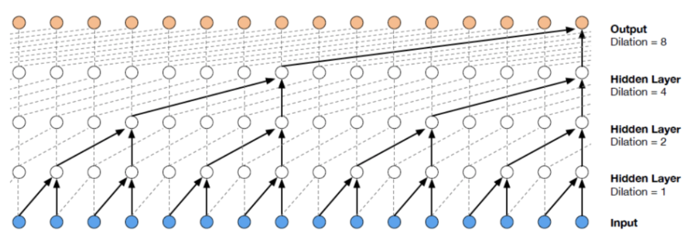
 
</html> 

但如果要用在图上，有以下几个挑战：

+ 图的structures和size是不一样的
+ node之间并没有顺序
+ 离散

### GraphVAE

2018年Simonovsky和Komodakis的[GraphVAE: Towards Generation of Small Graphs Using Variational Autoencoders](https://arxiv.org/abs/1802.03480)

提出了生成图的VAE的框架：

+ 输入graph
+ encoder：gnn+gated pooling=>graph representation，参考Li et al.在2015的
+ decoder：输出一个预先定义好max size的probalistic fully-connected graph
    + 对节点、边、节点和边的属性的存在性单独建模
    + graph matching是必须的

<html>
 
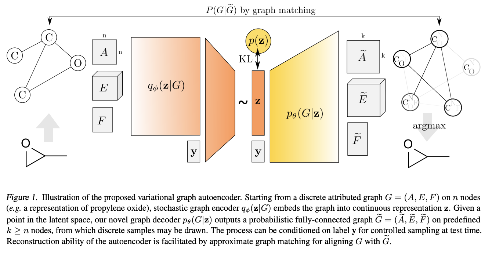
 
</html> 

输入的graph是`\(G=(A,E,F)\)`：`\(A\)`是邻接矩阵；`\(E\)`是边的属性的tensor；`\(F\)`是节点的属性的矩阵

decoder的输出：

+ 限制domain在最多max k个节点的所有graphs的集合中（k一般是10左右）
+ 一次输出一个k个节点的probalistic fully-connected graph `\(\tilde{G}=(\tilde{A},\tilde{E},\tilde{F})\)`
    + 以**bernoulli variables**建模nodes和edges的**existence**
    + 以**multinomial variables**建模nodes和edges的**attributes**
    + `\(\tilde{A}\in [0,1]^{k\times k}\)`：同时包括node probabilities `\(\tilde{A}_{aa}\)`和edge probabilities `\(\tilde{A}_{ab}\)`，其中`\(a\neq b\)`
    + `\(\tilde{E}\in [0,1]^{k\times k\times d_e}\)`：表示edge attributes的probabilities
    + `\(\tilde{F}\in [0,1]^{k\times d_e}\)`：表示node attributes的probabilities
+ inference：在`\(\tilde{A}\)`，`\(\tilde{E}\)`，`\(\tilde{F}\)`中使用edge-wise和node-wise的argmax
+ 计算reconstruction loss的时候，需要使用graph matching

缺点：

+ graph的max size必须是预先定义好的
+ graph matching是必须的

### JTVAE

[Junction Tree Variational Autoencoder for Molecular Graph Generation](https://arxiv.org/pdf/1802.04364.pdf)

+ 利用了化学领域的知识
    + 每个molecule(分子)可以表示为化学substructures(如环、键(bond))的树状的scaffold(骨架、支架)
+ 生成一个树状结构的object
    + 用来表示subgraph components的scaffold
+ 将substructure组装成一个coherent(连贯的) molecular graph

### MolGAN

[MolGAN: An implicit generative model for small molecular graphs](https://arxiv.org/pdf/1805.11973.pdf)

+ 一个implicit, likelihood-free的生成模型：用于分子生成
+ 结合了强化学习来encourage生成的带有化学属性的分子
+ Generator：从先验分布中生成分子
+ Discriminator：区分生成的sample和真实的sample
+ Reward network：
    + 学习给每个分子赋值一个reward，这个reward要和external software提供的score进行match
    + invalid的分子通常得到的reward是0

整体架构图如下：

<html>
 
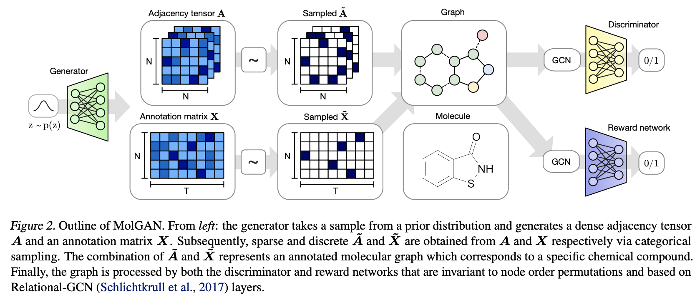
 
</html>

Generator：

+ 生成一个probabilistic fully-connected graph：
    + `\(X\in R^{N\times T}\)`：atom types
    + `\(A\in R^{N\times N\times Y}\)`：bond types
+ 目标函数：

`\[
L(\theta)=\lambda L_{WGAN}+(1-\lambda)L_RL
\]`

Discriminator & Reward network：

+ 通过neural message passing algorithm的一个变种-Relational-GCN，Schlichtkrull et al. 2017的[Modeling relational data with graph convolutional networks](https://arxiv.org/abs/1703.06103)来学习分子/graph的表示
+ discriminator和reward network用相同的网络结构（但参数不共享）
+ reward network用来近似external software的打分(使用真实的samples和生成的samples进行训练)

优缺点：

+ 不需要graph matching
+ graphs/分子的max size仍然需要预先定义

### GCPN

You et al.在2018的[Graph Convolutional Policy Network for Goal-Directed Molecular Graph Generation](https://arxiv.org/pdf/1806.02473.pdf)

+ 将分子的生成看成序列决策问题
    + 增加节点和边
    + 一个马尔可夫决策过程
+ 目标：发现分子式，能优化融入了chemical rules的特定的properties
+ GCPN：一个结合了RL的面向目标（goal-directed）的通用的model
    + 使用policy gradients来优化adversarial loss和domain-specific rewards
    + 能够在一个融入了domain-specific rules的environment中生效

整体架构图如下：

<html>
 
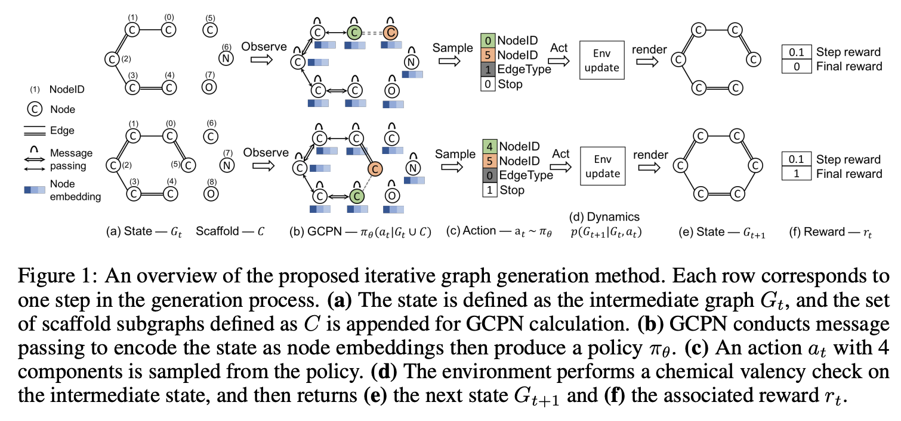
 
</html>

+ `\(M=(S,A,P,R,\gamma)\)`：
    + states `\(S=\{s_i\}\)`：包括所有intermediat和final graphs
    + actions `\(A=\{a_i\}\)`：每一个step对当前graph进行的修改
    + 状态转移概率`\(P\)`
    + reward函数`\(R\)`
    + discount factor `\(\gamma\)`
+ 状态空间：
    + `\(s_t\)`是中间生成的图`\(G_t\)`
    + `\(G_0\)`包括一个single node，表示一个carbon atom(碳原子)
+ 动作空间：
    + 每个step将要添加的一个atoms的集合：`\(C=\cup ^S_{i=1}C_i\)`
    + 具体的actions:
        + 把一个新的atom `\(C_i\)`连接到现有的`\(G_t\)`中的一个节点上去
        + 连接`\(G_t\)`内退出(exiting)的节点
+ state transition dynamics:
    + 在state transition dynamics中融入了domain-specific rules，只执行遵守规则的actions
    + policy network产生的infeasible(不可实行的)动作会被rejected，而state保持不变
+ Reward设计
    + final rewards：domain-specific rewards之和（例如，最终的property scores，对不真实的分子的惩罚，adversirial rewards）
    + intermediate rewards：step-wise validity(有效性) rewards和adversirial rewards
+ GCPN
    + 使用neural message passing算法计算节点的embeddings
    + 预测action：
        + 挑选两个节点
        + 预测边的类型
        + 预测是否结束（termination）

整体公式如下：

`\[
a_t=CONCAT(a_{first},a_{second},a_{edge},a_{stop})
\]`

其中

`\[
\begin{matrix}
f_{first}(s_t)=SOFTMAX(m_f(X)), & a_{first}\sim f_{first}(s_t)\in \{0,1\}^n \\ 
f_{second}(s_t)=SOFTMAX(m_s(X_{a_{first}},X)), & a_{second}\sim f_{second}(s_t)\in \{0,1\}^{n+c} \\ 
f_{edge}(s_t)=SOFTMAX(m_e(X_{a_{first}},X_{a_{second}})), & a_{edge}\sim f_{edge}(s_t)\in \{0,1\}^b \\ 
f_{stop}(s_t)=SOFTMAX(m_t(AGG(X))), & a_{stop}\sim f_{stop}(s_t)\in \{0,1\} \\ 
\end{matrix}
\]`

## 未来方向

参考[https://zhuanlan.zhihu.com/p/38142339](https://zhuanlan.zhihu.com/p/38142339)

主要想法：将relational的关系转化成attention，利用attention来代表两个entity的关系。隐式地将relational引入NN结构中

Zambaldi et al.在2018的[Relational deep reinforcement learning](https://arxiv.org/abs/1806.01830)