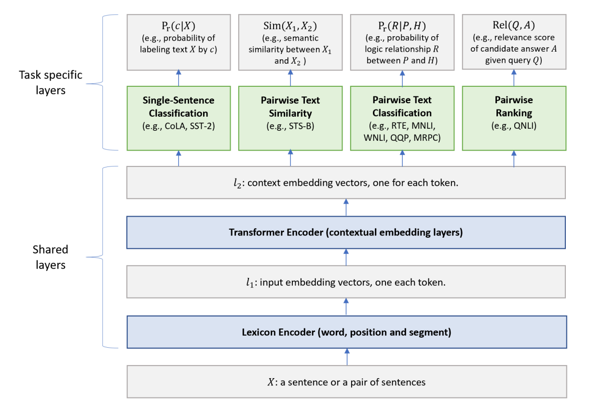

目录

<!-- TOC -->

<!-- /TOC -->

参考[GLUE排行榜上全面超越BERT的模型近日公布了！](https://mp.weixin.qq.com/s?__biz=MzA3MzI4MjgzMw==&mid=2650756988&idx=5&sn=c4f13f7ef8086fc92fd19542dcce68ff&chksm=871a9302b06d1a1424ab72319f439c1a5898a46c6c92409f75059f1c2de5ba1379052072d814&mpshare=1&scene=1&srcid=0317GFYlOPPmTLikracyQqtE&pass_ticket=y2lMhYAQVbFKus2ttT2YnbLDZ%2FT1PnWsH8UiDzyqogeTkFzFq2AWwaJREF2dZmiv#rd)

[Multi-Task Deep Neural Networks for Natural Language Understanding](https://arxiv.org/pdf/1901.11504.pdf)

<html>
 

 
</html>

较低层（即文本编码层）在所有任务中共享，而顶层是任务特定的，组合不同类型的 NLU 任务，如单句分类、pair文本分类、文本相似性和相关性排序。与BERT模型类似，MT-DNN分两个阶段进行训练：预训练和微调。与BERT不同的是，MT-DNN在微调阶段使用MTL，在其模型架构中具有多个任务特定层。

单词序列（可以是一句话或者打包在一起的句子对）作为输入X，先表示为一个嵌入向量序列，其中`\(l_1\)`中一个向量对应一个单词。然后 Transformer编码器通过自注意机制捕捉每个单词的语境信息，在`\(l_2\)`中生成语境嵌入序列。这就是多任务目标函数训练得到的共享语义表征。

