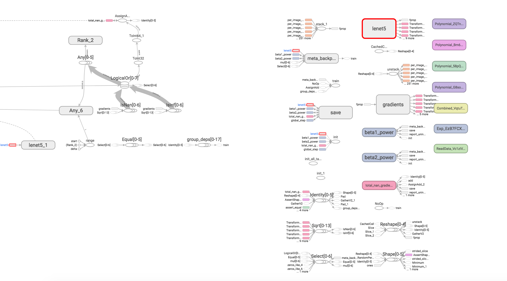

目录

<!-- TOC -->

- [安装及基本使用](#安装及基本使用)
    - [安装](#安装)
    - [跑lenet5](#跑lenet5)
    - [跑机器翻译](#跑机器翻译)
- [自定义参数和模型](#自定义参数和模型)
    - [自定义参数](#自定义参数)
- [现有模型](#现有模型)
    - [语音识别(asr, Automatic Speech Recogition)](#语音识别asr-automatic-speech-recogition)
    - [语言模型](#语言模型)
    - [机器翻译](#机器翻译)

<!-- /TOC -->


代码：[https://github.com/tensorflow/lingvo](https://github.com/tensorflow/lingvo)

论文：[Lingvo: a Modular and Scalable Framework for Sequence-to-Sequence Modeling](https://arxiv.org/abs/1902.08295)

Lingvo 是一个能够为协作式深度学习研究提供完整解决方案的 Tensorflow 框架，尤其关注序列到序列模型。Lingvo 模型由模块化构件组成，这些构件灵活且易于扩展，实验配置集中且可定制。分布式训练和量化推理直接在框架内得到支持，框架内包含大量 utilities、辅助函数和最新研究思想的现有实现。

设计原则如下：

+ 单个代码块应该精细且**模块化**，它们会使用相同的接口，同时也**容易扩展**；
+ 实验应该是共享的、可比较的、可复现的、可理解的和正确的；
+ 性能应该可以**高效地扩展到生产规模的数据集**，或拥有**数百个加速器的分布式训练系统**；
+ 当模型从**研究转向产品**时应该尽可能共享代码。

我们可以发现好多paper都是基于lingvo跑的呢：[https://github.com/tensorflow/lingvo/blob/master/PUBLICATIONS.md](https://github.com/tensorflow/lingvo/blob/master/PUBLICATIONS.md)

api文档：[https://tensorflow.github.io/lingvo/](https://tensorflow.github.io/lingvo/)

## 安装及基本使用

### 安装

首先的首先，需要安装：

```shell
pip install tf-nightly
pip install tensorflow -U # 至少要是2.0的哦，后面会讲原因，可以自己编个whl出来，再pip本地安装
```

首先下载数据集(如果遇到下载的ssl问题，可以参考[https://daiwk.github.io/posts/knowledge-tf-usage.html#%E5%B8%B8%E8%A7%81%E9%97%AE%E9%A2%98](https://daiwk.github.io/posts/knowledge-tf-usage.html#%E5%B8%B8%E8%A7%81%E9%97%AE%E9%A2%98))

```shell
mkdir -p /tmp/mnist
bazel run -c opt //lingvo/tools:keras2ckpt -- --dataset=mnist --out=/tmp/mnist/mnist
```

然后build一个trainer，如果出现如下错误。。把装了tf的py扔到PATH里就行。

```shell
bazel build -c opt //lingvo:trainer
ERROR: /home/disk2/daiwenkai/workspaces/tf/lingvo/lingvo/core/ops/BUILD:24:1: no such package '@tensorflow_solib//': Traceback (most recent call last):
        File "/home/disk2/daiwenkai/workspaces/tf/lingvo/lingvo/repo.bzl", line 88
                _find_tf_lib_path(repo_ctx)
        File "/home/disk2/daiwenkai/workspaces/tf/lingvo/lingvo/repo.bzl", line 30, in _find_tf_lib_path
                fail("Could not locate tensorflow ins...")
Could not locate tensorflow installation path. and referenced by '//lingvo/core/ops:x_ops'
ERROR: Analysis of target '//lingvo:trainer' failed; build aborted: no such package '@tensorflow_solib//': Traceback (most recent call last):
        File "/home/disk2/daiwenkai/workspaces/tf/lingvo/lingvo/repo.bzl", line 88
                _find_tf_lib_path(repo_ctx)
        File "/home/disk2/daiwenkai/workspaces/tf/lingvo/lingvo/repo.bzl", line 30, in _find_tf_lib_path
                fail("Could not locate tensorflow ins...")
Could not locate tensorflow installation path.
INFO: Elapsed time: 5.916s
INFO: 0 processes.
```

想看详细日志，可以：

```shell
bazel build -c opt //lingvo:trainer --sandbox_debug
```

想把当前的PATH加进去，可以：

```shell
bazel build -c opt //lingvo:trainer --sandbox_debug --action_env=PATH
```

这样，就会显示：

```shell
ERROR: /home/disk2/daiwenkai/workspaces/tf/lingvo/lingvo/core/ops/BUILD:304:1: Executing genrule //lingvo/core/ops:hyps_proto_gencc failed (Exit 1) process-wrapper failed: error executing command 
  (cd /home/work/.cache/bazel/_bazel_work/6019387a2835fd5f247d5cbc29b5ee5a/execroot/__main__ && \
  exec env - \
    PATH=/opt/compiler/gcc-4.8.2/bin/:/home/disk2/daiwenkai/tools/python-2.7.14/bin/:/home/disk2/daiwenkai/workspaces/tf/prepare/:/home/disk2/daiwenkai/workspaces/tf/prepare/jdk1.8.0_152/bin:/home/work/.hmpclient/bin:/home/work/.BCloud/bin:/home/work/.hmpclient/bin:/home/work/.jumbo/opt/sun-java6/bin:/home/work/.jumbo/opt/sun-java6/jre/bin:/home/work/.jumbo/opt/sun-java6/db/bin:/home/work/.jumbo/bin/core_perl:/home/work/.jumbo/bin:/usr/kerberos/bin:/usr/local/bin:/bin:/usr/bin:/usr/X11R6/bin:/opt/bin:/home/opt/bin \
    TMPDIR=/tmp \
  /home/work/.cache/bazel/_bazel_work/install/8e122cdaf21df7dee88c59e8c0fa6061/_embedded_binaries/process-wrapper '--timeout=0' '--kill_delay=15' /bin/bash -c 'source external/bazel_tools/tools/genrule/genrule-setup.sh; 
          mkdir -p bazel-out/k8-opt/genfiles/lingvo/core/ops/tf_proto.$$;
          tar -C bazel-out/k8-opt/genfiles/lingvo/core/ops/tf_proto.$$ -xf bazel-out/host/genfiles/lingvo/tf_protos.tar;
          external/protobuf_protoc/bin/protoc --proto_path=bazel-out/k8-opt/genfiles/lingvo/core/ops/tf_proto.$$  --proto_path=. --cpp_out=bazel-out/k8-opt/genfiles lingvo/core/ops/hyps.proto;
          rm -rf bazel-out/k8-opt/genfiles/lingvo/core/ops/tf_proto.$$
        ')
external/protobuf_protoc/bin/protoc: /lib64/tls/libc.so.6: version `GLIBC_2.4' not found (required by external/protobuf_protoc/bin/protoc)
Target //lingvo:trainer failed to build
Use --verbose_failures to see the command lines of failed build steps.
```

这个时候我们会发现，，因为依赖的是用gcc4.8编译好的protoc，而下下来本地跑bazel的时候，会用本地默认的lib64，所以不行，所以我们用trick来搞，对```lingvo/lingvo.bzl```进行如下修改，也就是

+ 一方面把```/opt/compiler/gcc-4.8.2/lib/ld-linux-x86-64.so.2 --library-path /opt/compiler/gcc-4.8.2/lib```加到protoc前面，
+ 另一方面，手动把protc的zip下载下来，例如```lingvo/repos.bzl```里要求的是3.6.1版本，然后解压到```./protobuf3.6.1_dir```目录，所以咱们把里面的include目录(里面有一堆.proto文件)加进来『```-I/home/disk2/daiwenkai/workspaces/tf/lingvo/protobuf3.6.1_dir/include```』

```python
def _proto_gen_cc_src(name, basename):
    native.genrule(
        name = name,
        srcs = [basename + ".proto"],
        outs = [basename + ".pb.cc", basename + ".pb.h"],
        tools = [
            "@protobuf_protoc//:protoc_bin",
            "//lingvo:tf_dot_protos",
        ],      
        # TODO(drpng): only unpack if tf_proto dependency is requested.
        cmd = """
          mkdir -p $(@D)/tf_proto.$$$$;
          tar -C $(@D)/tf_proto.$$$$ -xf $(location //lingvo:tf_dot_protos);
          /opt/compiler/gcc-4.8.2/lib/ld-linux-x86-64.so.2 --library-path /opt/compiler/gcc-4.8.2/lib $(location @protobuf_protoc//:protoc_bin) --proto_path=$(@D)/tf_proto.$$$$ -I/home/disk2/daiwenkai/workspaces/tf/lingvo/protobuf3.6.1_dir/include --proto_path=. --cpp_out=$(GENDIR) $(<);
          rm -rf $(@D)/tf_proto.$$$$
        """,
    )

def _proto_gen_py_src(name, basename):
    native.genrule(
        name = name, 
        srcs = [basename + ".proto"],
        outs = [basename + "_pb2.py"],
        tools = [
            "@protobuf_protoc//:protoc_bin",
            "//lingvo:tf_dot_protos",
        ],      
        # TODO(drpng): only unpack if tf_proto dependency is requested.
        cmd = """
          mkdir -p $(@D)/tf_proto.$$$$;
          tar -C $(@D)/tf_proto.$$$$ -xf $(location //lingvo:tf_dot_protos);
          /opt/compiler/gcc-4.8.2/lib/ld-linux-x86-64.so.2 --library-path /opt/compiler/gcc-4.8.2/lib $(location @protobuf_protoc//:protoc_bin) --proto_path=$(@D)/tf_proto.$$$$ -I/home/disk2/daiwenkai/workspaces/tf/lingvo/protobuf3.6.1_dir/include --proto_path=. --python_out=$(GENDIR) $(<);
          rm -rf $(@D)/tf_proto.$$$$
        """,
    )
```

注意！！！这里的protobuf版本要求是3.6.1！！！

为什么呢。。。发现我们从tf1.3源码build出来的include里会出现这种问题[https://github.com/tensorflow/lingvo/issues/39](https://github.com/tensorflow/lingvo/issues/39)，于是。。从源码编个tf2.0就行啦！！！！！

因为你的tf1.3的，那么protobuf是3.6.0的，所以是不行的呢！！

也就是说，把```lingvo/repo.bzl```必须是原来的3.6.1！！不要乱改成3.6.0。。。：

```python
def lingvo_protoc_deps():
    http_archive(
        name = "protobuf_protoc",
        build_file_content = """
filegroup(
    name = "protoc_bin",
    srcs = ["bin/protoc"],
    visibility = ["//visibility:public"],
)
""",
        urls = [
            #"https://github.com/google/protobuf/releases/download/v3.6.0/protoc-3.6.0-linux-x86_64.zip",
            "https://github.com/google/protobuf/releases/download/v3.6.1/protoc-3.6.1-linux-x86_64.zip",
        ],      
        sha256 = "6003de742ea3fcf703cfec1cd4a3380fd143081a2eb0e559065563496af27807",
        #sha256 = "84e29b25de6896c6c4b22067fb79472dac13cf54240a7a210ef1cac623f5231d",
    )
```

### 跑lenet5

然后就可以跑啦

```shell
bazel-bin/lingvo/trainer --run_locally=cpu --mode=sync --model=image.mnist.LeNet5 --logdir=/tmp/mnist/log --logtostderr
```

如果出现：『locale.Error: unsupported locale setting』这种报错！！

那么！！[https://stackoverflow.com/questions/14547631/python-locale-error-unsupported-locale-setting](https://stackoverflow.com/questions/14547631/python-locale-error-unsupported-locale-setting)这个解答是完美的！！

```shell
export LC_ALL=C
```

注意，跑的时候要装matplotlib，而且要用tk的东西（记得把libtk\*，还有libtcl\*拷到python的lib-dynload目录下去）~

当然，我们可以看tensorboard，使用

```shell
tensorboard --logdir=/tmp/mnist/log/ --port 8023
```

如果提示

```shell
E0309 04:14:00.829349 139808152127232 program.py:232] Tensorboard could not bind to unsupported address family ::
ERROR: Tensorboard could not bind to unsupported address family ::
```

那么，我们可以加上host参数：

```shell
tensorboard --logdir=/tmp/mnist/log/ --port 8023 --host bj01-aaa.bbb.bj01
```

可以看到：

<html>
<br/>

<br/>
</html>

这样，在```/tmp/mnist/log/control```目录下，就有：

+ params.txt: hyper-parameters.

例如：

```shell
add_summary : True
allow_implicit_capture : NoneType
cls : type/lingvo.core.base_model/SingleTaskModel
cluster.add_summary : NoneType
cluster.cls : type/lingvo.core.cluster/_Cluster
cluster.controller.devices_per_split : 1
cluster.controller.gpus_per_replica : 0
cluster.controller.name : '/job:local'
cluster.controller.num_tpu_hosts : 0
cluster.controller.replicas : 1
cluster.controller.tpus_per_replica : 0
cluster.decoder.devices_per_split : 1
cluster.decoder.gpus_per_replica : 0
cluster.decoder.name : '/job:local'

...

task.train.max_steps : 4000000
task.train.optimizer.add_summary : True
task.train.optimizer.allow_implicit_capture : NoneType
task.train.optimizer.beta1 : 0.9
task.train.optimizer.beta2 : 0.999
task.train.optimizer.cls : type/lingvo.core.optimizer/Adam
task.train.optimizer.dtype : float32
task.train.optimizer.epsilon : 1e-06
task.train.optimizer.fprop_dtype : NoneType
task.train.optimizer.inference_driver_name : NoneType
task.train.optimizer.is_eval : NoneType
task.train.optimizer.is_inference : NoneType
task.train.optimizer.name : 'Adam'
task.train.optimizer.params_init.method : 'xavier'
```

+ model_analysis.txt: model sizes for each layer.

例如：

```shell
_task.conv[0].w           (5, 5, 1, 20)               500 lenet5/conv0/w/var
_task.conv[1].w           (5, 5, 20, 50)            25000 lenet5/conv1/w/var
_task.fc.b                (300,)                      300 lenet5/fc/b/var
_task.fc.w                (2450, 300)              735000 lenet5/fc/w/var
_task.softmax.bias_0      (10,)                        10 lenet5/softmax/bias_0/var
_task.softmax.weight_0    (300, 10)                  3000 lenet5/softmax/weight_0/var
====================================================================================================
total #params:     763810
```

+ train.pbtxt: the training tf.GraphDef.

例如：

```shell
node {
  name: "global_step/Initializer/zeros"
  op: "Const" 
  attr {  
    key: "_class"
    value { 
      list {  
        s: "loc:@global_step"
      }
    }
  }
  attr {  
    key: "dtype" 
    value { 
      type: DT_INT64
    }
  }
  attr {  
    key: "value" 
    value { 
      tensor {
        dtype: DT_INT64
        tensor_shape {
        }       
        int64_val: 0
      }
    }
  }
}
node {
  name: "global_step"
...
```

+ events.\*: a tensorboard events file.


而在```/tmp/mnist/log/train```目录下，有

+ ckpt-\*: the checkpoint files.
+ checkpoint: a text file containing information about the checkpoint files.

例如：

```shell
model_checkpoint_path: "/tmp/mnist/log/train/ckpt-00397115"
all_model_checkpoint_paths: "/tmp/mnist/log/train/ckpt-00391858"
all_model_checkpoint_paths: "/tmp/mnist/log/train/ckpt-00391915"
all_model_checkpoint_paths: "/tmp/mnist/log/train/ckpt-00391973"
all_model_checkpoint_paths: "/tmp/mnist/log/train/ckpt-00392030"
```

### 跑机器翻译

参考[https://github.com/tensorflow/lingvo/tree/master/lingvo/tasks/mt](https://github.com/tensorflow/lingvo/tree/master/lingvo/tasks/mt)


## 自定义参数和模型

### 自定义参数

例如，我们想基于lenet5的模型，改一下训练时间，那么需要参考[https://github.com/tensorflow/lingvo/issues/40](https://github.com/tensorflow/lingvo/issues/40)

自己写一个：

```python
@model_registry.RegisterSingleTaskModel
class LeNet5Custom(LeNet5):
  """LeNet params for MNIST classification custom."""

  @classmethod
  def Task(cls):
    p = super(LeNet5Custom, cls).Task()
    p.train.max_steps = 100
    return p
```

然后跑一遍全流程：

```shell
ps aux| grep tensorboard| awk '{print $2}'| xargs kill -9
nohup tensorboard --logdir=/tmp/mnist/log/ --port 8023 --host xxx-xx-xx &

bazel build -c opt //lingvo:trainer --sandbox_debug --action_env=PATH
bazel-bin/lingvo/trainer --run_locally=cpu --mode=sync --model=image.mnist.LeNet5Custom --logdir=/tmp/mnist/log --logtostderr
```

## 现有模型

### 语音识别(asr, Automatic Speech Recogition)

+ [asr.librispeech.Librispeech960Grapheme](https://github.com/tensorflow/lingvo/blob/master/lingvo/tasks/asr/params/librispeech.py)

+ [asr.librispeech.Librispeech960Wpm](https://github.com/tensorflow/lingvo/blob/master/lingvo/tasks/asr/params/librispeech.py)

参考[Listen, Attend and Spell](https://arxiv.org/pdf/1508.01211.pdf)以及[End-to-end Continuous Speech Recognition using Attention-based Recurrent NN: First Results](https://arxiv.org/pdf/1412.1602.pdf)

### 语言模型

+ [lm.one_billion_wds.WordLevelOneBwdsSimpleSampledSoftmax](https://github.com/tensorflow/lingvo/blob/master/lingvo/tasks/lm/params/one_billion_wds.py)

参考[Exploring the Limits of Language Modeling](https://arxiv.org/pdf/1602.02410.pdf)

### 机器翻译

+ [mt.wmt14_en_de.WmtEnDeTransformerBase](https://github.com/tensorflow/lingvo/blob/master/lingvo/tasks/mt/params/wmt14_en_de.py)
+ [mt.wmt14_en_de.WmtEnDeRNMT](https://github.com/tensorflow/lingvo/blob/master/lingvo/tasks/mt/params/wmt14_en_de.py)
+ [mt.wmtm16_en_de.WmtCaptionEnDeTransformer](https://github.com/tensorflow/lingvo/blob/master/lingvo/tasks/mt/params/wmtm16_en_de.py)

参考ACL2018的[The Best of Both Worlds: Combining Recent Advances in Neural Machine Translation](http://aclweb.org/anthology/P18-1008)

