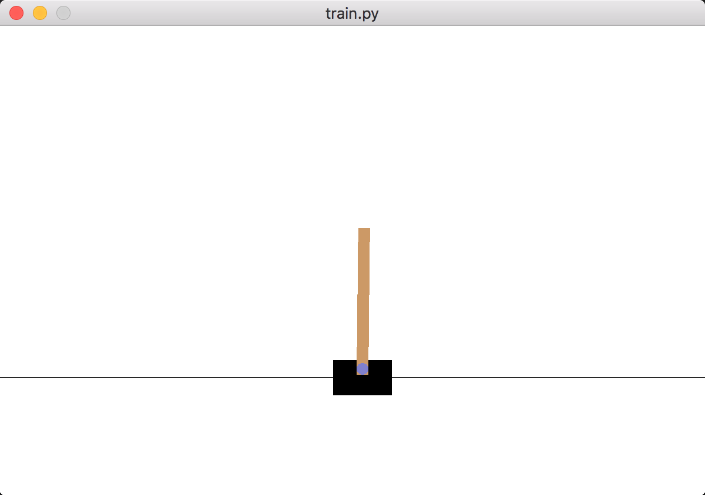

目录

<!-- TOC -->

- [简单使用](#%E7%AE%80%E5%8D%95%E4%BD%BF%E7%94%A8)
- [PARL框架](#parl%E6%A1%86%E6%9E%B6)
- [quickstart代码解析](#quickstart%E4%BB%A3%E7%A0%81%E8%A7%A3%E6%9E%90)

<!-- /TOC -->

## 简单使用

代码[https://github.com/PaddlePaddle/PARL](https://github.com/PaddlePaddle/PARL)

安装：

```shell
pip install parl
```

也可以从源码安装：

```shell
pip install paddlepaddle

pip install gym
git clone https://github.com/PaddlePaddle/PARL.git
cd PARL
pip install .
```

然后跑quickstart：

```shell
cd examples/QuickStart/
python train.py
# 
```

或者将评估过程可视化：

```shell
python train.py --eval_vis
```

这样就可以得到下图的结果

<html>
<br/>

<br/>
</html>

## PARL框架

主要抽象为Model、Algorithm、Agent三大模块：

+ Model：定义```policy network```或者```critic network```，使用```state```作为输入，建立一个前向网络
+ Algorithm：定义更新```Model```中的参数的机制，经常有不止一个model
+ Agent：是环境和Algorithm间的桥梁。负责与外界的数据I/O，并在把数据feed给训练process之前进行数据预处理

## quickstart代码解析

我们看一下quickstart的例子，这是一个policygradient：

Model如下：

```python
import parl.layers as layers
from parl.framework.model_base import Model
class CartpoleModel(Model):
    def __init__(self, act_dim):
        act_dim = act_dim
        hid1_size = act_dim * 10

        self.fc1 = layers.fc(size=hid1_size, act='tanh')
        self.fc2 = layers.fc(size=act_dim, act='softmax')

    def policy(self, obs):
        out = self.fc1(obs)
        out = self.fc2(out)
        return out
```

Algorithm如下，直接用的pg：

```python
from parl.algorithms import PolicyGradient
alg = PolicyGradient(model, hyperparas={'lr': LEARNING_RATE})
```

Agent就有点复杂啦：

```python
import parl.layers as layers
from parl.framework.agent_base import Agent
class CartpoleAgent(Agent):
    def __init__(self, algorithm, obs_dim, act_dim, seed=1):
        self.obs_dim = obs_dim
        self.act_dim = act_dim
        self.seed = seed
        super(CartpoleAgent, self).__init__(algorithm)

    def build_program(self):
        self.pred_program = fluid.Program()
        self.train_program = fluid.Program()

        fluid.default_startup_program().random_seed = self.seed
        self.train_program.random_seed = self.seed

        with fluid.program_guard(self.pred_program):
            # obs相当于是state
            obs = layers.data(
                name='obs', shape=[self.obs_dim], dtype='float32')
            self.act_prob = self.alg.define_predict(obs)

        with fluid.program_guard(self.train_program):
            # obs相当于是state
            obs = layers.data(
                name='obs', shape=[self.obs_dim], dtype='float32')
            act = layers.data(name='act', shape=[1], dtype='int64')
            reward = layers.data(name='reward', shape=[], dtype='float32')
            self.cost = self.alg.define_learn(obs, act, reward)

    def sample(self, obs):
        obs = np.expand_dims(obs, axis=0)
        act_prob = self.fluid_executor.run(
            self.pred_program,
            feed={'obs': obs.astype('float32')},
            fetch_list=[self.act_prob])[0]
        # 从数组的形状中删除单维度条目，即把shape中为1的维度去掉，参考https://daiwk.github.io/posts/knowledge-numpy-usage.html#npsqueeze
        act_prob = np.squeeze(act_prob, axis=0)
        act = np.random.choice(range(self.act_dim), p=act_prob)
        return act

    def predict(self, obs):
        obs = np.expand_dims(obs, axis=0)
        act_prob = self.fluid_executor.run(
            self.pred_program,
            feed={'obs': obs.astype('float32')},
            fetch_list=[self.act_prob])[0]
        # 从数组的形状中删除单维度条目，即把shape中为1的维度去掉，参考https://daiwk.github.io/posts/knowledge-numpy-usage.html#npsqueeze
        act_prob = np.squeeze(act_prob, axis=0)
        # 取出概率最大的那个动作
        act = np.argmax(act_prob)
        return act

    def learn(self, obs, act, reward):
        # 在act的最后面加多一维，why?...
        act = np.expand_dims(act, axis=-1)
        feed = {
            'obs': obs.astype('float32'),
            'act': act.astype('int64'),
            'reward': reward.astype('float32')
        }
        cost = self.fluid_executor.run(
            self.train_program, feed=feed, fetch_list=[self.cost])[0]
        return cost
```

使用时，先定义训练方法（reset环境，然后根据当前state采样出一个action，然后在环境中执行这个action，得到reward，这些(s,a,r)都存起来，如果done了，就返回这些(s,a,r)）：

```python
def run_train_episode(env, agent):
    obs_list, action_list, reward_list = [], [], []
    obs = env.reset()
    while True:
        obs_list.append(obs)
        action = agent.sample(obs)
        action_list.append(action)

        obs, reward, done, info = env.step(action)
        reward_list.append(reward)

        if done:
            break
    return obs_list, action_list, reward_list
```

然后定义计算discounted reward的函数，不断地乘gamma，再做个归一化

```python
def calc_discount_norm_reward(reward_list, gamma):
    discount_norm_reward = np.zeros_like(reward_list)

    discount_cumulative_reward = 0
    for i in reversed(range(0, len(reward_list))):
        discount_cumulative_reward = (
            gamma * discount_cumulative_reward + reward_list[i])
        discount_norm_reward[i] = discount_cumulative_reward
    discount_norm_reward = discount_norm_reward - np.mean(discount_norm_reward)
    discount_norm_reward = discount_norm_reward / np.std(discount_norm_reward)
    return discount_norm_reward
```

然后定义evaluate的方法，其实就是先reset环境，然后根据s，通过agent的predict得到一个a，然后执行这个a，得到reward，累加这个reward（**注意！！！这里没有gamma了！！！**），直到done，返回当前的累积reward：

```python
def run_evaluate_episode(env, agent):
    obs = env.reset()
    all_reward = 0
    while True:
        if args.eval_vis:
            env.render()
        action = agent.predict(obs)
        obs, reward, done, info = env.step(action)
        all_reward += reward
        if done:
            break
    return all_reward
```

然后就是整体流程啦：

```python
env = gym.make("CartPole-v0")
env.seed(SEED)
np.random.seed(SEED)
model = CartpoleModel(act_dim=ACT_DIM)
alg = PolicyGradient(model, hyperparas={'lr': LEARNING_RATE})
agent = CartpoleAgent(alg, obs_dim=OBS_DIM, act_dim=ACT_DIM, seed=SEED)
for i in range(1000):
    obs_list, action_list, reward_list = run_train_episode(env, agent)
    logger.info("Episode {}, Reward Sum {}.".format(i, sum(reward_list)))

    batch_obs = np.array(obs_list)
    batch_action = np.array(action_list)
    batch_reward = calc_discount_norm_reward(reward_list, GAMMA)

    agent.learn(batch_obs, batch_action, batch_reward)
    if (i + 1) % 100 == 0:
        all_reward = run_evaluate_episode(env, agent)
        logger.info('Test reward: {}'.format(all_reward))
```
