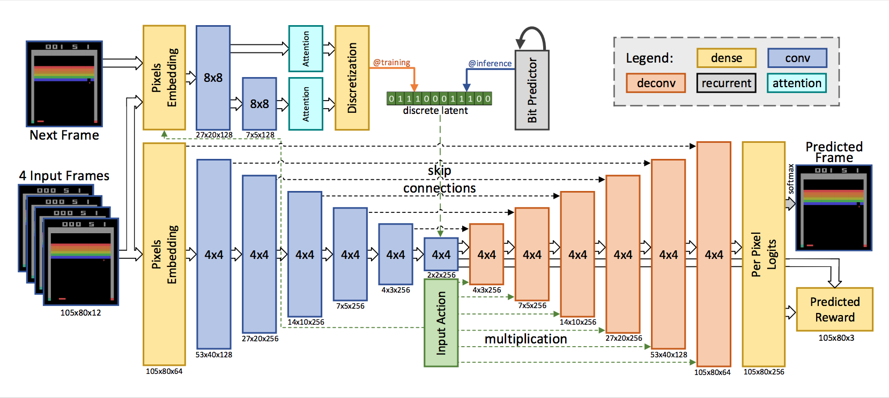

目录

<!-- TOC -->

- [概述](#%E6%A6%82%E8%BF%B0)

<!-- /TOC -->

## 概述

参考[仅需2小时学习，基于模型的强化学习方法可以在Atari上实现人类水平](https://mp.weixin.qq.com/s?__biz=MzA3MzI4MjgzMw==&mid=2650758447&idx=4&sn=4161f81dfd48317ae37e4cae1318edfe&chksm=871a9951b06d1047a214467941b60d87e8a27f7146a58bf092d2a2573df91b07d293294f3680&mpshare=1&scene=1&srcid=&pass_ticket=7RpWEE9pG33VI7QrEdlUejKpWhD51hkOFZcYbWAKlJdi8gHu1RETFQwn8uhoCs2u#rd)

论文地址：[Model Based Reinforcement Learning for Atari](https://arxiv.org/pdf/1903.00374.pdf)

无模型强化学习能够用于在复杂任务（如雅达利游戏，甚至基于图像观测）中学习非常有效的策略。但是，这通常需要**非常大量的交互**——事实上，比人类掌握相同游戏需要的次数更多。为什么人类可以学习如此之快？部分原因可能是，人类能够学习游戏原理，并预测出哪个动作会带来想要的结果。在本文中，我们探索了如何**基于视频预测模型**来达到类似效果，让智能体能够通过**更少的交互（相较于无模型方法而言，次数降低了几个数量级）**，通过雅达利游戏。本文讨论了模拟策略学习（SimPLe），一个基于视频预测模型的完全基于模型的深度强化学习算法，并比较了几种模型架构，包括一个在本文设定下得出最优结果的全新架构。我们在一系列雅达利游戏上测试评估了SimPLe，实验结果显示，仅通过10万次智能体和环境之间的交互（40万帧），约2小时的实时学习，SimPLe 就可获得有竞争力的结果。

效果最好的模型是前馈卷积神经网络。它利用一组卷积对一系列输入帧进行编码，并给定智能体采取的行动，然后利用一组反卷积对下一帧进行解码。奖励是基于瓶颈表征（bottleneck representation）预测的。

将**随机性**引入模型会带来不错的效果，可以让策略在训练阶段尝试更多不同的场景。为此，研究人员添加了一个**隐变量**，而来自隐变量的样本被添加至瓶颈表征。在**离散变量**该设定下效果最优，被**编码为比特序列**。模型的整体架构类似于**变分自编码器**，其中隐变量上的后验是基于**整个序列（输入帧+目标帧）近似**得到，从该后验中**抽取一个值**，并将该值与输入帧和action一起用于预测下一帧。在**推断阶段**，latent code由**自回归 LSTM**网络生成。

网络结构如下：

<html>
 

 
</html>

模型输入是 4 个堆叠的帧（以及智能体选择的策略），输出则是预测的下一帧及预期奖励。

用全连接层嵌入输入像素和action，在输出中有像素级的softmax（256 色）函数。

该模型有两个主要组成部分。

+ 首先，网络底部由带有**残差连接**的**卷积编码器和解码器(反卷积)**组成。为了根据智能体的行动调节输出，**解码器**中**每一层的输出**都**乘以learned embedded action**。
+ 模型的第二部分是**卷积推断网络**，类似于 Babaeizadeh 等人 (2017) [Stochastic variational video prediction](https://arxiv.org/abs/1710.11252)的观点，它在给定下一帧的条件下**近似估计后验**。
  + 在训练阶段(左上角的@training)，从**近似后验抽样**得到的**隐变量**值将**离散化**为比特。为使模型**可微**，**反向传播**根据 Kaiser & Bengio (2018) [Discrete autoencoders for sequence models](https://arxiv.org/abs/1801.09797)的方法**避开离散化**，并训练第三个基于LSTM的网络，以在给定先前比特时近似估计当前比特。
  + 在推断阶段(右上角的@inference)，利用该网络**自回归地(auto-regressively)**预测latent bits。

确定性模型（deterministic model）与上图架构相同，但**不包含推断网络**。

代码：[https://github.com/tensorflow/tensor2tensor/tree/master/tensor2tensor/rl](https://github.com/tensorflow/tensor2tensor/tree/master/tensor2tensor/rl)

包含视频的url：[https://sites.google.com/view/modelbasedrlatari/home](https://sites.google.com/view/modelbasedrlatari/home)
