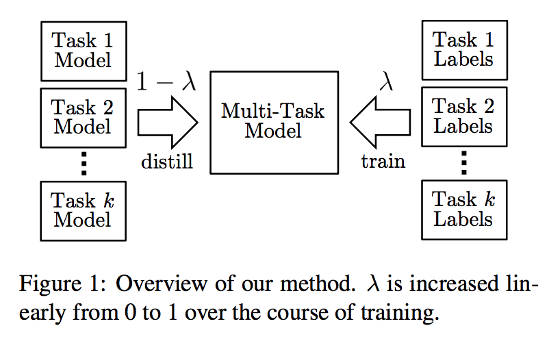

目录

<!-- TOC -->

- [概述](#概述)
- [模型结构](#模型结构)
- [方法](#方法)
    - [多任务训练](#多任务训练)
    - [知识蒸馏](#知识蒸馏)

<!-- /TOC -->

参考[BAM！利用知识蒸馏和多任务学习构建的通用语言模型](https://mp.weixin.qq.com/s?__biz=MzA3MzI4MjgzMw==&mid=2650758780&idx=4&sn=55fc290af6341d11184793ebcbbd02ca&chksm=871a9a02b06d13145f6b53cfb3900de5136fcfad6d88c0c7c93859bb383abf541122c5089c68&scene=0&xtrack=1&pass_ticket=OMkeru0hKbW%2FzHQFUoZof%2F%2BUDb%2BCgp5lNk%2B8t%2FD%2F3LWLuutOtmN3PBqbGS0R1bbs#rd)

论文地址：[BAM! Born-Again Multi-Task Networks for Natural Language Understanding](https://openreview.net/pdf?id=SylnYlqKw4)

## 概述

构建能够执行多个任务的单个模型一直是 NLP 领域的难题。多任务 NLP 对很多应用而言是无效的，多任务模型通常比单任务模型性能差。但是该研究提出利用知识蒸馏方法，让单任务模型高效教导多任务模型，从而在不同单任务上都有很好的表现。

知识蒸馏即将知识**从「教师」模型迁移到「学生」模型**，执行方式为训练**学生**模型**模仿教师**模型的预测。在「born-again network」(Furlanello et al., 2018) 中，教师和学生具备同样的神经网络架构和模型大小，然而令人惊讶的是，学生网络的性能超越了教师网络。该研究将这一想法扩展到多任务模型训练环境中。

研究者使用多个变体对比 Single->Multi born-again 知识蒸馏，这些变体包括单模型到单模型的知识蒸馏和多任务模型到多任务模型的知识蒸馏。此外，该研究还提出了一个简单的教师退火（teacher annealing）方法，帮助学生模型超越教师模型，大幅改善预测结果。

## 模型结构

<html>
 

 
</html>

上面是整体模型的结构，其采用**多个任务**的**单模型**与**对应标签**作为输入。其中**多任务模型**主要**基于BERT**，因此该多任务模型能通过知识蒸馏学习到各单任务模型的语言知识。模型会有一个教师退火的过程，即最开始由多个单任务模型教多任务模型学习，而随着**训练的进行**，多任务模型将**更多使用真实任务标签**进行训练(即图中的`\(\lambda\)`从0慢慢变到1)。

## 方法

### 多任务训练

模型：该研究所有模型均基于BERT构建。该模型将byte-pair-tokenized的输入句子传输到Transformer网络，为每个token生成语境化的表征。对于分类任务，研究者使用标准softmax层直接分类。对于回归任务，研究者使用最后一层的特征向量，并使用sigmoid激活函数。在该研究开发的多任务模型中，除了基于BERT的分类器，**所有模型参数在所有任务上共享**，这意味着不到 0.01% 的参数是任务特定的。和BERT一样，字符级词嵌入和Transformer使用「masked LM」预训练阶段的权重进行初始化。

训练：单任务训练按照BERT原文的研究来执行。至于多任务训练，研究者将**打乱不同任务的顺序**，即使在**小批量内也会进行shuffle**。最后模型的训练为**最小化所有任务上的（未加权）损失和**。

### 知识蒸馏

使用知识蒸馏方法，让单任务模型来教多任务模型。这里学生网络和教师网络具备同样的模型架构。

知识蒸馏中**学生**网络要**模仿教师**网络，这有可能导致学生网络受限于教师网络的性能，无法超过教师网络。为了解决该问题，该研究提出**teacher annealing**，在训练过程中混合教师预测和gold label。
