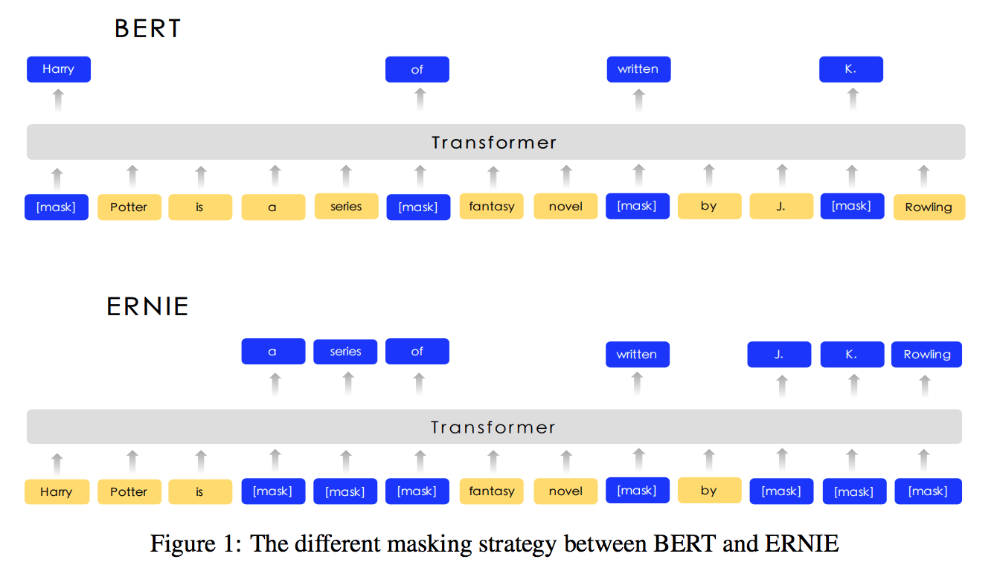
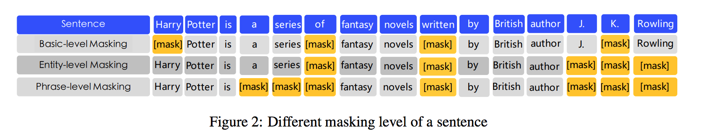
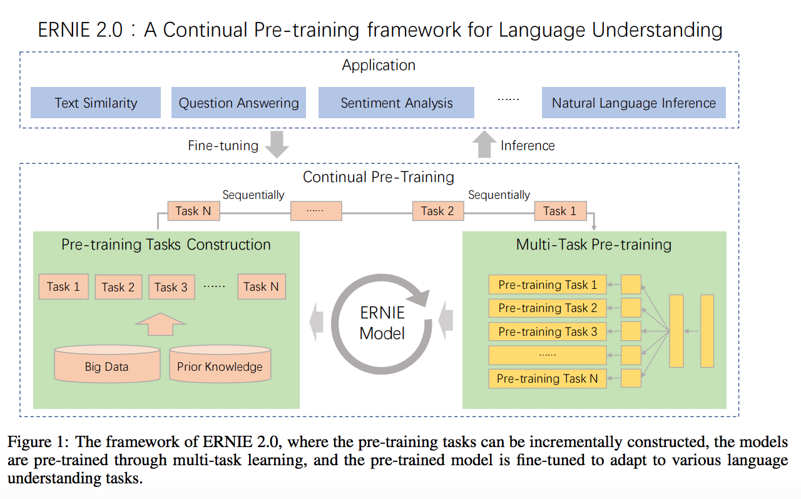
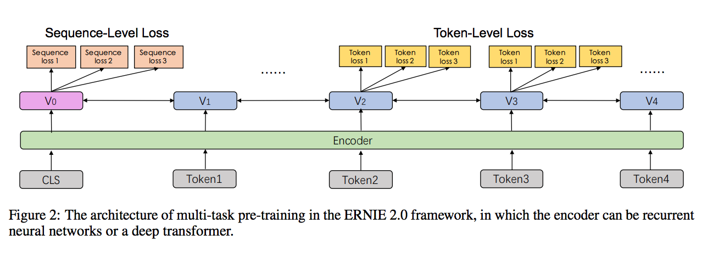
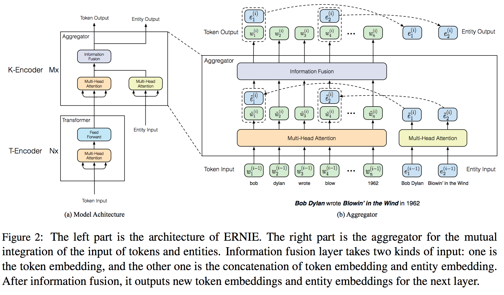
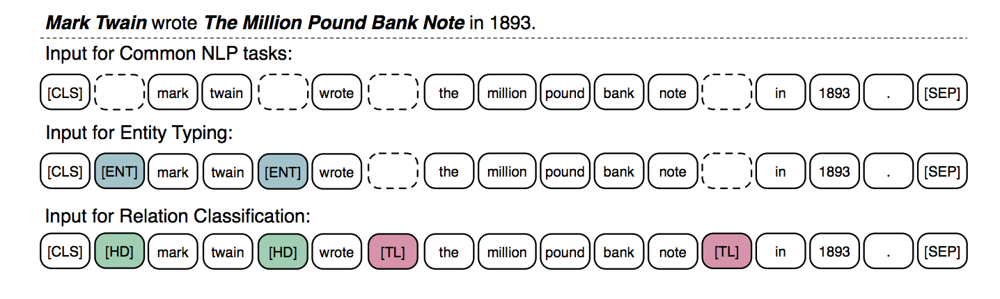
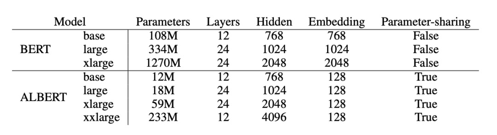

目录

<!-- TOC -->

- [bert](#bert)
  - [finetune和跑预测并save模型](#finetune%e5%92%8c%e8%b7%91%e9%a2%84%e6%b5%8b%e5%b9%b6save%e6%a8%a1%e5%9e%8b)
  - [线上infer部分](#%e7%ba%bf%e4%b8%8ainfer%e9%83%a8%e5%88%86)
- [ernie](#ernie)
  - [ernie(baiduNLP)](#erniebaidunlp)
  - [ernie2.0(baidunlp)](#ernie20baidunlp)
  - [ernie(清华ACL2019版)](#ernie%e6%b8%85%e5%8d%8eacl2019%e7%89%88)
    - [模型结构](#%e6%a8%a1%e5%9e%8b%e7%bb%93%e6%9e%84)
    - [finetune方法](#finetune%e6%96%b9%e6%b3%95)
- [XLMs/MASS/UNILM](#xlmsmassunilm)
  - [XLM(facebook2019)](#xlmfacebook2019)
  - [LASER(facebook2018)](#laserfacebook2018)
  - [MASS(microsoft)](#massmicrosoft)
  - [UNILM(microsoft)](#unilmmicrosoft)
- [UER框架](#uer%e6%a1%86%e6%9e%b6)
- [Whole Word Masking BERT](#whole-word-masking-bert)
- [xlnet](#xlnet)
- [RoBERTa](#roberta)
- [ALBERT](#albert)
- [DistilBERT](#distilbert)
- [移动端部署](#%e7%a7%bb%e5%8a%a8%e7%ab%af%e9%83%a8%e7%bd%b2)
- [中文预训练模型汇总](#%e4%b8%ad%e6%96%87%e9%a2%84%e8%ae%ad%e7%bb%83%e6%a8%a1%e5%9e%8b%e6%b1%87%e6%80%bb)
  - [roberta中文](#roberta%e4%b8%ad%e6%96%87)
  - [albert中文](#albert%e4%b8%ad%e6%96%87)
  - [xlnet中文](#xlnet%e4%b8%ad%e6%96%87)
- [TinyBert](#tinybert)
- [SenseBert：解决歧义](#sensebert%e8%a7%a3%e5%86%b3%e6%ad%a7%e4%b9%89)
- [bert的可解释性](#bert%e7%9a%84%e5%8f%af%e8%a7%a3%e9%87%8a%e6%80%a7)
- [bert相关模型的对比与分析](#bert%e7%9b%b8%e5%85%b3%e6%a8%a1%e5%9e%8b%e7%9a%84%e5%af%b9%e6%af%94%e4%b8%8e%e5%88%86%e6%9e%90)
- [faster transformer](#faster-transformer)
- [bert加速方法](#bert%e5%8a%a0%e9%80%9f%e6%96%b9%e6%b3%95)
- [多模态bert](#%e5%a4%9a%e6%a8%a1%e6%80%81bert)
  - [vilbert](#vilbert)
  - [VLbert](#vlbert)
- [bert的一些常见问题](#bert%e7%9a%84%e4%b8%80%e4%ba%9b%e5%b8%b8%e8%a7%81%e9%97%ae%e9%a2%98)

<!-- /TOC -->

paddle的LARK里包含了一些nlp模型

[强力推荐！飞桨产业级PaddleNLP最新全景图发布](https://mp.weixin.qq.com/s/xtv8T-X8OddhF5wDasR3NA)

## bert

### finetune和跑预测并save模型

```shell
BERT_BASE_PATH=./pretrained_model/chinese_L-12_H-768_A-12/
TASK_NAME="XNLI"
#DATA_PATH=./data/XNLI-1.0-demo/
DATA_PATH=./data/XNLI-MT-1.0-dwk/
INIT_CKPT_PATH=./output/step_50
SAVE_INFERENCE_PATH=./output/infer_step_50 ## 这个目录下会有个__model__文件，给在线infer用的，注意paddle的版本要用1.3.1以上的，1.3.0生成的这个目录有bug
python=../../python-2.7.14-paddle-1.3.1/bin/python


export FLAGS_enable_parallel_graph=1
export FLAGS_sync_nccl_allreduce=1
export CUDA_VISIBLE_DEVICES=0,1,2,3,4,5,6,7
export CPU_NUM=3 ## 设置跑的cpu核数

TASK_NAME='XNLI'
CKPT_PATH=./output/

function finetune_xnli()
{

### 如果有56核的cpu，会占114g。。；而如果是12核的cpu，只会占25g内存
DATA_PATH=./data/XNLI-MT-1.0-dwk/
$python -u run_classifier.py --task_name ${TASK_NAME} \
           --use_cuda false \
           --do_train true \
           --do_val true \
           --do_test true \
           --batch_size 1 \
           --in_tokens false \
           --init_pretraining_params ${BERT_BASE_PATH}/params \
           --data_dir ${DATA_PATH} \
           --vocab_path ${BERT_BASE_PATH}/vocab.txt \
           --checkpoints ${CKPT_PATH} \
           --save_steps 50 \
           --weight_decay  0.01 \
           --warmup_proportion 0.0 \
           --validation_steps 2500 \
           --epoch 1 \
           --max_seq_len 8 \
           --bert_config_path ${BERT_BASE_PATH}/bert_config.json \
           --learning_rate 1e-4 \
           --skip_steps 1 \
           --random_seed 1
}

function save_inference_model() 
{

### 如果是56核cpu，会占22g内存..
DATA_PATH=./data/XNLI-1.0-demo/
$python -u predict_classifier.py --task_name ${TASK_NAME} \
           --use_cuda false \
           --batch_size 1 \
           --data_dir ${DATA_PATH} \
           --vocab_path ${BERT_BASE_PATH}/vocab.txt \
           --do_lower_case true \
           --init_checkpoint ${INIT_CKPT_PATH} \
           --max_seq_len 8 \
           --bert_config_path ${BERT_BASE_PATH}/bert_config.json \
           --do_predict true \
           --save_inference_model_path ${SAVE_INFERENCE_PATH}

}

function main()
{
    finetune_xnli
    [[ $? -ne 0 ]] && exit 1
    save_inference_model
    [[ $? -ne 0 ]] && exit 1
    return 0
}

main 2>&1 
```

### 线上infer部分

参考这个readme:

[https://github.com/PaddlePaddle/models/tree/develop/PaddleNLP/language_representations_kit/BERT/inference](https://github.com/PaddlePaddle/models/tree/develop/PaddleNLP/language_representations_kit/BERT/inference)

生成demo文件可以参考

```shell
TASK_NAME="xnli"
DATA_PATH=../data/XNLI-1.0/
BERT_BASE_PATH=../pretrained_model/chinese_L-12_H-768_A-12/
python=../../../python-2.7.14-paddle-1.3.1/bin/python
$python gen_demo_data.py \
           --task_name ${TASK_NAME} \
           --data_path ${DATA_PATH} \
           --vocab_path "${BERT_BASE_PATH}/vocab.txt" \
           --batch_size 1 \
           > bert_data.demo

#           --in_tokens \
```

运行示例：

```shell
INFERENCE_MODEL_PATH=./output/infer_step_50
DATA_PATH=./bert_data.demo
REPEAT_TIMES=1
./bin/bert_demo --logtostderr \
        --model_dir $INFERENCE_MODEL_PATH \
        --data $DATA_PATH \
        --repeat $REPEAT_TIMES \
        --output_prediction
```

## ernie

也可以参考[站在BERT肩膀上的NLP新秀们（PART I）](https://blog.csdn.net/Kaiyuan_sjtu/article/details/90757442)

### ernie(baiduNLP)

参考[中文任务全面超越BERT：百度正式发布NLP预训练模型ERNIE](https://mp.weixin.qq.com/s?__biz=MzA3MzI4MjgzMw==&mid=2650758722&idx=1&sn=6742b0f86982890d78cb3ec3be9865b3&scene=0#wechat_redirect)

[ERNIE: Enhanced Representation through Knowledge Integration](https://arxiv.org/pdf/1904.09223.pdf)

使用entity-level masking和phrase-level masking两种mask方法

输入的每个样本由5个 ';' 分隔的字段组成，数据格式：

+ token_ids
+ sentence_type_ids：两句话，第一句都是0，第二句都是1
+ position_ids
+ seg_labels：分词边界信息: 0表示词首、1表示非词首、-1为占位符, 其对应的词为 CLS 或者 SEP；
+ next_sentence_label

例如：

```shell
1 1048 492 1333 1361 1051 326 2508 5 1803 1827 98 164 133 2777 2696 983 121 4 19 9 634 551 844 85 14 2476 1895 33 13 983 121 23 7 1093 24 46 660 12043 2 1263 6 328 33 121 126 398 276 315 5 63 44 35 25 12043 2;0 0 0 0 0 0 0 0 0 0 0 0 0 0 0 0 0 0 0 0 0 0 0 0 0 0 0 0 0 0 0 0 0 0 0 0 0 0 0 0 1 1 1 1 1 1 1 1 1 1 1 1 1 1 1 1;0 1 2 3 4 5 6 7 8 9 10 11 12 13 14 15 16 17 18 19 20 21 22 23 24 25 26 27 28 29 30 31 32 33 34 35 36 37 38 39 40 41 42 43 44 45 46 47 48 49 50 51 52 53 54 55;-1 0 0 0 0 1 0 1 0 0 1 0 0 1 0 1 0 0 0 0 0 0 1 0 1 0 0 1 0 1 0 0 0 0 1 0 0 0 0 -1 0 0 0 1 0 0 1 0 1 0 0 1 0 1 0 -1;0
```

和bert在mask上的区别：

<html>
<br/>

<br/>
</html>

一个句子的不同level的mask方式：

<html>
<br/>

<br/>
</html>

### ernie2.0(baidunlp)

[ERNIE 2.0: A CONTINUAL PRE-TRAINING FRAMEWORK FOR LANGUAGE UNDERSTANDING](https://arxiv.org/pdf/1907.12412v1.pdf)

<html>
<br/>

<br/>
</html>

另一张图：

<html>
<br/>

<br/>
</html>

### ernie(清华ACL2019版)

参考[ACL 2019 \| 清华等提出ERNIE：知识图谱结合BERT才是「有文化」的语言模型](https://mp.weixin.qq.com/s?__biz=MzA3MzI4MjgzMw==&mid=2650762696&idx=4&sn=70c25ea24d15ed53880f45c511938813&chksm=871aa9b6b06d20a0536c7602a5757e28f995600bdffdd52ccb791927ba17aaaa10bfc15a209d&scene=0&xtrack=1&pass_ticket=10gfACXwvjCg3%2FChSZlp60K3dPTbQYhHe4njUqeSGdqo1x0Esjyqks8weqv1u2O0#rd)

ppt：[https://pan.baidu.com/s/1TjGOB2myXT-bln3OpFcbgA](https://pan.baidu.com/s/1TjGOB2myXT-bln3OpFcbgA) 提取码：35fv

[ERNIE: Enhanced Language Representation with Informative Entities](https://arxiv.org/pdf/1905.07129.pdf)

代码：[https://github.com/thunlp/ERNIE](https://github.com/thunlp/ERNIE)

+ 对于抽取并编码的知识信息，研究者首先**识别**文本中的**命名实体**，然后将这些提到的实体**与知识图谱中的实体进行匹配**。

研究者并不直接使用 KG 中基于图的事实，相反他们通过**知识嵌入**算法（例如，TransE，参考[Translating Embeddings for Modeling Multi-relational Data](https://www.utc.fr/~bordesan/dokuwiki/_media/en/transe_nips13.pdf)，简单说就是(head,relation,tail)这个三元组，每个元素都是一个向量，期望head+relation尽可能=tail）**编码KG的图结构**，并将多信息实体嵌入作为ERNIE的输入。基于**文本和知识图谱的对齐**，ERNIE 将知识模块的实体表征整合到语义模块的隐藏层中。

+ 与 BERT 类似，研究者采用了带 Mask 的语言模型，以及预测下一句文本作为预训练目标。除此之外，为了更好地融合文本和知识特征，研究者设计了一种新型预训练目标，即随机**Mask掉**一些**对齐了输入文本的命名实体**，并要求模型从知识图谱中选择合适的实体以完成对齐。

现存的预训练语言表征模型只利用局部上下文预测 Token，但 ERNIE 的新目标要求模型**同时聚合上下文**和**知识事实**的信息，并**同时**预测**Token和实体**，从而构建一种知识化的语言表征模型。

研究者针对两种知识驱动型 NLP 任务进行了实验，即实体分型（entity typing）和关系分类。实验结果表明，ERNIE在知识驱动型任务中效果显著超过当前最佳的 BERT，因此 ERNIE 能完整利用词汇、句法和知识信息的优势。研究者同时在其它一般 NLP 任务中测试 ERNIE，并发现它能获得与 BERT 相媲美的性能。

#### 模型结构

<html>
<br/>

<br/>
</html>

由两个堆叠的模块构成：

+ 底层的文本编码器（T-Encoder），负责获取输入 token 的词法和句法信息；
+ 上层的知识型编码器（K-Encoder），负责将额外的面向token的实体知识信息整合进来自底层的文本信息。这样我们就可以在一个统一的特征空间中表征token和实体的异构信息了。注意，**输出也是两部分**，token output和entity output，然后这两部分**各自过self-attention**，再进行information fusion。

N表示T-Encoder的层数，M表示K-Encoder的层数。

#### finetune方法

+ 针对relation classification问题，```[HD]```表示head entity，```[TL]```表示tail entity，然后```[CLS]```表示这个pair对的关系分类的label
+ 针对entity typing问题，其实是个简化版的relation classification问题，只要```[ENT]```这个就行了，然后这个实体是哪一类的，用```[CLS]```来表示，每条样本只预测一个```[ENT]```的分类。另一个实体用占位符替代。
+ 对于普通任务，把上述的```[TL]```、```[HD]```和```[ENT]```用占位符来替代就行。

<html>
<br/>

<br/>
</html>

## XLMs/MASS/UNILM

参考[站在BERT肩膀上的NLP新秀们：XLMs、MASS和UNILM](https://mp.weixin.qq.com/s?__biz=MzIwMTc4ODE0Mw==&mid=2247497613&idx=2&sn=11932f04ecc6a6999910385c0ffb4806&chksm=96ea280da19da11b1c4b6c7d93ca52a2f4aa035ec3a483d6936fc6e86aaf25aa59f6fb62e163&mpshare=1&scene=1&srcid=06063Y6CfgNf0h03W2Hd9iQ2&pass_ticket=TloMdmvUbLd5jnKvVTzrccQhGuskwL6KQ0HhJLF56Nwtcb16%2BVvMA09bw32tFrjs#rd)

参考[站在BERT肩膀上的NLP新秀们（PART II）](https://blog.csdn.net/Kaiyuan_sjtu/article/details/90814031)

### XLM(facebook2019)

facebook提出[Cross-lingual Language Model Pretraining](https://arxiv.org/abs/1901.07291)

### LASER(facebook2018)

[Massively Multilingual Sentence Embeddings for Zero-Shot Cross-Lingual Transfer and Beyond](https://arxiv.org/abs/1812.10464)

XLM的主要思想还是来自于这片文章，借用了BERT的框架最后成了XLM。本文提出了LASER（Language-Agnostic SEntence Representations）

### MASS(microsoft)

bert只使用了Transformer的encoder部分，其下游任务也主要是适用于自然语言理解（NLU），对于类似文本摘要、机器翻译、对话应答生成等自然语言生成（NLG）任务显然是不太合适的。

[MASS: Masked Sequence to Sequence Pre-training for Language Generation](https://arxiv.org/abs/1905.02450)

受到bert的启发，作者们提出联合训练encoder和decoder的模型

训练步骤主要分为两步：

+ Encoder： 输入为被随机mask掉连续部分token的句子，使用Transformer对其进行编码；这样处理的目的是可以使得encoder可以更好地捕获没有被mask掉词语信息用于后续decoder的预测；
+ Decoder： 输入为与encoder同样的句子，但是mask掉的正好和encoder相反，和翻译一样，使用attention机制去训练，但只预测encoder端被mask掉的词。该操作可以迫使decoder预测的时候更依赖于source端的输入而不是前面预测出的token，防止误差传递。


### UNILM(microsoft)

[Unified Language Model Pre-training for Natural Language Understanding and Generation](https://arxiv.org/abs/1905.03197)

使用的核心框架还是 Transformer，不同的是预训练的目标函数结合了以下三个： 

+ 单向语言模型（同 ELMO/GPT） 
+ 双向语言模型（同 BERT） 
+ seq2seq 语言模型（同上一篇）

这里的 Transformer 是同一个，即三个 LM 目标参数共享，有点 multi-task learning 的感觉，可以学习到更 genneral 的文本表示。


以上四篇的小结：

+ BERT仅关注encoder，LASER考虑了encoder-decoder的联合训练。但从LASER模型框架上也可以看出，其**无法提取word级别的特征**，擅长于跨语言任务；
+ XLM和MASS都是跨语言模型，补充了BERT在NLG任务上的不足。模型层面而言XLM没有使用传统的encoder-decoder框架；
+ UNILM可以同时处理NLU和NLG任务。后续的改进可以考虑加入跨语言任务的预训练，比如XLM和MASS做的工作。

## UER框架

Universal Encoder Representations

参考[一大批中文（BERT等）预训练模型等你认领！](https://mp.weixin.qq.com/s?__biz=MzIwMTc4ODE0Mw==&mid=2247497927&idx=1&sn=feb841473f5503fe549f87304865e901&chksm=96ea2747a19dae51f41c17870ab37172382b24ae53b451f566d6afee1fce7d34388a0aef92aa&mpshare=1&scene=1&srcid=&pass_ticket=b29oFqpJS3l2z9rkgAH2HsO1MhYXnw6w%2FmAI30o3T46KiQgaX30qaNd4uUXfW4zq#rd)

代码：[https://github.com/dbiir/UER-py](https://github.com/dbiir/UER-py)

知乎中记录问题：[https://zhuanlan.zhihu.com/p/70389596](https://zhuanlan.zhihu.com/p/70389596)

## Whole Word Masking BERT

[哈工大讯飞联合实验室发布基于全词覆盖的中文BERT预训练模型](https://mp.weixin.qq.com/s?__biz=MzIxMjAzNDY5Mg==&mid=2650794872&idx=1&sn=dccd856283bdd4edcdad08cf75506697&chksm=8f477e93b830f7850e6c0ffe684264f704c6fcc4e126a6300b5ae33916aa676a279206e1e4ce&mpshare=1&scene=1&srcid=0701DAFsQt28gF1hGzH4llaM&pass_ticket=8wChBZeeRNV5mWLFKMXfVyWjwTb94XookbbSJiYpmEClqUrpybiGPpfilXkL5UQN#rd)

[https://github.com/ymcui/Chinese-BERT-wwm](https://github.com/ymcui/Chinese-BERT-wwm)

论文：[Pre-Training with Whole Word Masking for Chinese BERT](https://arxiv.org/abs/1906.08101)

## xlnet

[https://daiwk.github.io/posts/nlp-xlnet.html](https://daiwk.github.io/posts/nlp-xlnet.html)

## RoBERTa

来自Facebook

参考[重回榜首的BERT改进版开源了，千块V100、160GB纯文本的大模型](https://mp.weixin.qq.com/s?__biz=MzA3MzI4MjgzMw==&mid=2650766934&idx=2&sn=54c479dd8e8e69cd9617b9a1962443e1&chksm=871aba28b06d333e0d5dc64754b7280776ba5c17577831077dc5cd2caa4c2335beec3afd8d34&scene=0&xtrack=1&pass_ticket=zAXdHORK5tTx549e9RwAgNcm7bjJrH4ENwbbTYVrAZDqpsE%2Fu1hY63b%2FoRfnZQdM#rd)

[RoBERTa: A Robustly Optimized BERT Pretraining Approach](https://arxiv.org/pdf/1907.11692.pdf)

## ALBERT

[预训练小模型也能拿下13项NLP任务，谷歌ALBERT三大改造登顶GLUE基准](https://mp.weixin.qq.com/s/kvSoDr0E_mvsc7lcLNKmgg)

ALBERT 模型在 GLUE、RACE 和 SQuAD 基准测试上都取得了新的 SOTA 效果，并且参数量还少于 BERT-large。

[ALBERT: a lite bert for self-supervised learning of language representations](https://openreview.net/pdf?id=H1eA7AEtvS)

emb只有128？

<html>
<br/>

<br/>
</html>

通过对词嵌入矩阵进行因式分解，再为下游任务共享不同层的所有参数，这样可以大大降低 BERT 的参数量。

还提出了一种新型句间连贯性损失函数，它可以强迫模型学习句间的连贯性表达，从而有利于各种下游 NLP 任务。

ALBERT 通过两个参数削减技术克服了扩展预训练模型面临的主要障碍。第一个技术是对嵌入参数化进行因式分解。研究者将大的词汇嵌入矩阵分解为两个小的矩阵，从而将隐藏层的大小与词汇嵌入的大小分离开来。这种分离使得隐藏层的增加更加容易，同时不显著增加词汇嵌入的参数量。

第二种技术是跨层参数共享。这一技术可以避免参数量随着网络深度的增加而增加。两种技术都显著降低了 BERT 的参数量，同时不对其性能造成明显影响，从而提升了参数效率。ALBERT 的配置类似于 BERT-large，但参数量仅为后者的 1/18，训练速度却是后者的 1.7 倍。这些参数削减技术还可以充当某种形式的正则化，可以使训练更加稳定，而且有利于泛化。

为了进一步提升 ALBERT 的性能，研究者还引入了一个自监督损失函数，用于句子级别的预测（SOP）。SOP 主要聚焦于句间连贯，用于解决原版 BERT 中下一句预测（NSP）损失低效的问题。

参考[谷歌全新轻量级新模型ALBERT刷新三大NLP基准！](https://mp.weixin.qq.com/s/-Kzr4w7pv2DCOUlilg2Wfg)

## DistilBERT

参考[小版BERT也能出奇迹：最火的预训练语言库探索小巧之路](https://mp.weixin.qq.com/s/a0d0b1jSm5HxHso9Lz8MSQ)

1.4w个stars。。

[https://huggingface.co/transformers](https://huggingface.co/transformers)

[DistilBERT, a distilled version of BERT: smaller, faster, cheaper and lighter](https://arxiv.org/abs/1910.01108)

## 移动端部署

HuggingFace 在 GitHub 上表示，他们有意将这些模型放到移动设备上，并提供了一个 repo 的代码，将 GPT-2 模型转换为 CoreML 模型放在移动端。

未来，他们会进一步推进开发工作，用户可以无缝地将大模型转换成 CoreML 模型，无需使用额外的程序脚本。

[https://github.com/huggingface/swift-coreml-transformers](https://github.com/huggingface/swift-coreml-transformers)

## 中文预训练模型汇总

### roberta中文

[RoBERTa中文预训练模型，你离中文任务的「SOTA」只差个它](https://mp.weixin.qq.com/s/EKFa40rLQlnEVuu9V7GDmg)

[https://github.com/brightmart/roberta_zh](https://github.com/brightmart/roberta_zh)

### albert中文

[https://github.com/brightmart/albert_zh](https://github.com/brightmart/albert_zh)

### xlnet中文

[https://github.com/brightmart/xlnet_zh](https://github.com/brightmart/xlnet_zh)

## TinyBert

[TinyBERT：模型小7倍，速度快8倍，华中科大、华为出品](https://mp.weixin.qq.com/s/VL7TSHmZPKD-xGdOxNmnHw)

[TinyBERT: Distilling BERT for Natural Language Understanding](https://arxiv.org/abs/1909.10351)

提出了一个two-stage learning framework，在pre-training阶段和task-specific阶段都进行distill。

相比baseline，只有28% parameters和31%的inference时间

在glue上，7.5x小，infer上有9.4x快。

## SenseBert：解决歧义

[解决自然语言歧义问题，斯坦福教授、IJCAI 卓越研究奖得主提出 SenseBERT 模型](https://mp.weixin.qq.com/s/844jUNpo17C447SKiPAHJw)

[SenseBERT: Driving Some Sense into BERT](https://arxiv.org/abs/1908.05646)

[解读《SenseBERT: Driving Some Sense into BERT》](https://blog.csdn.net/weixin_37947156/article/details/100042008)

SenseBERT不仅能够预测遮蔽词汇（masked word），还能预测它们在给定语境下的实际含义。

AI21 Labs的研究人员使用英语词汇数据库WordNet作为标注参照系统，设计了一个网络来预测单词在语境中的实际含义。然后将该预训练网络嵌入 BERT。

## bert的可解释性

[ACL 2019 \| 理解 BERT 每一层都学到了什么](https://mp.weixin.qq.com/s/w2Cwo--GTKp5o8YKRtbl7g)

[What does BERT learn about the structure of language?](https://hal.inria.fr/hal-02131630/document)

探索BERT深层次的表征学习是一个非常有必要的事情，一是这可以帮助我们更加清晰地认识BERT的局限性，从而改进BERT或者搞清楚它的应用范围；二是这有助于探索BERT的可解释性

## bert相关模型的对比与分析

[带你读论文\|8篇论文梳理BERT相关模型进展与反思](https://mp.weixin.qq.com/s/kJhOrz0VaYc-k-6XJS02ag)

近期 BERT 相关模型一览

+ XLNet 及其与 BERT 的对比

[A Fair Comparison Study of XLNet and BERT](https://medium.com/@xlnet.team/a-fair-comparison-study-of-xlnet-and-bert-with-large-models-5a4257f59dc0)

+ RoBERTa
+ SpanBERT
+ MT-DNN 与知识蒸馏

[Multi-Task Deep Neural Networks for Natural Language Understanding](https://arxiv.org/abs/1901.11504)

对 BERT 在部分 NLP 任务中表现的深入分析

+ BERT 在 Argument Reasoning Comprehension 任务中的表现
+ BERT 在 Natural Language Inference 任务中的表现

[从语言模型到Seq2Seq：Transformer如戏，全靠Mask](https://mp.weixin.qq.com/s/jdQVz4SC8UGTynlTft2CIA)

[BERT or XLNet，围观NLP巅峰烧钱大战。技术发展太快，如何才能跟得上节奏？](https://mp.weixin.qq.com/s/VCmUkcP97XV_HqG7cjhfyg)

[后 BERT 时代的那些 NLP 预训练模型](https://mp.weixin.qq.com/s/zinf8c570v-PfNO-0lLl3w)


## faster transformer

[英伟达Faster Transformer：作者带你揭秘BERT优化](https://mp.weixin.qq.com/s/_yA8ZkwOR8pfarLRCeh8UQ)

## bert加速方法

[https://daiwk.github.io/posts/platform-bert-speedup.html](https://daiwk.github.io/posts/platform-bert-speedup.html)


## 多模态bert

### vilbert

[ViLBERT: Pretraining Task-Agnostic Visiolinguistic Representations for Vision-and-Language Tasks](https://arxiv.org/pdf/1908.02265.pdf)

研究人员提出了一种名为 ViLBERT（图文 BERT）模型。这是一个可以学习任务未知的、图像内容和自然语言联合表征的模型。研究人员将流行的 BERT 架构扩展成一个 multi-modal two-stream 模型上。在这个模型上，模型用两个分开的流处理图像和文本输入，但他们彼此用联合注意力层交互。研究人员在两个代理任务上，使用 Conceptual Captions 数据集（数据集很大，而且是自动收集的数据）预训练这个模型，然后将模型秦阿姨到多个建立好的图像-文本任务上。这些任务包括图像问答、图像常识推理、引述表达、指称成分，以及基于捕捉的图像提取。这些只需要在基本架构上进行微小的补充。研究人员观察到，相比现有的针对任务的特定模型，新模型在这些任务上都有了相助的性能提升——在每个任务上都取得了 SOTA。

### VLbert

Visual-Linguistic BERT，简称 VL-BERT

[微软亚研提出VL-BERT：通用的视觉-语言预训练模型](https://mp.weixin.qq.com/s/RaYwdMXT0UKN8_bni-DpWw)

此预训练过程可以显著提高下游的视觉-语言任务的效果，包含视觉常识推理、视觉问答与引用表达式理解等。值得一提的是，在视觉常识推理排行榜中，VL-BERT 取得了当前单模型的最好效果。

[VL-BERT: Pre-training of Generic Visual-Linguistic Representations](https://arxiv.org/abs/1908.08530)

之前的视觉-语言模型分别使用计算机视觉或自然语言处理领域中的预训练模型进行初始化，但如果目标任务数据量不足，模型容易过拟合从而损失性能。并且对于不同的视觉-语言任务，其网络架构一般是经过特殊设计的，由此很难通过视觉-语言联合预训练的过程帮助下游任务。

VL-BERT 的主干网络使用 TransformerAttention 模块，并将视觉与语言嵌入特征作为输入，其中输入的每个元素是来自句子中的单词、或图像中的感兴趣区域（Region of Interests，简称 RoIs）。在模型训练的过程中，每个元素均可以根据其内容、位置、类别等信息自适应地聚合来自所有其他元素的信息。在堆叠多层 TransformerAttention 模块后，其特征表示即具有更为丰富的聚合与对齐视觉和语言线索的能力。

为了更好地建模通用的视觉-语言表示，作者在大规模视觉-语言语料库中对 VL-BERT 进行了预训练。采用的预训练数据集为图像标题生成数据集，Conceptual Captions，其中包含了大约 330 万个图像标题对。

VL-BERT 的预训练主要采用三个任务：a) 屏蔽语言模型（Masked Language Modeling），即随机屏蔽掉语句中的一些词，并预测当前位置的词是什么；b) 屏蔽 RoI 分类（MaskedRoIClassification），即随机屏蔽掉视觉输入中的一些 RoIs，并预测此空间位置对应 RoI 的所属类别；c) 图像标题关联预测（Sentence-Image Relationship Prediction），即预测图像与标题是否属于同一对。

在预训练结束后，使用微调来进行下游任务的训练。本文中主要在三个视觉-语言下游任务中进行微调，即视觉常识推理（VisualCommonsenseReasoning）、视觉问答（VisualQuestionAnswering）与引用表达式理解（ReferringExpressionComprehension），下面将分别介绍。

视觉常识推理任务即给定图片与相关问题，机器不仅需要回答问题，还需要提供理由来证明答案的正确性。此任务（Q->AR）被分解为两个子任务，即视觉问答（Q->A，给定图片与问题，输出正确答案），以及视觉推理（QA->R，给定图片、问题与答案，输出正确的理由）。

## bert的一些常见问题

[Transformer 结构中最后一层 softmax 为什么不再使用 层次化softmax了呢？](https://www.zhihu.com/question/310845030/answer/595573391?hb_wx_block=0&utm_source=wechat_session&utm_medium=social&utm_oi=632586637935251456)

主要还是计算资源的问题。

Mikolov发明word2vec的几个版本大概在13-14年前后。那个时候GPU非常少见，印象里面CMU的NLP组没有GPU，Stanford NLP lab只有6块K40。

大规模直接算 softmax 是在google的14年那篇seq2seq做MT的文章。为了快，把一个softmax 并行在4️块GPU上，每个GPU负责四分之一。那个年代，大多数NLP组全组都不会有4块GPU。

hierarchical softmax是softmax的近似，suboptimal的。当如今计算资源足够大的时候，当然包括时间和显存 (BERT 和 Elmo 都没有用hierarchical)，hierarchical softmax就逐渐退出了历史舞台。
