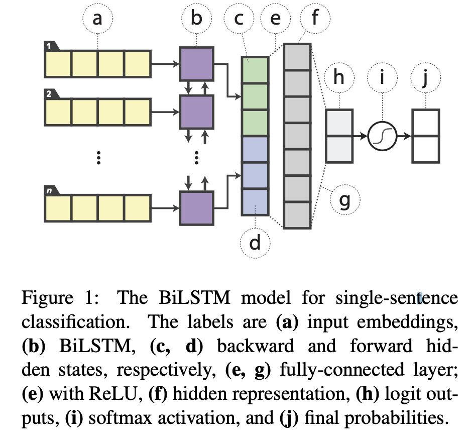
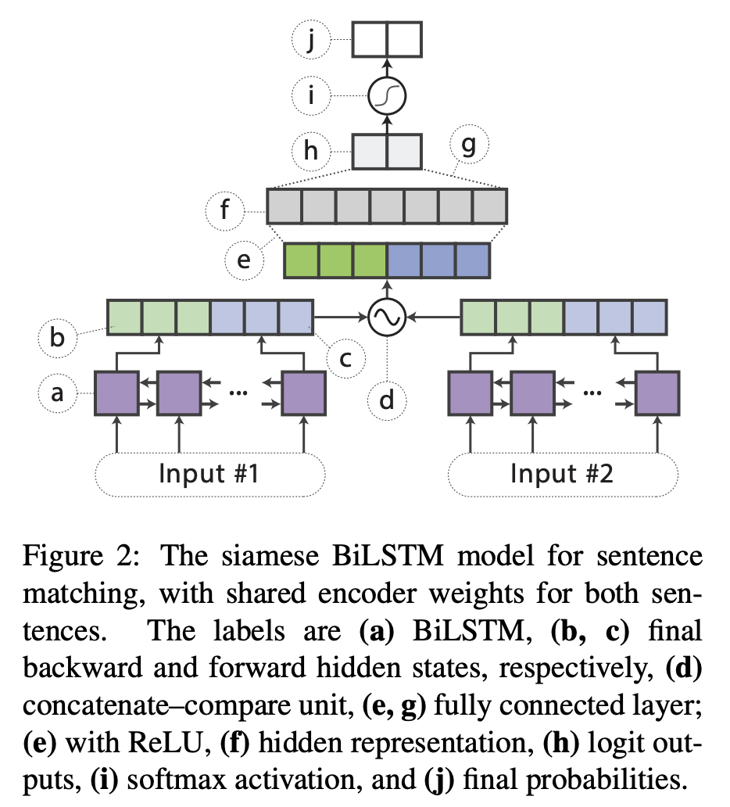

目录

<!-- TOC -->

- [LAMB](#lamb)
- [cuBERT](#cubert)
- [distill](#distill)
  - [背景与相关工作](#%e8%83%8c%e6%99%af%e4%b8%8e%e7%9b%b8%e5%85%b3%e5%b7%a5%e4%bd%9c)
    - [模型压缩](#%e6%a8%a1%e5%9e%8b%e5%8e%8b%e7%bc%a9)
  - [网络结构与方法](#%e7%bd%91%e7%bb%9c%e7%bb%93%e6%9e%84%e4%b8%8e%e6%96%b9%e6%b3%95)
  - [distill目标](#distill%e7%9b%ae%e6%a0%87)
  - [用于distill的augmentation](#%e7%94%a8%e4%ba%8edistill%e7%9a%84augmentation)
    - [Masking](#masking)
    - [POS-guided word replacement](#pos-guided-word-replacement)
    - [n-gram sampling](#n-gram-sampling)
    - [整个augmentation的流程](#%e6%95%b4%e4%b8%aaaugmentation%e7%9a%84%e6%b5%81%e7%a8%8b)
- [土豪版：Megatron](#%e5%9c%9f%e8%b1%aa%e7%89%88megatron)

<!-- /TOC -->


更多参考：[https://daiwk.github.io/posts/nlp-paddle-lark.html](https://daiwk.github.io/posts/nlp-paddle-lark.html)

## LAMB

参考[76分钟训练BERT！谷歌大脑新型优化器LAMB加速大批量训练](https://mp.weixin.qq.com/s?__biz=MzA3MzI4MjgzMw==&mid=2650759697&idx=1&sn=fe72aacd339307eca4ca79da19375526&chksm=871aa66fb06d2f796cfda4649fc084f31ec74281a0862af59a42b8ccacb57f4bbdce257de29e&mpshare=1&scene=1&srcid=&pass_ticket=7xdQ1FGMEYoqdGrXJFR19sivsW6Crb87wS1sHZF8wBLs7ph%2Fdoe7AQvztk%2FA3Q8h#rd)

论文：[Reducing BERT Pre-Training Time from 3 Days to 76 Minutes](https://arxiv.org/abs/1904.00962)

## cuBERT

[https://github.com/zhihu/cuBERT](https://github.com/zhihu/cuBERT)

## distill

[Distilling Task-Specific Knowledge from BERT into Simple Neural Networks](https://arxiv.org/pdf/1903.12136.pdf)

首先，distill相关的可以参考[https://daiwk.github.io/posts/dl-knowledge-distill.html](https://daiwk.github.io/posts/dl-knowledge-distill.html)

### 背景与相关工作

要进行distill就需要大量的无标签数据，然后让大模型给出logits，但nlp领域不像图像，可以简单地data augmentation。传统的nlp的data augmentation通常是task-specific的（例如[GLUE: A multi-task benchmark and analysis platform for natural language understanding](https://arxiv.org/abs/1804.07461)，或者[Generating factoid questions with recurrent neural networks: The 30m factoid question-answer corpus](https://www.aclweb.org/anthology/P16-1056)），本文提出了一个rule-based的用来构建transfer set的data augmentation方法。

#### 模型压缩

开山之作是lecun在1990年的[Optimal brain damage](http://yann.lecun.com/exdb/publis/pdf/lecun-90b.pdf)，提出了一个local error-based的方法来剪枝不重要的weight。

2015年的[Compressing deep neural networks with pruning, trained quantization and Huffman coding](https://arxiv.org/abs/1510.00149)提出了一个简单的压缩pipeline，可以把模型大小缩小40倍，且不对准确率造成损伤。

但上面的这些方法会引入高度不规则的稀疏性（highly irregular sparsity），阻止了高度优化的计算routines。

所以其他人会使用一些以设备为中心的指标（ targeting device-centric metrics），例如浮点数运算（[FLOPs as a direct optimization objective for learning sparse neural networks](https://arxiv.org/pdf/1811.03060.pdf)），或者响应时间（[Constraint-aware deep neural network compression](http://openaccess.thecvf.com/content_ECCV_2018/papers/Changan_Chen_Constraints_Matter_in_ECCV_2018_paper.pdf)），来直接把整个filters剪枝掉（如[Pruning filters for efficient convnets](https://arxiv.org/abs/1608.08710)，或者[Learning efficient convolutional networks through network slimming](https://arxiv.org/abs/1708.06519)）。

还有些人直接研究量子神经网络（如[Training and inference with integers in deep neural networks](https://arxiv.org/abs/1802.04680)）。甚至还有提出用二进制权重和激活的二进制网络来搞，[Binarized neural networks: Training deep neural networks with weights and activations constrained to +1 or -1](https://arxiv.org/abs/1602.02830)

而distill的方法能将大模型(teacher)的知识transfer到一个完全不同结构的小模型(student)中，在nlp领域已经有两个例子了：机器翻译的[Sequence level knowledge distillation](https://arxiv.org/abs/1606.07947)，还有语言模型的[On-device neural language model based word prediction](https://aclweb.org/anthology/C18-2028)。

### 网络结构与方法

拆成两大步：

+ 加上logits-regression objective
+ 建立transfer set，对训练集做augmentation从而可以让knowledge transfer更有效

bert模型对一个句子或者pair，会产出一个特征向量`\(\boldsymbol{h} \in \mathbb{R}^{d}\)`，我们基于这个向量来构建分类器：

+ **单个句子的分类**：直接加一个softmax层，`\(\boldsymbol{y}^{(B)}=\operatorname{softmax}(W \boldsymbol{h})\)`，其中`\(W \in \mathbb{R}^{k \times d}\)`是softmax层的权重矩阵，`\(k\)`是label数
+ **句子pair的任务**：将两句话的feature进行concat，然后扔给一个softmax层

训练阶段，同时finetune bert的参数和softmax层的参数，目标是label的cross-entropy loss。

student模型

+ **单个句子的分类**：如下图，word emb之后接一个双向lstm，两个方向的输出concat到一起，然后接全连接(用的Relu)，然后再接softmax。

<html>
<br/>


<br/>

</html>

+  **句子pair的任务**：如下图，对两个sentence encoder使用siamese结构我双向lstm，分别产生`\(\boldsymbol{h}_{s_1}\)`和`\(\boldsymbol{h}_{s_2}\)`，然后做一个标准的concatenate–compare操作（参考[GLUE: A multi-task benchmark and analysis platform for natural language understanding](https://arxiv.org/abs/1804.07461)），即`\(f\left(\boldsymbol{h}_{s 1}, \boldsymbol{h}_{s 2}\right)=\left[\boldsymbol{h}_{s 1}, \boldsymbol{h}_{s 2}, \boldsymbol{h}_{s 1} \odot\right. \boldsymbol{h}_{s 2},\left|\boldsymbol{h}_{s 1}-\boldsymbol{h}_{s 2}\right| ]\)`，其中`\(\odot\)`是element wise乘积，然后把这个结果给一个relu的分类器。

<html>
<br/>


<br/>

</html>

### distill目标

softmax的输入也就是logits是`\(z=w^Th\)`，输出是：

`\[
\widetilde{y}_{i}=\operatorname{softmax}(\boldsymbol{z})=\frac{\exp \left\{\boldsymbol{w}_{i}^{\top} \boldsymbol{h}\right\}}{\sum_{j} \exp \left\{\boldsymbol{w}_{j}^{\top} \boldsymbol{h}\right\}}
\]`

本文使用Caruana等人的[Do deep nets really need to be deep?](https://arxiv.org/abs/1312.6184)方法，distillation objective是student和teacher的logits的mse：

`\[
\mathcal{L}_{\text { distill }}=\left\|\boldsymbol{z}^{(B)}-\boldsymbol{z}^{(S)}\right\|_{2}^{2}
\]`

其中，`\(\boldsymbol{z}^{(B)}\)`是teacher的logit，`\(\boldsymbol{z}^{(S)}\)`是student的logit。其他方法比如hinton在2015年的[Distilling the knowledge in a neural network](https://arxiv.org/abs/1503.02531)使用soft target的cross entropy也是可行的，但在这个任务上效果还是mse稍好一点。

训练的时候，这个distillation objective可以和传统的针对one-hot的label的cross-entropy一起用：

`\[
\begin{aligned} \mathcal{L} &=\alpha \cdot \mathcal{L}_{\mathrm{CE}}+(1-\alpha) \cdot \mathcal{L}_{\mathrm{distill}} \\=&-\alpha \sum_{i} \log y_{i}^{(S)}-(1-\alpha)\left\|z^{(B)}-z^{(S)}\right\|_{2}^{2} \end{aligned}
\]`

实验结果显示，`\(\alpha\)`设成0的时候，也就是**只使用distill的loss，效果最好。**

+ 对于有label的数据集，one-hot target `\(t\)`直接用ground-truth的label
+ 对于无label的数据集，可以直接用teacher的预估label：`\(t_{i}=1\ if\ i=\operatorname{argmax} y^{(B)}\)`，否则就是0


### 用于distill的augmentation

随机使用以下几个操作之一：

#### Masking

以`\(p_{\text { mask }}\)`的概率，随机地将一个词替换为```[MASK]```，在student模型里就是```[UNK]```，而在bert中就是mask。这个规则能够clarify每个词对label的贡献，例如，teacher网络对于```I [MASK] the comedy```产生的logits比```“I loved the comedy```产出的logits要低。

#### POS-guided word replacement

以`\(p_{\text { pos }}\)`的概率，随机地把一个词替换成相同POS(part-of-speech) tag的另一个词（如，把how替换成what）。为了保持原始的训练集的分布，新词从使用POS tag进行re-normalize的unigram的分布中采样出来。

#### n-gram sampling

以`\(p_{\text { ng }}\)`的概率，从`\(\{1,2, \dots, 5\}\)`中随机选一个`\(n\)`，然后随机采样出一个ngram。这种方法相当于随机扔掉句子的其他部分，是一种更aggressive的masking。

#### 整个augmentation的流程

给定一个训练样本`\(\left\{w_{1}, \dots w_{n}\right\}\)`，整个augmentation的过程如下：

+ 对每个词`\(w_i\)`从uniform distribution `\(X_{i} \sim \mathrm{UNIFORM}[0,1]\)`中采样出一个`\(X_i\)`如下操作
    + 如果`\(X_{i}<p_{\mathrm{mask}}\)`，对`\(w_i\)`进行masking
    + 如果`\(p_{\text { mask }} \leq X_{i}<p_{\mathrm{mask}}+p_{\mathrm{pos}}\)`，那么对`\(w_i\)`使用POS-guided word replacement
+ 对这个样本的每个词处理完之后，以`\(p_{\text { ng }}\)`的概率，使用n-gram sampling，然后把结果加到augmented数据集中（无标签）

然后使用`\(n_{\text { iter }}\)`次如上操作，得到`\(n_{\text { iter }}\)`个augmented的sample。


## 土豪版：Megatron

[https://github.com/NVIDIA/Megatron-LM](https://github.com/NVIDIA/Megatron-LM)

[有钱任性：英伟达训练80亿参数量GPT-2，1475块V100 53分钟训练BERT](https://mp.weixin.qq.com/s/8qJqP9gWook8VhtQQnWDxw)

+ 将BERT的训练时间缩短到了53分钟；
+ 将BERT的推理时间缩短到了2.2毫秒（10 毫秒已经是业界公认的高水平）；
+ 将GPT-2的参数量推向80亿（以前OpenAI GPT-2最大为15亿参数量）。

最大配置：72层、每层隐藏单元都是3072

[想效仿英伟达50分钟训练 BERT？只有GPU还不够……](https://mp.weixin.qq.com/s/MWaJP283qQrhs1VvyF0SrQ)

论文：[Megatron-LM: Training Multi-Billion Parameter Language Models Using GPU Model Parallelism](https://arxiv.org/abs/1909.08053v1)

该方法无需新的编译器或库更改，它与 pipeline 模型并行正交且互补，只需在 PyTorch 中嵌入几个通信操作即可完整实现。利用该方法，研究者使用 512 个 GPU 收敛了一个具备 83 亿参数的 transformer 语言模型，该模型是目前最大的 transformer 模型，其规模是 BERT 的 24 倍，GPT-2 的 5.6 倍。

为了展示该方法的可扩展性，研究者建立了一个基线：他们在单个 NVIDIA V100 32GB GPU 上训练了一个具备 12 亿参数的模型，整个训练应用维持 39 TeraFLOPs/秒的性能，是单个 GPU 在 DGX-2H 服务器上运行的理论峰值 FLOPS 的 30%，因此这是一个非常强大的基线模型。将该模型扩展至 83 亿参数，并使用 8-way 模型并行化在 512 个 GPU 上进行训练，达到了 15.1 PetaFLOPs/秒的性能。与单个 GPU 的情况相比，它实现了 76% 的扩展效率。在 174 GB 文本数据上收敛该模型需要以 12 ZettaFLOPs 训练 9.2 天。

研究者利用 transformer 网络的结构，仅添加几个同步基元（synchronization primitives）即创建出一个简单的模型并行化实现。他们对 transformer 中的自注意力模块和多层感知机（MLP）模块均采用了模型并行化。

模型并行与数据并行是正交的，因此我们可以同时使用二者在合理时间内训练大型模型。

