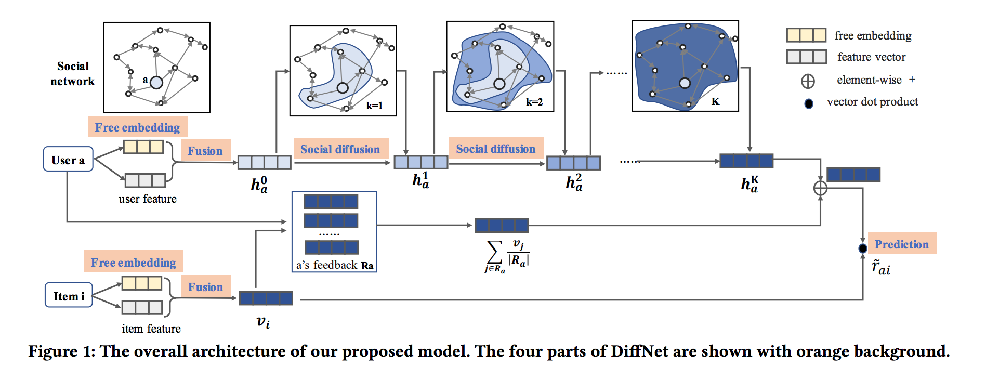

目录

<!-- TOC -->

- [DiffNet](#diffnet)
- [DGRec](#dgrec)
- [IGPL](#igpl)
- [GraphRec](#graphrec)
- [DANSER](#danser)
- [NGCF](#ngcf)

<!-- /TOC -->

参考[近期必读的6篇【图神经网络的推荐（GNN+R）】相关论文和代码（WWW、SIGIR、WSDM）](https://mp.weixin.qq.com/s?__biz=MzU2OTA0NzE2NA==&mid=2247510850&idx=1&sn=222f99d740acd50bcbcf5a5745c5d938&chksm=fc864a51cbf1c34739a348177e109d4ff4323f313208c410a44ac6af4cc4e32ad66f6275b235&mpshare=1&scene=1&srcid=&pass_ticket=yi5ku1%2Fs0oomHKKecAzMcpWLxtfI6PDYKYJn%2BWzsyCs3SOPlL0ZxjXuFZUZ2FS5h#rd)

## DiffNet

SIGIR ’19，

[A Neural Influence Diffusion Model for Social Recommendation](https://arxiv.org/pdf/1904.10322.pdf)

社交推荐系统利用每个用户的局部邻居偏好(local neighbors’ preferences)来缓解数据稀疏性，从而更好地进行用户emb建模。对于每一个社交平台的用户，其潜在的嵌入是受他信任的用户影响的，而这些他信任的用户也被他们自己的社交联系所影响。随着社交影响在社交网络中递归传播和扩散（diffuse），每个用户的兴趣在递归过程中发生变化。然而，目前的社交推荐模型只是利用每个用户的**局部邻居**来构建**静态模型**，没有模拟全局社交网络中的**递归扩散**，导致推荐性能不理想。

本文提出了一个deep influence propagation model。对于每个用户，扩散过程（diffusion）用融合了相关特征和一个caputure了latent behavior preference的free的用户隐向量。本文的key idea是，设计了一个layer-wise的influence propagation结构，可以随着social diffusion process的进行，对用户emb进行演化。

<html>
 

 
</html>

## DGRec

WSDM ’19，

[Session-based Social Recommendation via Dynamic Graph Attention Networks](https://arxiv.org/abs/1902.09362v2)

代码：[https://github.com/DeepGraphLearning/RecommenderSystems/tree/master/socialRec](https://github.com/DeepGraphLearning/RecommenderSystems/tree/master/socialRec)

## IGPL

[Inductive Graph Pattern Learning for Recommender Systems Based on a Graph Neural Network](https://arxiv.org/abs/1904.12058v1)

## GraphRec

WWW'19，

[Graph Neural Networks for Social Recommendation](https://arxiv.org/pdf/1902.07243.pdf)

## DANSER

WWW'19 Oral

[Dual Graph Attention Networks for Deep Latent Representation of Multifaceted Social Effects in Recommender Systems](https://arxiv.org/abs/1903.10433)

## NGCF

SIGIR'19

[Neural Graph Collaborative Filtering](https://www.comp.nus.edu.sg/~xiangnan/papers/sigir19-NGCF.pdf)
