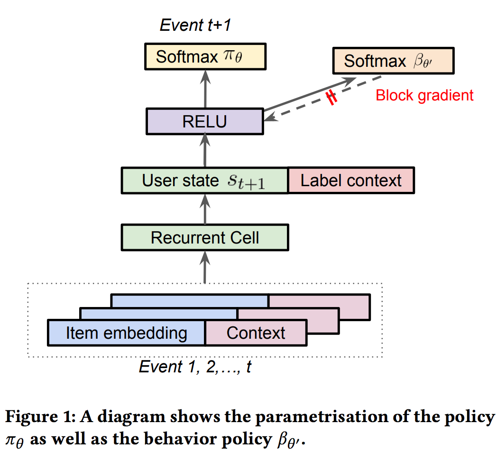

目录

<!-- TOC -->

<!-- /TOC -->

[Top-K Off-Policy Correction for a REINFORCE Recommender System](https://arxiv.org/pdf/1812.02353.pdf)

视频链接：[Reinforcement Learning for Recommender Systems: A Case Study on Youtube](https://www.youtube.com/watch?v=HEqQ2_1XRTs)

参考[Youtube推荐已经上线RL了，强化学习在推荐广告工业界大规模应用还远吗？](https://zhuanlan.zhihu.com/p/69559974)

google的ai blog也说到了off-policy的分类方法，可以预测出哪种机器学习模型会产生最好结果。参考[https://ai.googleblog.com/2019/06/off-policy-classification-new.html](https://ai.googleblog.com/2019/06/off-policy-classification-new.html)

Youtube推荐系统架构主要分为两层：召回和排序。本文中的算法应用在**召回**侧。

建模思路是给定用户的**行为历史**，预测用户**下一次的点击item**。

受限于On-Policy方法对系统训练架构要求复杂，所以本文采用Off-Policy的训练策略，即，并不是根据用户的交互进行实时的策略更新，而是根据**收集到日志中用户反馈**进行**模型训练**。

假设同时展示K个不重复item的reward奖励等于每个item的reward的之和，

而offpolicy的训练方式，对policy gradient类的模型训练会带来如下问题：

+ 策略梯度是由不同的policy计算出来的
+ 同一个用户的行为历史也收集了其他召回策略的数据。（没看懂。。）

然后作者就提出了基于importance weighting的Off-Policy修正方案，对pg的计算进行一阶逼近：

`\[
\prod_{t^{\prime}=0}^{|\tau|} \frac{\pi\left(a_{t^{\prime}} | s_{t^{\prime}}\right)}{\beta\left(a_{t^{\prime}} | s_{t^{\prime}}\right)} \approx \prod_{t^{\prime}=0}^{t} \frac{\pi\left(a_{t^{\prime}} | s_{t^{\prime}}\right)}{\beta\left(a_{t^{\prime}} | s_{t^{\prime}}\right)}=\frac{P_{\pi_{\theta}}\left(s_{t}\right)}{P_{\beta}\left(s_{t}\right)} \frac{\pi\left(a_{t} | s_{t}\right)}{\beta\left(a_{t} | s_{t}\right)} \approx \frac{\pi\left(a_{t} | s_{t}\right)}{\beta\left(a_{t} | s_{t}\right)}
\]`

最终可以得到一个低variance的策略梯度的biased estimator：

`\[
\sum_{\tau \sim \beta}\left[\sum_{t=0}^{|\tau|} \frac{\pi_{\theta}\left(a_{t} | s_{t}\right)}{\beta\left(a_{t} | s_{t}\right)} R_{t} \nabla_{\theta} \log \pi_{\theta}\left(a_{t} | s_{t}\right)\right]
\]`

注：随机策略梯度就有这么个重要性权重，应该是类似的思路吧。。[https://daiwk.github.io/posts/rl-stepbystep-chap9.html#31-%E9%9A%8F%E6%9C%BA%E7%AD%96%E7%95%A5ac%E6%96%B9%E6%B3%95](https://daiwk.github.io/posts/rl-stepbystep-chap9.html#31-%E9%9A%8F%E6%9C%BA%E7%AD%96%E7%95%A5ac%E6%96%B9%E6%B3%95)

因为是基于用户的交互历史预测下一个用户点击的item，所以文中也采用RNN针对用户State的转换进行建模。文中提到实验了包括LSTM、GRU等RNN单元，发现Chaos Free的RNN单元([A recurrent neural network without chaos](https://arxiv.org/abs/1612.06212))因为稳定高效而使用起来效果最好。

上面那个公式里，最难获取到的是**用户的行为策略**，理想情况下是收集日志的时候同时把用户相应的用户策略也就是点击概率给收集下来，但由于策略不同等客观原因文中针对用户的行为策略使用另外一组`\(\theta '\)`参数进行预估，而且**防止它的梯度回传**影响主RNN网络的训练。

<html>
 

 
</html>

在推荐系统中，用户可以同时看到**k个**展示给用户的**候选item**，用户可能同时与一次展示出来的多个item进行交互。因此需要扩展策略根据用户的行为历史**预测下一次**用户**可能点击的top-K个item**。

假设**同时展示K个不重复**item的reward奖励等于**每个item的reward的之和**，这样，Top-K的Off-Policy修正的策略梯度如下：

`\[
\begin{aligned} & \sum_{\tau \sim \beta}\left[\sum_{t=0}^{|\tau|} \frac{\alpha_{\theta}\left(a_{t} | s_{t}\right)}{\beta\left(a_{t} | s_{t}\right)} R_{t} \nabla_{\theta} \log \alpha_{\theta}\left(a_{t} | s_{t}\right)\right] \\=& \sum_{\tau \sim \beta}\left[\sum_{t=0}^{|\tau|} \frac{\pi_{\theta}\left(a_{t} | s_{t}\right)}{\beta\left(a_{t} | s_{t}\right)} \frac{\partial \alpha\left(a_{t} | s_{t}\right)}{\partial \pi\left(a_{t} | s_{t}\right)} R_{t} \nabla_{\theta} \log \pi_{\theta}\left(a_{t} | s_{t}\right)\right] \end{aligned}
\]`

与上面Top 1的修正公式相比主要是多了一个包含K的系数。也就是说，**随着K的增长**，策略梯度会比原来的公式**更快地降到0**。
