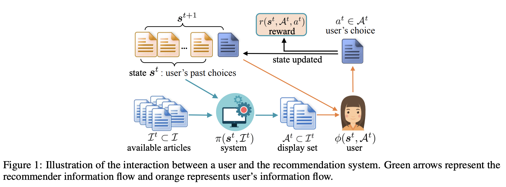
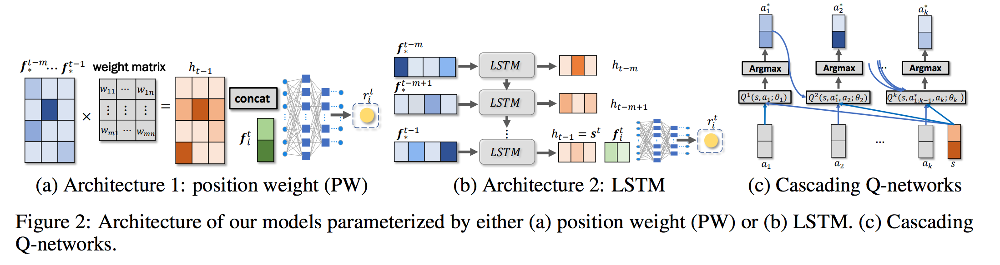

目录

<!-- TOC -->

- [简介](#%E7%AE%80%E4%BB%8B)
- [Setting和RL Formulation](#setting%E5%92%8Crl-formulation)
- [Generative Adversarial User Model](#generative-adversarial-user-model)
  - [User Behavior As Reward Maximization](#user-behavior-as-reward-maximization)
  - [Model Parameterization](#model-parameterization)
  - [Generative Adversarial Training](#generative-adversarial-training)
- [Cascading RL Policy for Recommendation](#cascading-rl-policy-for-recommendation)
  - [Cascading Q-Networks](#cascading-q-networks)
  - [Parameterization and Estimation](#parameterization-and-estimation)

<!-- /TOC -->

参考[ICML 2019 \| 强化学习用于推荐系统，蚂蚁金服提出生成对抗用户模型](https://mp.weixin.qq.com/s?__biz=MzA3MzI4MjgzMw==&mid=2650763260&idx=3&sn=ae589196211189a8aba6f56a11e2cccb&chksm=871aab82b06d22942d37c9b6efe33cd9647050599f293e59ffc8ababeedb9f8c80afbd80b509&scene=0&xtrack=1&pass_ticket=TloMdmvUbLd5jnKvVTzrccQhGuskwL6KQ0HhJLF56Nwtcb16%2BVvMA09bw32tFrjs#rd)

[Generative Adversarial User Model for Reinforcement Learning Based Recommendation System](https://arxiv.org/pdf/1812.10613.pdf)

## 简介

本文提出利用**生成对抗网络**同时学习**用户行为模型transition**以及**奖励函数reward**。将该**用户模型**作为强化学习的**模拟环境**，研究者开发了全新的**Cascading-DQN**算法，从而得到了可以**高效处理大量候选**物品的**组合推荐**策略。

本文用真实数据进行了实验，发现和其它相似的模型相比，这一**生成对抗用户模型**可以**更好地解释用户行为**，而基于该模型的RL策略可以给用户带来**更好的长期收益**，并给系统提供**更高的点击率**。

RL在推荐场景中有以下问题：

+ 首先，驱动用户行为的兴趣点**（奖励函数）一般是未知的**，但它对于 RL 算法的使用来说至关重要。在用于推荐系统的现有RL算法中，奖励函数一般是**手动设计的（例如用 ±1 表示点击或不点击）**，这可能无法反映出用户对不同项目的偏好如何(如[Deep Reinforcement Learning for Page-wise Recommendations](https://arxiv.org/abs/1805.02343))。
+ 其次，**无模型**RL一般都需要**和环境（在线用户）进行大量的交互**才能学到良好的策略。但这在推荐系统设置中是不切实际的。如果推荐看起来比较随机或者推荐结果不符合在线用户兴趣，他会很快**放弃**!!这一服务。

为了解决**无模型**方法**样本复杂度大**的问题，**基于模型**的RL方法更为可取。近期有一些研究，在robotics applications中，在**相关但不相同**的**环境**设置中训练机器人策略，结果表明**基于模型**的RL**采样效率更高**。如[Neural Network Dynamics for Model-Based Deep Reinforcement Learning with Model-Free Fine-Tuning](https://arxiv.org/abs/1708.02596)，还有[Gaussian Processes for Data-Efficient Learning in Robotics and Control](https://www.doc.ic.ac.uk/~mpd37/publications/pami_final_w_appendix.pdf)，还有[ Learning to adapt: Meta-learning for model-based control](https://arxiv.org/abs/1803.11347)。

基于模型的方法的优势在于可以**池化**大量的**off-policy数据**，而且可以用这些数据学习良好的环境动态模型，而无模型方法只能用**昂贵的on-policy**数据学习。但之前基于模型的方法一般都是根据物理或高斯过程设计的，而**不是根据用户行为的复杂序列**定制的。

本文的框架用统一的minimax框架学习**用户行为模型**和相关的**奖励函数**，然后再用这个模型**学习RL策略**。

主要贡献如下：

+ 开发了生成对抗学习（GAN）方法来对用户行为动态性(dynamics)建模，并recover奖励函数。可以通过**联合的minimax优化算法**同时评估这两个组件。该方法的优势在于：
    + 可以得到**更predictive(可预测的？)的用户模型**，而且可以用**与用户模型一致**的方法**学习奖励函数**；
    + 相较于手动设计的简单奖励函数，**从用户行为中学习到的奖励函数**更**有利于**后面的**强化学习**；
    + 学习到的用户模型使研究者能够为**新用户**执行基于模型的RL和在线适应从而实现更好的结果。
+ 用这一模型作为模拟环境，研究者还开发了**级联DQN**(cascade dqn)算法来获得组合推荐策略。**动作-值函数**的**级联设计**允许其在**大量候选物品**中找到要展示的物品的**最佳子集**，其**时间复杂度**和**候选物品的数量**呈**线性关系**，大大减少了计算难度。

用真实数据进行实验得到的结果表明，从保留似然性和点击预测的角度来说，这种生成对抗模型可以**更好地拟合用户行为**。根据学习到的用户模型和奖励，研究者发现评估推荐策略可以给用户带来**更好的长期累积奖励**。此外，在**模型不匹配**的情况下，基于模型的策略也能够**很快地适应新动态**（和无模型方法相比，**和用户交互的次数要少得多**）。

<html>
 

 
</html>

图中绿线是推荐的信息流，黄线是用户的信息流。

## Setting和RL Formulation

setting：给用户展示了`\(k\)`个item，然后他点了**1个或者0个**，然后展示后`\(k\)`个item。

简单来讲，RL框架就是，推荐系统会在用户状态`\(\mathcal{s}\)`下，采用策略`\(\pi(\boldsymbol{s}, \mathcal{I})\)`来从集合`\(\mathcal{I}\)`中进行选择，使得如下的用户长期累积reward最大：

`\[
 \pi^{*}=\underset{\pi\left(\boldsymbol{s}^{t}, \mathcal{I}^{t}\right)}{\arg \max } \mathbb{E}\left[\sum_{t=0}^{\infty} \gamma^{t} r\left(\boldsymbol{s}^{t}, a^{t}\right)\right]
 \]`

其中，`\(s^{0} \sim p^{0}\)`，`\(\mathcal{A}^{t} \sim \pi\left(s^{t}, \mathcal{I}^{t}\right)\)`，`\(\boldsymbol{s}^{t+1} \sim P\left(\cdot | \boldsymbol{s}^{t}, \mathcal{A}^{t}\right)\)`，`\(a^{t} \in \mathcal{A}^{t}\)`。

+ 环境：在推荐的每一页的`\(k\)`个item中可以点击其中一个的用户
+ 状态`\(\boldsymbol{s}^{t} \in \mathcal{S}\)`：用户**历史点击**的一个**有序序列**
+ 动作`\(\mathcal{A}^{t} \in\left(\begin{array}{c}{\mathcal{I}^{t}} \\ {k}\end{array}\right)\)`：推荐系统从`\(\mathcal{I}^{t}\)`个候选中选择`\(k\)`个候选的**子集**。其中，`\(\left(\begin{array}{c}{\mathcal{I}^{t}} \\ {k}\end{array}\right)\)`表示`\(\mathcal{I}^{t}\)`中的所有的`\(k\)`元素子集。而`\(\mathcal{I}^{t} \subset \mathcal{I}\)`是所有候选`\(\mathcal{I}\)`在时间步`\(t\)`的候选子集。
+ 状态转移`\(P\left(\cdot | s^{t}, \mathcal{A}^{t}\right) : \mathcal{S} \times\left(\begin{array}{l}{\mathcal{I}} \\ {k}\end{array}\right) \mapsto \mathcal{P}(\mathcal{S})\)`：给定状态`\(\mathcal{s}^{t}\)`，以及展示的集合`\(\mathcal{A}^{t}\)`的情况下，转移到状态`\(\boldsymbol{s}^{t+1}\)`的转移概率。等价于[下文](#user-behavior-as-reward-maximization)提到的在用户行为上的分布`\(\phi\left(s^{t}, \mathcal{A}^{t}\right)\)`
+ 奖励函数`\(r\left(\boldsymbol{s}^{t}, \mathcal{A}^{t}, a^{t}\right) : \mathcal{S} \times\left(\begin{array}{l}{\mathcal{I}} \\ {k}\end{array}\right) \times \mathcal{I} \mapsto \mathbb{R}\)`：用户在状态`\(\boldsymbol{s}^{t}\)`下，采用动作`\(a^{t} \in \mathcal{A}^{t}\)`得到的回报。在这里假设推荐系统得到的回报和用户得到的回报一样，所以长期回报也是一样。
+ 策略`\(\mathcal{A}^{t} \sim \pi\left(s^{t}, \mathcal{I}^{t}\right) : \mathcal{S} \times 2^{\mathcal{I}} \mapsto \mathcal{P}\left(\left(\begin{array}{c}{\mathcal{I}_{k}} \\ {k}\end{array}\right)\right)\)`：在用户状态`\(\mathcal{s}^{t}\)`下，从集合`\(\mathcal{I}^{t}\)`中选择子集`\(\mathcal{A}^{t}\)`进行展示的概率。

可见，

+ **环境**、**状态**、**状态转移**与**用户**有关，
+ **行为**、**策略**与**推荐系统**有关。
+ **回报**与**推荐系统**和**用户**均有关。

使用`\(r\left(\boldsymbol{s}^{t}, \mathcal{A}^{t}, a^{t}\right)\)`来强调回报对推荐的action的依赖，也就是说，用户只能从展示的结果集中进行选择。其实，`\(r\left(\boldsymbol{s}^{t}, \mathcal{A}^{t}, a^{t}\right)=r\left(\boldsymbol{s}^{t}, a^{t}\right) \cdot \mathbf{1}\left(a^{t} \in \mathcal{A}^{t}\right)\)`。所以[下文](#user-behavior-as-reward-maximization)在讲用户模型的时候，就使用`\(r\left(\boldsymbol{s}^{t}, a^{t}\right)=r\left(\boldsymbol{s}^{t}, \mathcal{A}^{t}, a^{t}\right)\)`来表示了，假设`\(a^{t} \in \mathcal{A}^{t}\)`是true。

reward函数和transition都是未知的，可以从数据中学习。只要这两个学好了，那么就可以通过使用例如Q-learrning等算法，不断地对模型进行query，来估计上文提到的最优的策略`\( \pi^{*}=\underset{\pi\left(\boldsymbol{s}^{t}, \mathcal{I}^{t}\right)}{\arg \max } \mathbb{E}\left[\sum_{t=0}^{\infty} \gamma^{t} r\left(\boldsymbol{s}^{t}, a^{t}\right)\right]\)`。

## Generative Adversarial User Model

找reward的过程，其实是一个逆向强化学习的过程，可以参考[漫谈逆向强化学习 - A Brief Review to Inverse Reinforcement Learning](https://blog.csdn.net/philthinker/article/details/79778271 )：

什么是逆向强化学习呢？当完成复杂的任务时，强化学习的回报函数很难指定，我们希望有一种方法找到一种高效可靠的回报函数，这种方法就是逆向强化学习。我们假设专家在完成某项任务时，其决策往往是最优的或接近最优的，当所有的策略产生的累积汇报函数期望都不比专家策略产生的累积回报期望大时，强化学习所对应的回报函数就是根据示例学到的回报函数。即逆向强化学习就是**从专家示例中学习回报函数**。当需要基于最优序列样本学习策略时，我们可以结合逆向强化学习和强化学习共同提高回报函数的精确度和策略的效果。

而paper的话，可以看吴恩达的[Algorithms for Inverse Reinforcement Learning](https://ai.stanford.edu/~ang/papers/icml00-irl.pdf)。

受imitation learning的启发，通过**expert demonstration**来学习**序列决策策略(sequential decision-making policies)**，参考Abbeel和吴恩达的[Apprenticeship learning via inverse reinforcement learning](https://ai.stanford.edu/~ang/papers/icml04-apprentice.pdf)【其中的"Apprenticeship"的意思就是学徒】，还有[Model-free imitation learning with policy optimization](https://arxiv.org/abs/1605.08478)，还有[Generative adversarial imitation learning](https://arxiv.org/abs/1606.03476)，还有[Behavioral Cloning from Observation](https://arxiv.org/abs/1805.01954)。因此，本文提出了一个unified mini-max optimization来基于sample trajectories(轨迹)来同时学习用户行为模型和回报函数。

### User Behavior As Reward Maximization

基于如下两个现实(realistic)的假设来对用户行为建模：

+ 用户不是消极的(passive)。当用户看到展现的`\(k\)`个item时，会做出令他自己的回报最大的决定。回报`\(r\)`意味着这个用户对这个item有多感兴趣或者多满意。而如果他都不感兴趣，可以选择都不点。
+ reward不仅和当前这个被选择的item有关，也和用户的历史有关。例如，一个用户听了a的某一首歌，可能他会对a的其他歌也感兴趣；而如果他听了很多a的歌，可能他也会感到厌倦了。这些都是和personal experience有关的。

把点击的item(视为用户的action `\(a^{t}\)`)还有用户的历史(视为状态`\(\mathcal{s}^{t}\)`)都作为reward函数的输入：`\(r\left(s^{t}, a^{t}\right)\)`。而没有点击的item会被视为special item或者action。

假设在session `\(t\)`，展示给用户`\(k\)`个item `\(\mathcal{A}^{t}=\left\{a_{1}, \cdots, a_{k}\right\}\)`，而他们对应的特征是`\(\left\{\boldsymbol{f}_{1}^{t}, \cdots, \boldsymbol{f}_{k}^{t}\right\}\)`。然后他采用可以使自己的期望reward最大的策略`\(\phi^{*}\)`来做出action `\(a^{t} \in \mathcal{A}^{t}\)`。这个策略可以看成是在一个候选action集合`\(\mathcal{A}^{t}\)`上的概率分布：

`\[
\phi^{*}\left(\boldsymbol{s}^{t}, \mathcal{A}^{t}\right)=\arg \max _{\phi \in \Delta^{k-1}} \mathbb{E}_{\phi}\left[r\left(\boldsymbol{s}^{t}, a^{t}\right)\right]-R(\phi) / \eta
\]`

其中，

+ `\(\Delta^{k-1}\)`是probability simplex，也就是概率[单纯形](https://zh.wikipedia.org/wiki/%E5%8D%95%E7%BA%AF%E5%BD%A2)，参考[https://juejin.im/entry/58e09c2cda2f60005fcd5573](https://juejin.im/entry/58e09c2cda2f60005fcd5573)，简单理解好像。。就是`\(k\)`个元素，和为1，所以可以看成是一个概率分布。
+ `\(R(\phi)\)`是一个凸的正则函数。
+ `\(\eta\)`能控制正则化的强度

引理1：假设正则项是`\(R(\phi)=\sum_{i=1}^{k} \phi_{i} \log \phi_{i}\)`，也就是negative Shannon entropy，而且`\(\phi \in \Delta^{k-1}\)`是任意一种mapping。然后这个最优策略有如下逼近形式：

`\[
\phi^{*}\left(\boldsymbol{s}^{t}, \mathcal{A}^{t}\right)_{i}=\exp \left(\eta r\left(\boldsymbol{s}^{t}, a_{i}\right)\right) / \sum_{a_{j} \in \mathcal{A}^{t}} \exp \left(\eta r\left(\boldsymbol{s}^{t}, a_{j}\right)\right)
\]`

进一步地，在每一个session `\(t\)`中，用户的最优策略`\(\phi^{*}\)`与如下离散的choice model是等价的，其中，`\(\varepsilon^{t}\)`服从Gumbel分布（参考[【Learning Notes】Gumbel 分布及应用浅析](https://blog.csdn.net/JackyTintin/article/details/79364490)），wikipedia的解释[https://en.wikipedia.org/wiki/Gumbel_distribution](https://en.wikipedia.org/wiki/Gumbel_distribution)，简单来说是一个极值分布，比如每个点是周围若干个点的max或者min这种。。

`\[
a^{t}=\arg \max _{a \in \mathcal{A}^{t}} \eta r\left(\boldsymbol{s}^{t}, a\right)+\varepsilon^{t}
\]`

如上引理说明了，用户根据reward function去greedily地选择一个item(exploitation)，而其中的Gumbel noise `\(\varepsilon^{t}\)`使得用户可以去deviate(偏差)和explore其他reward相对小一点的item。在经济学模型中，已经有类似的方法了，例如[Maximum score estimation of the stochastic utility model of choice](https://www.sciencedirect.com/science/article/pii/0304407675900329)，还有[Conditional logit analysis of qualitative choice behaviour](https://eml.berkeley.edu/reprints/mcfadden/zarembka.pdf)，但之前的经济学模型并没有把多样的特征还有用户状态的演变考虑进去。可见，`\(\eta\)`越小，越偏向explore。不过，因为每个人的reward也不一样，所以实际应用的时候，简单地设置`\(\eta=1\)`。

注意：

+ 其他的正则`\(R(\phi)\)`也可以用，这样`\(\phi^{*}\)`和`\(r\)`的关系也会变，也就不一定会有那个逼近的形式了
+ 对于用户没有点击任意一个item这种情况，可以看成一直在展现集合`\(\mathcal{A}^{t}\)`中的一个特殊的item。这个item的feature vector可以都搞成0，或者可以把reward定义成一个常量。

### Model Parameterization

使用用户在session `\(t\)`之前历史点击的embedding来表示状态`\(\boldsymbol{s}^{t}\)`，然后基于状态和当前action `\(a^{t}\)`的embedding来定义reward函数`\(r\left(\boldsymbol{s}^{t}, a^{t}\right)\)`。

定义用户的状态`\(\boldsymbol{s}^{t} :=h\left(\boldsymbol{F}_{*}^{1 : t-1} :=\left[\boldsymbol{f}_{*}^{1}, \cdots, \boldsymbol{f}_{*}^{t-1}\right]\right)\)`，其中每一个`\(\boldsymbol{f}_{*}^{\tau} \in \mathbb{R}^{d}\)`是session `\(\tau\)`的点击item的特征向量，`\(h(\cdot)\)`是一个embedding函数，本文提出了一种简单且有效的position weighting scheme。`\(\boldsymbol{W} \in \mathbb{R}^{m \times n}\)`是一个行数`\(m\)`是一个固定的历史的时间步数，而`\(n\)`列里每一列与positions上的importance weights的集合有关。所以embedding函数`\(h \in \mathbb{R}^{d n \times 1}\)`可以设计成如下形式：

`\[
\boldsymbol{s}^{t}=h\left(\boldsymbol{F}_{*}^{t-m : t-1}\right) :=\operatorname{vec}\left[\sigma\left(\boldsymbol{F}_{*}^{t-m : t-1} \boldsymbol{W}+\boldsymbol{B}\right)\right]
\]`

其中，`\(\boldsymbol{B} \in \mathbb{R}^{d \times n}\)`是一个bias矩阵。`\(\sigma(\cdot)\)`是非线性变换。`\(\operatorname{vec}[\cdot]\)`把输入矩阵的列concate到一起，形成一个长向量。当然，也可以使用LSTM来对历史进行建模。但position weighting scheme是浅层网络，比RNN在前向计算和反向传播上都更加高效。

<html>
 

 
</html>

接下来，定义reward函数还有用户行为模型。

用户的选择`\(a^{t} \in \mathcal{A}^{t}\)`和特征是`\(\boldsymbol{f}_{a^{t}}^{t}\)`的item有关，所以，reward定义如下：

`\[
r\left(\boldsymbol{s}^{t}, a^{t}\right) :=\boldsymbol{v}^{\top} \sigma\left(\boldsymbol{V}\left[\begin{array}{c}{\boldsymbol{s}^{t}} \\ {\boldsymbol{f}_{a^{t}}^{t}}\end{array}\right]+\boldsymbol{b}\right)
\]`

用户行为模型如下：

`\[
\phi\left(s, \mathcal{A}^{t}\right) \propto \exp \left(\boldsymbol{v}^{\prime \top} \sigma\left(\boldsymbol{V}^{\prime}\left[\begin{array}{c}{\boldsymbol{s}^{t}} \\ {\boldsymbol{f}_{a^{t}}^{t}}\end{array}\right]+\boldsymbol{b}^{\prime}\right)\right)
\]`

其中，`\(\boldsymbol{V}, \boldsymbol{V}^{\prime} \in \mathbb{R}^{\ell \times(d n+d)}\)`是权重矩阵，而`\(\boldsymbol{b}, \boldsymbol{b}^{\prime} \in \mathbb{R}^{1 \times(d n+d)}\)`是bias**向量**，`\(\boldsymbol{v}, \boldsymbol{v}^{\prime} \in \mathbb{R}^{\ell}\)`是最终的regression参数。

为了简化一点，把reward的所有参数定义为`\(\theta\)`，而用户模型的所有参数定义为`\(\alpha\)`，因此，reward就是`\(r_{\theta}\)`，而用户模型就是`\(\phi_{\alpha}\)`。

自己来梳理一下。。有m个时间步，每个时间步的f是d维的，所以F是mxd，而w是mxn，所以乘完后是个dxn，然后这个vec的操作就是把n列竖着叠到一起，变成一个dnx1的向量。这就是s。然后那个s,f呢，f只是一个item，所以是d维，而s是dnx1，把这两个竖着叠在一起就是(dn+1)xd=dn+d这么多行，所以V就是lx(dn+d)。V乘以s和f的那个，出来就是一个lx1的。最后的r是一个标量吧。

### Generative Adversarial Training

上面提到的reward函数`\(r\left(s^{t}, a^{t}\right)\)`和用户行为模型`\(\phi\left(s^{t}, \mathcal{A}^{t}\right)\)`均是未知的，需要从数据中学习。用户行为模型`\(\phi\)`试图模仿真实用户最大化其reward `\(r\)`的真实action序列。根据gan的术语，

+ `\(\phi\)`可以看做是一个generator。基于用户的历史，产生用户的下一个行为。参数是`\(\alpha\)`，要让把假的当成真实最大，所以在下面的式子里，需要`\(\alpha\)`最大！
+ `\(r\)`可以看做是一个discriminator，试图分辨出用户的真实行为与generator产生的用户行为。参数是`\(\theta\)`，要让把真实的当成真实最大，而下面的式子第二项前有个负号，所以要`\(\theta\)`最小。。

给定一个有`\(T\)`个已观测action的轨迹(trajectory)`\(\left\{a_{\text {true}}^{1}, a_{\text {true}}^{2}, \ldots, a_{\text {true}}^{T}\right\}\)`，以及对应的点击item的特征`\(\left\{\boldsymbol{f}_{*}^{1}, \boldsymbol{f}_{*}^{2}, \ldots, \boldsymbol{f}_{*}^{T}\right\}\)`，解决如下mini-max的优化问题：

`\[
\begin{aligned} \min _{\theta} \max _{\alpha}\left(\mathbb{E}_{\phi_{\alpha}}\right.&\left[\sum_{t=1}^{T} r_{\theta}\left(\boldsymbol{s}_{\text {true}}^{t}, a^{t}\right)\right]-R\left(\phi_{\alpha}\right) / \eta ) -\sum_{t=1}^{T} r_{\theta}\left(\boldsymbol{s}_{\text {true}}^{t}, a_{\text {true}}^{t}\right) \end{aligned}
\]`

其中，`\(\boldsymbol{s}_{\text {true}}^{t}\)`用来强调这是观测到的数据。上式前面那项是基于真实state使用用户模型产出的action得到的reward，也就是正常gan里的D(G(z))，后面一项是真实的state下真实action的reward，也就是正常gan里的D(x)。

对于一般化的正则项`\(R\left(\phi_{\alpha}\right)\)`，mini-max的优化问题并没有一个逼近形式，所以需要通过交替更新`\(\phi_{\alpha}\)`和`\(r_{\theta}\)`：

`\[
\left\{\begin{array}{l}{\alpha \leftarrow \alpha+\gamma_{1} \nabla_{\alpha} \mathbb{E}_{\phi_{\alpha}}\left[\sum_{t=1}^{T} r_{\theta}\right]-\gamma_{1} \nabla_{\alpha} R\left(\phi_{\alpha}\right) / \eta} \\ {\theta \leftarrow \theta-\gamma_{2} \mathbb{E}_{\phi_{\alpha}}\left[\sum_{t=1}^{T} \nabla_{\theta} r_{\theta}\right]+\gamma_{2} \sum_{t=1}^{T} \nabla_{\theta} r_{\theta}}\end{array}\right.
\]`

这个更新过程可能不一定会stable，因为这本身可能是一个非凸问题。所以可以在初始化的时候加个特殊的正则。对于entropy的正则，有个如下引理2的逼近形式：

引理2：假设正则项是`\(R(\phi)=\sum_{i=1}^{k} \phi_{i} \log \phi_{i}\)`，而`\(\Phi\)`包含了所有的从`\(\mathcal{S} \times\left(\begin{array}{l}{\mathcal{I}} \\ {k}\end{array}\right)\)`映射到`\(\Delta^{k-1}\)`的mapping。那么如上的优化问题可以等价为如下最大化likelihood的估计：

`\[
\max _{\theta \in \Theta} \prod_{t=1}^{T} \frac{\exp \left(\eta r_{\theta}\left(s_{t r u e}^{t}, a_{t r u e}^{t}\right)\right)}{\sum_{a^{t} \in \mathcal{A}^{t}} \exp \left(\eta r_{\theta}\left(s_{t r u e}^{t}, a^{t}\right)\right)}
\]`

当entropy正则的reward函数学习完了之后，能用来对其他形式的正则进行初始化。

## Cascading RL Policy for Recommendation

aaa

### Cascading Q-Networks

### Parameterization and Estimation

