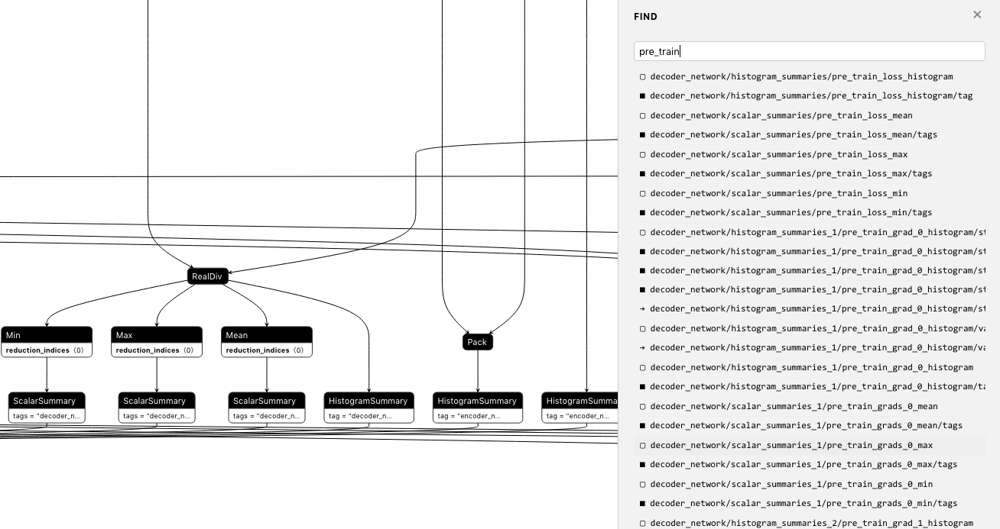

目录

<!-- TOC -->

- [netron](#netron)

<!-- /TOC -->


## netron

官网：[https://github.com/lutzroeder/netron](https://github.com/lutzroeder/netron)

可以装个mac的app

也可以直接python装了，然后：

```shell
netron xxx.pb --host "aa.bbbbb.cc.com" --p 8999
```

接下来就可以在chrome里通过```http://aa.bbbbb.cc.com:8999```来看了


tf要生成pb的一个最简单的demo，紧跟着save加一句write_graph就行：

```python
with tf.Session() as sess:
    saver = tf.train.Saver()
    ## ...
    ## save
    saver.save(sess, "models/")
    tf.train.write_graph(sess.graph_def, './', 'model.pb', False)

```

可以搜索的呢。。掉渣天

<html>
<br/>

<br/>
</html>

