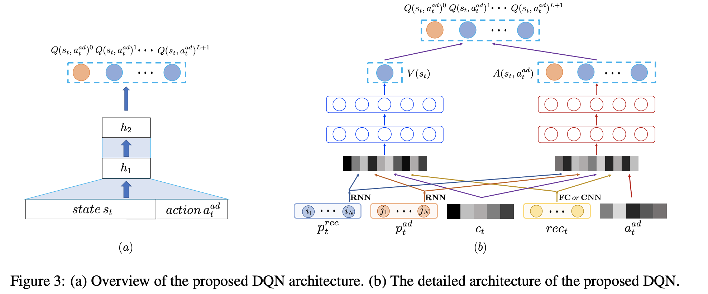
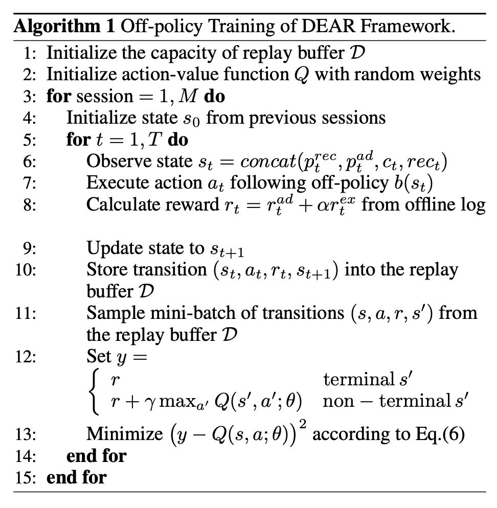
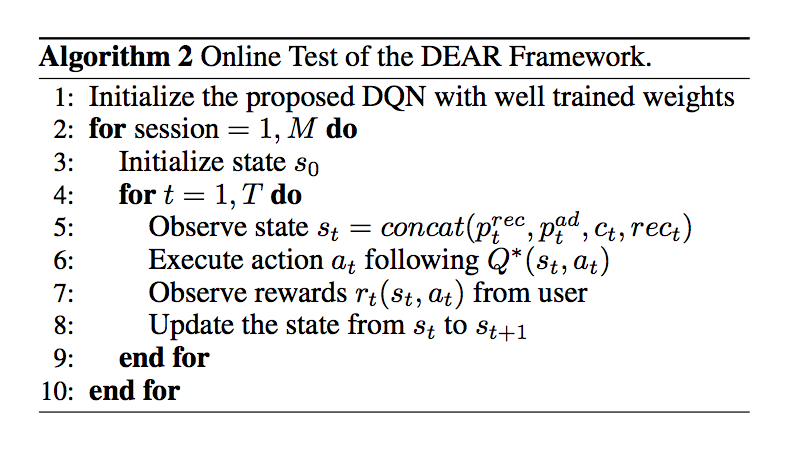

目录

<!-- TOC -->

- [drn](#drn)
- [top-k off-policy](#top-k-off-policy)
- [slateq](#slateq)
- [DEAR](#dear)
  - [dear模型结构](#dear%e6%a8%a1%e5%9e%8b%e7%bb%93%e6%9e%84)
  - [dear实验](#dear%e5%ae%9e%e9%aa%8c)

<!-- /TOC -->

## drn

[https://daiwk.github.io/posts/rl-drn.html](https://daiwk.github.io/posts/rl-drn.html)

## top-k off-policy

[https://daiwk.github.io/posts/dl-topk-off-policy-correction.html](https://daiwk.github.io/posts/dl-topk-off-policy-correction.html)

## slateq

[https://daiwk.github.io/posts/rl-slateq.html](https://daiwk.github.io/posts/rl-slateq.html)

## DEAR

[今日头条最新论文，首次改进DQN网络解决推荐中的在线广告投放问题](https://zhuanlan.zhihu.com/p/85417314)

[Deep Reinforcement Learning for Online Advertising in Recommender Systems](https://arxiv.org/abs/1909.03602)

### dear模型结构

在给定推荐列表前提下，本文提出了一种基于DQN的创新架构来同时解决三个任务：

+ **是否**插入广告
+ 如果插入，插入**哪一条**广告
+ 插入广告在推荐列表的哪个**位置**

DQN的两种经典结构：

+ **输入state**，输出是**所有可能action对应的Q**；
+ **输入state**以及某**一个action**，输出是**对应的Q**。

这两种经典架构的最主要的问题是只能将action定义为插入哪一条广告，或者插入广告在列表的哪个位置，无法同时解决上述提到的三个任务。

当然，**插入位置**与**插入哪一条广告**通过某种表示形式，如one-hot编码来建模action，那么action空间就是O(A\*L)，其中A是广告数量，L是位置数量。要实际应用是不可能的。。

本文融合了上述提到了两种经典DQN结构的结合，会**同时**针对**所有可能的插入位置**的Q进行预估。

如下图的左边部分，输入层包含**State**以及**Action（插入哪条广告）**，输出层则是广告插入推荐列表的**L+1位置对应的Q**-（假设推荐列表长度为L，则可以插入广告的位置为L+1种可能）。与此同时，使用一个**特殊插入位置0**用来表示**不进行广告插入**，因此输出层的长度扩展成为**L+2**。

<html>
 

 
</html>

然后看右边部分，参考dueling dqn，输出层Q函数被拆解成两部分：只由state决定的V(s)函数；以及由state和action同时决定的A(s,a)函数。其中，

+ state是把下面3部分concate到一起的一个向量：
  + 使用GRU针对用户的推荐结果点击历史和广告点击历史进行用户序列偏好建模的`\(p^{rec}_t\)`和`\(p^{ad}_t\)`；
  + 当前用户请求的上下文信息`\(c\)`，例如操作系统，app版本号，上下滑动等；
  + 当前请求展示的推荐列表item的特征进行concat(当然也可以是cnn等)形成的低维稠密向量`\(rec_{t}\)`；
+ action包含两部分：
  + 一部分是候选插入广告ad的特征`\(a_t^{ad}\)`，作为输入的一部分
  + 另一部分则是广告插入的位置`\(a_t^{loc}\)`
+ reward函数。Reward函数也包含两部分：
  + 一部分是广告的的收入`\(r^{ad}_t\)`；
  + 另一部分则是用户是否继续往下刷的奖励`\(r^{ex}_t\)`，继续刷新是1，离开是-1。

最优的Q函数策略便可以通过Bellman等式求得：

`\[
Q^{*}\left(s_{t}, a_{t}\right)=\mathbb{E}_{s_{t+1}}\left[r_{t}+\gamma \max _{a_{t+1}} Q^{*}\left(s_{t+1}, a_{t+1}\right) | s_{t}, a_{t}\right]
\]`

基于用户交互历史的离线日志，采用 Off-policy的方式进行训练得到最优的投放策略。

针对每一次迭代训练：

+ 针对用户请求构建状态`\(s_t=concat(p^{rec}_t,p^{ad}_t,c_t,rec_t)\)`；
+ 根据off-policy `\(b(s_t)\)`(即离线日志里的当前广告策略)执行action `\(a_t\)`，也就是选取特定ad；
+ 更新状态为`\(s_{t+1}\)`
+ 计算reward `\(r_t=r_t^{ad}+\alpha r_t^{ex}\)`；
+ 将状态转移信息`\((s_{t}，a_{t}，r_{t}，s_{t+1})\)`存储到replay buffer；
+ 从replay buffer中取出mini-batch的状态转移信息`\(s,a,r,s'\)`，来最小化`\((y-Q(s, a ; \theta))^{2}\)`训练得到最优的Q函数参数。
+ 其中，

`\[
y=\left\{\begin{array}{ll}{r} & {\text { terminal } s^{\prime}} \\ {r+\gamma \max _{a^{\prime}} Q\left(s^{\prime}, a^{\prime} ; \theta\right)} & {\text { non - terminal } s^{\prime}}\end{array}\right.
\]`

<html>
 

 
</html>

在线test：

+ 得到状态`\(s_t=concat(p^{rec}_t,p^{ad}_t,c_t,rec_t)\)`；
+ 通过最优策略`\(Q^*(s_t,a_t)\)`执行动作`\(a_t\)`
+ 得到用户反馈的reward `\(r_t(s_t,a_t)\)`
+ 将状态从`\(s_t\)`更新到`\(s_{t+1}\)`

<html>
 

 
</html>

### dear实验

100w的session，涉及到18w的user，1700w的自然结果视频，1000w的广告。

平均每个session里有55个自然结果视频,55%的推荐列表里有广告，平均每个session的时长是17min。

